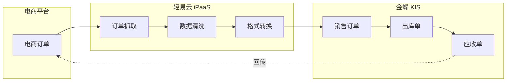
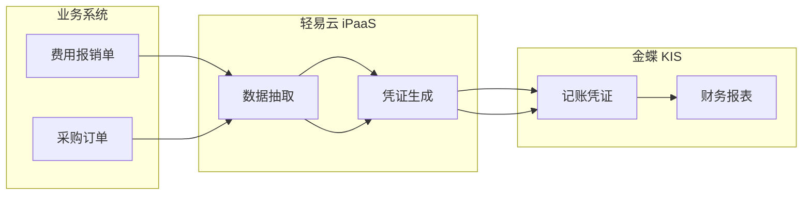

# 金蝶 KIS 集成专题

本文档详细介绍轻易云 iPaaS 平台与金蝶 KIS（Keep It Simple）的集成配置方法，涵盖 KIS 云和 KIS 私有云两种部署方式的连接器配置、适配器选择、API 接口调用等完整内容。

## 概述

金蝶 KIS 是金蝶软件（中国）有限公司面向小型企业推出的管理软件，基于微软 Windows 平台开发，以"简化管理"为核心理念。轻易云 iPaaS 提供专用的金蝶 KIS 连接器，支持以下核心能力：

- **基础数据同步**：物料、客户、供应商、部门、职员等主数据双向同步
- **业务单据集成**：采购、销售、库存、生产单据的自动化流转
- **库存管理**：实时库存查询、调拨单、出入库单据对接
- **消息订阅**：支持库存、出入库单据等业务事件的实时推送

> [!NOTE]
> 金蝶 KIS 分为 **KIS 云**（SaaS 版）和 **KIS 私有云**（本地部署版）两种部署方式，配置方式略有差异，本文档将分别说明。

## 部署方式对比

| 特性 | KIS 云（SaaS 版） | KIS 私有云（本地部署版） |
|------|------------------|------------------------|
| 部署方式 | 金蝶云托管 | 企业本地服务器 |
| 访问地址 | https://kisyun.kingdee.com | 企业内网地址 |
| API 地址 | https://api.kingdee.com | 私有云服务器地址 |
| 授权方式 | 应用 ID + 应用密钥 + 短信验证码 | 应用 ID + 应用密钥 |
| 适用场景 | 小微企业、无 IT 运维能力 | 对数据安全有要求的企业 |

## KIS 云连接器配置

### 前置准备

在轻易云 iPaaS 平台配置 KIS 云连接器前，需要先在金蝶 KIS 云管理平台完成以下准备工作：

1. 访问 [金蝶 KIS 云管理平台](https://kisyun.kingdee.com/view/#/companys.html)
2. 使用管理员手机号登录
3. 选择对应的 KIS 云产品

### 创建应用

1. 进入产品页面，点击**应用列表**
2. 点击**添加应用**，搜索并选择 **KIS 云生态集成服务（限免）**
3. 确认添加后，记录系统分配的**应用 ID** 和**应用密钥**

### 配置连接器基础信息

登录轻易云 iPaaS 控制台，按以下步骤配置：

1. 进入**连接器管理**页面，点击**新建连接器**
2. 选择 **ERP** 分类下的**金蝶 KIS**
3. 填写基础连接参数：

| 参数名 | 类型 | 必填 | 说明 |
| ------ | ---- | ---- | ---- |
| `host` | string | ✅ | API 请求地址，固定值 `https://api.kingdee.com` |
| `app_id` | string | ✅ | 从 KIS 云管理平台获取的应用 ID |
| `app_secret` | string | ✅ | 从 KIS 云管理平台获取的应用密钥 |
| `admin_phone` | string | ✅ | 管理员手机号，用于接收验证码 |

> [!IMPORTANT]
> 此时不要点击保存，需先完成后续步骤获取并补充完整剩余参数。

### 获取连接凭证

KIS 云连接器需要通过一系列查询方案获取完整的连接凭证，按顺序执行以下步骤：

#### 步骤 1：发送短信验证码

1. 在轻易云 iPaaS 中创建一个**发送手机短信验证码**的集成方案
2. 方案配置如下：
   - **接口地址**：金蝶开放平台短信发送接口
   - **请求参数**：管理员手机号
3. 执行方案，手动激活队列发送短信验证码
4. 验证码有效期为 5 分钟，请及时获取并记录

#### 步骤 2：获取用户信息

1. 返回连接器配置页面，补充上一步获取的**手机验证码**
2. 创建一个**通过短信验证码获取金蝶云平台用户信息**的集成方案
3. 执行方案并激活队列
4. 在**数据管理**中查看返回的 JSON 数据，提取以下信息：
   - `session_id`：用户会话标识
   - `access_token`：访问令牌
5. 将获取的 `session_id` 和 `access_token` 补充到连接器配置中

#### 步骤 3：获取账套列表

1. 创建一个**获取 KIS 云账套列表**的集成方案
2. 执行方案并激活队列
3. 在**数据管理**中查看返回的 JSON 数据，提取以下信息：
   - `pid`：产品实例 ID
   - `acctnumber`：账套号
4. 将获取的 `pid` 和 `acctnumber` 补充到连接器配置中

> [!NOTE]
> 如企业有多个账套需要对接，需为每个账套分别创建连接器，重复此步骤获取对应账套信息。

#### 步骤 4：获取应用编号

1. 创建一个**获取金蝶 KIS 云用户账套应用列表**的集成方案
2. 执行方案并激活队列
3. 在**数据管理**中查看返回的 JSON 数据
4. 找到 `appname` 为 **KIS 云生态集成服务（限免）** 的记录
5. 提取该应用的 `icrmid`（应用编号）
6. 将 `icrmid` 补充到连接器配置中

### 完成配置

1. 确认连接器所有必填参数已填写完整
2. 点击**测试连接**验证连通性
3. 连接成功后点击**保存**

> [!TIP]
> 连接器的最后两项信息**网关后端地址**和 `auth_data` 的刷新令牌由接口自动处理，无需手动配置。

### 多账套配置

如需对接多个账套：

1. 从**步骤 3**开始，为每个账套创建独立的连接器
2. 使用相同的 `session_id`、`access_token` 和 `icrmid`
3. 仅需修改对应账套的 `pid` 和 `acctnumber`

## KIS 私有云连接器配置

### 前置准备

1. 确认 KIS 私有云已部署完成并可正常访问
2. 获取私有云服务器的 API 请求地址
3. 准备应用 ID 和应用密钥（需向金蝶或服务商申请）

### 配置连接器

1. 登录轻易云 iPaaS 控制台，进入**连接器管理**
2. 点击**新建连接器**，选择 **ERP** 分类下的**金蝶 KIS 私有云**
3. 填写连接参数：

| 参数名 | 类型 | 必填 | 说明 |
| ------ | ---- | ---- | ---- |
| `host` | string | ✅ | 私有云 API 请求地址，如 `https://kis-server.company.com` |
| `app_id` | string | ✅ | 应用 ID |
| `app_secret` | string | ✅ | 应用密钥 |
| `instance_id` | string | ✅ | 第三方实例 ID |
| `account_db` | string | ✅ | 账套数据库标识 |

4. 点击**测试连接**验证连通性
5. 连接成功后点击**保存**

## 适配器选择

根据业务场景选择对应的适配器：

| 场景 | 适配器 | 说明 |
|------|--------|------|
| 数据查询 | `KISQueryAdapter` | 用于从 KIS 查询数据 |
| 数据写入 | `KISExecuteAdapter` | 用于向 KIS 写入数据 |

> [!TIP]
> 在创建集成方案时，源平台查询选择 `KISQueryAdapter`，目标平台写入选择 `KISExecuteAdapter`。

## 常用接口说明

### 物料查询接口

**接口地址**：`/koas/APP006992/api/Material/List`

**请求方式**：`POST`

**请求参数**：

| 字段 | 名称 | 类型 | 说明 |
| ---- | ---- | ---- | ---- |
| `AccountDB` | 账套号 | string | 账套数据库标识 |
| `CurrentPage` | 当前页 | int | 页码，从 1 开始 |
| `Rid` | 请求 ID | string | 随机生成的 UUID |

**请求示例**：

```json
{
  "AccountDB": "001",
  "CurrentPage": "1",
  "Rid": "4634bb20-4017-11ef-a6ec-fa163e42320a"
}
```

### 库存查询接口

**接口地址**：`/koas/APP006992/api/Inventory/List`

**请求参数**：

| 字段 | 名称 | 类型 | 说明 |
| ---- | ---- | ---- | ---- |
| `AccountDB` | 账套号 | string | 账套数据库标识 |
| `MaterialCode` | 物料编码 | string | 可选，指定物料 |
| `WarehouseCode` | 仓库编码 | string | 可选，指定仓库 |
| `CurrentPage` | 当前页 | int | 页码 |

### 单据写入接口

**接口地址**：根据单据类型不同，如 `/koas/APP006992/api/SaleOrder/Create`

**请求参数**：根据具体单据类型和业务需求配置

> [!IMPORTANT]
> 完整的 API 文档请参考 [金蝶 KIS API 文档](https://open.jdy.com/#/files/api/detail?index=2&categrayId=dded94c553614747b2c9b8b49c396aa6&id=925e98cd326611ee898167f25619c776)。

## 数据映射配置

### 基础资料映射示例

#### 物料主数据同步

| 源系统字段 | 目标系统字段 | 转换规则 |
| ---------- | ------------ | -------- |
| `MaterialCode` | `FNumber` | 直接映射 |
| `MaterialName` | `FName` | 直接映射 |
| `Specification` | `FSpecification` | 直接映射 |
| `UnitCode` | `FUnitID` | 单位编码映射 |
| `MaterialType` | `FErpClsID` | 属性转换 |

#### 客户档案同步

| 源系统字段 | 目标系统字段 | 转换规则 |
| ---------- | ------------ | -------- |
| `CustomerCode` | `FNumber` | 直接映射 |
| `CustomerName` | `FName` | 直接映射 |
| `Contact` | `FContact` | 直接映射 |
| `Phone` | `FPhone` | 直接映射 |
| `Address` | `FAddress` | 直接映射 |

### 业务单据映射示例

#### 销售订单同步

| 源系统字段 | 目标系统字段 | 转换规则 |
| ---------- | ------------ | -------- |
| `OrderNo` | `FBillNo` | 直接映射 |
| `OrderDate` | `FDate` | 日期格式转换 |
| `CustomerCode` | `FCustID` | 客户编码映射 |
| `MaterialCode` | `FItemID` | 物料编码映射 |
| `Quantity` | `Fauxqty` | 数量映射 |
| `Price` | `FPrice` | 单价映射 |

## 消息订阅配置

KIS 私有云支持消息订阅功能，可实现业务事件的实时推送。

### 支持的订阅类型

| 订阅类型 | 业务对象 | 说明 |
|----------|----------|------|
| `OTHER_INVENTORY` | 即时库存 | 库存变动实时推送 |
| `BILL_ICSTOCKBILL_1002` | 产品入库单 | 生产入库事件 |
| `BILL_ICSTOCKBILL_1010` | 其他出库单 | 出库业务事件 |
| `BILL_ICSTOCKBILL_1024` | 生产领料单 | 领料业务事件 |
| `BILL_ICSTOCKBILL_1029` | 其他出库单 | 出库业务事件 |
| `BILL_ICSTOCKBILL_1041` | 调拨单 | 库存调拨事件 |

### 配置消息订阅

#### 步骤 1：配置订阅地址

1. 登录金蝶 KIS 私有云管理后台
2. 进入**小微企业生态门户**配置页面
3. 在订阅地址配置中填写：

```json
{host}/api/open/kisSubScriptions/{connector_id}
```

其中：
- `{host}`：轻易云 API 接口地址
- `{connector_id}`：轻易云连接器 ID

#### 步骤 2：配置方案编码

1. 在轻易云 iPaaS 平台，进入用于接收订阅消息的集成方案详情
2. 在**方案信息**中查看**编码**
3. 将该编码配置到 KIS 私有云的消息订阅配置中

> [!WARNING]
> 消息订阅配置完成后，需在金蝶 KIS 系统中启用对应的业务对象订阅开关，否则无法接收推送消息。

## 集成场景示例

### 场景一：KIS 对接电商平台



**实现步骤**：

1. 配置电商平台连接器（如旺店通、聚水潭）
2. 配置金蝶 KIS 连接器
3. 创建集成方案：源平台选择电商平台，目标平台选择 KIS
4. 配置销售订单、发货单的数据映射
5. 设置定时同步策略，建议每 5~10 分钟同步一次

### 场景二：KIS 与财务系统对接



**实现步骤**：

1. 配置金蝶 KIS 连接器
2. 创建费用报销同步方案，将报销数据生成会计凭证
3. 创建采购对账方案，自动生成应付凭证
4. 设置定时任务，每日自动同步

## 常见问题

### Q：连接 KIS 云时提示 "认证失败"？

A：请检查以下配置：
- 确认 `session_id` 和 `access_token` 是否已过期（有效期较短）
- 确认 `pid` 和 `acctnumber` 是否对应正确的账套
- 确认 `icrmid` 是否为 "KIS 云生态集成服务（限免）" 的应用编号
- 确认手机验证码是否在 5 分钟有效期内

### Q：如何刷新 `access_token`？

A：`access_token` 有效期较短，失效后需重新执行获取用户信息的步骤：
1. 重新发送短信验证码
2. 重新执行获取用户信息的查询方案
3. 更新连接器中的 `session_id` 和 `access_token`

### Q：KIS 私有云连接失败？

A：请检查以下配置：
- 确认私有云服务器地址是否正确，包含端口号（如有）
- 确认应用 ID 和应用密钥是否正确
- 确认 `instance_id` 和 `account_db` 是否填写正确
- 确认轻易云服务器与 KIS 私有云服务器之间的网络连通性

### Q：消息订阅未收到推送？

A：请检查以下配置：
- 确认订阅地址格式正确，包含正确的 `host` 和 `connector_id`
- 确认方案编码与接收消息的集成方案一致
- 确认在金蝶 KIS 系统中已启用对应业务对象的订阅开关
- 检查轻易云平台的日志，确认是否有消息接收记录

### Q：如何实现增量数据同步？

A：建议采用以下策略实现增量同步：
1. 使用单据日期或创建时间作为增量标识
2. 在请求参数中添加时间范围条件
3. 记录上次同步的最大时间戳，下次同步时作为起始条件
4. 对于删除数据，可定期执行全量比对

### Q：分页查询如何配置？

A：KIS 接口支持分页查询，配置方式如下：
- `CurrentPage`：当前页码，从 1 开始
- `PageSize`：每页返回记录数，建议设置为 100~500
- 总页数需要通过多次调用获取，直到返回数据为空或小于页大小

## 相关资源

- [配置连接器](../../guide/configure-connector) — 连接器基础使用指南
- [金蝶云星空集成专题](./kingdee-cloud-galaxy) — 金蝶云星空对接指南
- [金蝶 K3 WISE 集成专题](./kingdee-k3wise) — 金蝶 K3 WISE 对接指南
- [金蝶 EAS 集成专题](./kingdee-eas) — 金蝶 EAS 对接指南
- [标准集成方案](../../standard-schemes/erp-integration) — ERP 对接最佳实践
- [金蝶开放平台](https://open.jdy.com/) — 金蝶官方 API 文档

---

> [!TIP]
> 如需更多技术支持，请联系轻易云客户成功团队或访问 [轻易云官网](https://www.qeasy.cloud/)。
