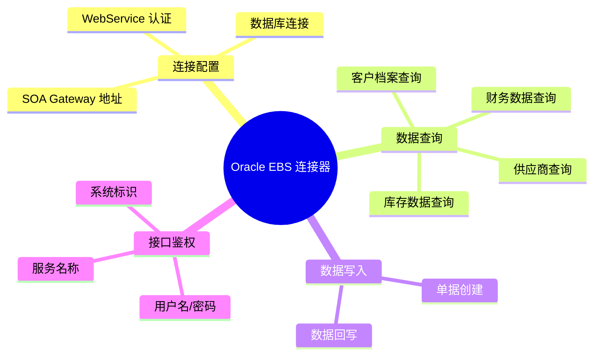
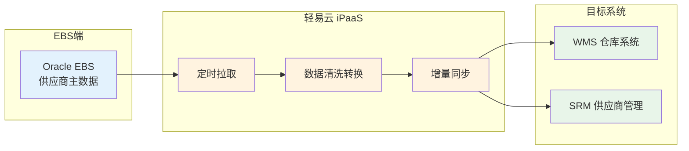
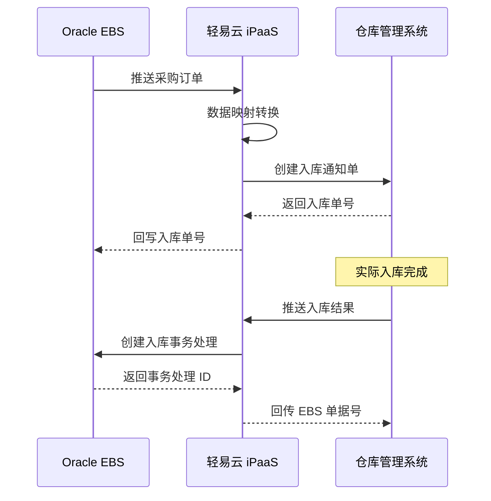
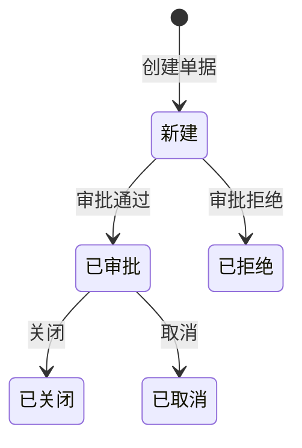

# Oracle EBS 集成专题

本文档详细介绍轻易云 iPaaS 平台与 Oracle E-Business Suite（EBS）的集成配置方法，涵盖 WebService 连接配置、接口鉴权、供应商数据同步、库存数据查询等常见集成场景，帮助企业实现 EBS 与第三方系统的数据互通。

## 概述

Oracle E-Business Suite（EBS）是 Oracle 公司推出的综合性企业资源计划（ERP）解决方案，广泛应用于大型跨国企业的财务管理、供应链管理、生产制造、人力资源等核心业务领域。

轻易云 iPaaS 提供专用的 Oracle EBS 连接器，基于 EBS Integrated SOA Gateway（ISG）实现以下核心能力：

- **主数据同步**：供应商、客户、物料、组织等基础档案的双向同步
- **业务单据集成**：采购订单、销售订单、库存单据的自动化流转
- **财务数据对接**：凭证生成、科目余额查询、应付应收数据抽取
- **库存数据交互**：实时库存查询、出入库记录同步



## 连接器配置

### 创建连接器

1. 登录轻易云 iPaaS 控制台，进入**连接器管理**页面
2. 点击**新建连接器**，选择 **ERP** 分类下的 **Oracle EBS**
3. 填写连接参数（详见下方参数说明）
4. 点击**测试连接**验证连通性
5. 连接成功后点击**保存**

### 连接参数说明

| 参数名 | 类型 | 必填 | 说明 |
| ------ | ---- | ---- | ---- |
| `server_url` | string | ✅ | EBS SOA Gateway 地址，如 `https://ebs-server:8011` |
| `db_host` | string | ✅ | EBS 数据库服务器地址 |
| `db_port` | int | ✅ | 数据库端口，默认 `1521` |
| `db_service` | string | ✅ | Oracle Service Name 或 SID |
| `db_username` | string | ✅ | 数据库用户名 |
| `db_password` | string | ✅ | 数据库密码 |
| `ws_username` | string | ✅ | WebService 调用用户名 |
| `ws_password` | string | ✅ | WebService 调用密码 |

> [!IMPORTANT]
> Oracle EBS 的 WebService 访问需要确保轻易云平台能够访问 SOA Gateway 端口（默认 8011）。建议通过 VPN 或专线打通网络，避免数据在公网传输。

### 适配器选择

| 场景 | 查询适配器 | 写入适配器 |
| ---- | ---------- | ---------- |
| 标准数据查询 | `OracleEBSQueryAdapter` | — |
| 供应商数据同步 | `OracleEBSVendorAdapter` | `OracleEBSWriteAdapter` |
| 库存数据查询 | `OracleEBSInventoryAdapter` | — |
| 通用数据写入 | — | `OracleEBSWriteAdapter` |

## WebService 接口鉴权

Oracle EBS 的 WebService 接口采用基于用户名/密码的 HTTP Basic 认证，同时需要在请求头或请求体中传递系统标识和服务名称参数。

### 请求参数说明

| 参数名 | 类型 | 必填 | 说明 |
| ------ | ---- | ---- | ---- |
| `P_SERVICE_NAME` | string | ✅ | 服务名称，标识调用的业务接口，如 `GET_VENDOR` |
| `P_ORIG_SYSTEM` | string | ✅ | 源系统标识，如 `WMS`、`CRM`、`OA` 等 |
| `DATE_F` | string | — | 查询开始日期，格式 `yyyy-MM-dd` |
| `DATE_T` | string | — | 查询结束日期，格式 `yyyy-MM-dd` |

### 鉴权配置示例

在轻易云 iPaaS 的请求调度者配置中，设置以下参数：

```json
{
  "authentication": {
    "type": "basic",
    "username": "{{ws_username}}",
    "password": "{{ws_password}}"
  },
  "headers": {
    "Content-Type": "text/xml;charset=UTF-8",
    "SOAPAction": "process"
  }
}
```

### 请求体参数配置

对于查询类接口，在**其他请求参数**中配置：

```json
{
  "P_SERVICE_NAME": "GET_VENDOR",
  "P_ORIG_SYSTEM": "WMS"
}
```

在**请求体参数**中配置时间范围：

```json
{
  "DATE_F": "2025-01-01",
  "DATE_T": "2025-12-31"
}
```

## 业务接口清单

### 供应商相关接口

| 接口名称 | 服务标识 | 操作类型 | 说明 |
| -------- | -------- | -------- | ---- |
| 供应商查询 | `GET_VENDOR` | 查询 | 查询供应商主数据 |
| 供应商创建 | `CREATE_VENDOR` | 写入 | 创建供应商档案 |
| 供应商更新 | `UPDATE_VENDOR` | 写入 | 更新供应商信息 |

### 库存相关接口

| 接口名称 | 服务标识 | 操作类型 | 说明 |
| -------- | -------- | -------- | ---- |
| 库存查询 | `GET_INVENTORY` | 查询 | 查询库存现有量 |
| 物料查询 | `GET_ITEM` | 查询 | 查询物料主数据 |
| 入库记录查询 | `GET_RCV_TRANSACTION` | 查询 | 查询采购入库记录 |
| 出库记录查询 | `GET_DELIVERY` | 查询 | 查询销售出库记录 |

### 财务相关接口

| 接口名称 | 服务标识 | 操作类型 | 说明 |
| -------- | -------- | -------- | ---- |
| 凭证查询 | `GET_JOURNAL` | 查询 | 查询会计凭证 |
| 科目余额查询 | `GET_BALANCE` | 查询 | 查询科目余额 |
| 应付查询 | `GET_AP_INVOICE` | 查询 | 查询应付发票 |
| 应收查询 | `GET_AR_INVOICE` | 查询 | 查询应收发票 |

## 常见集成场景

### 场景一：供应商主数据同步

将 EBS 中的供应商数据同步到 WMS、SRM 或其他业务系统。



**配置步骤**：

1. **创建源平台调度者**
   - 选择适配器：`OracleEBSVendorAdapter`
   - 配置服务名称：`GET_VENDOR`
   - 配置源系统标识：`WMS`

2. **设置时间范围参数**
   ```json
   {
     "DATE_F": "{{lastSyncTime|date('yyyy-MM-dd')}}",
     "DATE_T": "{{currentTime|date('yyyy-MM-dd')}}"
   }
   ```

3. **配置数据映射**
   | EBS 字段 | 目标字段 | 说明 |
   | -------- | -------- | ---- |
   | `VENDOR_ID` | `supplier_code` | 供应商编码 |
   | `VENDOR_NAME` | `supplier_name` | 供应商名称 |
   | `VENDOR_SITE_CODE` | `site_code` | 供应商地点编码 |
   | `ADDRESS_LINE1` | `address` | 地址 |
   | `PHONE` | `contact_phone` | 联系电话 |

### 场景二：库存数据实时同步

将 EBS 库存数据同步到电商平台或 WMS 系统，实现全渠道库存共享。

**方案一：定时批量同步**

```json
{
  "source": {
    "adapter": "OracleEBSInventoryAdapter",
    "serviceName": "GET_INVENTORY",
    "params": {
      "P_SERVICE_NAME": "GET_INVENTORY",
      "P_ORIG_SYSTEM": "ECOMMERCE",
      "DATE_F": "{{lastSyncTime|date('yyyy-MM-dd')}}",
      "DATE_T": "{{currentTime|date('yyyy-MM-dd')}}"
    },
    "schedule": {
      "type": "interval",
      "interval": 300
    }
  },
  "transform": {
    "rules": [
      {
        "field": "onhand_quantity",
        "expression": "SUM(quantity - reserved_quantity)"
      }
    ]
  }
}
```

**方案二：基于触发器的实时同步**

通过 EBS 的数据库触发器，在库存变动时实时推送数据到轻易云 iPaaS：

```sql
-- 伪代码示例：库存变动触发器
CREATE OR REPLACE TRIGGER inv_transaction_trg
AFTER INSERT OR UPDATE ON MTL_MATERIAL_TRANSACTIONS
FOR EACH ROW
BEGIN
    -- 调用 WebService 推送库存变动
    UTL_HTTP.REQUEST(
        'https://datahub-api.qeasy.cloud/api/webhook/inventory-sync',
        'POST',
        JSON_OBJECT(
            'item_id' VALUE :new.inventory_item_id,
            'organization_id' VALUE :new.organization_id,
            'quantity' VALUE :new.transaction_quantity,
            'transaction_date' VALUE :new.transaction_date
        )
    );
END;
```

> [!WARNING]
> 数据库触发器方式需要谨慎设计，避免影响 EBS 核心业务流程的性能。建议在非高峰期进行批量同步，或采用异步消息队列方式。

### 场景三：采购订单与 WMS 对接

实现 EBS 采购订单到 WMS 入库单的业务流程打通。



**关键字段映射**：

| EBS 采购订单 | WMS 入库通知 | 说明 |
| ------------ | ------------ | ---- |
| `PO_HEADER_ID` | `source_order_no` | 采购订单头 ID |
| `SEGMENT1` | `po_number` | 采购订单号 |
| `VENDOR_ID` | `supplier_code` | 供应商编码 |
| `LINE_NUM` | `line_no` | 行号 |
| `ITEM_ID` | `sku_code` | 物料编码 |
| `QUANTITY` | `expected_qty` | 数量 |

## 数据查询注意事项

### 日期参数格式

Oracle EBS 接口要求日期格式为 `yyyy-MM-dd`：

```json
{
  "DATE_F": "2025-01-01",
  "DATE_T": "2025-12-31"
}
```

### 大数据量分页处理

针对数据量较大的查询场景，建议采用分页机制：

```json
{
  "source": {
    "adapter": "OracleEBSQueryAdapter",
    "serviceName": "GET_VENDOR",
    "pagination": {
      "enabled": true,
      "pageSize": 500,
      "pageParam": "PAGE_NUM",
      "sizeParam": "PAGE_SIZE"
    }
  }
}
```

### 增量同步策略

为避免重复拉取全量数据，建议使用基于时间的增量同步：

1. **记录上次同步时间**：在集成方案中维护 `lastSyncTime` 变量
2. **使用时间窗口查询**：每次同步时查询 `lastSyncTime` 到当前时间的数据
3. **更新时间戳**：同步成功后更新 `lastSyncTime`

```json
{
  "variables": {
    "lastSyncTime": "2025-01-01 00:00:00"
  },
  "source": {
    "params": {
      "DATE_F": "{{lastSyncTime|date('yyyy-MM-dd')}}",
      "DATE_T": "{{currentTime|date('yyyy-MM-dd')}}"
    }
  },
  "onSuccess": {
    "updateVariable": {
      "lastSyncTime": "{{currentTime}}"
    }
  }
}
```

## 写入数据注意事项

### 单据状态管理

Oracle EBS 中的单据通常具有严格的状态流转规则：



> [!IMPORTANT]
> 写入 EBS 的单据需要确保所有必填字段完整，且符合 EBS 的业务规则校验。建议在写入前进行数据完整性检查。

### 字段编码映射

Oracle EBS 中大量使用内部 ID 进行数据关联，写入时需要确保编码正确映射：

| 字段类型 | 示例 | 说明 |
| -------- | ---- | ---- |
| 供应商 ID | `VENDOR_ID` | EBS 内部供应商唯一标识 |
| 物料 ID | `INVENTORY_ITEM_ID` | EBS 内部物料唯一标识 |
| 组织 ID | `ORGANIZATION_ID` | 库存组织内部标识 |
| 地点 ID | `VENDOR_SITE_ID` | 供应商地点内部标识 |

> [!CAUTION]
> 写入数据时，应使用 EBS 内部 ID 而非业务编码进行关联。建议在集成方案中维护编码与 ID 的映射表，或通过查询接口动态获取 ID。

### 并发控制

当多个集成任务同时写入 EBS 时，可能产生并发冲突：

```json
{
  "target": {
    "adapter": "OracleEBSWriteAdapter",
    "concurrency": {
      "lockKey": "ebs_{{document_type}}_{{document_number}}",
      "lockTimeout": 60
    }
  }
}
```

## 常见问题

### Q：连接测试失败，提示 "无法连接到 SOA Gateway"？

请检查以下配置：

1. 确认 `server_url` 地址和端口是否正确（默认 8011）
2. 检查轻易云服务器与 EBS 服务器的网络连通性
3. 确认 EBS SOA Gateway 服务已启动
4. 检查防火墙是否开放了 SOA Gateway 端口

### Q：接口调用返回 "认证失败"？

1. 确认 `ws_username` 和 `ws_password` 是否正确
2. 检查该用户是否具有调用对应服务的权限
3. 确认用户未被锁定或密码未过期

### Q：查询返回数据为空？

1. 检查 `P_SERVICE_NAME` 和 `P_ORIG_SYSTEM` 是否正确
2. 确认日期范围参数 `DATE_F` 和 `DATE_T` 是否合理
3. 检查 EBS 中是否存在符合条件的数据
4. 查看 EBS 接口日志，确认是否有错误信息

### Q：如何获取 EBS 内部 ID？

可通过查询接口获取编码对应的内部 ID：

```json
{
  "P_SERVICE_NAME": "GET_VENDOR",
  "P_ORIG_SYSTEM": "WMS",
  "VENDOR_NUMBER": "V001"
}
```

响应示例：

```json
{
  "VENDOR_ID": 12345,
  "VENDOR_NUMBER": "V001",
  "VENDOR_NAME": "示例供应商"
}
```

### Q：如何处理 EBS 的自定义字段？

Oracle EBS 支持通过描述性弹性域（DFF）扩展自定义字段：

```json
{
  "VENDOR_ID": 12345,
  "ATTRIBUTE1": "自定义值1",
  "ATTRIBUTE2": "自定义值2",
  "ATTRIBUTE_CATEGORY": "供应商扩展属性"
}
```

### Q：同步数据时遇到性能问题？

建议采用以下优化策略：

| 优化策略 | 说明 | 适用场景 |
| -------- | ---- | -------- |
| 时间切片 | 按日期范围分段查询 | 历史数据同步 |
| 增量同步 | 只同步变更数据 | 日常定时同步 |
| 并行处理 | 同时处理多个数据批次 | 大数据量场景 |
| 异步处理 | 使用消息队列解耦 | 高并发写入场景 |

## 相关资源

- [Oracle EBS Integrated SOA Gateway 文档](https://docs.oracle.com/cd/E26401_01/doc.122/e20929/T419934T473186.htm) — 官方技术文档
- [配置连接器](../../guide/configure-connector) — 连接器基础使用指南
- [ERP 连接器概览](./README) — 其他 ERP 系统连接器
- [数据映射指南](../../guide/data-mapping) — 字段映射配置详解

---

> [!NOTE]
> Oracle EBS 的接口配置可能因版本和定制情况有所差异，建议参考具体 EBS 环境的接口文档。如有疑问，请联系轻易云技术支持团队。
