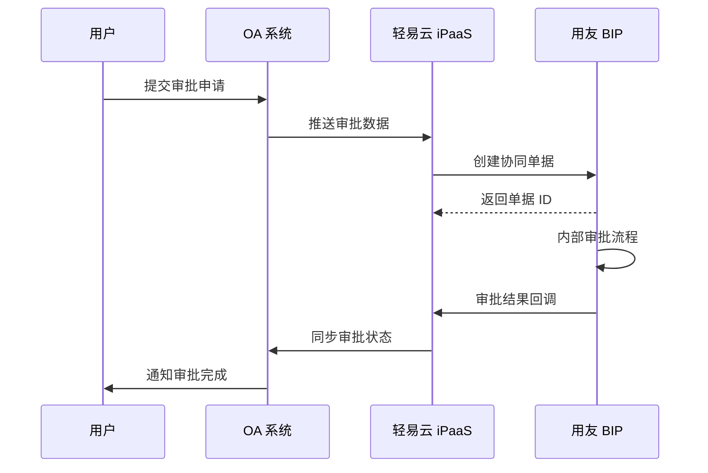

# 用友 BIP 集成专题

本文档详细介绍轻易云 iPaaS 平台与用友 BIP（Yonyou Business Innovation Platform）的集成配置方法，涵盖连接器配置、接口鉴权、协同流程配置以及常见集成场景的最佳实践。

## 概述

用友 BIP（Business Innovation Platform）是用友网络面向超大型企业推出的商业创新平台，基于云原生架构，融合大数据、人工智能、云计算、物联网等前沿技术，帮助企业实现数智化转型。

轻易云 iPaaS 提供专用的用友 BIP 连接器，支持以下核心能力：

- **基础数据同步**：组织、物料、客户、供应商等主数据双向同步
- **业务单据集成**：采购、销售、库存、财务单据的自动化流转
- **协同流程对接**：BIP 协同平台与第三方系统的流程集成
- **表单数据交互**：BIP 表单数据的查询与写入

## 连接器配置

### 创建连接器

1. 登录轻易云 iPaaS 控制台，进入**连接器管理**页面
2. 点击**新建连接器**，选择 **ERP** 分类下的**用友 BIP**
3. 填写连接参数（详见下方参数说明）
4. 点击**测试连接**验证连通性
5. 连接成功后点击**保存**

### 连接参数说明

| 参数名 | 类型 | 必填 | 说明 |
| ------ | ---- | ---- | ---- |
| `app_key` | string | ✅ | 应用 Key，在用友开放平台创建应用后获取 |
| `app_secret` | string | ✅ | 应用密钥，与应用 Key 配对使用 |
| `tenant_id` | string | ✅ | 租户 ID，登录用友 BIP 后台获取 |
| `domain` | string | ✅ | 租户动态域名，通常与登录地址一致 |

> [!IMPORTANT]
> 用友 BIP 的 `domain` 参数通常为租户专属的登录域名，格式如 `https://xxx.yonyoucloud.com`，请确保填写完整地址且以 `/` 结尾。

### 适配器选择

| 场景 | 查询适配器 | 写入适配器 |
| ---- | ---------- | ---------- |
| 标准单据查询 | `BIPQueryAdapter` | — |
| 标准单据写入 | — | `BIPV2ExecuteAdapter` |
| 表单数据查询 | `BIPQueryAdapter` | — |
| 表单数据写入 | — | `BIPV2ExecuteAdapter` |

## 接口鉴权配置

### 获取应用凭证

1. **登录用友开放平台**
   
   访问 [用友开放平台](https://developer.yonyou.com/)，使用企业管理员账号登录。

2. **创建应用**
   
   进入**应用管理**页面，点击**新建应用**，填写应用名称、描述等信息。

3. **获取应用 Key 和密钥**
   
   应用创建成功后，在应用详情页可获取：
   - **应用 Key**（`app_key`）
   - **应用密钥**（`app_secret`）

4. **配置 API 权限**
   
   为应用分配所需的 API 调用权限，包括：
   - 基础数据查询权限
   - 业务单据操作权限
   - 协同流程操作权限

### 获取租户信息

1. **获取租户 ID**
   
   登录用友 BIP 后台，进入**系统管理** → **租户信息**，查看并记录租户 ID。

2. **获取租户域名**
   
   租户域名通常与登录地址一致，也可通过以下接口动态获取：

```json
{
  "method": "GET",
  "url": "/api/uap tenant/getTenantById",
  "params": {
    "tenantId": "your_tenant_id"
  }
}
```

## 协同流程配置指南

### 表单数据查询配置

#### 接口信息

- **API 地址**：`/yonbip/uspace/openapi/iform/queryIFormDatas`
- **请求方式**：POST
- **适配器**：`BIPQueryAdapter`

#### 请求参数

| 参数名 | 类型 | 必填 | 说明 |
| ------ | ---- | ---- | ---- |
| `pkBo` | string | ✅ | 表单业务对象 ID，在 BIP 后台获取 |
| `iformUserId` | string | ✅ | 表单用户 ID |
| `paramMap` | object | — | 查询参数映射 |
| `paramMap.includeSubForm` | string | — | 是否包含子表单数据，`true` / `false` |

#### 请求示例

```json
{
  "pkBo": "05586bb7254e4d07a457d3734a7d7c65",
  "iformUserId": "2d16464d-7832-4c7f-9b7f-4e22b5fb0890",
  "paramMap": {
    "includeSubForm": "true"
  }
}
```

### 表单数据写入配置

#### 接口信息

- **API 地址**：根据具体业务接口确定
- **请求方式**：POST
- **适配器**：`BIPV2ExecuteAdapter`

#### 配置步骤

1. 在源平台配置中选择 `BIPQueryAdapter` 作为查询适配器
2. 在目标平台配置中选择 `BIPV2ExecuteAdapter` 作为写入适配器
3. 根据接口文档配置请求参数映射
4. 设置字段映射关系

### 获取表单模板信息

#### 获取表单 ID（`pk_bo`）

1. 登录用友 BIP 后台
2. 打开需要查询或写入的表单
3. 按 **F12** 打开浏览器开发者工具
4. 在 Network 面板中找到表单相关的 API 请求
5. 从请求参数中提取 `pk_bo` 值

#### 获取用户 ID（`iformUserId`）

1. 登录用友 BIP 后台
2. 进入**个人中心**或**用户信息**页面
3. 通过浏览器开发者工具查看用户信息接口返回
4. 提取用户 ID 字段

#### 获取表单字段配置

调用以下接口查询表单字段详情：

- **API 地址**：`/yonbip/uspace/openapi/iform/queryForm`
- **请求方式**：POST
- **请求参数**：

```json
{
  "pkBo": "your_form_pk_bo",
  "iformUserId": "your_user_id"
}
```

返回结果中包含表单的所有字段定义，可用于配置数据映射。

## 常见集成场景

### 场景一：基础资料同步

将用友 BIP 中的基础资料（组织、物料、客户、供应商）同步到其他系统。


**配置要点**：

1. **源平台配置**：使用 `BIPQueryAdapter` 查询基础资料接口
2. **目标平台配置**：根据目标系统类型选择对应适配器
3. **数据映射**：建立 BIP 字段与目标系统字段的映射关系
4. **增量同步**：使用 `lastUpdateTime` 等字段实现增量同步

### 场景二：业务单据集成

实现采购订单、销售订单、出入库单等业务单据在 BIP 与其他系统间的自动流转。

| 单据类型 | 同步方向 | 触发时机 |
| -------- | -------- | -------- |
| 采购订单 | BIP ↔ SRM 系统 | 订单创建、变更、审批完成 |
| 销售订单 | BIP ↔ 电商平台 | 订单审核、发货、签收 |
| 出入库单 | BIP ↔ WMS 系统 | 单据审核完成 |
| 财务凭证 | BIP → 费控系统 | 凭证生成 |

**配置示例 — 采购订单同步**：

```json
{
  "source": {
    "adapter": "BIPQueryAdapter",
    "api": "/yonbip/uspace/openapi/iform/queryIFormDatas",
    "params": {
      "pkBo": "purchase_order_form_id",
      "iformUserId": "user_id"
    }
  },
  "target": {
    "adapter": "BIPV2ExecuteAdapter",
    "api": "/yonbip/uspace/openapi/iform/saveFormData"
  }
}
```

### 场景三：协同流程对接

将用友 BIP 协同平台的审批流程与第三方 OA 系统（如钉钉、企业微信、泛微）对接。

**典型流程**：



**配置要点**：

1. 在 BIP 中配置流程回调 URL，指向轻易云 iPaaS 的 Webhook 接口
2. 配置数据映射，将 OA 表单字段映射到 BIP 协同表单字段
3. 设置审批状态同步规则

### 场景四：表单数据抽取

定期抽取用友 BIP 表单数据至数据仓库或 BI 系统，用于数据分析和报表展示。

**配置建议**：

| 配置项 | 建议值 | 说明 |
| ------ | ------ | ---- |
| 同步频率 | 每小时 / 每天 | 根据数据时效性要求 |
| 同步方式 | 增量同步 | 使用 `modifyTime` 字段筛选 |
| 批量大小 | 500 ~ 1000 条 | 避免单次请求数据量过大 |
| 异常处理 | 失败重试 3 次 | 配置重试间隔和告警 |

## 接口调用示例

### 查询表单数据

```json
// 请求配置
{
  "api": "/yonbip/uspace/openapi/iform/queryIFormDatas",
  "method": "POST",
  "headers": {
    "Content-Type": "application/json",
    "Authorization": "Bearer {access_token}"
  },
  "body": {
    "pkBo": "05586bb7254e4d07a457d3734a7d7c65",
    "iformUserId": "2d16464d-7832-4c7f-9b7f-4e22b5fb0890",
    "paramMap": {
      "includeSubForm": "true",
      "pageIndex": "1",
      "pageSize": "100"
    }
  }
}
```

### 写入表单数据

```json
// 请求配置
{
  "api": "/yonbip/uspace/openapi/iform/saveFormData",
  "method": "POST",
  "headers": {
    "Content-Type": "application/json",
    "Authorization": "Bearer {access_token}"
  },
  "body": {
    "pkBo": "05586bb7254e4d07a457d3734a7d7c65",
    "iformUserId": "2d16464d-7832-4c7f-9b7f-4e22b5fb0890",
    "formData": {
      "field1": "value1",
      "field2": "value2"
    }
  }
}
```

## 常见问题

### Q：连接测试失败，提示 "认证失败"？

请检查以下配置：

- 确认 `app_key` 和 `app_secret` 是否正确匹配
- 检查 `tenant_id` 是否为当前登录租户
- 确认 `domain` 地址是否完整且可访问
- 验证应用是否已分配所需的 API 权限

### Q：如何获取表单的业务对象 ID（`pk_bo`）？

1. 登录用友 BIP 后台，打开目标表单
2. 按 **F12** 打开浏览器开发者工具
3. 切换到 **Network** 面板
4. 刷新页面或执行表单操作
5. 查找包含 `queryIFormDatas` 或 `queryForm` 的请求
6. 在请求参数中找到 `pkBo` 字段值

### Q：查询返回数据为空？

- 检查 `pk_bo` 是否正确对应目标表单
- 确认 `iformUserId` 是否有该表单的查看权限
- 验证查询参数 `paramMap` 是否设置了过于严格的过滤条件
- 检查时间范围参数是否合理

### Q：写入数据时提示 "字段校验失败"？

- 通过 `queryForm` 接口获取表单完整的字段定义
- 确认必填字段都已赋值
- 检查字段数据类型是否匹配（如日期格式、数值精度）
- 验证关联字段（如组织、人员）的 ID 是否有效

### Q：协同流程状态如何同步到外部系统？

1. 在用友 BIP 流程设计器中配置外部回调接口
2. 将回调地址设置为轻易云 iPaaS 的 Webhook 端点
3. 在轻易云 iPaaS 中配置流程监听方案
4. 解析回调数据中的审批状态和意见
5. 将状态同步到目标系统

## 相关资源

- [用友开放平台](https://developer.yonyou.com/) — 官方 API 文档和开发者工具
- [配置连接器](../../guide/configure-connector) — 连接器基础使用指南
- [ERP 连接器概览](./README) — 其他 ERP 系统连接器
- [数据映射指南](../../guide/data-mapping) — 字段映射配置详解
- [集成方案配置](../../guide/create-integration) — 创建集成方案的完整流程

---

> [!NOTE]
> 用友 BIP 的 API 接口可能会随版本更新而调整，建议定期关注 [用友开放平台](https://developer.yonyou.com/openAPI) 的更新公告。如有疑问，请联系轻易云技术支持团队。
