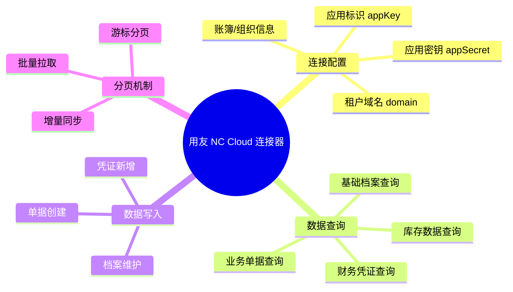
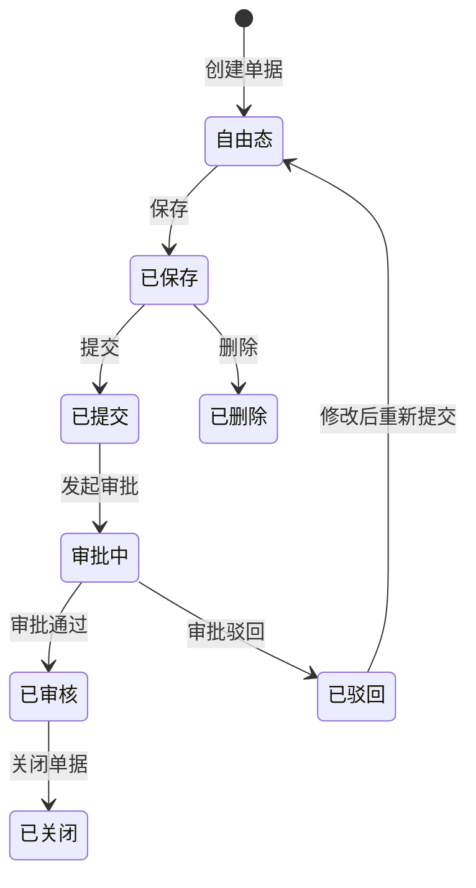
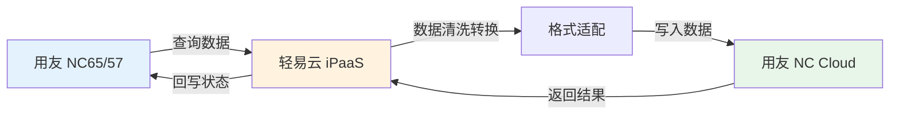
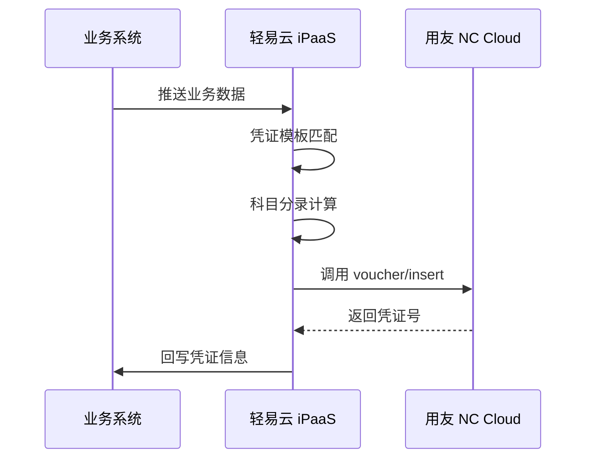
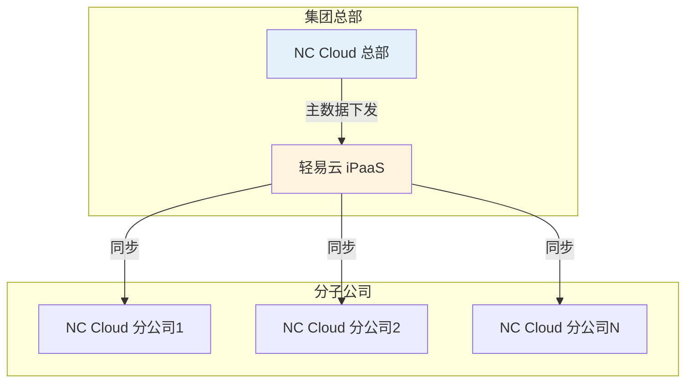

# 用友 NC Cloud 集成专题

本文档详细介绍轻易云 iPaaS 平台与用友 NC Cloud（NCC）的集成配置方法，涵盖连接器配置、接口鉴权、业务接口清单、分页拉取机制以及常见集成场景的最佳实践，帮助企业实现 NC Cloud 与第三方系统的数据互通。

## 概述

用友 NC Cloud（简称 NCC）是用友网络面向大型集团企业推出的数字化平台，基于云原生架构，聚焦数字化管理、数字化经营、数字化商业，帮助大型企业实现人、财、物、客的全面数字化，驱动业务创新与管理变革。

轻易云 iPaaS 提供专用的用友 NC Cloud 连接器，基于 NC Cloud OpenAPI 实现以下核心能力：

- **基础档案同步**：组织、物料、客户、供应商、部门、人员等主数据双向同步
- **财务凭证集成**：总账凭证、辅助核算、现金流量等财务数据的自动化对接
- **供应链单据流转**：采购订单、销售订单、出入库单等业务单据的跨系统协同
- **组织间协同**：支持多组织、多账套的复杂集团架构数据交换



## 连接器配置

### 创建连接器

1. 登录轻易云 iPaaS 控制台，进入**连接器管理**页面
2. 点击**新建连接器**，选择 **ERP** 分类下的**用友 NC Cloud**
3. 填写连接参数（详见下方参数说明）
4. 点击**测试连接**验证连通性
5. 连接成功后点击**保存**

### 连接参数说明

| 参数名 | 类型 | 必填 | 说明 |
| ------ | ---- | ---- | ---- |
| `domain` | string | ✅ | NC Cloud 租户域名，如 `https://ncc.yonyou.com` |
| `app_key` | string | ✅ | 应用标识，在用友开放平台创建应用后获取 |
| `app_secret` | string | ✅ | 应用密钥，与 AppKey 配对使用 |
| `tenant_id` | string | ✅ | 租户 ID，登录 NC Cloud 后台获取 |
| `account_book` | string | — | 默认账簿编码，可多账簿配置时指定 |

> [!IMPORTANT]
> 用友 NC Cloud 的 `domain` 地址通常是租户专属的登录域名，请确保填写完整地址且以 `/` 结尾。若使用私有化部署，请填写内网或 VPN 可访问的服务器地址。

### 适配器选择

| 场景 | 查询适配器 | 写入适配器 |
| ---- | ---------- | ---------- |
| 基础档案查询 | `NCCQueryAdapter` | — |
| 财务凭证查询 | `NCCQueryAdapter` | — |
| 业务单据查询 | `NCCQueryAdapter` | — |
| 凭证新增 | — | `NCCVoucherAdapter` |
| 单据创建 | — | `NCCWriteAdapter` |
| 档案维护 | — | `NCCArchiveAdapter` |

## 接口鉴权配置

### 获取应用凭证

1. **登录用友开放平台**
   
   访问 [用友开放平台](https://developer.yonyou.com/)，使用企业管理员账号登录。

2. **创建应用**
   
   进入**应用管理**页面，点击**新建应用**，选择 **NC Cloud** 产品，填写应用名称、描述等信息。

3. **获取应用 Key 和密钥**
   
   应用创建成功后，在应用详情页可获取：
   - **应用 Key**（`app_key`）
   - **应用密钥**（`app_secret`）

4. **配置 API 权限**
   
   为应用分配所需的 API 调用权限，包括：
   - 基础数据查询权限（组织、物料、客户等）
   - 财务数据操作权限（凭证、账簿等）
   - 业务单据操作权限（订单、出入库等）

### 获取租户信息

1. **获取租户 ID**
   
   登录用友 NC Cloud 后台，进入**系统管理** → **租户管理**，查看并记录租户 ID。

2. **获取租户域名**
   
   租户域名通常与登录地址一致，格式如 `https://xxx.yonyoucloud.com`。

## 业务接口清单

用友 NC Cloud 提供丰富的 OpenAPI 接口，轻易云 iPaaS 已封装适配以下常用接口：

### 基础档案接口

| 接口名称 | 接口标识 | 操作类型 | 说明 |
| -------- | -------- | -------- | ---- |
| 组织查询 | `/api/org/query` | 查询 | 查询业务单元、财务组织信息 |
| 物料档案查询 | `/api/material/query` | 查询 | 查询物料基础信息 |
| 客户档案查询 | `/api/customer/query` | 查询 | 查询客户基础信息 |
| 供应商档案查询 | `/api/supplier/query` | 查询 | 查询供应商基础信息 |
| 部门档案查询 | `/api/dept/query` | 查询 | 查询部门组织架构信息 |
| 人员档案查询 | `/api/psn/query` | 查询 | 查询员工信息 |
| 会计科目查询 | `/api/gl/account/query` | 查询 | 查询会计科目档案 |
| 账簿查询 | `/api/gl/accbook/query` | 查询 | 查询账簿信息 |

### 财务接口

| 接口名称 | 接口标识 | 操作类型 | 说明 |
| -------- | -------- | -------- | ---- |
| 凭证列表查询 | `/api/gl/voucher/list` | 查询 | 查询财务凭证列表 |
| 凭证详情查询 | `/api/gl/voucher/detail` | 查询 | 查询凭证详细信息 |
| 凭证新增 | `/api/gl/voucher/insert` | 写入 | 新增会计凭证 |
| 凭证删除 | `/api/gl/voucher/delete` | 写入 | 删除未审核凭证 |
| 科目余额查询 | `/api/gl/balance/query` | 查询 | 查询科目余额表 |
| 现金流量项目查询 | `/api/gl/cashflow/query` | 查询 | 查询现金流量项目 |

### 供应链接口

| 接口名称 | 接口标识 | 操作类型 | 说明 |
| -------- | -------- | -------- | ---- |
| 采购订单查询 | `/api/po/order/query` | 查询 | 查询采购订单数据 |
| 采购订单保存 | `/api/po/order/save` | 写入 | 创建或修改采购订单 |
| 采购入库单查询 | `/api/purin/query` | 查询 | 查询采购入库单 |
| 销售订单查询 | `/api/so/order/query` | 查询 | 查询销售订单数据 |
| 销售订单保存 | `/api/so/order/save` | 写入 | 创建或修改销售订单 |
| 销售出库单查询 | `/api/sodelivery/query` | 查询 | 查询销售出库单 |
| 库存现存量查询 | `/api/stock/query` | 查询 | 查询当前库存数量 |

### 接口调用示例

#### 查询凭证列表

```json
{
  "api": "/api/gl/voucher/list",
  "method": "POST",
  "body": {
    "accbookCode": "0001",           // 账簿编码
    "year": "2026",                  // 会计年度
    "period": "03",                  // 会计期间
    "vouchertypeCode": "01",         // 凭证类别
    "num_start": "1",                // 凭证号起
    "num_end": "9999"                // 凭证号止
  }
}
```

#### 新增会计凭证

```json
{
  "api": "/api/gl/voucher/insert",
  "method": "POST",
  "body": {
    "accbookCode": "0001",           // 账簿编码
    "prepareddate": "2026-03-13",    // 制单日期
    "year": "2026",                  // 年度
    "period": "03",                  // 期间
    "vouchertype": "01",             // 凭证类别编码
    "prepared": "张三",               // 制单人
    "attachment": 2,                 // 附件数
    "detail": [
      {
        "detailindex": 1,            // 分录号
        "unitCode": "1001",          // 业务单元编码
        "explanation": "摘要内容",    // 摘要
        "accountCode": "100201",     // 科目编码
        "currtypeCode": "CNY",       // 币别编码
        "localdebitamount": 10000.00,  // 组织本币借方金额
        "localcreditamount": 0,        // 组织本币贷方金额
        "ass": [                       // 辅助核算
          {
            "checktypecode": "Dept",   // 核算项编码
            "checkvaluecode": "D01"    // 核算值编码
          }
        ]
      },
      {
        "detailindex": 2,
        "unitCode": "1001",
        "explanation": "摘要内容",
        "accountCode": "600101",
        "currtypeCode": "CNY",
        "localdebitamount": 0,
        "localcreditamount": 10000.00
      }
    ]
  }
}
```

#### 查询物料档案

```json
{
  "api": "/api/material/query",
  "method": "POST",
  "body": {
    "code": "",                      // 物料编码，为空查询全部
    "name": "",                      // 物料名称，支持模糊查询
    "classcode": "",                 // 分类编码
    "pageIndex": 1,                  // 当前页码
    "pageSize": 100                  // 每页记录数
  }
}
```

## 分页拉取机制

用友 NC Cloud 接口支持分页查询，轻易云 iPaaS 提供自动分页适配器，帮助用户高效获取大批量数据。

### 分页参数说明

| 参数名 | 类型 | 说明 | 示例值 |
| ------ | ---- | ---- | ------ |
| `pageIndex` | int | 当前页码，从 1 开始 | 1, 2, 3... |
| `pageSize` | int | 每页记录数，最大 1000 | 100, 500, 1000 |
| `totalCount` | int | 总记录数（响应返回） | 5000 |
| `totalPage` | int | 总页数（响应返回） | 10 |

### 分页拉取配置

在轻易云 iPaaS 集成方案中配置分页拉取：

```json
{
  "source": {
    "adapter": "NCCQueryAdapter",
    "api": "/api/gl/voucher/list",
    "pagination": {
      "enabled": true,
      "pageSize": 500,                    // 每页拉取 500 条
      "pageParam": "pageIndex",           // 页码参数名
      "sizeParam": "pageSize",            // 页大小参数名
      "totalPath": "data.total",          // 总记录数路径
      "dataPath": "data.records"          // 数据列表路径
    }
  }
}
```

### 增量同步配置

为避免重复拉取全量数据，建议使用增量同步策略：

```json
{
  "source": {
    "adapter": "NCCQueryAdapter",
    "api": "/api/gl/voucher/list",
    "params": {
      "startDate": "{{lastSyncTime|date('yyyy-MM-dd')}}",  // 上次同步时间
      "endDate": "{{currentTime|date('yyyy-MM-dd')}}"      // 当前时间
    },
    "pagination": {
      "enabled": true,
      "pageSize": 500
    }
  },
  "schedule": {
    "type": "interval",                   // 定时触发
    "interval": 300                       // 每 5 分钟执行一次
  }
}
```

> [!TIP]
> 建议根据数据变化频率设置合理的同步间隔。对于财务凭证等对实时性要求不高的场景，可设置每小时同步一次；对于库存数据，可设置 5-15 分钟间隔。

## 写入注意事项

### 单据状态管理

用友 NC Cloud 的单据通常具有多种状态，写入时需要注意状态流转规则：



| 操作 | 接口标识 | 前置条件 | 注意事项 |
| ---- | -------- | -------- | -------- |
| 创建单据 | `*/save` | 无 | 确保编码规则正确，必填字段完整 |
| 提交单据 | `*/submit` | 单据已保存 | 提交后进入审批流程 |
| 审核单据 | `*/audit` | 单据已提交 | 审核后单据不可修改 |
| 删除单据 | `*/delete` | 单据未提交 | 已审核单据需先弃审 |

> [!WARNING]
> 审核后的单据在 NC Cloud 系统中通常不允许直接修改，如需修改必须先执行弃审操作。在设计集成方案时，建议先判断单据状态，再决定后续操作。

### 字段映射注意事项

#### 编码字段严格匹配

用友 NC Cloud 中的基础档案（客户、供应商、物料等）通过编码进行关联，写入时必须确保编码严格匹配：

| 字段类型 | 示例 | 说明 |
| -------- | ---- | ---- |
| 客户编码 | `customerCode` | 必须存在于客户档案中 |
| 供应商编码 | `supplierCode` | 必须存在于供应商档案中 |
| 物料编码 | `materialCode` | 必须存在于物料档案中 |
| 部门编码 | `deptCode` | 必须存在于部门档案中 |
| 人员编码 | `psnCode` | 必须存在于人员档案中 |
| 组织编码 | `orgCode` | 必须存在于组织档案中 |
| 科目编码 | `accountCode` | 必须存在于科目档案中 |

> [!CAUTION]
> 如果写入的编码在 NC Cloud 系统中不存在，接口将返回错误。建议在集成前进行基础档案的同步，或在集成方案中增加编码映射转换逻辑。

#### 多组织多账簿处理

NC Cloud 支持多组织、多账簿的复杂集团架构，写入时需注意：

| 场景 | 处理方式 | 说明 |
| ---- | -------- | ---- |
| 跨组织业务 | 指定 `unitCode` | 明确业务发生的组织 |
| 多账簿凭证 | 指定 `accbookCode` | 明确凭证所属的账簿 |
| 组织间交易 | 使用 `srcUnitCode` 和 `tgtUnitCode` | 区分来源组织和目标组织 |

### 业务规则校验

写入单据时，NC Cloud 系统会进行一系列业务规则校验，常见校验失败原因：

| 错误提示 | 原因 | 解决方案 |
| -------- | ---- | -------- |
| 单据编号重复 | 传入的单据号已存在 | 使用系统自动编号，或检查编码规则 |
| 客户不存在 | 客户编码未建档 | 同步客户档案后再写单据 |
| 物料不存在 | 物料编码未建档 | 同步物料档案后再写单据 |
| 现存量不足 | 库存数量不足 | 检查库存或调整数量 |
| 借贷不平衡 | 凭证借贷金额不等 | 核对凭证分录金额 |
| 会计期间已结账 | 目标期间已结账 | 选择未结账期间 |
| 辅助核算不匹配 | 科目与辅助核算组合错误 | 核对科目辅助核算配置 |

## 常见集成场景

### 场景一：NC65 / NC57 升级迁移至 NC Cloud

将旧版用友 NC（NC65 或 NC57）的数据迁移到 NC Cloud，实现系统升级过程中的数据无缝对接。



**配置要点**：

1. **档案映射**：将 NC65 的档案编码映射到 NC Cloud 的档案编码
2. **字段适配**：处理新旧版本字段差异（如 NC Cloud 增加了全局本币字段）
3. **分阶段迁移**：先迁移基础档案，再迁移历史数据，最后迁移业务单据
4. **数据校验**：迁移完成后进行数据一致性校验

**NC65 与 NC Cloud 凭证字段映射示例**：

| NC65 字段 | NC Cloud 字段 | 转换说明 |
| ---------- | -------------- | -------- |
| `pk_voucher` | `pk_voucher` | 直接映射 |
| `totalLocDebit` | `totalDebit` | 字段名变更 |
| `debitLocAmount` | `localdebitamount` | 格式调整 |
| `assvos` | `ass` | 辅助核算结构调整 |
| — | `groupdebitamount` | 新增字段，需计算填充 |

### 场景二：财务凭证自动生成

将业务系统（电商平台、WMS、费控系统等）的数据自动生成 NC Cloud 会计凭证，实现业财一体化。



**凭证模板配置示例**：

| 业务类型 | 借方科目 | 贷方科目 | 金额来源 | 辅助核算 |
| -------- | -------- | -------- | -------- | -------- |
| 销售收款 | 银行存款 | 应收账款 | 收款金额 | 客户、部门 |
| 采购付款 | 应付账款 | 银行存款 | 付款金额 | 供应商、部门 |
| 成本结转 | 主营业务成本 | 库存商品 | 出库成本 | 物料、仓库 |
| 费用报销 | 管理费用 | 其他应付款 | 报销金额 | 部门、人员 |

### 场景三：多组织主数据分发

实现集团总部与分子公司之间的主数据统一管理和分发。



**配置建议**：

| 数据类型 | 同步方向 | 同步频率 | 冲突处理 |
| -------- | -------- | -------- | -------- |
| 会计科目 | 集团 → 分子公司 | 实时 | 集团覆盖 |
| 客户档案 | 双向同步 | 每小时 | 按时间戳合并 |
| 供应商档案 | 双向同步 | 每小时 | 按时间戳合并 |
| 物料档案 | 集团 → 分子公司 | 每天 | 集团覆盖 |

### 场景四：NC Cloud 与电商平台对接

实现 NC Cloud 与电商平台的订单、库存、商品数据互通。

| 业务场景 | 同步方向 | 关键字段映射 |
| -------- | -------- | ------------ |
| 订单同步 | 电商平台 → NC Cloud | 订单号 → 销售订单号 |
| 库存同步 | NC Cloud → 电商平台 | 现存量 → 可售库存 |
| 商品同步 | NC Cloud → 电商平台 | 物料编码 → SKU |
| 退款同步 | 电商平台 → NC Cloud | 退款单 → 销售退货单 |

## 常见问题

### Q：连接测试失败，提示 "认证失败"？

请检查以下配置：

1. 确认 `app_key` 和 `app_secret` 是否正确匹配
2. 检查 `tenant_id` 是否为当前登录租户
3. 确认 `domain` 地址是否完整且可访问
4. 验证应用是否已分配所需的 API 权限
5. 检查系统时间是否准确（时间偏差会导致 Token 验证失败）

### Q：如何获取 NC Cloud 的档案编码？

1. **登录 NC Cloud 系统**，进入相应的基础档案节点
2. **查看档案列表**，获取编码信息
3. 或使用查询接口获取：

```json
{
  "api": "/api/customer/query",
  "method": "POST",
  "body": {
    "pageIndex": 1,
    "pageSize": 1000
  }
}
```

### Q：单据写入成功但在 NC Cloud 中查不到？

1. 检查单据是否写入正确的组织（`unitCode` 参数）
2. 确认单据日期在当前会计期间内（财务单据）
3. 检查单据状态，可能在自由态或审批中状态
4. 确认操作用户有查看该类型单据的权限
5. 检查是否因编码规则问题导致单据号生成失败

### Q：如何处理多账簿的财务数据？

在接口请求中明确指定账簿编码：

```json
{
  "api": "/api/gl/voucher/list",
  "method": "POST",
  "body": {
    "accbookCode": "0001"     // 指定账簿编码
  }
}
```

### Q：NC Cloud 与 NC65 的凭证接口有什么区别？

| 对比项 | NC65 | NC Cloud |
| ------ | ---- | -------- |
| 接口路径 | `/uapws/rest/gl/voucher/*` | `/api/gl/voucher/*` |
| 本币金额字段 | `debitLocAmount` | `localdebitamount` |
| 辅助核算 | `assvos` 数组 | `ass` 数组 |
| 全局本币 | 不支持 | `globaldebitamount` |
| 集团本币 | 部分支持 | `groupdebitamount` |

### Q：如何查询历史期间的财务数据？

```json
{
  "api": "/api/gl/balance/query",
  "method": "POST",
  "body": {
    "accbookCode": "0001",
    "year": "2025",            // 指定年度
    "period": "12",            // 指定期间
    "accountCode": ""          // 科目编码（可选）
  }
}
```

## 相关资源

- [用友开放平台](https://developer.yonyou.com/) — 官方 API 文档和开发者工具
- [配置连接器](../../guide/configure-connector) — 连接器基础使用指南
- [ERP 连接器概览](./README) — 其他 ERP 系统连接器
- [用友 U8+ 集成专题](./yonyou-u8) — 用友 U8+ 连接器文档
- [用友 BIP 集成专题](./yonyou-bip) — 用友 BIP 连接器文档
- [数据映射指南](../../guide/data-mapping) — 字段映射配置详解
- [集成方案配置](../../guide/create-integration) — 创建集成方案的完整流程

---

> [!NOTE]
> 用友 NC Cloud 的 API 接口可能会随版本更新而调整，建议定期关注 [用友开放平台](https://developer.yonyou.com/openAPI) 的更新公告。如有疑问，请联系轻易云技术支持团队。
