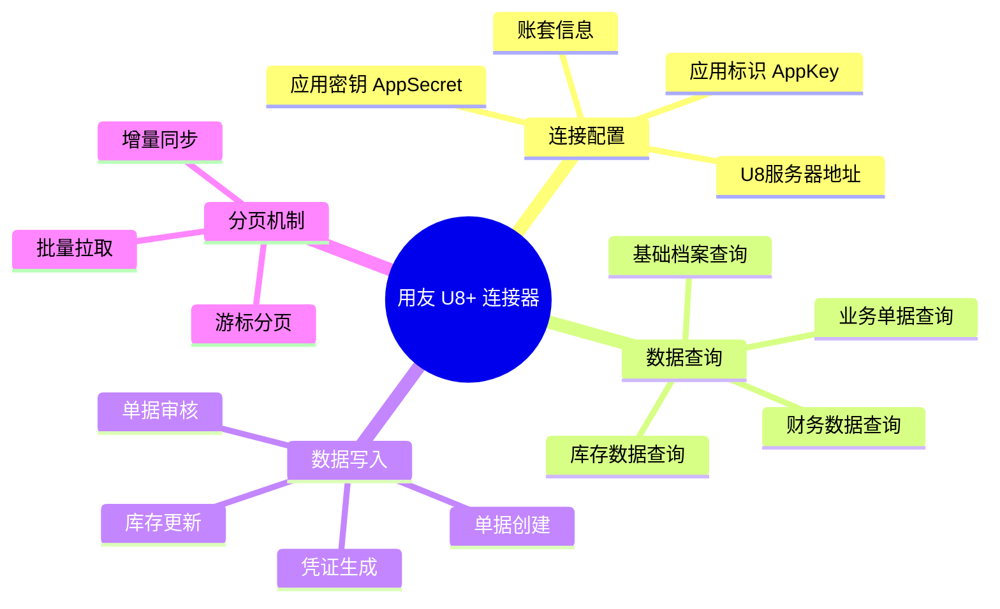
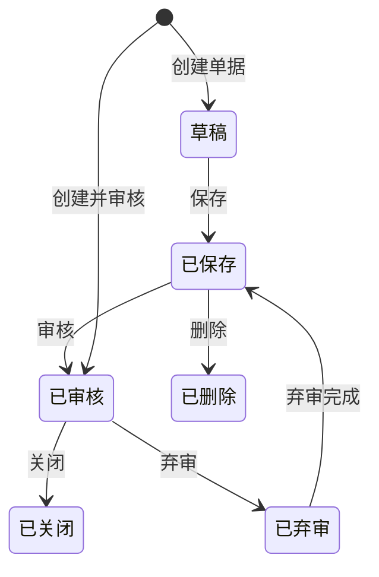
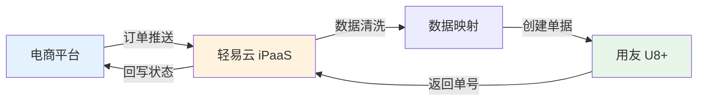
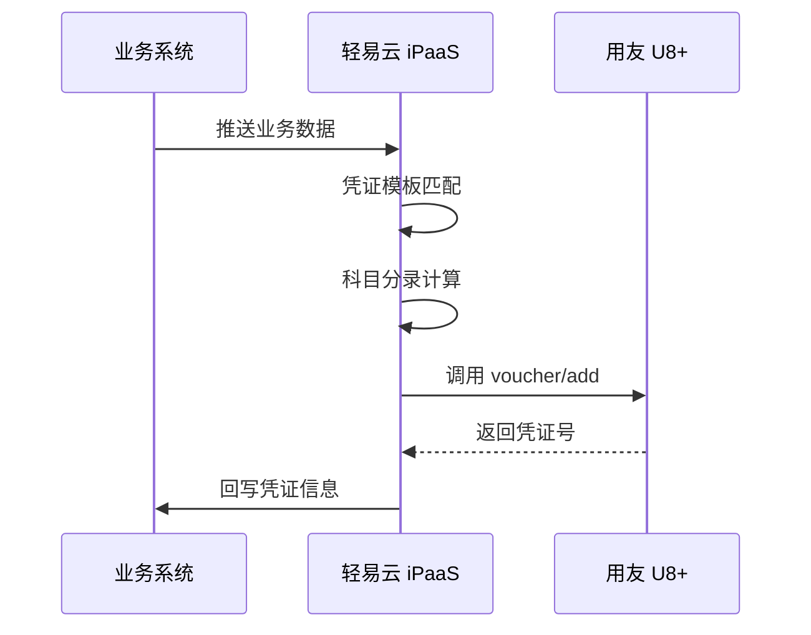

# 用友 U8+ 集成专题

本文档详细介绍轻易云 iPaaS 平台与用友 U8+ 的集成配置方法，涵盖连接器配置、业务接口清单、分页拉取机制以及写入注意事项，帮助企业实现 U8+ 系统与第三方应用的高效数据互通。

## 概述

用友 U8+ 是用友网络面向中型成长型企业推出的 ERP 管理软件，覆盖财务、供应链、生产制造、人力资源等核心业务领域，在国内拥有广泛的用户基础。

轻易云 iPaaS 提供专用的用友 U8+ 连接器，基于 U8+ OpenAPI 实现以下核心能力：

- **基础档案同步**：物料、客户、供应商、部门、人员等主数据双向同步
- **业务单据集成**：采购订单、销售订单、出入库单、财务凭证的自动化流转
- **库存数据交互**：实时库存查询、库存台账同步
- **财务数据对接**：凭证生成、科目余额查询、账簿数据抽取



## 连接器配置

### 创建连接器

1. 登录轻易云 iPaaS 控制台，进入**连接器管理**页面
2. 点击**新建连接器**，选择 **ERP** 分类下的**用友 U8+**
3. 填写连接参数（详见下方参数说明）
4. 点击**测试连接**验证连通性
5. 连接成功后点击**保存**

### 连接参数说明

| 参数名 | 类型 | 必填 | 说明 |
| ------ | ---- | ---- | ---- |
| `server_url` | string | ✅ | U8+ 服务器地址，如 `http://u8-server:8080` |
| `app_key` | string | ✅ | 应用标识，在 U8+ 开放平台申请 |
| `app_secret` | string | ✅ | 应用密钥，与 AppKey 配对使用 |
| `account_id` | string | ✅ | 账套 ID（年度账套编号） |
| `user_code` | string | ✅ | U8+ 操作用户编码 |
| `password` | string | ✅ | U8+ 操作用户密码 |

> [!IMPORTANT]
> 用友 U8+ 的 `server_url` 需要确保轻易云平台能够访问，建议使用内网穿透或 VPN 方式打通网络。若使用公网地址，请确保防火墙已开放相应端口。

### 适配器选择

| 场景 | 查询适配器 | 写入适配器 |
| ---- | ---------- | ---------- |
| 基础档案查询 | `U8QueryAdapter` | — |
| 业务单据查询 | `U8QueryAdapter` | — |
| 单据创建 | — | `U8WriteAdapter` |
| 单据审核 | — | `U8AuditAdapter` |
| 凭证生成 | — | `U8VoucherAdapter` |

## 业务接口清单

用友 U8+ 开放平台提供了丰富的 API 接口，轻易云 iPaaS 已封装适配以下常用接口：

### 基础档案接口

| 接口名称 | 接口标识 | 操作类型 | 说明 |
| -------- | -------- | -------- | ---- |
| 存货档案查询 | `inventory/list` | 查询 | 查询物料/商品基础信息 |
| 存货分类查询 | `inventoryclass/list` | 查询 | 查询物料分类信息 |
| 客户档案查询 | `customer/list` | 查询 | 查询客户基础信息 |
| 供应商档案查询 | `vendor/list` | 查询 | 查询供应商基础信息 |
| 部门档案查询 | `department/list` | 查询 | 查询组织架构信息 |
| 人员档案查询 | `person/list` | 查询 | 查询员工信息 |
| 仓库档案查询 | `warehouse/list` | 查询 | 查询仓库基础信息 |
| 计量单位查询 | `unit/list` | 查询 | 查询计量单位信息 |

### 供应链接口

| 接口名称 | 接口标识 | 操作类型 | 说明 |
| -------- | -------- | -------- | ---- |
| 采购订单查询 | `poorder/list` | 查询 | 查询采购订单数据 |
| 采购订单创建 | `poorder/add` | 写入 | 创建采购订单 |
| 采购入库单查询 | `purinlist/list` | 查询 | 查询采购入库单 |
| 采购入库单创建 | `purinlist/add` | 写入 | 创建采购入库单 |
| 销售订单查询 | `soorder/list` | 查询 | 查询销售订单数据 |
| 销售订单创建 | `soorder/add` | 写入 | 创建销售订单 |
| 销售出库单查询 | `sodelivery/list` | 查询 | 查询销售出库单 |
| 销售出库单创建 | `sodelivery/add` | 写入 | 创建销售出库单 |
| 调拨单查询 | `transfer/list` | 查询 | 查询库存调拨单 |
| 调拨单创建 | `transfer/add` | 写入 | 创建调拨单 |
| 盘点单查询 | `check/list` | 查询 | 查询库存盘点单 |
| 盘点单创建 | `check/add` | 写入 | 创建盘点单 |

### 财务接口

| 接口名称 | 接口标识 | 操作类型 | 说明 |
| -------- | -------- | -------- | ---- |
| 会计凭证查询 | `voucher/list` | 查询 | 查询财务凭证 |
| 会计凭证创建 | `voucher/add` | 写入 | 生成会计凭证 |
| 科目档案查询 | `code/list` | 查询 | 查询会计科目 |
| 科目余额查询 | `balance/list` | 查询 | 查询科目余额 |
| 现金流量项目查询 | `cashflow/list` | 查询 | 查询现金流量项目 |

### 接口调用示例

#### 查询存货档案

```json
{
  "api": "inventory/list",
  "method": "POST",
  "body": {
    "cInvCode": "",           // 存货编码，为空则查询全部
    "cInvName": "",           // 存货名称，支持模糊查询
    "cInvCCode": "",          // 存货分类编码
    "pageIndex": 1,           // 当前页码
    "pageSize": 100           // 每页记录数
  }
}
```

#### 创建销售订单

```json
{
  "api": "soorder/add",
  "method": "POST",
  "body": {
    "Head": {
      "cSTCode": "01",                    // 销售类型编码
      "dDate": "2026-03-13",              // 订单日期
      "cCusCode": "C001",                 // 客户编码
      "cDepCode": "D01",                  // 部门编码
      "cPersonCode": "P001",              // 业务员编码
      "cMemo": "轻易云测试订单"           // 备注
    },
    "Body": [
      {
        "cInvCode": "M001",               // 存货编码
        "iQuantity": 100,                 // 数量
        "iUnitPrice": 50.00,              // 单价
        "iTaxRate": 13,                   // 税率
        "dPreDate": "2026-03-20",         // 预发货日期
        "cMemo": "第一行明细"             // 行备注
      }
    ]
  }
}
```

#### 生成会计凭证

```json
{
  "api": "voucher/add",
  "method": "POST",
  "body": {
    "Voucher": {
      "InoId": "",                        // 凭证号，为空自动编号
      "DbillDate": "2026-03-13",          // 制单日期
      "Csign": "记",                      // 凭证字
      "Illd": "",                         // 附单据数
      "Cdigest": "摘要内容",              // 摘要
      "Entries": [
        {
          "Ccode": "1001",                // 科目编码（借方）
          "Md": 1000.00,                  // 借方金额
          "Mc": 0,                        // 贷方金额
          "CdeptId": "",                  // 部门编码
          "CpersonId": "",                // 人员编码
          "CcusId": "",                   // 客户编码
          "CvenId": ""                    // 供应商编码
        },
        {
          "Ccode": "6001",                // 科目编码（贷方）
          "Md": 0,
          "Mc": 1000.00,
          "CdeptId": "",
          "CpersonId": "",
          "CcusId": "",
          "CvenId": ""
        }
      ]
    }
  }
}
```

## 分页拉取机制

用友 U8+ 接口支持分页查询，轻易云 iPaaS 提供自动分页适配器，帮助用户高效获取大批量数据。

### 分页参数说明

| 参数名 | 类型 | 说明 | 示例值 |
| ------ | ---- | ---- | ------ |
| `pageIndex` | int | 当前页码，从 1 开始 | 1, 2, 3... |
| `pageSize` | int | 每页记录数，最大 1000 | 100, 500, 1000 |
| `totalCount` | int | 总记录数（响应返回） | 5000 |
| `totalPage` | int | 总页数（响应返回） | 10 |

### 分页拉取配置

在轻易云 iPaaS 集成方案中配置分页拉取：

```json
{
  "source": {
    "adapter": "U8QueryAdapter",
    "api": "inventory/list",
    "pagination": {
      "enabled": true,
      "pageSize": 500,                    // 每页拉取 500 条
      "pageParam": "pageIndex",           // 页码参数名
      "sizeParam": "pageSize",            // 页大小参数名
      "totalPath": "data.total",          // 总记录数路径
      "dataPath": "data.records"          // 数据列表路径
    }
  }
}
```

### 增量同步配置

为避免重复拉取全量数据，建议使用增量同步策略：

```json
{
  "source": {
    "adapter": "U8QueryAdapter",
    "api": "soorder/list",
    "params": {
      "dBeginDate": "{{lastSyncTime|date('yyyy-MM-dd')}}",  // 上次同步时间
      "dEndDate": "{{currentTime|date('yyyy-MM-dd')}}"      // 当前时间
    },
    "pagination": {
      "enabled": true,
      "pageSize": 500
    }
  },
  "schedule": {
    "type": "interval",                   // 定时触发
    "interval": 300                       // 每 5 分钟执行一次
  }
}
```

> [!TIP]
> 建议根据数据变化频率设置合理的同步间隔。对于实时性要求高的场景（如库存同步），可设置 1-5 分钟间隔；对于业务单据，可设置 15-30 分钟间隔。

### 大表分页优化

针对数据量极大的表（如库存台账、凭证分录），建议采用以下优化策略：

| 优化策略 | 说明 | 适用场景 |
| -------- | ---- | -------- |
| 时间切片 | 按时间范围分段拉取，减少单次查询数据量 | 历史数据同步 |
| 主键分段 | 按主键范围分段拉取，避免深分页性能问题 | 无时间字段的大表 |
| 并行拉取 | 同时发起多个分页请求，提升同步效率 | 服务器性能充足时 |
| 游标模式 | 使用服务端游标，避免深分页 | U8 版本支持时 |

## 写入注意事项

### 单据状态管理

用友 U8+ 的单据通常具有多种状态，写入时需要注意状态流转规则：



| 操作 | 接口标识 | 前置条件 | 注意事项 |
| ---- | -------- | -------- | -------- |
| 创建单据 | `*/add` | 无 | 确保编码规则正确，必填字段完整 |
| 审核单据 | `*/audit` | 单据已保存 | 审核后单据不可修改 |
| 弃审单据 | `*/unaudit` | 单据已审核 | 弃审后才能修改或删除 |
| 删除单据 | `*/delete` | 单据未审核 | 已审核单据需先弃审 |

> [!WARNING]
> 审核后的单据在 U8 系统中通常不允许直接修改，如需修改必须先执行弃审操作。在设计集成方案时，建议先判断单据状态，再决定后续操作。

### 字段映射注意事项

#### 编码字段严格匹配

用友 U8+ 中的基础档案（客户、供应商、物料等）通过编码进行关联，写入时必须确保编码严格匹配：

| 字段类型 | 示例 | 说明 |
| -------- | ---- | ---- |
| 客户编码 | `cCusCode` | 必须存在于客户档案中 |
| 供应商编码 | `cVenCode` | 必须存在于供应商档案中 |
| 存货编码 | `cInvCode` | 必须存在于存货档案中 |
| 部门编码 | `cDepCode` | 必须存在于部门档案中 |
| 人员编码 | `cPersonCode` | 必须存在于人员档案中 |
| 仓库编码 | `cWhCode` | 必须存在于仓库档案中 |
| 科目编码 | `cCode` | 必须存在于科目档案中 |

> [!CAUTION]
> 如果写入的编码在 U8 系统中不存在，接口将返回错误。建议在集成前进行基础档案的同步，或在集成方案中增加编码映射转换逻辑。

#### 数值精度处理

| 字段 | 精度 | 说明 |
| ---- | ---- | ---- |
| 金额字段 | 2 位小数 | 如 `iUnitPrice`、`iMoney` |
| 数量字段 | 根据计量单位 | 通常为 0-6 位小数 |
| 税率字段 | 2 位小数 | 如 `iTaxRate` = 13.00 |
| 汇率字段 | 4-6 位小数 | 根据币种设置 |

#### 日期格式要求

U8+ 接口要求日期格式为 `yyyy-MM-dd` 或 `yyyy-MM-dd HH:mm:ss`：

```json
{
  "dDate": "2026-03-13",           // 日期
  "dPreDate": "2026-03-20",        // 预发货日期
  "dCreateTime": "2026-03-13 10:30:00"  // 创建时间
}
```

### 业务规则校验

写入单据时，U8+ 系统会进行一系列业务规则校验，常见校验失败原因：

| 错误提示 | 原因 | 解决方案 |
| -------- | ---- | -------- |
| 单据编号重复 | 传入的单据号已存在 | 使用 U8 自动编号，或检查编号规则 |
| 客户不存在 | 客户编码未建档 | 同步客户档案后再写单据 |
| 存货不存在 | 存货编码未建档 | 同步存货档案后再写单据 |
| 仓库不存在 | 仓库编码错误 | 核对仓库档案 |
| 现存量不足 | 库存数量不足 | 检查库存或调整数量 |
| 借贷不平衡 | 凭证借贷金额不等 | 核对凭证分录金额 |
| 会计期间已结账 | 目标期间已结账 | 选择未结账期间 |
| 字段值超出范围 | 数值超出字段限制 | 检查字段长度和精度 |

### 并发写入控制

当多个集成任务同时写入 U8+ 时，可能产生并发冲突：

> [!IMPORTANT]
> 建议为写入操作配置分布式锁，避免同一单据被多个任务同时操作。轻易云 iPaaS 支持基于单据号的乐观锁机制，可在集成方案中开启。

```json
{
  "target": {
    "adapter": "U8WriteAdapter",
    "api": "soorder/add",
    "concurrency": {
      "lockKey": "u8_soorder_{{cSOCode}}",  // 基于单据号加锁
      "lockTimeout": 30                      // 锁超时时间 30 秒
    }
  }
}
```

## 常见集成场景

### 场景一：电商订单对接

将电商平台（淘宝、京东、拼多多等）的订单自动同步到用友 U8+ 销售订单。



**配置要点**：

1. **客户映射**：将电商平台买家信息映射到 U8 客户档案
2. **商品映射**：将平台 SKU 映射到 U8 存货编码
3. **价格处理**：处理平台促销、优惠券后的实际成交金额
4. **仓库路由**：根据收货地址自动匹配发货仓库

**数据映射示例**：

| 电商平台字段 | U8+ 字段 | 转换规则 |
| ------------ | -------- | -------- |
| 订单编号 | cSOCode | 直接映射 |
| 买家昵称 | cCusName | 查找或创建客户 |
| SKU 编码 | cInvCode | 商品映射表转换 |
| 购买数量 | iQuantity | 直接映射 |
| 实付金额 | iSum | 分摊计算 |
| 收货地址 | cShipAddress | 地址解析 |

### 场景二：库存实时同步

实现 U8+ 库存数据与电商平台、WMS 系统的实时同步。

**方案一：U8+ → 电商平台（库存上架）**

```json
{
  "source": {
    "adapter": "U8QueryAdapter",
    "api": "currentstock/list",           // 查询现存量
    "schedule": {
      "type": "interval",
      "interval": 300                     // 每 5 分钟同步
    }
  },
  "transform": {
    "rules": [
      {
        "field": "iQuantity",             // 可用量计算
        "expression": "iQuantity - iOutQuantity"
      }
    ]
  },
  "target": {
    "adapter": "ECommerceStockAdapter",   // 电商平台库存适配器
    "api": "stock/update"
  }
}
```

**方案二：WMS → U8+（出入库同步）**

| 业务节点 | U8+ 接口 | 说明 |
| -------- | -------- | ---- |
| 入库上架 | `purinlist/add` | 创建采购入库单 |
| 销售出库 | `sodelivery/add` | 创建销售出库单 |
| 调拨出入库 | `transfer/add` | 创建调拨单 |
| 盘点调整 | `check/add` | 创建盘点单 |

### 场景三：财务凭证自动生成

将业务系统数据自动生成 U8+ 会计凭证，实现业财一体化。



**凭证模板配置示例**：

| 业务类型 | 借方科目 | 贷方科目 | 金额来源 |
| -------- | -------- | -------- | -------- |
| 销售收款 | 银行存款 | 应收账款 | 收款金额 |
| 采购付款 | 应付账款 | 银行存款 | 付款金额 |
| 成本结转 | 主营业务成本 | 库存商品 | 出库成本 |
| 费用报销 | 管理费用 | 其他应付款 | 报销金额 |

## 常见问题

### Q：连接测试失败，提示 "无法连接到服务器"？

请检查以下配置：

1. 确认 `server_url` 地址是否正确，包含端口号
2. 检查轻易云服务器与 U8 服务器的网络连通性
3. 确认 U8 服务器的防火墙已开放相应端口
4. 验证 U8 OpenAPI 服务是否已启动

### Q：接口调用返回 "Token 失效"？

U8+ 的访问 Token 有有效期限制，轻易云 iPaaS 会自动处理 Token 刷新。如出现 Token 失效错误：

1. 检查 `app_key` 和 `app_secret` 是否正确
2. 确认应用已在 U8 开放平台授权
3. 检查 U8 服务器时间是否准确（时间偏差会导致 Token 验证失败）

### Q：如何获取 U8+ 的编码信息？

1. **登录 U8 系统**，进入相应的基础档案模块
2. **查看档案列表**，获取编码信息
3. 或使用查询接口获取：

```json
{
  "api": "customer/list",
  "method": "POST",
  "body": {
    "pageIndex": 1,
    "pageSize": 1000
  }
}
```

### Q：单据写入成功但在 U8 中查不到？

1. 检查单据是否写入正确的账套（`account_id` 参数）
2. 确认单据日期在当前会计期间内
3. 检查单据状态，可能在草稿或待审核状态
4. 确认操作用户有查看该类型单据的权限

### Q：如何处理 U8+ 中的自定义项？

U8+ 支持单据头和单据体的自定义字段，写入时使用 `cDefine` 前缀：

```json
{
  "Head": {
    "cDefine1": "自定义值1",      // 单据头自定义项 1
    "cDefine2": "自定义值2",      // 单据头自定义项 2
    "cDefine3": "自定义值3"       // 单据头自定义项 3
  },
  "Body": [
    {
      "cInvCode": "M001",
      "cDefine22": "行自定义值1",  // 单据体自定义项 1
      "cDefine23": "行自定义值2"   // 单据体自定义项 2
    }
  ]
}
```

### Q：如何查询历史期间的库存数据？

使用库存台账查询接口，指定查询日期：

```json
{
  "api": "currentstock/list",
  "method": "POST",
  "body": {
    "dQueryDate": "2025-12-31",     // 查询截止日期
    "cWhCode": "",                  // 仓库编码（可选）
    "cInvCode": ""                  // 存货编码（可选）
  }
}
```

## 相关资源

- [用友 U8 开放平台](https://u8open.yonyou.com/) — 官方 API 文档和开发者工具
- [配置连接器](../../guide/configure-connector) — 连接器基础使用指南
- [ERP 连接器概览](./README) — 其他 ERP 系统连接器
- [数据映射指南](../../guide/data-mapping) — 字段映射配置详解
- [集成方案配置](../../guide/create-integration) — 创建集成方案的完整流程

---

> [!NOTE]
> 用友 U8+ 的 API 接口可能因版本不同有所差异，建议参考具体 U8 版本的接口文档。如有疑问，请联系轻易云技术支持团队。
