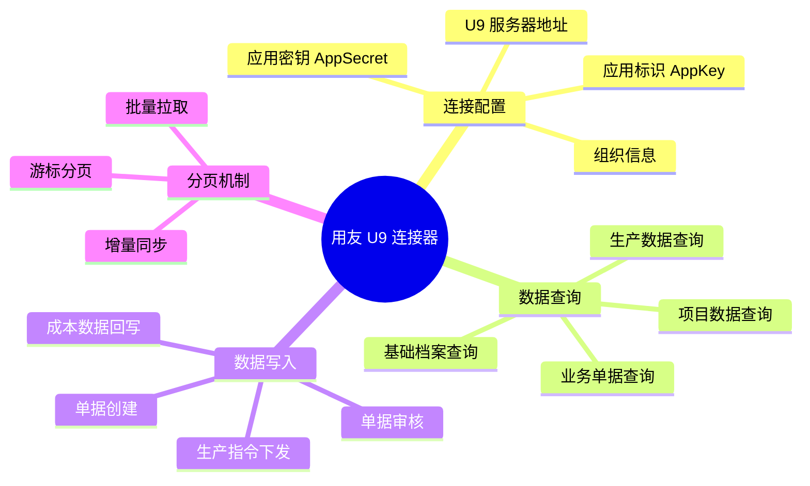
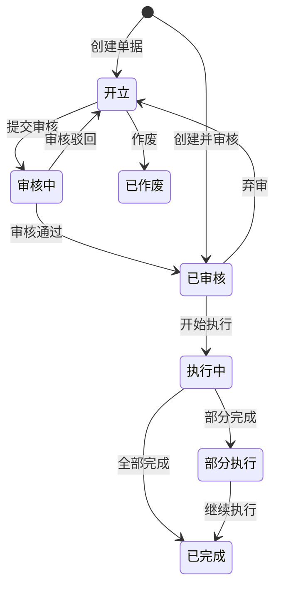
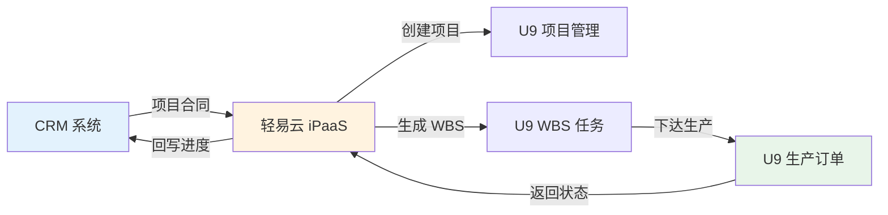
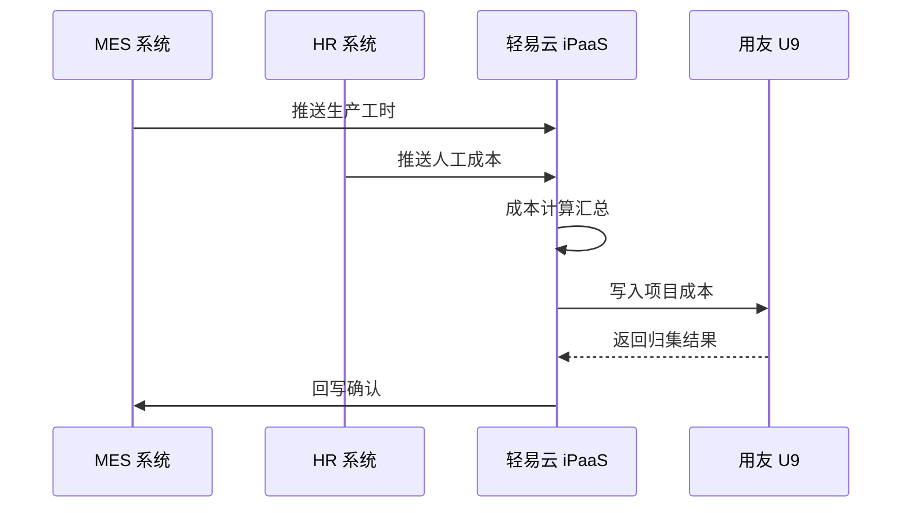

# 用友 U9 集成专题

本文档详细介绍轻易云 iPaaS 平台与用友 U9 的集成配置方法，涵盖连接器配置、业务接口清单、分页拉取机制以及写入注意事项，帮助企业实现 U9 系统与第三方应用的高效数据互通。

## 概述

用友 U9 是用友网络面向离散制造行业推出的世界级 ERP 管理软件，基于 SOA（Service-Oriented Architecture，面向服务架构）架构设计，专注于项目制造、按单设计、多组织协同等复杂业务场景，在装备制造、汽车及零部件、电子电器等行业拥有广泛的用户基础。

轻易云 iPaaS 提供专用的用友 U9 连接器，基于 U9 OpenAPI 实现以下核心能力：

- **基础档案同步**：物料、客户、供应商、部门、人员等主数据双向同步
- **业务单据集成**：销售订单、采购订单、生产订单、出入库单的自动化流转
- **项目制造对接**：项目任务、WBS（Work Breakdown Structure，工作分解结构）、成本归集的数据交互
- **多组织协同**：跨组织交易、内部结算、组织间调拨的数据贯通



## 连接器配置

### 创建连接器

1. 登录轻易云 iPaaS 控制台，进入**连接器管理**页面
2. 点击**新建连接器**，选择 **ERP** 分类下的**用友 U9**
3. 填写连接参数（详见下方参数说明）
4. 点击**测试连接**验证连通性
5. 连接成功后点击**保存**

### 连接参数说明

| 参数名 | 类型 | 必填 | 说明 |
| ------ | ---- | ---- | ---- |
| `server_url` | string | ✅ | U9 服务器地址，如 `http://u9-server:8080/u9api` |
| `app_key` | string | ✅ | 应用标识，在 U9 开放平台申请 |
| `app_secret` | string | ✅ | 应用密钥，与 AppKey 配对使用 |
| `org_code` | string | ✅ | 默认组织编码，如 `100` |
| `user_code` | string | ✅ | U9 操作用户编码 |
| `password` | string | ✅ | U9 操作用户密码 |

> [!IMPORTANT]
> 用友 U9 的 `server_url` 需要确保轻易云平台能够访问，建议使用内网穿透或 VPN 方式打通网络。若使用公网地址，请确保防火墙已开放相应端口。U9 为多组织架构，配置时需明确默认组织编码。

### 适配器选择

| 场景 | 查询适配器 | 写入适配器 |
| ---- | ---------- | ---------- |
| 基础档案查询 | `U9QueryAdapter` | — |
| 业务单据查询 | `U9QueryAdapter` | — |
| 单据创建 | — | `U9WriteAdapter` |
| 单据审核 | — | `U9AuditAdapter` |
| 生产订单操作 | — | `U9MOManageAdapter` |

## 业务接口清单

用友 U9 开放平台提供了丰富的 API 接口，轻易云 iPaaS 已封装适配以下常用接口：

### 基础档案接口

| 接口名称 | 接口标识 | 操作类型 | 说明 |
| -------- | -------- | -------- | ---- |
| 物料档案查询 | `ItemMaster/Query` | 查询 | 查询物料/商品基础信息 |
| 物料分类查询 | `ItemCategory/Query` | 查询 | 查询物料分类信息 |
| 客户档案查询 | `Customer/Query` | 查询 | 查询客户基础信息 |
| 供应商档案查询 | `Supplier/Query` | 查询 | 查询供应商基础信息 |
| 部门档案查询 | `Department/Query` | 查询 | 查询组织架构信息 |
| 人员档案查询 | `Operators/Query` | 查询 | 查询员工信息 |
| 仓库档案查询 | `Wh/Query` | 查询 | 查询仓库基础信息 |
| 计量单位查询 | `UOM/Query` | 查询 | 查询计量单位信息 |
| 项目档案查询 | `Project/Query` | 查询 | 查询项目基础信息 |

### 供应链接口

| 接口名称 | 接口标识 | 操作类型 | 说明 |
| -------- | -------- | -------- | ---- |
| 销售订单查询 | `SO/Query` | 查询 | 查询销售订单数据 |
| 销售订单创建 | `SO/Create` | 写入 | 创建销售订单 |
| 销售出货单查询 | `Ship/Query` | 查询 | 查询销售出货单 |
| 销售出货单创建 | `Ship/Create` | 写入 | 创建销售出货单 |
| 采购订单查询 | `PO/Query` | 查询 | 查询采购订单数据 |
| 采购订单创建 | `PO/Create` | 写入 | 创建采购订单 |
| 采购收货单查询 | `Rcv/Query` | 查询 | 查询采购收货单 |
| 采购收货单创建 | `Rcv/Create` | 写入 | 创建采购收货单 |
| 调拨单查询 | `Transfer/Query` | 查询 | 查询库存调拨单 |
| 调拨单创建 | `Transfer/Create` | 写入 | 创建调拨单 |

### 生产制造接口

| 接口名称 | 接口标识 | 操作类型 | 说明 |
| -------- | -------- | -------- | ---- |
| 生产订单查询 | `MO/Query` | 查询 | 查询生产订单 |
| 生产订单创建 | `MO/Create` | 写入 | 创建生产订单 |
| 生产订单下发 | `MO/Issue` | 写入 | 下发生产订单 |
| 生产领料单查询 | `Issue/Query` | 查询 | 查询生产领料单 |
| 生产入库单查询 | `RcvRpt/Query` | 查询 | 查询生产入库单 |
| 生产入库单创建 | `RcvRpt/Create` | 写入 | 创建生产入库单 |
| 工序转移单查询 | `OPTransfer/Query` | 查询 | 查询工序转移单 |
| 资源查询 | `Resource/Query` | 查询 | 查询工作中心资源 |

### 项目制造接口

| 接口名称 | 接口标识 | 操作类型 | 说明 |
| -------- | -------- | -------- | ---- |
| 项目任务查询 | `ProjectTask/Query` | 查询 | 查询项目任务（WBS） |
| 项目成本查询 | `ProjectCost/Query` | 查询 | 查询项目成本归集 |
| 项目物料查询 | `ProjectItem/Query` | 查询 | 查询项目专用物料 |
| 项目生产订单查询 | `ProjectMO/Query` | 查询 | 查询项目关联生产订单 |

### 财务接口

| 接口名称 | 接口标识 | 操作类型 | 说明 |
| -------- | -------- | -------- | ---- |
| 会计凭证查询 | `Voucher/Query` | 查询 | 查询财务凭证 |
| 会计凭证创建 | `Voucher/Create` | 写入 | 生成会计凭证 |
| 科目档案查询 | `Account/Query` | 查询 | 查询会计科目 |
| 科目余额查询 | `AccountBalance/Query` | 查询 | 查询科目余额 |
| 应收单查询 | `ARBill/Query` | 查询 | 查询应收单据 |
| 应付单查询 | `APBill/Query` | 查询 | 查询应付单据 |

### 接口调用示例

#### 查询物料档案

```json
{
  "api": "ItemMaster/Query",
  "method": "POST",
  "body": {
    "Code": "",             // 物料编码，为空则查询全部
    "Name": "",             // 物料名称，支持模糊查询
    "CategoryCode": "",     // 物料分类编码
    "OrgCode": "100",       // 组织编码
    "PageIndex": 1,         // 当前页码
    "PageSize": 100         // 每页记录数
  }
}
```

#### 创建销售订单

```json
{
  "api": "SO/Create",
  "method": "POST",
  "body": {
    "OrgCode": "100",                     // 组织编码
    "DocTypeCode": "SO01",                // 单据类型编码
    "BusinessDate": "2026-03-13",         // 业务日期
    "CustomerCode": "C001",               // 客户编码
    "DepartmentCode": "D01",              // 部门编码
    "OperatorCode": "P001",               // 业务员编码
    "Memo": "轻易云测试订单",             // 备注
    "SOFields": {                         // 扩展字段
      "CustomField1": "自定义值1"
    },
    "SOLines": [                          // 订单明细
      {
        "LineNo": 1,                      // 行号
        "ItemCode": "M001",               // 物料编码
        "Qty": 100,                       // 数量
        "Price": 50.00,                   // 单价
        "TaxRate": 13,                    // 税率
        "NeedShipDate": "2026-03-20",     // 需求日期
        "Memo": "第一行明细"              // 行备注
      }
    ]
  }
}
```

#### 创建生产订单

```json
{
  "api": "MO/Create",
  "method": "POST",
  "body": {
    "OrgCode": "100",                     // 组织编码
    "DocTypeCode": "MO01",                // 单据类型编码
    "BusinessDate": "2026-03-13",         // 业务日期
    "DepartmentCode": "D01",              // 生产部门编码
    "ItemCode": "M001",                   // 生产物料编码
    "Qty": 1000,                          // 生产数量
    "PlanStartDate": "2026-03-14",        // 计划开工日期
    "PlanCompleteDate": "2026-03-20",     // 计划完工日期
    "ProjectCode": "P2026001",            // 项目编码（项目制造时必填）
    "Memo": "轻易云测试生产订单",         // 备注
    "MOLines": [                          // 用料明细
      {
        "LineNo": 1,
        "ItemCode": "RM001",              // 子件物料编码
        "Qty": 100,                       // 需求数量
        "SupplyType": "Push"              // 供应类型：Push（推式）/Pull（拉式）
      }
    ]
  }
}
```

## 分页拉取机制

用友 U9 接口支持分页查询，轻易云 iPaaS 提供自动分页适配器，帮助用户高效获取大批量数据。

### 分页参数说明

| 参数名 | 类型 | 说明 | 示例值 |
| ------ | ---- | ---- | ------ |
| `PageIndex` | int | 当前页码，从 1 开始 | 1, 2, 3... |
| `PageSize` | int | 每页记录数，最大 1000 | 100, 500, 1000 |
| `TotalCount` | int | 总记录数（响应返回） | 5000 |
| `TotalPage` | int | 总页数（响应返回） | 10 |

### 分页拉取配置

在轻易云 iPaaS 集成方案中配置分页拉取：

```json
{
  "source": {
    "adapter": "U9QueryAdapter",
    "api": "ItemMaster/Query",
    "pagination": {
      "enabled": true,
      "pageSize": 500,                    // 每页拉取 500 条
      "pageParam": "PageIndex",           // 页码参数名
      "sizeParam": "PageSize",            // 页大小参数名
      "totalPath": "Data.TotalCount",     // 总记录数路径
      "dataPath": "Data.Records"          // 数据列表路径
    }
  }
}
```

### 增量同步配置

为避免重复拉取全量数据，建议使用增量同步策略：

```json
{
  "source": {
    "adapter": "U9QueryAdapter",
    "api": "SO/Query",
    "params": {
      "ModifiedTimeFrom": "{{lastSyncTime|date('yyyy-MM-dd HH:mm:ss')}}",  // 上次同步时间
      "ModifiedTimeTo": "{{currentTime|date('yyyy-MM-dd HH:mm:ss')}}"      // 当前时间
    },
    "pagination": {
      "enabled": true,
      "pageSize": 500
    }
  },
  "schedule": {
    "type": "interval",                   // 定时触发
    "interval": 300                       // 每 5 分钟执行一次
  }
}
```

> [!TIP]
> 建议根据数据变化频率设置合理的同步间隔。对于实时性要求高的场景（如库存同步），可设置 1-5 分钟间隔；对于业务单据，可设置 15-30 分钟间隔。

### 大表分页优化

针对数据量极大的表（如库存台账、生产交易记录），建议采用以下优化策略：

| 优化策略 | 说明 | 适用场景 |
| -------- | ---- | -------- |
| 时间切片 | 按时间范围分段拉取，减少单次查询数据量 | 历史数据同步 |
| 组织切片 | 按组织分段拉取，适用于多组织架构 | 集团型企业 |
| 并行拉取 | 同时发起多个分页请求，提升同步效率 | 服务器性能充足时 |
| 游标模式 | 使用服务端游标，避免深分页 | U9 版本支持时 |

## 写入注意事项

### 单据状态管理

用友 U9 的单据通常具有多种状态，写入时需要注意状态流转规则：



| 操作 | 接口标识 | 前置条件 | 注意事项 |
| ---- | -------- | -------- | -------- |
| 创建单据 | `*/Create` | 无 | 确保编码规则正确，必填字段完整 |
| 审核单据 | `*/Submit` | 单据已开立 | 审核后单据进入执行状态 |
| 弃审单据 | `*/UndoSubmit` | 单据已审核 | 弃审后才能修改或删除 |
| 作废单据 | `*/Void` | 单据未执行 | 已执行单据不可作废 |

> [!WARNING]
> 审核后的单据在 U9 系统中通常不允许直接修改，如需修改必须先执行弃审操作。在设计集成方案时，建议先判断单据状态，再决定后续操作。

### 多组织业务处理

用友 U9 采用多组织架构，跨组织业务需要特殊处理：

| 业务类型 | 处理说明 | 相关接口 |
| -------- | -------- | -------- |
| 跨组织销售 | 组织间交易自动生成结算单 | `SO/Create` + `InterOrgTrade` |
| 跨组织采购 | 内部采购自动生成供应组织销售订单 | `PO/Create` + `InterOrgTrade` |
| 组织间调拨 | 内部交易生成调出组织销售、调入组织采购 | `Transfer/Create` |
| 内部结算 | 跨组织交易自动生成应收应付 | `InterOrgSettlement` |

### 字段映射注意事项

#### 编码字段严格匹配

用友 U9 中的基础档案（客户、供应商、物料等）通过编码进行关联，写入时必须确保编码严格匹配：

| 字段类型 | 示例 | 说明 |
| -------- | ---- | ---- |
| 客户编码 | `CustomerCode` | 必须存在于客户档案中 |
| 供应商编码 | `SupplierCode` | 必须存在于供应商档案中 |
| 物料编码 | `ItemCode` | 必须存在于物料档案中 |
| 部门编码 | `DepartmentCode` | 必须存在于部门档案中 |
| 人员编码 | `OperatorCode` | 必须存在于人员档案中 |
| 仓库编码 | `WhCode` | 必须存在于仓库档案中 |
| 组织编码 | `OrgCode` | 必须存在于组织档案中 |
| 项目编码 | `ProjectCode` | 必须存在于项目档案中 |

> [!CAUTION]
> 如果写入的编码在 U9 系统中不存在，接口将返回错误。建议在集成前进行基础档案的同步，或在集成方案中增加编码映射转换逻辑。

#### 数值精度处理

| 字段 | 精度 | 说明 |
| ---- | ---- | ---- |
| 金额字段 | 2 位小数 | 如 `Price`、`Amount` |
| 数量字段 | 根据计量单位 | 通常为 0-6 位小数 |
| 税率字段 | 2 位小数 | 如 `TaxRate` = 13.00 |
| 汇率字段 | 4-6 位小数 | 根据币种设置 |

#### 日期格式要求

U9 接口要求日期格式为 `yyyy-MM-dd` 或 `yyyy-MM-dd HH:mm:ss`：

```json
{
  "BusinessDate": "2026-03-13",           // 业务日期
  "NeedShipDate": "2026-03-20",           // 需求日期
  "PlanStartDate": "2026-03-14",          // 计划开工日期
  "CreatedOn": "2026-03-13 10:30:00"      // 创建时间
}
```

### 业务规则校验

写入单据时，U9 系统会进行一系列业务规则校验，常见校验失败原因：

| 错误提示 | 原因 | 解决方案 |
| -------- | ---- | -------- |
| 单据编号重复 | 传入的单据号已存在 | 使用 U9 自动编号，或检查编号规则 |
| 客户不存在 | 客户编码未建档 | 同步客户档案后再写单据 |
| 物料不存在 | 物料编码未建档 | 同步物料档案后再写单据 |
| 仓库不存在 | 仓库编码错误 | 核对仓库档案 |
| 现存量不足 | 库存数量不足 | 检查库存或调整数量 |
| 项目不存在 | 项目编码错误 | 核对项目档案 |
| 会计期间已结账 | 目标期间已结账 | 选择未结账期间 |
| 字段值超出范围 | 数值超出字段限制 | 检查字段长度和精度 |

### 并发写入控制

当多个集成任务同时写入 U9 时，可能产生并发冲突：

> [!IMPORTANT]
> 建议为写入操作配置分布式锁，避免同一单据被多个任务同时操作。轻易云 iPaaS 支持基于单据号的乐观锁机制，可在集成方案中开启。

```json
{
  "target": {
    "adapter": "U9WriteAdapter",
    "api": "SO/Create",
    "concurrency": {
      "lockKey": "u9_so_{{DocNo}}",        // 基于单据号加锁
      "lockTimeout": 30                     // 锁超时时间 30 秒
    }
  }
}
```

## 常见集成场景

### 场景一：项目制造订单对接

将 CRM 系统中的项目合同自动同步到用友 U9 项目制造模块，生成项目档案、WBS 任务和生产订单。



**配置要点**：

1. **项目映射**：将 CRM 项目信息映射到 U9 项目档案
2. **WBS 分解**：根据合同产品结构自动生成 WBS 任务
3. **物料映射**：将 BOM 结构映射到 U9 生产订单用料
4. **进度同步**：实时同步生产进度回 CRM

**数据映射示例**：

| CRM 字段 | U9 字段 | 转换规则 |
| -------- | -------- | -------- |
| 合同编号 | ProjectCode | 直接映射 |
| 客户编码 | CustomerCode | 客户映射表转换 |
| 产品 BOM | ItemCode + MOLines | BOM 展开 |
| 交期 | PlanCompleteDate | 日期转换 |
| 合同金额 | ProjectAmount | 金额映射 |

### 场景二：多组织库存实时同步

实现 U9 多组织库存数据与电商平台、WMS 系统的实时同步。

**方案一：U9 → 电商平台（库存上架）**

```json
{
  "source": {
    "adapter": "U9QueryAdapter",
    "api": "WhQoh/Query",                  // 查询库存现存量
    "schedule": {
      "type": "interval",
      "interval": 300                     // 每 5 分钟同步
    }
  },
  "transform": {
    "rules": [
      {
        "field": "AvailableQty",          // 可用量计算
        "expression": "Qoh - ReservedQty"
      }
    ]
  },
  "target": {
    "adapter": "ECommerceStockAdapter",   // 电商平台库存适配器
    "api": "stock/update"
  }
}
```

**方案二：WMS → U9（出入库同步）**

| 业务节点 | U9 接口 | 说明 |
| -------- | -------- | ---- |
| 采购入库 | `Rcv/Create` | 创建采购收货单 |
| 销售出库 | `Ship/Create` | 创建销售出货单 |
| 生产领料 | `Issue/Create` | 创建生产领料单 |
| 生产入库 | `RcvRpt/Create` | 创建生产入库单 |
| 调拨出入库 | `Transfer/Create` | 创建调拨单 |

### 场景三：项目成本归集

将项目执行过程中的材料成本、人工费用、制造费用自动归集到 U9 项目成本模块。



**成本数据映射**：

| 成本类型 | 来源系统 | U9 接口 | 归集方式 |
| -------- | -------- | -------- | -------- |
| 直接材料 | WMS/库存 | `ProjectCost/Create` | 按项目领料单 |
| 直接人工 | MES/考勤 | `ProjectCost/Create` | 按项目工时 |
| 制造费用 | 财务系统 | `ProjectCost/Create` | 按项目分摊 |
| 外协费用 | SRM 系统 | `ProjectCost/Create` | 按采购订单 |

## 常见问题

### Q：连接测试失败，提示 "无法连接到服务器"？

请检查以下配置：

1. 确认 `server_url` 地址是否正确，包含端口号和 API 路径
2. 检查轻易云服务器与 U9 服务器的网络连通性
3. 确认 U9 服务器的防火墙已开放相应端口
4. 验证 U9 OpenAPI 服务是否已启动

### Q：接口调用返回 "Token 失效"？

U9 的访问 Token 有有效期限制，轻易云 iPaaS 会自动处理 Token 刷新。如出现 Token 失效错误：

1. 检查 `app_key` 和 `app_secret` 是否正确
2. 确认应用已在 U9 开放平台授权
3. 检查 U9 服务器时间是否准确（时间偏差会导致 Token 验证失败）

### Q：如何获取 U9 的编码信息？

1. **登录 U9 系统**，进入相应的基础档案模块
2. **查看档案列表**，获取编码信息
3. 或使用查询接口获取：

```json
{
  "api": "Customer/Query",
  "method": "POST",
  "body": {
    "OrgCode": "100",
    "PageIndex": 1,
    "PageSize": 1000
  }
}
```

### Q：单据写入成功但在 U9 中查不到？

1. 检查单据是否写入正确的组织（`OrgCode` 参数）
2. 确认单据日期在当前会计期间内
3. 检查单据状态，可能在开立或待审核状态
4. 确认操作用户有查看该类型单据的权限
5. 检查单据类型配置是否正确

### Q：如何处理 U9 中的自定义项？

U9 支持单据头和单据体的自定义字段，写入时使用 `DescFlexField` 对象：

```json
{
  "SOFields": {
    "DescFlexField": {
      "PrivateDescSeg1": "自定义值1",      // 私有自定义段 1
      "PrivateDescSeg2": "自定义值2",      // 私有自定义段 2
      "PrivateDescSeg3": "自定义值3"       // 私有自定义段 3
    }
  },
  "SOLines": [
    {
      "ItemCode": "M001",
      "DescFlexField": {
        "PrivateDescSeg1": "行自定义值1",  // 行私有自定义段 1
        "PrivateDescSeg2": "行自定义值2"   // 行私有自定义段 2
      }
    }
  ]
}
```

### Q：项目制造中如何关联生产订单与项目？

在创建生产订单时，通过 `ProjectCode` 字段指定关联项目：

```json
{
  "api": "MO/Create",
  "body": {
    "OrgCode": "100",
    "ItemCode": "M001",
    "Qty": 100,
    "ProjectCode": "P2026001",            // 关联项目编码
    "WBSTaskCode": "P2026001.001",        // 关联 WBS 任务（可选）
    "Memo": "项目专用生产订单"
  }
}
```

### Q：如何查询历史期间的库存数据？

使用库存台账查询接口，指定查询日期：

```json
{
  "api": "WhQoh/Query",
  "method": "POST",
  "body": {
    "QueryDate": "2025-12-31",            // 查询截止日期
    "OrgCode": "100",
    "WhCode": "",                         // 仓库编码（可选）
    "ItemCode": ""                        // 物料编码（可选）
  }
}
```

## 相关资源

- [用友 U9 开放平台](https://u9cloud.yonyou.com/) — 官方 API 文档和开发者工具
- [配置连接器](../../guide/configure-connector) — 连接器基础使用指南
- [ERP 连接器概览](./README) — 其他 ERP 系统连接器
- [数据映射指南](../../guide/data-mapping) — 字段映射配置详解
- [集成方案配置](../../guide/create-integration) — 创建集成方案的完整流程

---

> [!NOTE]
> 用友 U9 的 API 接口可能因版本不同有所差异，建议参考具体 U9 版本的接口文档。如有疑问，请联系轻易云技术支持团队。
