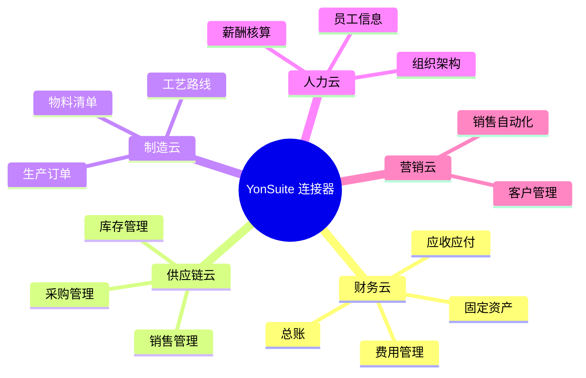

# 用友 YonSuite 连接器

用友 YonSuite 是用友网络面向成长型企业推出的云原生 ERP 套件，基于云原生架构设计，覆盖财务、供应链、生产制造、人力资源、营销、协同等全业务场景。轻易云 iPaaS 提供专用的 YonSuite 连接器，帮助企业实现 YonSuite 与第三方系统的深度集成。

## 连接器概述

### 产品简介

用友 YonSuite 是基于云原生架构的企业级云服务平台，具有以下特点：

- **云原生架构**：微服务架构，支持弹性扩展
- **全场景覆盖**：财务、供应链、生产、人力、营销一体化
- **低代码开发**：YonBuilder 平台支持快速定制
- **多端应用**：PC、移动、小程序多终端适配
- **开放生态**：标准 OpenAPI，支持生态集成

### 核心能力



## 前置条件

### 1. YonSuite 环境要求

| 项目 | 要求 |
|-----|------|
| 版本 | YonSuite 2020 及以上版本 |
| 部署方式 | 公有云 / 专属云 |
| 接口权限 | 已开通 OpenAPI 访问权限 |

### 2. 获取连接凭证

1. 登录 YonSuite 管理后台
2. 进入【系统管理】→【OpenAPI】→【应用管理】
3. 创建新应用，获取以下凭证：

| 凭证 | 说明 | 获取位置 |
|-----|------|---------|
| `appKey` | 应用标识 | 应用详情页 |
| `appSecret` | 应用密钥 | 应用详情页 |
| `domain` | 租户域名 | 系统管理页 |

> [!IMPORTANT]
> `appSecret` 只会显示一次，请妥善保存。

### 3. 配置接口权限

在应用管理中，根据业务需要开通以下权限：

| 权限类别 | 权限范围 | 说明 |
|---------|---------|------|
| 财务云 | 凭证、科目、余额查询 | 财务数据集成 |
| 供应链云 | 订单、库存、收发存 | 供应链集成 |
| 制造云 | 生产订单、BOM | 生产制造集成 |
| 人力云 | 组织、人员、薪酬 | HR 集成 |

## 配置参数

### 基础连接参数

| 参数名 | 类型 | 必填 | 说明 |
|-------|------|------|------|
| `domain` | string | ✅ | YonSuite 租户域名，如 `https://xxx.yonwork.com` |
| `appKey` | string | ✅ | 应用标识 |
| `appSecret` | string | ✅ | 应用密钥 |
| `tenantId` | string | ✅ | 租户 ID |
| `timeout` | number | — | 请求超时时间，默认 30000ms |
| `maxRetries` | number | — | 最大重试次数，默认 3 次 |

### 高级配置参数

| 参数名 | 类型 | 默认值 | 说明 |
|-------|------|--------|------|
| `charset` | string | `utf-8` | 字符编码 |
| `version` | string | `1.0` | API 版本 |
| `signMethod` | string | `sha256` | 签名算法 |
| `poolSize` | number | 10 | 连接池大小 |

### 连接配置示例

```json
{
  "domain": "https://demo.yonwork.com",
  "appKey": "your-app-key",
  "appSecret": "your-app-secret",
  "tenantId": "your-tenant-id",
  "timeout": 30000,
  "maxRetries": 3,
  "charset": "utf-8"
}
```

## 支持的操作

### 财务云接口

| 接口名称 | 接口标识 | 操作类型 | 说明 |
|---------|---------|---------|------|
| 会计凭证查询 | `voucher.list` | 查询 | 查询财务凭证列表 |
| 会计凭证创建 | `voucher.create` | 写入 | 创建会计凭证 |
| 科目档案查询 | `account.list` | 查询 | 查询会计科目 |
| 科目余额查询 | `balance.query` | 查询 | 查询科目余额 |
| 辅助核算查询 | `auxiliary.list` | 查询 | 查询辅助核算项 |

### 供应链云接口

| 接口名称 | 接口标识 | 操作类型 | 说明 |
|---------|---------|---------|------|
| 采购订单查询 | `purchaseorder.list` | 查询 | 查询采购订单 |
| 采购订单创建 | `purchaseorder.create` | 写入 | 创建采购订单 |
| 销售订单查询 | `salesorder.list` | 查询 | 查询销售订单 |
| 销售订单创建 | `salesorder.create` | 写入 | 创建销售订单 |
| 库存查询 | `inventory.query` | 查询 | 查询实时库存 |
| 出入库单查询 | `ioorder.list` | 查询 | 查询出入库单据 |

### 制造云接口

| 接口名称 | 接口标识 | 操作类型 | 说明 |
|---------|---------|---------|------|
| 生产订单查询 | `mo.list` | 查询 | 查询生产订单 |
| 生产订单创建 | `mo.create` | 写入 | 创建生产订单 |
| BOM 查询 | `bom.list` | 查询 | 查询物料清单 |
| 工艺路线查询 | `routing.list` | 查询 | 查询工艺路线 |

### 人力云接口

| 接口名称 | 接口标识 | 操作类型 | 说明 |
|---------|---------|---------|------|
| 组织架构查询 | `org.list` | 查询 | 查询部门架构 |
| 员工信息查询 | `employee.list` | 查询 | 查询员工信息 |
| 员工信息创建 | `employee.create` | 写入 | 创建员工档案 |

## 请求示例

### 查询会计凭证

```json
{
  "api": "voucher.list",
  "method": "POST",
  "body": {
    "pageIndex": 1,
    "pageSize": 100,
    "beginDate": "2026-01-01",
    "endDate": "2026-03-31",
    "voucherType": "记"
  }
}
```

### 创建销售订单

```json
{
  "api": "salesorder.create",
  "method": "POST",
  "body": {
    "code": "SO20260313001",
    "vouchDate": "2026-03-13",
    "customer": {
      "code": "C001"
    },
    "details": [
      {
        "product": {
          "code": "P001"
        },
        "quantity": 100,
        "price": 50.00,
        "amount": 5000.00
      }
    ]
  }
}
```

### 创建会计凭证

```json
{
  "api": "voucher.create",
  "method": "POST",
  "body": {
    "voucherDate": "2026-03-13",
    "voucherType": {
      "code": "记"
    },
    "entries": [
      {
        "account": {
          "code": "1001"
        },
        "debitAmount": 10000.00,
        "creditAmount": 0,
        "summary": "收到货款"
      },
      {
        "account": {
          "code": "6001"
        },
        "debitAmount": 0,
        "creditAmount": 10000.00,
        "summary": "收到货款"
      }
    ]
  }
}
```

## 适配器配置

### 查询适配器

```json
{
  "source": {
    "adapter": "YonSuiteQueryAdapter",
    "api": "salesorder.list",
    "params": {
      "pageSize": 500,
      "beginDate": "{{startDate}}",
      "endDate": "{{endDate}}"
    },
    "pagination": {
      "enabled": true,
      "pageParam": "pageIndex",
      "sizeParam": "pageSize"
    }
  }
}
```

### 写入适配器

```json
{
  "target": {
    "adapter": "YonSuiteExecuteAdapter",
    "api": "voucher.create",
    "mapping": {
      "voucherDate": "{{date}}",
      "entries": "{{entries}}"
    }
  }
}
```

## 常见问题

### Q: 连接测试失败，提示 "Unauthorized"？

**排查步骤：**

1. 检查 `appKey` 和 `appSecret` 是否正确
2. 确认应用已在 YonSuite 中授权
3. 检查 `domain` 地址是否正确（注意是否包含 `https://`）
4. 验证 `tenantId` 是否匹配当前租户

### Q: 如何获取租户 ID？

1. 登录 YonSuite 管理后台
2. 进入【系统管理】→【租户信息】
3. 查看租户 ID 字段

### Q: 接口返回 "权限不足" 怎么办？

1. 进入【系统管理】→【OpenAPI】→【应用管理】
2. 找到对应应用，点击【权限配置】
3. 勾选需要的接口权限
4. 保存并等待权限生效（约 5 分钟）

### Q: 分页查询有什么限制？

| 参数 | 限制 | 说明 |
|-----|------|------|
| `pageSize` | 最大 1000 | 超过会被限制为 1000 |
| `pageIndex` | 从 1 开始 | 0 会被视为 1 |
| 单次查询 | 最大 10000 条 | 建议分批查询 |

### Q: 如何处理并发写入？

建议配置分布式锁防止并发冲突：

```json
{
  "target": {
    "adapter": "YonSuiteExecuteAdapter",
    "api": "voucher.create",
    "concurrency": {
      "lockKey": "yon_voucher_{{code}}",
      "lockTimeout": 30
    }
  }
}
```

### Q: 日期格式有什么要求？

YonSuite 接口要求日期格式为 `yyyy-MM-dd` 或 `yyyy-MM-dd HH:mm:ss`：

```json
{
  "vouchDate": "2026-03-13",
  "createdTime": "2026-03-13 14:30:00"
}
```

### Q: 如何调试接口请求？

1. 开启调试模式：
   ```json
   {
     "debug": true,
     "logLevel": "DEBUG"
   }
   ```

2. 查看轻易云平台日志中心的请求/响应详情

3. 使用 YonSuite 官方提供的 API 调试工具

## 相关资源

- [用友 YonSuite 开放平台](https://yonwork.yonyou.com/)
- [用友 U8+ 连接器](./yonyou-u8)
- [用友 NC Cloud 连接器](./yonyou-nc-cloud)
- [ERP 连接器概览](../erp)

> [!NOTE]
> YonSuite 的接口文档以官方最新版本为准，如有更新请及时调整集成配置。
