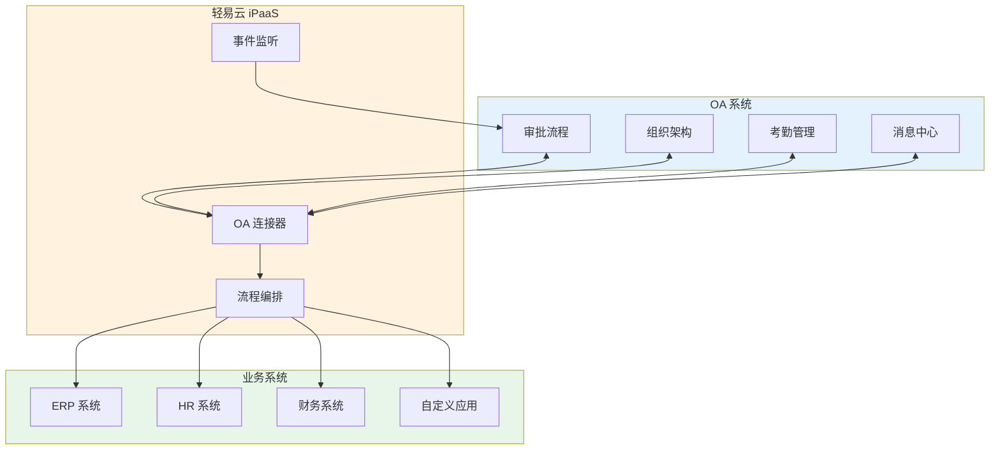
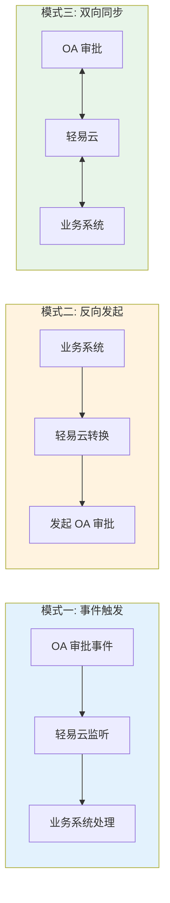
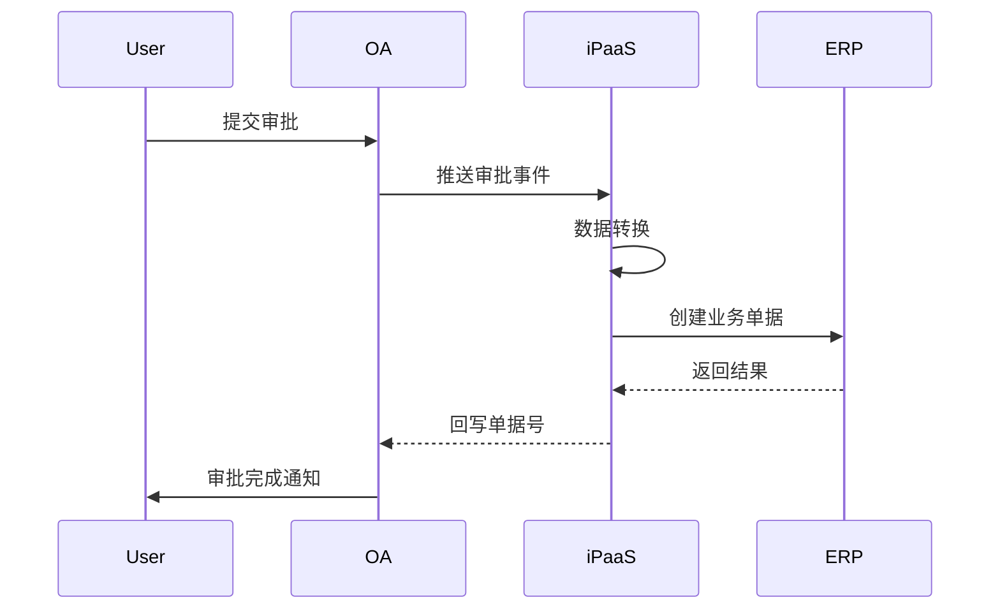
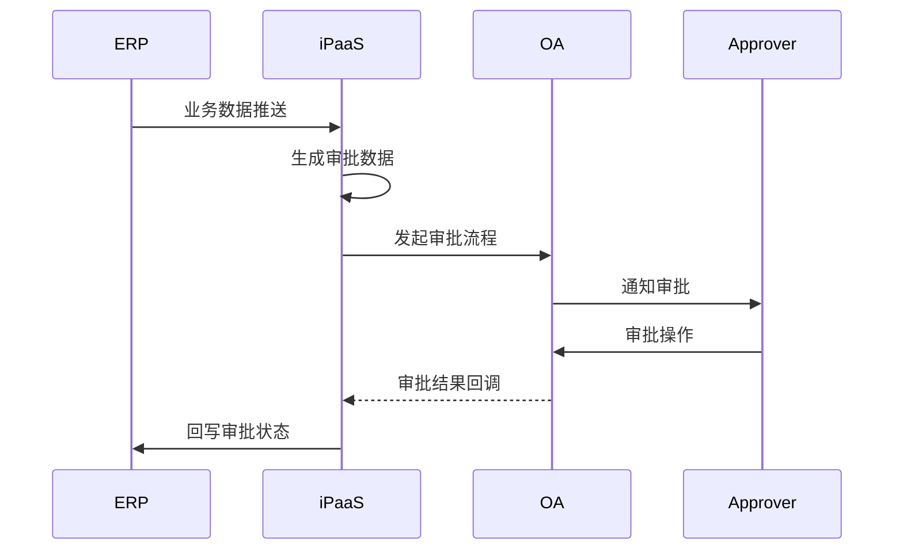
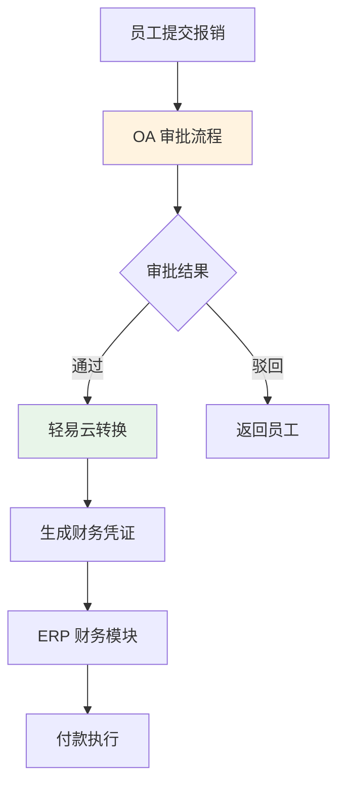
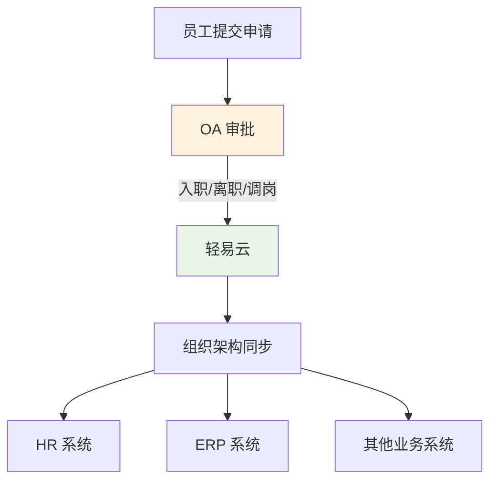
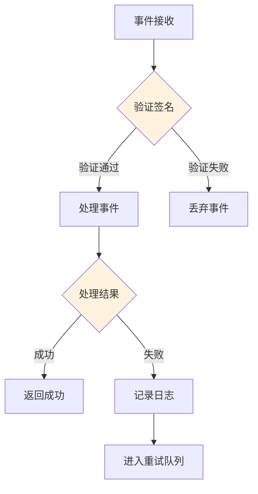

# OA / 协同类连接器概览

轻易云 iPaaS 平台提供全面的 OA（Office Automation，办公自动化）系统连接器，支持钉钉、飞书、企业微信、泛微、致远等主流协同办公平台，帮助企业实现审批流程、组织架构、消息通知等业务的无缝集成。

## OA 连接器介绍

OA 系统是企业日常办公和流程管理的核心平台，涵盖审批流程、考勤管理、组织架构、消息推送等功能。轻易云 iPaaS 的 OA 连接器通过标准化的 API 对接，实现以下核心能力：

- **审批流程集成**：审批单据的自动发起、状态同步、结果回传
- **组织架构同步**：部门、人员信息的实时同步
- **消息通知推送**：系统消息的自动发送和提醒
- **考勤数据对接**：打卡记录、请假数据的自动采集
- **文件附件传输**：审批附件的上传下载



## 支持的 OA 系统列表

### 互联网协同平台

| 系统名称 | 连接器标识 | 主要功能 | 适用场景 |
|---------|-----------|---------|---------|
| [钉钉](./oa/dingtalk) | `dingtalk` | 审批、考勤、消息、组织架构 | 阿里生态企业 |
| [飞书](./oa/feishu) | `feishu` | 审批、多维表格、消息、会议 | 字节生态企业 |
| [企业微信](./oa/wecom) | `wecom` | 审批、客户联系、应用消息 | 微信生态企业 |

### 传统 OA 系统

| 系统名称 | 连接器标识 | 主要功能 | 适用场景 |
|---------|-----------|---------|---------|
| [泛微 e-cology](./oa/weaver-ecology) | `weaver-ecology` | 复杂流程、知识管理 | 大型集团 |
| [泛微 e-office](./oa/weaver-eoffice) | `weaver-eoffice` | 标准办公、轻量流程 | 中小型企业 |
| [泛微云桥](./oa/fanwei) | `fanwei` | 泛微云产品对接 | 云端部署 |
| [致远 OA](./oa/seeyon-oa) | `seeyon-oa` | 协同办公、业务生成器 | 中大型组织 |
| [致远 A8+](./oa/seeyon-a8) | `seeyon-a8` | 集团管控、多组织 | 大型集团 |
| [蓝凌 OA](./oa/landray) | `landray` | 知识管理、智慧办公 | 知识密集型企业 |

### 低代码平台

| 系统名称 | 连接器标识 | 主要功能 | 适用场景 |
|---------|-----------|---------|---------|
| [简道云](./oa/jiandaoyun) | `jiandaoyun` | 表单、流程、仪表盘 | 快速搭建业务应用 |
| [氚云](./oa/chuanyun) | `chuanyun` | 表单、流程、报表 | 钉钉生态低代码 |
| [道一云](./oa/daoyiyun) | `daoyiyun` | 七巧低代码平台 | 企业微信生态 |
| [H3 BPM](./oa/h3yun) | `h3yun` | 流程管理、业务集成 | 复杂流程场景 |

### 费控报销系统

| 系统名称 | 连接器标识 | 主要功能 | 适用场景 |
|---------|-----------|---------|---------|
| [汇联易](./oa/huilianyi) | `huilianyi` | 费用报销、差旅管理 | 企业费用管控 |

## 审批流集成说明

### 集成模式



#### 模式一：事件触发模式

OA 系统中的审批事件触发业务系统动作：



**适用场景**：
- 采购申请审批通过后自动生成采购订单
- 费用报销审批通过后自动生成财务凭证
- 销售订单审批通过后自动下发仓库

#### 模式二：反向发起模式

业务系统数据触发 OA 审批流程：



**适用场景**：
- 电商平台大额订单触发特价审批
- 库存预警触发补货申请审批
- 客户信用超额触发特批发审批

### 审批状态映射

| OA 状态 | 业务含义 | 建议映射 |
|---------|---------|---------|
| `RUNNING` | 审批中 | 待处理 |
| `AGREE` | 已通过 | 已批准 |
| `REFUSE` | 已拒绝 | 已驳回 |
| `TRANSFER` | 已转交 | 处理中 |
| `REVERT` | 已撤销 | 已取消 |

### 常见集成场景

#### 场景一：费用报销集成



#### 场景二：采购申请集成


#### 场景三：人事审批集成



## 通用配置说明

### 连接配置参数

| 参数名 | 类型 | 必填 | 说明 |
|-------|------|------|------|
| `corp_id` | string | ✅ | 企业 ID |
| `app_key` | string | ✅ | 应用标识 |
| `app_secret` | string | ✅ | 应用密钥 |
| `agent_id` | string | — | 应用代理 ID（部分平台需要）|
| `webhook_url` | string | — | 事件回调地址 |

### 事件监听配置

```json
{
  "eventListener": {
    "enabled": true,
    "events": [
      "bpms_instance_change",
      "bpms_task_change",
      "user_add_org",
      "user_modify_org"
    ],
    "callbackUrl": "https://your-domain.com/callback"
  }
}
```

### 常用适配器

| 适配器名称 | 用途 | 适用平台 |
|-----------|------|---------|
| `OAQueryAdapter` | 数据查询 | 通用 |
| `OAExecuteAdapter` | 数据写入 | 通用 |
| `OAEventAdapter` | 事件监听 | 钉钉、飞书 |
| `OAApprovalAdapter` | 审批操作 | 钉钉、飞书、企业微信 |

## 最佳实践

### 1. 审批模板标准化

建议企业统一审批表单的字段命名和数据格式：

| 标准字段 | 字段类型 | 说明 |
|---------|---------|------|
| `applicant` | string | 申请人 |
| `apply_time` | datetime | 申请时间 |
| `amount` | number | 金额 |
| `department` | string | 所属部门 |
| `business_type` | string | 业务类型 |

### 2. 异常重试机制

配置合理的重试策略，确保消息可靠投递：

```json
{
  "retryPolicy": {
    "maxRetries": 3,
    "retryInterval": 5000,
    "exponentialBackoff": true
  }
}
```

### 3. 数据一致性保障



## 相关文档

- [钉钉连接器](./oa/dingtalk)
- [飞书连接器](./oa/feishu)
- [企业微信连接器](./oa/wecom)
- [审批流集成方案](../standard-schemes/oa-integration)
- [配置连接器](../guide/configure-connector)

> [!TIP]
> 如需了解更多 OA 系统的集成细节，请访问对应连接器的详细文档页面。
