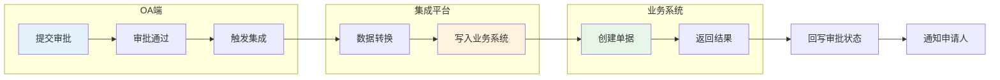
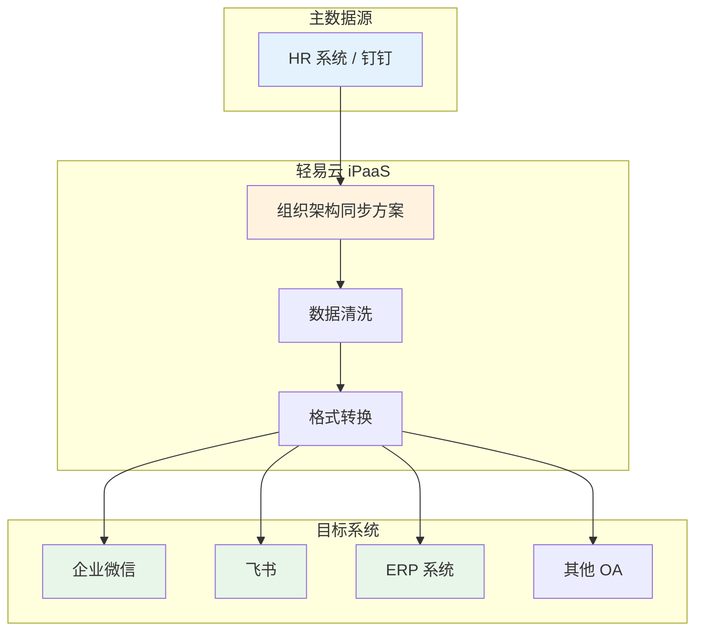

# OA / 协同类连接器

轻易云 iPaaS 平台提供丰富的 OA 与协同办公系统连接器，帮助企业实现审批流程与业务系统的无缝对接。本专题涵盖钉钉、飞书、企业微信、泛微、蓝凌、致远、道一云、氚云、简道云、汇联易等主流协同平台的集成方案与配置指南。

> [!TIP]
> 所有 OA 类连接器均支持双向数据同步：既可以将 OA 审批数据推送至 ERP、财务等业务系统，也可以将业务系统的处理结果回写至 OA 审批流程。

## 连接器概览

| 连接器 | 类型 | 功能特点 | 文档状态 |
| ------ | ---- | -------- | -------- |
| [钉钉](./dingtalk) | 移动办公平台 | 审批流、考勤、组织架构、消息推送 | ✅ 稳定 |
| [飞书](./lark) | 协同办公套件 | 审批、多维表格、日历、即时通讯 | ✅ 稳定 |
| [企业微信](./wecom) | 企业通讯工具 | 审批流、打卡、客户管理、应用消息 | ✅ 稳定 |
| [泛微 e-cology](./weaver-ecology) | 专业 OA 系统 | 工作流、知识管理、协同办公 | ✅ 稳定 |
| [泛微 e-office](./weaver-eoffice) | 中小企业 OA | 轻量级审批、文档管理 | ✅ 稳定 |
| [蓝凌 EKP](./landray-ekp) | 知识管理平台 | 流程管理、知识库、协同办公 | ✅ 稳定 |
| [致远 OA](./seeyon-oa) | 协同管理系统 | 表单流程、公文管理、移动办公 | ✅ 稳定 |
| [道一云](./daoyiyun) | 企业微信生态 | 七巧低代码、表单流程、数据集成 | ✅ 稳定 |
| [氚云](./chuanyun) | 低代码平台 | 表单设计、流程引擎、API 开放 | ✅ 稳定 |
| [简道云](./jiandaoyun) | 零代码应用 | 表单搭建、流程审批、数据分析 | ✅ 稳定 |
| [汇联易](./huilianyi) | 费控报销平台 | 费用报销、审批流、财务集成 | ✅ 稳定 |

## 通用集成场景

### 审批流程集成

OA 审批流程与业务系统的典型集成模式包括：

1. **审批触发业务** — 当 OA 审批通过时，自动在 ERP 中创建采购订单、付款单等业务单据
2. **业务驱动审批** — 业务系统发起申请，推送至 OA 进行审批，审批结果回写业务系统
3. **数据双向同步** — 保持 OA 与业务系统的数据一致性，如组织架构、人员信息等

### 消息通知集成

| 场景 | 触发条件 | 通知方式 | 典型应用 |
| ---- | -------- | -------- | -------- |
| 审批提醒 | 新审批到达 | 应用消息 / 短信 | 钉钉/飞书/企微工作通知 |
| 业务预警 | 库存不足/超预算 | 群机器人消息 | 采购审批群通知 |
| 结果反馈 | 集成成功/失败 | 卡片消息 | 审批结果实时推送 |
| 定时报告 | 日报/周报生成 | 邮件 / 群消息 | 经营数据定时推送 |

### 组织架构同步

## 快速开始

### 创建 OA 连接器

以钉钉连接器为例，创建流程如下：

1. 进入**连接器管理**页面，点击**新建连接器**
2. 选择连接器类型为**钉钉**
3. 配置授权参数：
   - **CorpID**：企业唯一标识
   - **AppKey / AppSecret**：自建应用凭证
   - **AgentID**：应用代理标识
4. 点击**测试连接**，验证配置是否正确
5. 保存连接器

> [!NOTE]
> 不同 OA 系统的授权方式有所差异：
> - **钉钉 / 飞书 / 企业微信**：基于自建应用的 AppKey + AppSecret
> - **泛微 / 蓝凌 / 致远**：基于 WebService / REST API 的用户名密码或 Token
> - **氚云 / 简道云 / 道一云**：基于 OpenAPI 的引擎编码 + 密钥

### 配置审批集成方案

通用配置步骤：

1. **创建方案** — 选择源平台（OA）和目标平台（业务系统）
2. **配置源平台** — 选择审批模板，设置查询条件
3. **配置目标平台** — 选择目标单据类型，映射字段
4. **设置触发方式** — 定时轮询或 Webhook 实时推送
5. **测试验证** — 提交测试审批，验证数据流转

## 连接器特性对比

| 特性 | 钉钉 | 飞书 | 企业微信 | 泛微 | 蓝凌 | 致远 |
| ---- | ---- | ---- | -------- | ---- | ---- | ---- |
| 审批回调 | ✅ | ✅ | ✅ | ✅ | ✅ | ✅ |
| 考勤数据 | ✅ | ✅ | ✅ | ❌ | ❌ | ❌ |
| 组织架构 | ✅ | ✅ | ✅ | ✅ | ✅ | ✅ |
| 消息推送 | ✅ | ✅ | ✅ | ✅ | ✅ | ✅ |
| 附件下载 | ✅ | ✅ | ✅ | ✅ | ✅ | ✅ |
| 审批意见 | ✅ | ✅ | ✅ | ✅ | ✅ | ✅ |

> [!IMPORTANT]
> 部分功能需要特定的 API 权限或高级版本支持。配置前请确认您的 OA 系统版本及已开通的接口权限。

## 常见问题

### Q: 如何获取审批模板的 ID？

不同平台的获取方式：

- **钉钉**：登录钉钉开放平台 → 进入应用详情 → 审批模板管理
- **飞书**：审批后台 → 表单设计 → URL 中的表单 ID
- **企业微信**：管理后台 → 应用管理 → 审批 → 模板设置
- **泛微**：表单流程 → 表单管理 → 模板编码

### Q: 审批附件如何传输？

轻易云 iPaaS 支持自动下载和上传审批附件：

1. 在源平台配置中启用**附件下载**选项
2. 设置文件大小限制和类型过滤（可选）
3. 在目标平台配置附件上传映射
4. 系统会自动完成附件的下载、暂存和上传流程

### Q: 如何实现审批结果回写？

使用**链式触发**或**回写方案**：

1. 主方案：OA 审批 → 业务系统（创建单据）
2. 回写方案：业务系统 → OA（更新审批状态）
3. 通过**数据关联字段**建立两个方案的关联关系

## 相关文档

- [连接器总览](../README) — 查看所有连接器分类
- [配置连接器](../../guide/configure-connector) — 连接器通用配置指南
- [新建集成方案](../../guide/create-integration) — 方案创建完整教程
- [标准方案：OA 协同](../../standard-schemes/oa-integration) — 典型集成场景方案

## 获取帮助

- 技术支持：[https://www.qeasy.cloud](https://www.qeasy.cloud)
- 在线文档：[https://docs.qeasy.cloud](https://docs.qeasy.cloud)
- 社区论坛：[https://community.qeasy.cloud](https://community.qeasy.cloud)
