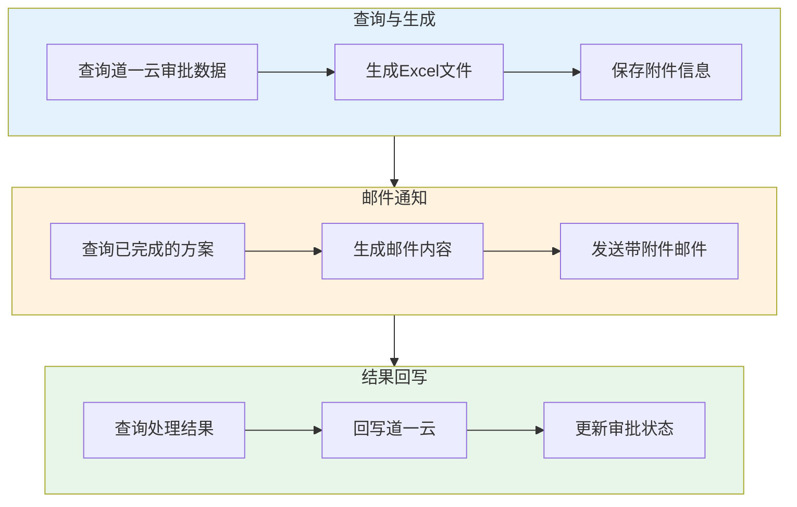

# 道一云连接器

道一云·七巧是一款企业级低代码应用搭建平台，提供可视化表单设计、流程审批、数据管理和 OpenAPI 开放能力。通过道一云连接器，您可以实现道一云与 ERP、财务、邮件等系统的深度集成，构建高效的企业数字化 workflow。

> [!TIP]
> 道一云·七巧的 OpenAPI 提供通讯录、表单、流程、消息、鉴权、素材等多种 API 类型，支持将第三方数据同步到七巧，也可在第三方系统中查询七巧数据。

## 前置准备

在使用道一云连接器之前，您需要在道一云控制台获取以下配置信息：

| 参数 | 说明 | 获取位置 |
| ---- | ---- | -------- |
| `AppKey` | 应用标识 | 开放平台 → 微开发者中心 → OpenAPI |
| `AppSecret` | 应用密钥 | 同上 |
| `应用 ID` | 应用唯一标识 | 应用设计器 URL 或开放平台 |
| `表单 ID` | 表单唯一标识 | 表单设计器 URL 或开放平台 |

### 获取连接器凭证

1. 登录道一云·七巧控制台
2. 进入 **开放平台 → 微开发者中心 → OpenAPI**
3. 查看 **使用指南** 页面获取 `AppKey` 和 `AppSecret`


> [!NOTE]
> 详细授权配置请参考 [道一云·七巧 OpenAPI 使用指南](https://qiqiao.do1.com.cn/help/develop_manual/%E5%BC%80%E6%94%BE%E5%B9%B3%E5%8F%B0/OpenAPI/OpenAPI%E4%BD%BF%E7%94%A8%E6%8C%87%E5%8D%97.html)

### 获取应用 ID 和表单 ID

在道一云·七巧平台中，应用 ID 和表单 ID 可在以下位置获取：

1. **应用设计器 URL**：`https://qy.do1.com.cn/qiqiao2/console/platformDesign/appDesigner/{应用ID}`
2. **表单设计器 URL**：在应用设计器中打开表单时，URL 中包含表单 ID
3. **开放平台**：在 **OpenAPI → 使用指南** 页面可查看已授权的应用和表单列表

## 创建连接器

完成道一云端配置后，在轻易云平台创建连接器：

1. 进入**连接器管理**页面，点击**新建连接器**
2. 选择连接器类型为**道一云·七巧**
3. 填写配置参数：

| 参数 | 说明 | 示例值 |
| ---- | ---- | ------ |
| **AppKey** | 应用标识 | `xxxxxxxxxxxxxxxx` |
| **AppSecret** | 应用密钥 | `xxxxxxxxxxxxxxxxxxxxxxxxxxxxxxxx` |

4. 点击**测试连接**验证配置
5. 保存连接器

## 配置说明

### 查询适配器

使用 `DaoYiYunQueryAdapter` 进行数据查询。

**常用接口**：

| 接口 | 说明 | 文档链接 |
| ---- | ---- | -------- |
| `表单数据查询` | 查询表单中的数据列表 | [表单 OpenAPI](https://qiqiao.do1.com.cn/help/develop_manual/%E5%BC%80%E6%94%BE%E5%B9%B3%E5%8F%B0/OpenAPI/%E8%A1%A8%E5%8D%95OpenAPI.html) |
| `单条数据查询` | 根据 ID 查询单条数据详情 | 同上 |
| `审批数据查询` | 查询审批流程实例数据 | 流程 OpenAPI |

**请求参数示例**（查询表单数据）：

```json
{
  "appId": "xxxxxxxx",
  "formModelId": "xxxxxxxx",
  "page": 1,
  "pageSize": 100,
  "conditions": [
    {
      "field": "createTime",
      "operator": ">=",
      "value": "{{LAST_SYNC_TIME|datetime}}"
    }
  ]
}
```

### 写入适配器

使用 `DaoYiYunExecuteAdapter` 进行数据写入。

**常用接口**：

| 接口 | 说明 |
| ---- | ---- |
| `创建表单数据` | 在指定表单中创建新数据 |
| `更新表单数据` | 更新已有数据记录 |
| `删除表单数据` | 删除指定数据记录 |
| `发起审批流程` | 在流程表单中发起新的审批实例 |

**请求参数示例**（创建表单数据）：

```json
{
  "appId": "xxxxxxxx",
  "formModelId": "xxxxxxxx",
  "data": {
    "field_xxx": "字段值",
    "field_yyy": "2025-01-01"
  }
}
```

## 关联子表操作

### 关联子表查询

查询主表数据时同时获取关联子表数据，需要在请求参数中添加 `joinFormModelIds` 字段：

```json
{
  "appId": "主表应用ID",
  "formModelId": "主表表单ID",
  "page": 1,
  "pageSize": 100,
  "joinFormModelIds": "关联表ID:关联表名:关联表外键"
}
```

> [!IMPORTANT]
> `joinFormModelIds` 参数格式为：`关联表ID:关联表名:关联表外键`。如需关联多个子表，使用逗号分隔。

**配置示例**：


### 关联子表写入

关联子表写入需要分两步完成：

1. **先写入主表数据**：获取主表数据的主键 ID
2. **再写入子表数据**：将主表 ID 作为外键关联写入


**配置步骤**：

1. 创建**主表写入方案**：配置道一云连接器写入主表数据
2. 创建**主表查询方案**：查询刚写入的主表数据，获取主键 ID
3. 创建**子表写入方案**：在数据映射中使用主表 ID 作为外键


> [!TIP]
> 子表写入时，需要在目标平台配置中使用数据管理功能，将主表 ID 回写到数据管理中，供子表方案使用。

## 附件处理

### 附件下载

道一云连接器支持自动下载表单中的附件文件。

**配置要求**：

1. 在源平台配置中启用**附件下载**选项
2. 配置 `attachments` 和 `otherapi` 参数


**附件过滤策略**（示例：昆山汉唐金缘文化项目）：

> 仅下载同时满足以下条件的附件：
> - 文件大小 ≤ 10 MB
> - 文件类型属于白名单：PDF、Word（.doc/.docx）、图片（.png/.jpg/.jpeg/.gif）、Excel（.xls/.xlsx）、PowerPoint（.ppt/.pptx）

**附件状态说明**：

| 状态 | 说明 |
| ---- | ---- |
| `不处理` | 附件刚查询到的初始状态，等待下载 |
| `等待中` | 附件已加入下载队列，等待执行 |
| `已完成` | 附件下载成功 |
| `失败` | 附件下载失败，可查看失败原因 |

> [!NOTE]
> 附件查询初始状态为"不处理"，等附件下载完成后才会置为"等待中"。

### 带附件邮件发送

如需将道一云附件作为邮件附件发送，使用专用适配器：

**适配器**：`\Adapter\Datahub\SendEmailAttachments`

**配置步骤**：

1. 配置附件下载方案（如上所述）
2. 创建邮件发送方案，目标平台选择**邮件平台**
3. 在适配器配置中选择 `SendEmailAttachments`
4. 配置收件人、邮件主题、正文内容
5. 附件字段会自动从源数据中获取并附加到邮件

> [!TIP]
> 参考示例方案：[附件下载示例方案](https://pro.qliang.cloud/strategy/detail/92dbd18b-2539-3ebd-ba0d-ba845323f66e#BasicSummary)

## 完整集成案例：审批数据到邮件并回写

以下是一个完整的集成场景：从道一云·七巧查询审批数据，生成 Excel 文件，发送邮件通知，并将处理结果回写道一云。



### 步骤 1：查询道一云数据并生成 Excel

**源平台**：道一云·七巧  
**目标平台**：Excel 文件

**处理逻辑**：

1. 查询指定审批模型中的审批单数据：
   - 单号、申请人、审批状态等基本信息
   - 所有关联附件的元数据（文件名、大小、类型、上传人）

2. 附件下载策略（可选）：
   - 仅下载符合大小和类型白名单的附件
   - 未下载的附件仍完整记录元信息

3. 数据写入 Excel：
   - 使用预定义 Excel 模板（含表头、样式）
   - 将审批数据及附件信息写入
   - 附件元数据存入字段如 `xxx_old`，保留完整信息：

```json
{
  "生产图纸_old": [
    {
      "uid": 1768296100253,
      "fileSize": 183106,
      "name": "企业微信截图_17682935475196.png",
      "fileType": "image/png",
      "fileId": "191547060016961536",
      "createDate": 1768296101453,
      "uploadUser": "08fa109d8774c19492e9ee6a95ea9212"
    }
  ]
}
```

> [!TIP]
> 参考示例方案：[道一云查询与Excel生成](https://pro.qliang.cloud/strategy/detail/ef4a5cea-6955-36da-99ea-b1cc1caeae32#BasicSummary)

### 步骤 2：查询方案数据并发送邮件

**源平台**：轻易云集成平台（数据管理）  
**目标平台**：邮件

**配置流程**：

1. **查询数据**
   - 获取上一步生成的方案数据
   - 筛选状态为"已完成"的记录
   - 提取业务所需的核心字段

2. **生成邮件内容**
   - 以表格形式展示方案数据摘要
   - 可选：添加 Excel 附件（由第 1 步生成）

3. **发送邮件**
   - 配置收件人（支持多收件人/抄送人）
   - 邮件主题示例：`【方案完成通知】2025年 XX 月 XX 日审批方案汇总`
   - 邮件正文包含方案数据摘要

> [!TIP]
> 如需发送附件，确保使用 `SendEmailAttachments` 适配器，并正确配置附件字段映射。

### 步骤 3：回写道一云

**源平台**：轻易云集成平台（数据管理）  
**目标平台**：道一云·七巧

**配置流程**：

1. **查询数据**
   - 获取已完成处理的方案数据
   - 仅提取需要回写的字段

2. **回写操作**
   - 调用道一云 API，将数据按配置字段写入
   - 支持状态同步（如：完成、已处理、已归档）
   - 可更新审批单的自定义字段

3. **结果验证**
   - 确认回写是否成功，记录日志
   - 可配置失败重试机制

**回写字段示例**：

| 源字段 | 目标字段 | 说明 |
| ------ | -------- | ---- |
| `process_status` | `处理状态` | 更新为"已处理" |
| `process_time` | `处理时间` | 当前时间 |
| `result_remark` | `处理备注` | 处理结果说明 |

## 常见问题

### Q: 如何获取表单的所有字段编码？

在道一云·七巧表单设计器中：

1. 进入表单设计页面
2. 选中目标字段
3. 在右侧属性面板中查看字段编码
4. 对于关联子表字段，编码格式为 `子表编码.子字段编码`

### Q: 关联子表查询时返回数据为空？

请检查：

1. `joinFormModelIds` 参数格式是否正确（`关联表ID:关联表名:关联表外键`）
2. 关联表 ID 和表单 ID 是否对应正确
3. 关联关系是否在道一云中已建立

### Q: 附件下载失败怎么办？

请检查：

1. 应用是否已开通素材/文件相关的 API 权限
2. 附件文件是否超过大小限制
3. 文件存储空间是否充足
4. 网络连接是否正常

### Q: 如何实现审批数据的实时同步？

道一云·七巧支持通过 Webhook 或流程事件推送审批状态变更：

1. 在道一云流程设计中配置**流程事件**
2. 设置事件触发条件（如：审批通过、审批驳回）
3. 配置推送地址为轻易云回调接收地址
4. 在轻易云平台创建回调接收方案处理推送数据

### Q: 写入数据时提示"权限不足"？

请检查：

1. AppKey 和 AppSecret 是否正确
2. 该应用是否已授权 OpenAPI 访问权限
3. 操作人是否有目标表单的写入权限
4. 表单是否开启了外部数据写入开关

## 相关文档

- [道一云·七巧 OpenAPI 文档](https://qiqiao.do1.com.cn/help/develop_manual/%E5%BC%80%E6%94%BE%E5%B9%B3%E5%8F%B0/OpenAPI.html)
- [表单 OpenAPI 详细说明](https://qiqiao.do1.com.cn/help/develop_manual/%E5%BC%80%E6%94%BE%E5%B9%B3%E5%8F%B0/OpenAPI/%E8%A1%A8%E5%8D%95OpenAPI.html)
- [道一云查询与写入示例方案](https://pro.qliang.cloud/strategy/detail/f001898a-adbf-3026-a9e0-e3a26c2bed69#BasicSummary)
- [附件下载示例方案](https://pro.qliang.cloud/strategy/detail/92dbd18b-2539-3ebd-ba0d-ba845323f66e#BasicSummary)
- [OA / 协同类连接器概览](./README)
- [配置连接器](../../guide/configure-connector)
- [新建集成方案](../../guide/create-integration)
