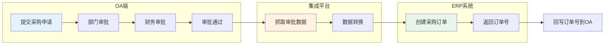
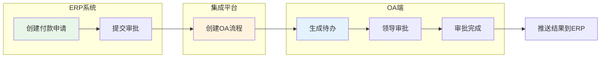
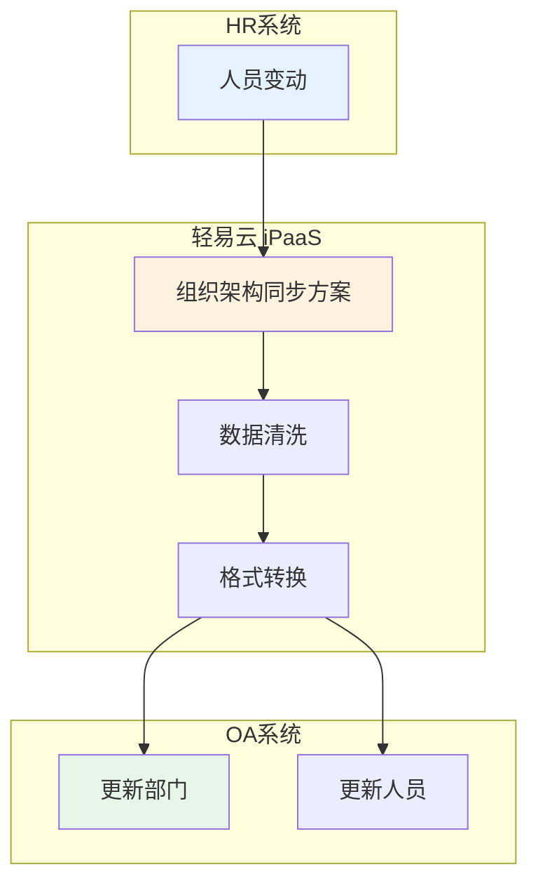

# 泛微 E9 连接器

泛微 E9（e-cology 9.0）是泛微网络推出的企业级协同办公平台，提供强大的工作流引擎、知识管理和移动办公能力。通过轻易云 iPaaS 泛微 E9 连接器，您可以实现泛微 OA 与 ERP、财务等业务系统的深度集成，打通审批流程与业务数据的通道。

> [!TIP]
> 泛微 E9 连接器支持双向数据同步：既可以将 OA 审批数据推送至业务系统，也可以将业务系统的处理结果回写至 OA 审批流程，实现端到端的流程自动化。

## 前置准备

在使用泛微 E9 连接器之前，您需要准备以下信息：

| 参数 | 说明 | 获取位置 |
| ---- | ---- | -------- |
| `OA 地址` | 泛微 E9 服务器地址 | 浏览器访问地址，如 `http://oa.example.com` |
| `用户名` | 具有接口访问权限的账号 | 系统管理员分配 |
| `密码` | 账号密码 | 系统管理员分配 |

> [!IMPORTANT]
> 用于集成的账号需要具备以下权限：
> - 流程查询权限（查看所有流程数据）
> - 流程创建权限（发起新流程）
> - WebService 接口访问权限

## 创建连接器

1. 进入**连接器管理**页面，点击**新建连接器**
2. 选择连接器类型为**泛微 E9**
3. 填写配置参数：

| 参数 | 说明 | 示例值 |
| ---- | ---- | ------ |
| **服务器地址** | OA 服务器地址 | `http://oa.example.com` 或 `https://oa.example.com:8443` |
| **用户名** | 登录账号 | `admin` |
| **密码** | 登录密码 | `******` |

4. 点击**测试连接**验证配置
5. 保存连接器

## 适配器说明

### 查询适配器

| 适配器名称 | 功能描述 |
| ---------- | -------- |
| `WeaverE9V2QueryAdapter` | 查询流程信息、审批数据、流程状态等 |
| `E9HttpQueryAdapter` | HTTP 方式查询流程数据（含附件查询） |

### 写入适配器

| 适配器名称 | 功能描述 |
| ---------- | -------- |
| `DoCreateWorkflowRequestAdapter` | 创建新流程实例 |
| `E9HttpExecuteAdapter` | HTTP 方式执行流程操作（含附件上传） |

## 集成配置指南

### 获取流程基础信息

在配置集成方案前，需要获取以下关键信息：

#### 1. 获取 workflowId（流程 ID）

1. 登录泛微 E9 系统
2. 进入**流程模块** → 选择目标流程
3. 在浏览器地址栏中查看 URL，例如：
   ```text
   http://oa.example.com/workflow/request/CreateRequest.jsp?workflowid=377
   ```
4. `workflowid` 参数值即为流程 ID

#### 2. 获取表单字段信息

1. 打开需要对接的申请工作流表单
2. 使用浏览器开发者工具（F12）查看网络请求
3. 找到请求地址：`/api/workflow/reqform/loadForm`
4. 在响应数据中查看 `tableInfo` 和 `fieldinfomap` 字段：

| 字段属性 | 说明 |
| -------- | ---- |
| `fieldid` | 前端提交时使用的字段 ID |
| `fieldlabel` | 前端显示的标签名称 |
| `fieldname` | 后端配置的字段名（集成方案中使用的名称） |

> [!NOTE]
> - `main`：主表字段信息
> - `detail_1`、`detail_2` 等：明细表字段信息（多个明细表按序号区分）

### 创建流程（写入配置）

#### 请求参数结构

创建流程时需要构建以下 JSON 结构：

```json
{
  "workflowBaseInfo": {
    "workflowId": "38"
  },
  "requestName": "测试流程--2023-09-07",
  "requestLevel": "1",
  "creatorId": "14720",
  "workflowMainTableInfo": {
    "requestRecords": [
      {
        "workflowRequestTableFields": [
          {
            "fieldName": "name",
            "fieldValue": "14720",
            "view": true,
            "edit": true
          },
          {
            "fieldName": "yzgsmc",
            "fieldValue": "0",
            "view": true,
            "edit": true
          }
        ]
      }
    ]
  }
}
```

#### 参数说明

| 字段 | 类型 | 必填 | 说明 |
| ---- | ---- | ---- | ---- |
| `workflowId` | string | 是 | 流程模板 ID |
| `requestName` | string | 是 | 流程标题 |
| `requestLevel` | string | 否 | 紧急程度（0-普通，1-紧急，2-特急） |
| `creatorId` | string | 是 | 创建人用户 ID |
| `fieldName` | string | 是 | 表单字段名称 |
| `fieldValue` | string | 是 | 字段值 |
| `view` | boolean | 否 | 是否可见 |
| `edit` | boolean | 否 | 是否可编辑 |

### 查询流程（读取配置）

#### 获取流程详情

使用 `getWorkflowRequest` 接口查询已提交流程的详细信息：

| 参数 | 类型 | 说明 |
| ---- | ---- | ---- |
| `requestid` | int | 流程实例 ID |
| `userid` | int | 查询用户 ID |

#### 常用查询接口

| 接口 | 适配器 | 说明 |
| ---- | ------ | ---- |
| `getWorkflowRequest` | WeaverE9V2QueryAdapter | 获取流程详情 |
| `getToDoWorkflowRequestList` | WeaverE9V2QueryAdapter | 获取待办列表 |
| `getHendledWorkflowRequestList` | WeaverE9V2QueryAdapter | 获取已办列表 |

### 附件下载配置

启用附件下载功能需要在源平台配置中添加参数：

| 参数 | 类型 | 必填 | 说明 |
| ---- | ---- | ---- | ---- |
| `DownloadAttachment` | boolean | 是 | 是否下载附件，`true`-下载，`false`-不下载 |

配置示例：

```json
{
  "otherRequest": {
    "DownloadAttachment": true
  }
}
```

> [!TIP]
> 启用附件下载后，系统会自动将 OA 中的附件下载到轻易云临时存储，可在数据映射中通过 `attachments` 字段获取附件列表。

## WebService 接口参考

### 接口部署

确保泛微 E9 系统已启用 WebService 接口：

1. 打开文件 `/ecology/WEB-INF/web.xml`
2. 检查是否包含以下 Servlet 配置：

```xml
<servlet>
  <servlet-name>XFireServlet</servlet-name>
  <servlet-class>org.codehaus.xfire.transport.http.XFireConfigurableServlet</servlet-class>
</servlet>
<servlet-mapping>
  <servlet-name>XFireServlet</servlet-name>
  <url-pattern>/services/*</url-pattern>
</servlet-mapping>
```

3. 重启服务后，访问 `http://OA地址/services/WorkflowService?wsdl` 验证部署

### 核心接口列表

| 接口名称 | 功能描述 |
| -------- | -------- |
| `doCreateWorkflowRequest` | 创建新流程 |
| `submitWorkflowRequest` | 提交流程 |
| `nextNodeByReject` | 退回流程 |
| `forwardWorkflowRequest` | 转发流程 |
| `getWorkflowRequest` | 获取流程详情 |
| `getToDoWorkflowRequestList` | 获取待办列表 |
| `getHendledWorkflowRequestList` | 获取已办列表 |
| `getMyWorkflowRequestList` | 获取我的请求列表 |

### 返回值说明

创建流程接口返回值：

| 返回值 | 含义 |
| ------ | ---- |
| `> 0` | 成功，返回流程 requestid |
| `-1` | 创建流程失败 |
| `-2` | 用户没有流程创建权限 |
| `-3` | 创建流程基本信息失败 |
| `-4` | 保存表单主表信息失败 |
| `-5` | 更新紧急程度失败 |
| `-6` | 流程操作者失败 |
| `-7` | 流转至下一节点失败 |
| `-8` | 节点附加操作失败 |

## 典型集成场景

### 场景一：OA 审批驱动业务单据



**配置要点**：
1. 源平台选择泛微 E9，监听审批通过事件
2. 配置数据映射，将 OA 表单字段映射到 ERP 订单字段
3. 目标平台创建采购订单
4. 配置回写方案，将 ERP 订单号写回 OA 表单

### 场景二：业务系统发起 OA 审批



**配置要点**：
1. ERP 系统调用轻易云 API 或直接触发集成方案
2. 使用 `DoCreateWorkflowRequestAdapter` 创建 OA 流程
3. 配置回调方案监听 OA 审批结果
4. 审批完成后更新 ERP 系统状态

### 场景三：组织架构同步



**配置要点**：
1. 使用泛微组织架构同步接口
2. 定时触发同步任务
3. 处理部门、岗位、人员的增删改

## 数据映射示例

### 主表字段映射

| OA 字段名 | 目标系统字段 | 说明 |
| ---------- | ------------ | ---- |
| `name` | `applicant` | 申请人 |
| `yzgsmc` | `company` | 公司名称 |
| `yzbm` | `dept_code` | 部门编码 |
| `yzri` | `apply_date` | 申请日期 |
| `yzmc` | `project_name` | 项目名称 |
| `yzsy` | `purpose` | 用途说明 |
| `yzsl` | `quantity` | 数量 |
| `manager` | `manager_id` | 主管 ID |
| `remark` | `comments` | 备注 |

### 明细表字段映射

明细表字段命名格式：`字段名_行号`

| OA 字段名 | 目标系统字段 | 说明 |
| ---------- | ------------ | ---- |
| `field5789_0` | `item_no` | 明细第1行-序号 |
| `field5790_0` | `material_code` | 明细第1行-物料编码 |
| `field5791_0` | `material_name` | 明细第1行-物料名称 |
| `field5789_1` | `item_no` | 明细第2行-序号 |
| `field5790_1` | `material_code` | 明细第2行-物料编码 |

> [!NOTE]
> 明细表行号从 `0` 开始计数。配置映射时需要考虑动态行数的情况，建议使用轻易云的数据转换功能处理明细表结构。

## 常见问题

### Q: 如何获取用户 ID（creatorId）？

1. 登录泛微 E9 系统后台
2. 进入**人力资源管理** → **人员管理**
3. 查看用户详情，记录 `id` 字段值
4. 或通过数据库查询：`SELECT id, loginid, lastname FROM hrmresource`

### Q: 流程创建成功但数据未写入？

请检查：
1. 表单字段名称 `fieldName` 是否正确（区分大小写）
2. 字段值格式是否符合要求（如日期格式 `2023-09-08`）
3. 必填字段是否都已赋值
4. 创建人 `creatorId` 是否具有该流程的创建权限

### Q: 附件下载失败怎么办？

1. 确认 `DownloadAttachment` 参数设置为 `true`
2. 检查 OA 服务器是否允许文件下载
3. 验证集成账号是否具有附件查看权限
4. 检查附件大小是否超过系统限制

### Q: 如何调试接口请求？

1. 在轻易云平台使用**调试器**功能
2. 查看源平台的原始响应数据
3. 检查轻易云**日志管理**中的详细日志
4. 对比 OA 系统数据库中的实际数据

### Q: 泛微 E9 与 E8 有什么区别？

| 特性 | E8 | E9 |
| ---- | --- | --- |
| 接口方式 | WebService | WebService + REST API |
| 前端技术 | 传统 JSP | Vue 前后端分离 |
| 移动端 | E-Mobile | 全新移动端 |
| 字段获取 | 表单解析 | API 获取 |

> [!WARNING]
> E8 和 E9 的接口存在差异，配置时请确认 OA 系统版本，选择对应的连接器类型。

## 相关文档

- [泛微 e-cology 连接器](./weaver-ecology) — 泛微 e-cology 其他版本
- [泛微 e-office 连接器](./weaver-eoffice) — 泛微中小企业版
- [OA 协同集成方案](../../standard-schemes/oa-integration) — 典型 OA 集成场景
- [配置连接器](../../guide/configure-connector) — 连接器通用配置指南
- [新建集成方案](../../guide/create-integration) — 方案创建完整教程

## 获取帮助

- 技术支持：[https://www.qeasy.cloud](https://www.qeasy.cloud)
- 在线文档：[https://docs.qeasy.cloud](https://docs.qeasy.cloud)
- 客服热线：400-8888-000
