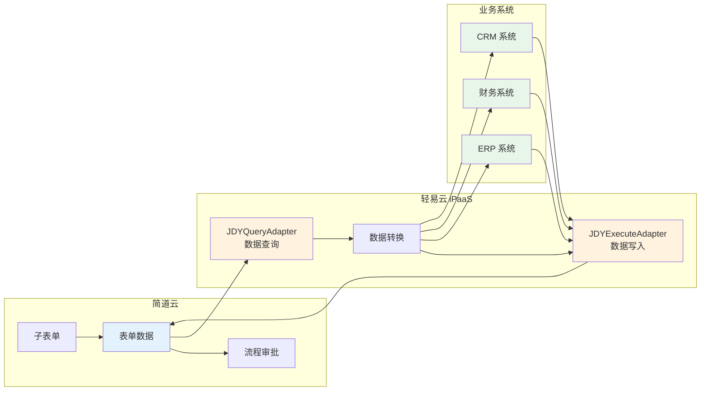
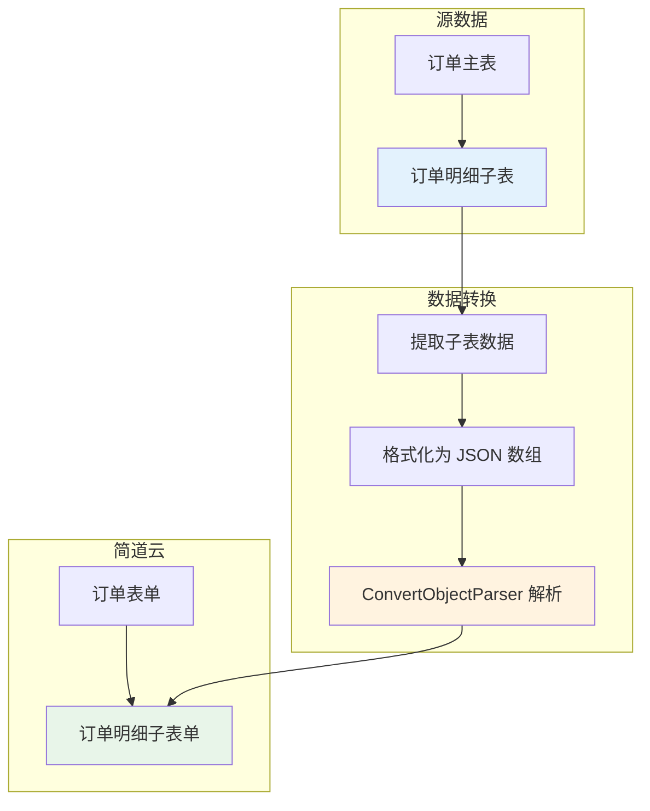

# 简道云连接器

简道云是一款零代码应用搭建平台，提供表单设计、流程审批、数据分析等功能。通过轻易云 iPaaS 简道云连接器，您可以实现简道云与 ERP、财务、CRM 等业务系统的数据互通，构建完整的数字化解决方案。



## 前置准备

在使用简道云连接器之前，您需要准备以下信息：

| 参数 | 类型 | 说明 | 获取方式 |
| ---- | ---- | ---- | -------- |
| `api_key` | string | API Key | 简道云后台 → 账户设置 → API Key |
| `app_id` | string | 应用 ID | 表单 URL 中 `/app/` 后的字符串 |
| `entry_id` | string | 表单 ID | 表单 URL 中 `/entry/` 后的字符串 |

> [!TIP]
> 简道云 API 详细文档请参考 [简道云开放平台](https://hc.jiandaoyun.com/open/14222)。

### 获取 AppId 和 EntryId

在简道云平台打开对应表单，选择**编辑**，在上方的地址栏可以看到对应信息：

```text
https://www.jiandaoyun.com/app/{app_id}/entry/{entry_id}
```

- `{app_id}` 为应用 ID
- `{entry_id}` 为表单 ID


## 创建连接器

1. 进入**连接器管理**页面，点击**新建连接器**
2. 选择连接器类型为**简道云**
3. 填写配置参数：
   - **API Key**：从简道云后台获取的 API Key
4. 点击**测试连接**验证配置
5. 保存连接器

## 配置说明

### 查询适配器

使用 `JDYQueryAdapter` 进行数据查询，调用简道云 OpenAPI v2 接口：

```text
GET /api/v2/app/{app_id}/entry/{entry_id}/data
```

> [!NOTE]
> 主键字段为 `_id`，在数据映射时请将简道云 `_id` 字段映射为目标系统的主键字段。

#### 请求参数配置

| 参数 | 类型 | 必填 | 说明 |
| ---- | ---- | ---- | ---- |
| `app_id` | string | ✅ | 应用 ID |
| `entry_id` | string | ✅ | 表单 ID |
| `fields` | array | — | 需要返回的字段列表（可选，不传返回全部） |
| `limit` | number | — | 每页返回数量（1~100，默认 100） |
| `filter` | object | — | 过滤条件（详见下文） |

#### 过滤参数配置

过滤参数 `filter` 类型为子表对象，支持多条件组合过滤。

**配置步骤**：

1. 首先配置过滤参数 `filter`，类型为**子表对象**
2. 在过滤参数下配置过滤逻辑 `rel`：`or`（或）或者 `and`（与）
3. 配置具体的过滤条件

**过滤条件字段说明**：

| 字段 | 字段名 | 示例值 | 字段类型 |
| ---- | ------ | ------ | -------- |
| `cond_1` | 自定义字段过滤 1 | — | 子表对象 |
| `field` | 过滤字段 | `updateTime` | 字符串 |
| `type` | 过滤类型 | `datetime` | 字符串 |
| `method` | 过滤方法 | `range` | 字符串 |
| `value` | 过滤值 | `{{LAST_SYNC_TIME\|datetime}}` | 字符串 |

> [!TIP]
> 如果有多个过滤条件，在 `filter` 下新增字段，按照 `cond_1`、`cond_2` 的方式依次配置。

**增量同步配置示例**（按更新时间范围查询）：

```json
{
  "rel": "and",
  "cond_1": {
    "field": "updateTime",
    "type": "datetime",
    "method": "range",
    "value": ["{{LAST_SYNC_TIME|datetime}}", "{{CURRENT_TIME|datetime}}"]
  }
}
```

**整体结构示例**：


**常用过滤方法说明**：

| 方法 | 说明 | 适用字段类型 |
| ---- | ---- | ------------ |
| `eq` | 等于 | text、number、datetime |
| `ne` | 不等于 | text、number、datetime |
| `like` | 包含 | text |
| `range` | 范围 | datetime、number |

> [!NOTE]
> 更多过滤参数配置帮助，可参考简道云开放文档：[查询多条数据接口](https://hc.jiandaoyun.com/open/14220)。

### 写入适配器

使用 `JDYExecuteAdapter` 进行数据写入，调用接口：

```text
POST /api/v2/app/{app_id}/entry/{entry_id}/data_create
```

#### 其他请求参数配置

| 字段 | 字段名 | 示例值 | 字段类型 | 说明 |
| ---- | ------ | ------ | -------- | ---- |
| `is_start_workflow` | 是否发起流程（仅流程表单有效） | `false` | 字符串 | `true` 发起流程，`false` 不发起 |
| `is_start_trigger` | 是否触发智能助手 | `false` | 字符串 | `true` 触发，`false` 不触发 |
| `transaction_id` | 事务 ID | — | 字符串 | 用于保证幂等性 |
| `app_id` | 应用 ID | — | 字符串 | 应用标识 |
| `entry_id` | 表单 ID | — | 字符串 | 表单标识 |

> [!IMPORTANT]
> - `is_start_workflow` 仅在流程表单中有效，设置为 `true` 时会自动发起审批流程
> - `transaction_id` 可用于防止重复提交，同一事务 ID 多次提交只会生效一次

#### 开启解析器

写入数据时，请求参数需要开启 `ConvertObjectParser` 解析器：

```json
{
  "name": "ConvertObjectParser",
  "params": "value"
}
```

> [!WARNING]
> 未开启此解析器可能导致对象类型的字段（如子表单、关联数据）无法正确解析和写入。

## 获取表单字段编码

配置数据映射时，需要获取简道云表单的字段编码（field id）。

**获取步骤**：

1. 在简道云打开对应表单，选择**编辑**
2. 选择**扩展功能**页签
3. 点击**数据推送**功能
4. 选择**字段对照表及 JSON 样例**
5. 圈住的内容即为字段编码


## 子表单配置

子表单字段需要按照特定格式进行配置，并且需要开启解析器。

### 数据格式

```json
{
  "子表单字段编码": [
    {
      "子字段1编码": "值1",
      "子字段2编码": "值2"
    }
  ]
}
```

### 配置示例

假设有一个订单表单，其中包含**订单明细**子表单，子表单中有**商品名称**和**数量**两个字段：

```json
{
  "order_items": [
    {
      "product_name": "{{source.product_name}}",
      "quantity": "{{source.quantity}}"
    }
  ]
}
```

> [!WARNING]
> 子表字段同样需要开启 `ConvertObjectParser` 解析器，否则子表单数据无法正确写入。

### 子表单数据映射配置

在轻易云平台的**数据映射**环节：

1. 源平台字段：选择子表单对应的数据源字段
2. 目标平台字段：填写简道云子表单字段编码
3. 值格式化：使用 `ConvertObjectParser` 解析器



## 流程表单与普通表单

简道云支持两种表单类型，在集成时需要注意区分：

| 特性 | 普通表单 | 流程表单 |
| ---- | -------- | -------- |
| 数据写入 | 直接写入 | 写入并触发审批流程 |
| `is_start_workflow` | 无效 | 有效，控制是否发起流程 |
| 数据查询 | 支持 | 支持 |
| 审批状态 | 无 | 有（审批中、已通过、已驳回） |

> [!TIP]
> 对于流程表单，建议设置 `is_start_workflow` 为 `true`，这样写入的数据会自动进入审批流程。

## 常见问题

### Q: 如何实现增量同步数据？

使用时间范围过滤条件，配合 `{{LAST_SYNC_TIME}}` 变量：

```json
{
  "rel": "and",
  "cond_1": {
    "field": "updateTime",
    "type": "datetime",
    "method": "range",
    "value": ["{{LAST_SYNC_TIME|datetime}}", "{{CURRENT_TIME|datetime}}"]
  }
}
```

将此配置添加到查询适配器的 `filter` 参数中，系统会自动只同步自上次同步以来更新的数据。

### Q: 流程表单和普通表单在写入时有什么区别？

- **普通表单**：直接写入数据，不涉及审批流程，`is_start_workflow` 参数无效
- **流程表单**：写入数据时可选择是否触发审批流程：
  - `is_start_workflow` = `true`：写入数据并自动发起审批流程
  - `is_start_workflow` = `false`：仅写入数据，不发起流程（草稿状态）

### Q: 如何获取数据推送的验证信息？

在简道云**数据推送**设置中配置：

| 配置项 | 说明 |
| ------ | ---- |
| **URL** | 填写轻易云回调地址，可在平台的**开发者** → **Webhook 配置**中获取 |
| **数据格式** | 选择 JSON |
| **验证令牌** | 配置后用于验证推送来源的合法性 |

### Q: 写入数据时提示 "字段格式错误" 怎么办？

1. 检查字段编码是否正确（使用字段对照表确认）
2. 检查字段值类型是否与简道云字段类型匹配
3. 对于对象类型字段（如子表单、关联数据），确保已开启 `ConvertObjectParser` 解析器
4. 检查必填字段是否都有值

### Q: 如何批量写入子表单数据？

子表单数据需要格式化为 JSON 数组：

```json
{
  "subform_field": [
    {"field1": "value1", "field2": "value2"},
    {"field1": "value3", "field2": "value4"}
  ]
}
```

在数据映射时，确保源数据是多行记录，通过 `ConvertObjectParser` 解析器自动聚合为数组格式。

### Q: 查询数据时如何分页？

使用 `limit` 参数控制每页返回数量（最大 100），配合简道云返回的 `_id` 字段进行游标分页：

```json
{
  "limit": 100,
  "filter": {
    "rel": "and",
    "cond_1": {
      "field": "_id",
      "type": "text",
      "method": "gt",
      "value": "{{LAST_ID}}"
    }
  }
}
```

## 相关文档

- [简道云开放平台](https://hc.jiandaoyun.com/)
- [查询多条数据接口](https://hc.jiandaoyun.com/open/14220)
- [新建单条数据接口](https://hc.jiandaoyun.com/open/14222)
- [简道云数据推送配置](https://hc.jiandaoyun.com/open/14224)
- [OA / 协同类连接器概览](./README)
- [配置连接器](../../guide/configure-connector)
- [数据映射指南](../../guide/data-mapping)
