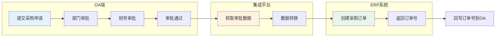
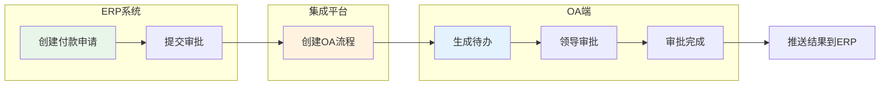
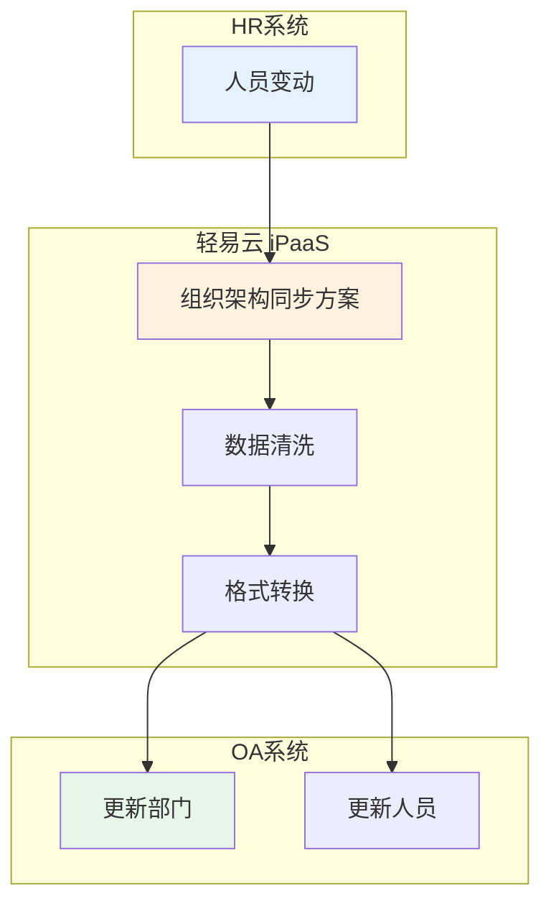

# 蓝凌 EKP 连接器

蓝凌 EKP（Enterprise Knowledge Portal）是蓝凌软件推出的企业级知识管理与协同办公平台，提供流程管理、知识库、协同办公、组织架构管理等丰富功能。通过轻易云 iPaaS 蓝凌 EKP 连接器，您可以实现蓝凌 OA 与 ERP、财务等业务系统的深度集成，打通审批流程与业务数据的通道。

> [!TIP]
> 蓝凌 EKP 连接器支持双向数据同步：既可以将 OA 审批数据推送至业务系统，也可以将业务系统的处理结果回写至 OA 审批流程，实现端到端的流程自动化。

## 前置准备

在使用蓝凌 EKP 连接器之前，您需要准备以下信息：

| 参数 | 说明 | 获取位置 |
| ---- | ---- | -------- |
| `OA 地址` | 蓝凌 EKP 服务器地址 | 浏览器访问地址，如 `http://oa.example.com` 或 `https://oa.example.com:8443` |
| `用户名` | 具有接口访问权限的账号 | 系统管理员分配 |
| `密码` | 账号密码 | 系统管理员分配 |

> [!IMPORTANT]
> 用于集成的账号需要具备以下权限：
> - 流程查询权限（查看所有流程数据）
> - 流程创建权限（发起新流程）
> - WebService 接口访问权限

## 创建连接器

1. 进入**连接器管理**页面，点击**新建连接器**
2. 选择连接器类型为**蓝凌 EKP**
3. 填写配置参数：

| 参数 | 说明 | 示例值 |
| ---- | ---- | ------ |
| **服务器地址** | OA 服务器地址 | `http://oa.example.com` 或 `https://oa.example.com:8443` |
| **用户名** | 登录账号 | `admin` |
| **密码** | 登录密码 | `******` |

4. 点击**测试连接**验证配置
5. 保存连接器

## 适配器说明

### 查询适配器

| 适配器名称 | 功能描述 |
| ---------- | -------- |
| `LandrayQueryAdapter` | 查询流程信息、审批数据、流程状态等 |
| `LandrayHttpQueryAdapter` | HTTP 方式查询流程数据（含附件查询） |

### 写入适配器

| 适配器名称 | 功能描述 |
| ---------- | -------- |
| `LandrayCreateFlowAdapter` | 创建新流程实例 |
| `LandrayHttpExecuteAdapter` | HTTP 方式执行流程操作（含附件上传） |

## 集成配置指南

### 获取流程基础信息

在配置集成方案前，需要获取以下关键信息：

#### 1. 获取流程模板 ID

1. 登录蓝凌 EKP 系统
2. 进入**流程管理** → 选择目标流程
3. 在浏览器地址栏中查看 URL，或咨询系统管理员获取流程模板 ID

#### 2. 获取表单字段信息

1. 打开需要对接的申请工作流表单
2. 使用浏览器开发者工具（F12）查看网络请求
3. 查看表单字段的标识信息：

| 字段属性 | 说明 |
| -------- | ---- |
| `fieldId` | 字段唯一标识 |
| `fieldName` | 字段名称（集成方案中使用的名称） |
| `fieldLabel` | 字段显示标签 |

> [!NOTE]
> - 主表字段直接通过字段名映射
> - 明细表字段需要按照特定格式配置，通常为 `detail_1.fieldName` 格式

### 创建流程（写入配置）

#### 请求参数结构

创建流程时需要构建以下 JSON 结构：

```json
{
  "docSubject": "流程标题",
  "docStatus": "20",
  "fdTemplateId": "流程模板ID",
  "formValues": {
    "fieldName1": "字段值1",
    "fieldName2": "字段值2"
  },
  "attachmentForms": [
    {
      "fdKey": "fd_enclosure",
      "fdFileName": "附件名称.pdf",
      "fdAttachment": "base64编码的文件内容"
    }
  ]
}
```

#### 参数说明

| 字段 | 类型 | 必填 | 说明 |
| ---- | ---- | ---- | ---- |
| `docSubject` | string | 是 | 流程标题 |
| `docStatus` | string | 是 | 流程状态，`20` 表示启动审批流程 |
| `fdTemplateId` | string | 是 | 流程模板 ID |
| `formValues` | object | 是 | 表单字段值集合 |
| `attachmentForms` | array | 否 | 附件列表 |
| `fdKey` | string | 是（附件） | 附件字段标识 |
| `fdFileName` | string | 是（附件） | 附件文件名 |
| `fdAttachment` | string | 是（附件） | Base64 编码的文件内容 |

> [!WARNING]
> 大文件建议上传到 Web 服务器，然后在表单中存放文件链接，避免直接通过 Base64 传输大文件。

### 查询流程（读取配置）

#### 常用查询接口

使用 `LandrayQueryAdapter` 查询流程数据：

| 接口 | 说明 |
| ---- | ---- |
| `getProcessList` | 获取流程列表 |
| `getProcessDetail` | 获取流程详情 |
| `getTodoList` | 获取待办列表 |
| `getDoneList` | 获取已办列表 |

**请求参数示例**：

```json
{
  "processId": "流程模板ID",
  "startTime": "{{LAST_SYNC_TIME|datetime}}",
  "endTime": "{{CURRENT_TIME|datetime}}",
  "status": "已完成"
}
```

### 附件下载配置

启用附件下载功能需要在源平台配置中添加参数：

| 参数 | 类型 | 必填 | 说明 |
| ---- | ---- | ---- | ---- |
| `downloadAttachment` | boolean | 是 | 是否下载附件，`true`-下载，`false`-不下载 |

配置示例：

```json
{
  "otherRequest": {
    "downloadAttachment": true
  }
}
```

> [!TIP]
> 启用附件下载后，系统会自动将 OA 中的附件下载到轻易云临时存储，可在数据映射中通过 `attachments` 字段获取附件列表。

## WebService 接口参考

### 接口部署

确保蓝凌 EKP 系统已启用 WebService 接口：

1. 确认蓝凌 EKP 系统已部署 WebService 服务
2. 访问 WebService 地址验证部署状态：
   ```text
   http://OA地址/sys/webservice/kmReviewWebserviceService?wsdl
   ```
3. 如无法访问，请联系蓝凌系统管理员开启 WebService 服务

### 核心接口列表

| 接口名称 | 功能描述 |
| -------- | -------- |
| `addReview` | 创建新流程 |
| `getProcessStatus` | 获取流程状态 |
| `getProcessDetail` | 获取流程详情 |
| `getTodoList` | 获取待办列表 |
| `getDoneList` | 获取已办列表 |

### 返回值说明

创建流程接口返回值：

| 返回值 | 含义 |
| ------ | ---- |
| `success` | 成功，返回流程实例 ID |
| `error` | 创建失败，具体错误信息见返回消息 |

常见错误码：

| 错误码 | 含义 | 排查方法 |
| ------ | ---- | -------- |
| `INVALID_USER` | 用户无效 | 检查用户名密码是否正确 |
| `NO_PERMISSION` | 无权限 | 确认账号具有流程创建权限 |
| `TEMPLATE_NOT_FOUND` | 模板不存在 | 检查流程模板 ID 是否正确 |
| `FIELD_REQUIRED` | 必填字段缺失 | 检查表单必填字段是否已赋值 |

## 典型集成场景

### 场景一：OA 审批驱动业务单据



**配置要点**：
1. 源平台选择蓝凌 EKP，监听审批通过事件
2. 配置数据映射，将 OA 表单字段映射到 ERP 订单字段
3. 目标平台创建采购订单
4. 配置回写方案，将 ERP 订单号写回 OA 表单

### 场景二：业务系统发起 OA 审批



**配置要点**：
1. ERP 系统调用轻易云 API 或直接触发集成方案
2. 使用 `LandrayCreateFlowAdapter` 创建 OA 流程
3. 配置回调方案监听 OA 审批结果
4. 审批完成后更新 ERP 系统状态

### 场景三：组织架构同步



**配置要点**：
1. 使用蓝凌组织架构同步接口
2. 定时触发同步任务
3. 处理部门、岗位、人员的增删改

## 数据映射示例

### 主表字段映射

| OA 字段名 | 目标系统字段 | 说明 |
| ---------- | ------------ | ---- |
| `docSubject` | `title` | 流程标题 |
| `docCreator` | `creator` | 创建人 |
| `docCreateTime` | `create_time` | 创建时间 |
| `fd_dept` | `dept_code` | 部门编码 |
| `fd_apply_date` | `apply_date` | 申请日期 |
| `fd_project` | `project_name` | 项目名称 |
| `fd_amount` | `amount` | 金额 |
| `fd_remark` | `comments` | 备注 |

### 明细表字段映射

明细表字段命名格式：`detail_1.fieldName`

| OA 字段名 | 目标系统字段 | 说明 |
| ---------- | ------------ | ---- |
| `detail_1.fd_seq` | `item_no` | 明细行序号 |
| `detail_1.fd_material` | `material_code` | 物料编码 |
| `detail_1.fd_quantity` | `quantity` | 数量 |
| `detail_1.fd_price` | `price` | 单价 |

> [!NOTE]
> 明细表配置时需要考虑动态行数的情况，建议使用轻易云的数据转换功能处理明细表结构。

## 常见问题

### Q: 如何获取流程模板 ID？

1. 登录蓝凌 EKP 系统后台
2. 进入**流程管理** → **流程模板**
3. 查看目标流程模板的 ID 字段值
4. 或联系系统管理员获取

### Q: 流程创建成功但数据未写入？

请检查：
1. 表单字段名称 `fieldName` 是否正确（区分大小写）
2. 字段值格式是否符合要求（如日期格式 `2023-09-08`）
3. 必填字段是否都已赋值
4. 创建人账号是否具有该流程的创建权限

### Q: 附件下载失败怎么办？

1. 确认 `downloadAttachment` 参数设置为 `true`
2. 检查 OA 服务器是否允许文件下载
3. 验证集成账号是否具有附件查看权限
4. 检查附件大小是否超过系统限制

### Q: 如何调试接口请求？

1. 在轻易云平台使用**调试器**功能
2. 查看源平台的原始响应数据
3. 检查轻易云**日志管理**中的详细日志
4. 对比 OA 系统数据库中的实际数据

### Q: 蓝凌 EKP 支持哪些接口协议？

蓝凌 EKP 主要支持以下接口协议：

| 协议 | 说明 |
| ---- | ---- |
| WebService | 标准 SOAP 协议接口 |
| REST API | RESTful 风格接口（部分版本支持） |

> [!NOTE]
> 不同版本的蓝凌 EKP 接口有所差异，配置前请确认 OA 系统版本及已开通的接口权限。

## 相关文档

- [OA / 协同类连接器概览](./README) — 查看所有 OA 连接器
- [配置连接器](../../guide/configure-connector) — 连接器通用配置指南
- [新建集成方案](../../guide/create-integration) — 方案创建完整教程
- [标准方案：OA 协同](../../standard-schemes/oa-integration) — 典型 OA 集成场景

## 获取帮助

- 技术支持：[https://www.qeasy.cloud](https://www.qeasy.cloud)
- 在线文档：[https://docs.qeasy.cloud](https://docs.qeasy.cloud)
- 社区论坛：[https://community.qeasy.cloud](https://community.qeasy.cloud)
