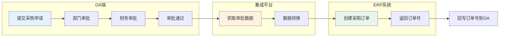
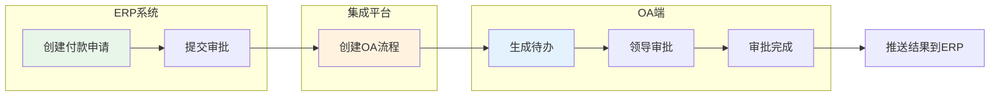
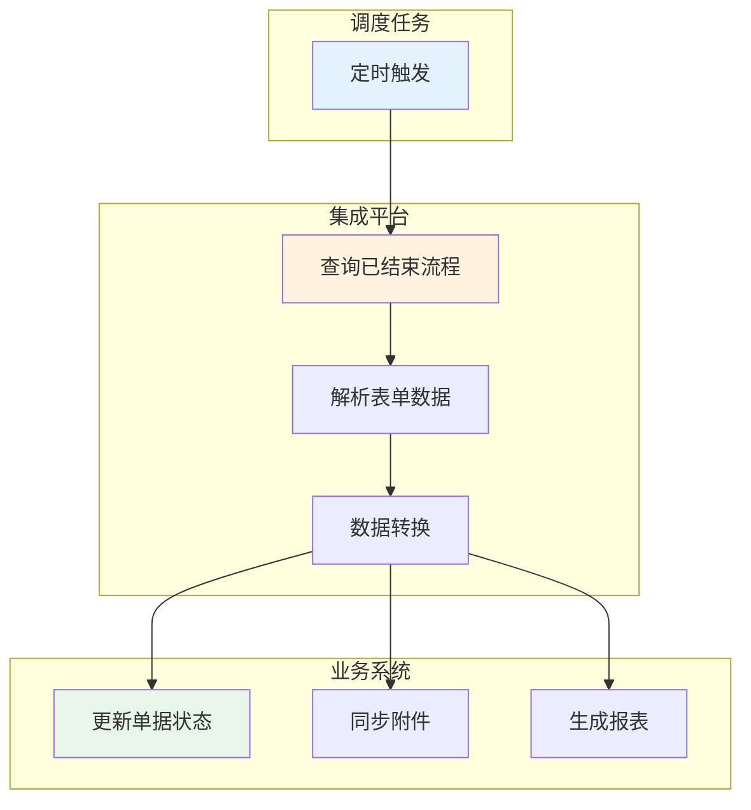

# 致远 A8 连接器

致远 A8 是致远互联推出的企业级协同管理平台，提供表单流程、公文管理、会议管理等核心功能。通过轻易云 iPaaS 致远 A8 连接器，您可以轻松实现致远 OA 与 ERP、财务等业务系统的数据互通，打通审批流程与业务数据的通道。

> [!TIP]
> 致远 A8 连接器支持双向数据同步：既可以将 OA 审批数据推送至业务系统，也可以将业务系统的处理结果回写至 OA 审批流程，实现端到端的流程自动化。

## 前置准备

在使用致远 A8 连接器之前，您需要准备以下信息：

| 参数 | 说明 | 获取位置 |
| ---- | ---- | -------- |
| `服务器地址` | 致远 A8 服务器地址 | 浏览器访问地址，如 `http://oa.example.com` |
| `用户名` | 具有接口访问权限的账号 | 系统管理员在后台创建 REST 用户 |
| `密码` | 账号密码 | 创建 REST 用户时设置 |

> [!IMPORTANT]
> 用于集成的账号需要具备以下权限：
> - 表单流程查询权限（查看所有流程数据）
> - 表单流程创建权限（发起新流程）
> - REST API 接口访问权限

## 创建连接器

### 步骤一：在致远 A8 中创建 REST 用户

1. 使用系统管理员账号登录致远 A8 后台管理
2. 进入**系统管理** → **系统管理员** → **设置**
3. 找到 **REST 用户管理** 模块
4. 点击**新建 REST 用户**

> [!NOTE]
> REST 用户是致远 A8 提供的一种专门用于接口调用的用户类型，与普通 OA 用户分开管理。

### 步骤二：在轻易云中配置连接器

1. 进入**连接器管理**页面，点击**新建连接器**
2. 选择连接器类型为**致远 A8**
3. 填写配置参数：

| 参数 | 说明 | 示例值 |
| ---- | ---- | ------ |
| **服务器地址** | OA 服务器地址 | `http://oa.example.com` 或 `https://oa.example.com:8443` |
| **用户名** | REST 用户名 | `rest_user` |
| **密码** | REST 用户密码 | `******` |

4. 点击**测试连接**验证配置
5. 保存连接器

## 适配器说明

### 查询适配器

| 适配器名称 | 功能描述 |
| ---------- | -------- |
| `SeeyonA8QueryAdapter` | 查询表单流程数据、审批状态等 |
| `SeeyonA8FlowQueryAdapter` | 查询已结束流程 ID 列表 |

### 写入适配器

| 适配器名称 | 功能描述 |
| ---------- | -------- |
| `SeeyonA8WriteAdapter` | 发起新表单流程 |
| `SeeyonA8FormSubmitAdapter` | 提交表单数据（HTML 正文方式） |

## 集成配置指南

### 获取表单模板信息

在配置集成方案前，需要获取以下关键信息：

#### 1. 获取 templateCode（表单模板编码）

1. 登录致远 A8 系统
2. 进入**业务应用** → **应用中心**
3. 找到目标表单应用，点击进入
4. 选择对应表单，点击**修改表单信息**
5. 在表单编辑页面中查看 **templateCode** 字段

> [!TIP]
> `templateCode` 是表单模板在系统中的唯一标识，格式通常为字母+数字组合，如 `H0002`。

### 表单列表查询配置

用于获取指定表单模板已结束的流程数据。

#### 请求参数结构

```json
{
  "templateCode": "H0002",
  "startTime": "2024-09-01",
  "endTime": "2024-09-30",
  "qcloudflowList": "qcloudflowList"
}
```

#### 参数说明

| 字段 | 类型 | 必填 | 说明 |
| ---- | ---- | ---- | ---- |
| `templateCode` | string | 是 | 表单模板编码 |
| `startTime` | string | 否 | 查询开始日期，格式 `YYYY-MM-DD` |
| `endTime` | string | 否 | 查询结束日期，格式 `YYYY-MM-DD` |
| `qcloudflowList` | string | 是 | 固定值，标识返回流程列表 |

#### 响应数据

系统会自动返回指定时间段内已完成的流程表单数据，包含流程 ID、表单数据、审批状态等信息。

### 表单写入配置

用于在致远 A8 中发起新的表单流程。

#### 使用接口 1.2：发起表单（HTML 正文）流程

##### 请求参数结构

```json
{
  "templateCode": "H0002",
  "subject": "采购申请-2024-09-20",
  "loginName": "zhangsan",
  "memberCode": "EMP001",
  "formData": {
    "field_name": "field_value"
  }
}
```

##### 参数说明

| 字段 | 类型 | 必填 | 说明 |
| ---- | ---- | ---- | ---- |
| `templateCode` | string | 是 | 表单模板编码 |
| `subject` | string | 是 | 流程标题 |
| `loginName` | string | 是 | 提交人登录名 |
| `memberCode` | string | 是 | 提交人员工编码 |
| `formData` | object | 是 | 表单字段数据 |

> [!IMPORTANT]
> `loginName` 和 `memberCode` 必须对应系统中真实存在的用户，否则流程无法创建成功。

## REST 接口参考

### 官方文档

致远 A8 REST 接口完整文档请参考：[http://open.seeyon.com/book/ctp/restjie-kou/gai-shu.html](http://open.seeyon.com/book/ctp/restjie-kou/gai-shu.html)

### 核心接口列表

| 接口名称 | 功能描述 | 适配器 |
| -------- | -------- | ------ |
| `GET /flow/flowData` | 查询流程数据 | `SeeyonA8QueryAdapter` |
| `POST /flow/flowData` | 发起新流程 | `SeeyonA8WriteAdapter` |
| `GET /form/query` | 查询表单数据 | `SeeyonA8QueryAdapter` |
| `POST /form/submit` | 提交表单 | `SeeyonA8FormSubmitAdapter` |

### 返回值说明

| 返回值 | 含义 |
| ------ | ---- |
| `0` | 成功 |
| `-1` | 参数错误 |
| `-2` | 用户认证失败 |
| `-3` | 无权限访问 |
| `-4` | 流程不存在 |
| `-5` | 系统内部错误 |

## 典型集成场景

### 场景一：OA 审批驱动业务单据



**配置要点**：
1. 源平台选择致远 A8，配置表单列表查询，监听审批通过事件
2. 在源平台配置中添加 `templateCode` 参数
3. 配置数据映射，将 OA 表单字段映射到 ERP 订单字段
4. 目标平台创建采购订单
5. 配置回写方案，将 ERP 订单号写回 OA 表单

### 场景二：业务系统发起 OA 审批



**配置要点**：
1. ERP 系统调用轻易云 API 或直接触发集成方案
2. 使用 `SeeyonA8WriteAdapter` 创建 OA 流程
3. 配置 `loginName` 和 `memberCode` 参数指定提交人
4. 配置回调方案监听 OA 审批结果
5. 审批完成后更新 ERP 系统状态

### 场景三：定时同步已完成流程



**配置要点**：
1. 配置定时策略，如每天凌晨 2:00 执行
2. 源平台使用表单列表查询，设置 `startTime` 和 `endTime` 参数
3. 自动获取指定时间段内所有已完成的流程
4. 支持分页查询大量数据

## 数据映射示例

### 常用表单字段映射

| OA 字段名 | 目标系统字段 | 说明 |
| ---------- | ------------ | ---- |
| `form_main_id` | `oa_flow_id` | 流程实例 ID |
| `subject` | `title` | 流程标题 |
| `start_user_name` | `applicant` | 申请人 |
| `start_time` | `apply_date` | 申请时间 |
| `finish_time` | `complete_date` | 完成时间 |
| `form_data.field1` | `field_value1` | 自定义表单字段 |

### 审批意见映射

| OA 字段名 | 目标系统字段 | 说明 |
| ---------- | ------------ | ---- |
| `opinion_user` | `approver` | 审批人 |
| `opinion_time` | `approve_time` | 审批时间 |
| `opinion_content` | `approve_comment` | 审批意见 |
| `opinion_result` | `approve_result` | 审批结果（同意/驳回） |

> [!NOTE]
> 表单字段的具体名称取决于表单模板的配置，请根据实际表单结构调整映射关系。

## 常见问题

### Q: 如何获取员工的 loginName 和 memberCode？

1. 登录致远 A8 系统后台
2. 进入**组织管理** → **人员管理**
3. 查看用户详情，记录以下字段：
   - **登录名**：对应 `loginName`
   - **人员编码**：对应 `memberCode`

### Q: 流程创建成功但表单数据未写入？

请检查：
1. `templateCode` 是否正确
2. `loginName` 和 `memberCode` 是否对应真实存在的用户
3. 表单字段名称是否与模板定义一致
4. 必填字段是否都已赋值

### Q: 如何查询特定状态的流程？

在表单列表查询配置中，可以通过以下参数过滤：

| 参数 | 说明 |
| ---- | ---- |
| `state` | 流程状态：`0`-待办，`1`-已办，`2`-已结束 |
| `startTime` | 开始日期 |
| `endTime` | 结束日期 |

### Q: 附件如何传输？

轻易云 iPaaS 支持自动下载和上传审批附件：

1. 在源平台配置中启用**附件下载**选项
2. 在数据映射中添加附件字段映射
3. 系统会自动完成附件的下载和传输

### Q: 如何实现审批结果回写？

使用**链式触发**或**回写方案**：

1. 主方案：OA 审批 → 业务系统（创建单据）
2. 回写方案：业务系统 → OA（更新审批状态）
3. 通过**数据关联字段**（如流程 ID）建立两个方案的关联关系

### Q: 致远 A8 与 A6 有什么区别？

| 特性 | A6 | A8 |
| ---- | --- | --- |
| 目标规模 | 中小企业 | 大中型企业 |
| 功能模块 | 基础 OA | 全面协同管理 |
| 接口能力 | 基础 REST | 完整 REST API |
| 表单引擎 | 标准表单 | 高级表单设计器 |

> [!WARNING]
> A6 和 A8 的接口存在细微差异，配置时请确认 OA 系统版本，选择对应的连接器类型。

## 相关文档

- [致远 OA 连接器](./seeyon-oa) — 致远 OA 其他版本
- [泛微 E9 连接器](./fanwei) — 泛微 OA 集成指南
- [蓝凌 EKP 连接器](./landray) — 蓝凌 OA 集成指南
- [OA 协同集成方案](../../standard-schemes/oa-integration) — 典型 OA 集成场景
- [配置连接器](../../guide/configure-connector) — 连接器通用配置指南
- [新建集成方案](../../guide/create-integration) — 方案创建完整教程

## 获取帮助

- 技术支持：[https://www.qeasy.cloud](https://www.qeasy.cloud)
- 在线文档：[https://docs.qeasy.cloud](https://docs.qeasy.cloud)
- 客服热线：400-8888-000
