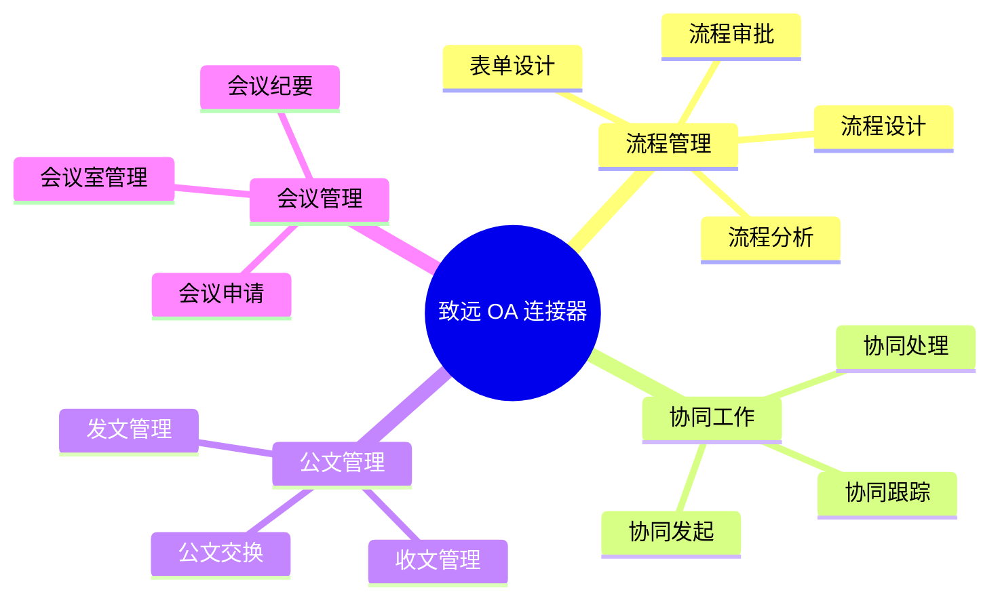

# 致远 OA 连接器

致远 OA 是致远互联推出的协同管理平台，提供流程管理、协同工作、业务生成器等丰富功能，适用于各类组织的数字化转型需求。轻易云 iPaaS 提供专用的致远 OA 连接器，帮助企业实现致远 OA 与业务系统的无缝集成。

## 连接器概述

### 产品简介

致远 OA 具有以下特点：

- **协同工作**：强大的协同办公能力
- **流程管理**：灵活的工作流引擎
- **业务生成器**：快速搭建业务应用
- **移动办公**：全面的移动化支持
- **集成平台**：开放的标准接口

### 适用版本

| 版本 | 支持状态 | 说明 |
|-----|---------|------|
| A8+ V8.x | ✅ 支持 | 推荐使用 |
| A8+ V7.x | ✅ 支持 | 稳定版本 |
| A6+ | ✅ 支持 | 中小企业 |
| G6 | ✅ 支持 | 政务版本 |



## 配置说明

### 前置条件

1. **开通 REST 接口**
   - 登录致远 OA 管理后台
   - 进入【系统管理】→【REST 接口管理】
   - 启用 REST 接口并配置授权

2. **获取连接信息**

| 参数 | 说明 | 获取位置 |
|-----|------|---------|
| `baseUrl` | 系统地址 | 系统配置 |
| `restUser` | REST 用户名 | REST 接口管理 |
| `restPwd` | REST 密码 | REST 接口管理 |
| `token` | 访问令牌 | 接口调试获取 |

### 连接配置参数

| 参数名 | 类型 | 必填 | 说明 |
|-------|------|------|------|
| `baseUrl` | string | ✅ | 致远 OA 系统地址 |
| `restUser` | string | ✅ | REST 接口用户名 |
| `restPwd` | string | ✅ | REST 接口密码 |
| `timeout` | number | — | 超时时间（毫秒） |

### 配置示例

```json
{
  "baseUrl": "http://seeyon-server:8080",
  "restUser": "restadmin",
  "restPwd": "your-password",
  "timeout": 30000
}
```

## 常用接口

### 流程接口

| 接口名称 | 接口标识 | 类型 | 说明 |
|---------|---------|------|------|
| 发起协同 | `/collaboration/save` | 写入 | 创建协同/流程 |
| 查询协同 | `/collaboration/get` | 查询 | 查询协同详情 |
| 处理协同 | `/collaboration/deal` | 写入 | 处理协同事项 |
| 查询待办 | `/collaboration/pending` | 查询 | 查询待办列表 |
| 查询已办 | `/collaboration/done` | 查询 | 查询已办列表 |

### 组织接口

| 接口名称 | 接口标识 | 类型 | 说明 |
|---------|---------|------|------|
| 查询单位 | `/orgAccounts` | 查询 | 查询单位列表 |
| 查询部门 | `/departments` | 查询 | 查询部门列表 |
| 查询人员 | `/members` | 查询 | 查询人员信息 |
| 查询岗位 | `/posts` | 查询 | 查询岗位信息 |

### 文档接口

| 接口名称 | 接口标识 | 类型 | 说明 |
|---------|---------|------|------|
| 上传附件 | `/attachments` | 写入 | 上传附件 |
| 下载附件 | `/attachments/{id}` | 查询 | 下载附件 |
| 查询文档 | `/docs` | 查询 | 查询文档 |

## 使用示例

### 发起协同（流程）

```json
{
  "api": "/collaboration/save",
  "method": "POST",
  "body": {
    "templateCode": "coll001",
    "subject": "采购申请-20260313",
    "memberId": "1001",
    "formData": {
      "field0001": "申请内容",
      "field0002": "10000",
      "field0003": "2026-03-13"
    }
  }
}
```

**响应示例**：

```json
{
  "success": true,
  "error_msg": "",
  "data": {
    "summaryId": "-123456789",
    "affairId": "-987654321",
    "subject": "采购申请-20260313"
  }
}
```

### 查询待办事项

```json
{
  "api": "/collaboration/pending",
  "method": "GET",
  "params": {
    "memberId": "1001",
    "page": 1,
    "pageSize": 20
  }
}
```

### 处理协同事项

```json
{
  "api": "/collaboration/deal",
  "method": "POST",
  "body": {
    "affairId": "-987654321",
    "memberId": "1001",
    "attitude": "1",  // 1: 已阅, 2: 同意, 3: 不同意
    "content": "同意此申请"
  }
}
```

### 查询人员信息

```json
{
  "api": "/members",
  "method": "GET",
  "params": {
    "loginName": "zhangsan"
  }
}
```

## 适配器配置

### 查询适配器

```json
{
  "source": {
    "adapter": "SeeyonQueryAdapter",
    "api": "/collaboration/pending",
    "params": {
      "memberId": "{{userId}}",
      "page": 1,
      "pageSize": 50
    }
  }
}
```

### 写入适配器

```json
{
  "target": {
    "adapter": "SeeyonExecuteAdapter",
    "api": "/collaboration/save",
    "mapping": {
      "templateCode": "{{templateCode}}",
      "subject": "{{title}}",
      "memberId": "{{userId}}",
      "formData": "{{formData}}"
    }
  }
}
```

## 常见问题

### Q: 如何获取模板编号？

1. 登录致远 OA 后台
2. 进入【流程管理】→【流程制作】
3. 选择目标流程模板
4. 查看模板属性中的【模板编号】

### Q: 如何获取表单字段标识？

1. 进入流程表单制作
2. 点击【表单属性】
3. 查看字段列表中的【字段名称】

### Q: 连接测试失败？

**排查步骤：**

1. 确认 `baseUrl` 地址正确（包含协议和端口）
2. 检查 REST 接口是否已启用
3. 验证 `restUser` 和 `restPwd` 正确
4. 确认该用户有 REST 接口访问权限
5. 检查网络连通性

### Q: 分页查询参数说明？

| 参数 | 说明 | 默认值 | 最大值 |
|-----|------|--------|--------|
| `page` | 当前页码 | 1 | — |
| `pageSize` | 每页条数 | 20 | 100 |

### Q: 协同状态说明？

| 状态 | 说明 |
|-----|------|
| `0` | 待处理 |
| `1` | 已处理 |
| `2` | 暂存待办 |
| `3` | 回退 |

### Q: 处理态度说明？

| 态度值 | 说明 |
|-------|------|
| `1` | 已阅 |
| `2` | 同意 |
| `3` | 不同意 |

### Q: 如何配置事件回调？

1. 进入【系统管理】→【事件管理】
2. 添加新的事件监听
3. 配置触发条件和回调 URL：
   ```text
   https://your-domain.com/callback/seeyon
   ```

## 相关资源

- [致远互联官网](https://www.seeyon.com/)
- [致远 A8+ 连接器](./seeyon-a8)
- [OA 连接器概览](../oa)

> [!NOTE]
> 致远 OA 的接口能力可能因版本不同有所差异，建议参考具体版本的接口文档。
