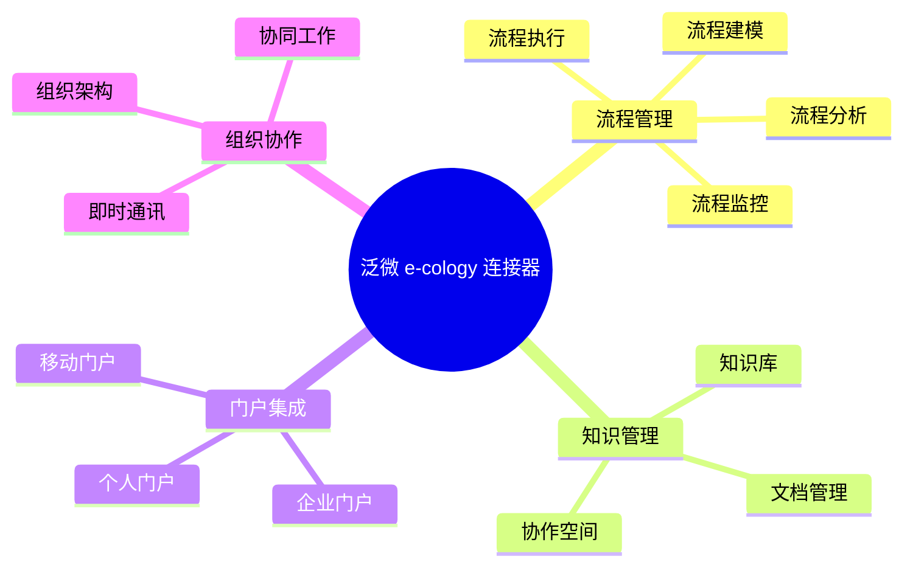
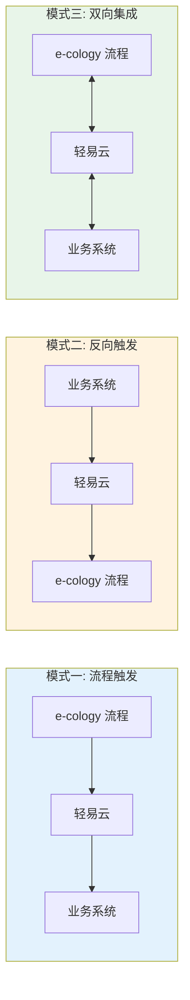
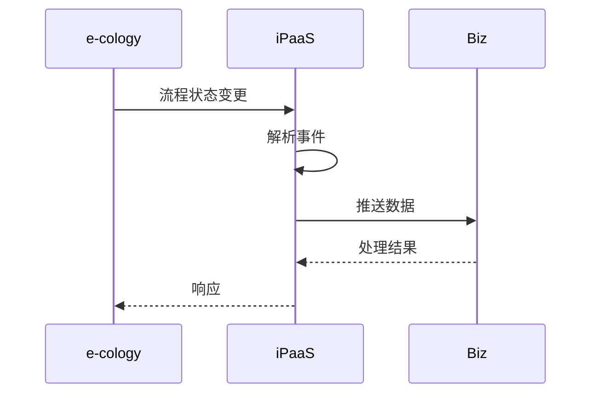

# 泛微 e-cology 连接器

泛微 e-cology 是泛微网络面向大型集团企业推出的协同管理平台，提供流程管理、知识管理、门户集成等全面功能。轻易云 iPaaS 提供专用的 e-cology 连接器，帮助企业实现 e-cology 与业务系统的深度集成。

## 连接器概述

### 产品简介

泛微 e-cology 具有以下特点：

- **流程引擎**：强大的流程建模和执行能力
- **知识管理**：企业知识的沉淀和共享
- **门户集成**：统一的信息访问入口
- **移动办公**：全功能的移动端支持
- **开放架构**：标准 API 和集成接口

### 核心能力



## 配置参数

### 前置条件

1. **开通接口权限**
   - 登录 e-cology 管理后台
   - 进入【集成中心】→【接口管理】
   - 申请开通 WebService 接口

2. **获取连接信息**

| 参数 | 说明 | 获取位置 |
|-----|------|---------|
| `serverUrl` | 服务器地址 | 系统配置 |
| `ip` | 授权 IP | 接口管理 |
| `appId` | 应用 ID | 接口管理 |
| `secret` | 应用密钥 | 接口管理 |

### 连接配置参数

| 参数名 | 类型 | 必填 | 说明 |
|-------|------|------|------|
| `serverUrl` | string | ✅ | e-cology 服务器地址 |
| `ip` | string | ✅ | 授权 IP 地址 |
| `appId` | string | ✅ | 应用 ID |
| `secret` | string | ✅ | 应用密钥 |
| `timeout` | number | — | 超时时间（毫秒） |

### 配置示例

```json
{
  "serverUrl": "http://ecology-server:8080",
  "ip": "192.168.1.100",
  "appId": "your-app-id",
  "secret": "your-secret",
  "timeout": 60000
}
```

## 流程集成说明

### 集成模式



### 流程监听配置

配置 e-cology 流程事件回调：

1. 进入【流程引擎】→【流程设置】
2. 选择目标流程，进入【接口动作】
3. 添加【自定义接口动作】
4. 配置回调 URL：
   ```text
   https://your-domain.com/callback/weaver/ecology
   ```

### 常用流程接口

| 接口名称 | 接口标识 | 说明 |
|---------|---------|------|
| 创建流程 | `workflow/createRequest` | 发起新的流程实例 |
| 查询流程 | `workflow/getRequest` | 查询流程详情 |
| 提交审批 | `workflow/submitRequest` | 提交流程审批 |
| 流程干预 | `workflow/interveneRequest` | 干预流程状态 |
| 流程查询 | `workflow/searchRequest` | 搜索流程列表 |

## 使用示例

### 创建流程实例

```json
{
  "api": "workflow/createRequest",
  "method": "POST",
  "body": {
    "workflowId": "123",
    "requestName": "采购申请-20260313",
    "creator": "张三",
    "mainData": {
      "field_1": "申请内容",
      "field_2": "10000",
      "field_3": "2026-03-13"
    },
    "detailData": [
      {
        "rowData": {
          "field_101": "商品 A",
          "field_102": "10",
          "field_103": "500"
        }
      }
    ]
  }
}
```

**响应示例**：

```json
{
  "code": "SUCCESS",
  "message": "流程创建成功",
  "data": {
    "requestId": "20260313001",
    "requestName": "采购申请-20260313",
    "status": "待审批"
  }
}
```

### 查询流程详情

```json
{
  "api": "workflow/getRequest",
  "method": "POST",
  "body": {
    "requestId": "20260313001"
  }
}
```

### 查询待办流程

```json
{
  "api": "workflow/getToDoRequest",
  "method": "POST",
  "body": {
    "userId": "zhangsan",
    "pageNo": 1,
    "pageSize": 20
  }
}
```

## 适配器配置

### 查询适配器

```json
{
  "source": {
    "adapter": "WeaverEcologyQueryAdapter",
    "api": "workflow/searchRequest",
    "params": {
      "workflowId": "123",
      "status": "待审批",
      "pageNo": 1,
      "pageSize": 100
    }
  }
}
```

### 写入适配器

```json
{
  "target": {
    "adapter": "WeaverEcologyExecuteAdapter",
    "api": "workflow/createRequest",
    "mapping": {
      "workflowId": "123",
      "requestName": "{{title}}",
      "creator": "{{applicant}}",
      "mainData": {
        "field_1": "{{content}}",
        "field_2": "{{amount}}"
      }
    }
  }
}
```

## 常用接口列表

### 流程接口

| 接口名称 | 接口标识 | 类型 | 说明 |
|---------|---------|------|------|
| 创建流程 | `workflow/createRequest` | 写入 | 创建流程实例 |
| 查询流程 | `workflow/getRequest` | 查询 | 查询流程详情 |
| 提交审批 | `workflow/submitRequest` | 写入 | 提交流程审批 |
| 查询待办 | `workflow/getToDoRequest` | 查询 | 查询待办流程 |
| 查询已办 | `workflow/getHaveDoRequest` | 查询 | 查询已办流程 |

### 组织接口

| 接口名称 | 接口标识 | 类型 | 说明 |
|---------|---------|------|------|
| 查询部门 | `hrm/department/getDepartment` | 查询 | 查询部门信息 |
| 查询人员 | `hrm/resource/getResource` | 查询 | 查询人员信息 |
| 查询岗位 | `hrm/job/getJob` | 查询 | 查询岗位信息 |

### 文档接口

| 接口名称 | 接口标识 | 类型 | 说明 |
|---------|---------|------|------|
| 上传文档 | `doc/uploadDoc` | 写入 | 上传文档 |
| 查询文档 | `doc/getDoc` | 查询 | 查询文档 |
| 删除文档 | `doc/deleteDoc` | 写入 | 删除文档 |

## 常见问题

### Q: 如何获取流程 ID？

1. 登录 e-cology 后台
2. 进入【流程引擎】→【路径设置】
3. 选择目标流程
4. 查看流程 ID（通常在 URL 中）

### Q: 如何获取字段 ID？

1. 进入流程表单设置
2. 右键点击目标字段
3. 查看【检查元素】
4. 找到 `fieldid` 属性

### Q: 连接测试失败？

**排查步骤：**

1. 确认服务器地址正确
2. 检查 IP 是否已在 e-cology 中授权
3. 验证 `appId` 和 `secret` 正确
4. 确认接口权限已开通
5. 检查网络连通性

### Q: 流程创建后如何获取流程编号？

创建流程接口会返回 `requestId`，这是流程的唯一标识：

```json
{
  "code": "SUCCESS",
  "data": {
    "requestId": "20260313001",  // 流程编号
    "requestName": "采购申请-20260313"
  }
}
```

### Q: 如何处理流程审批意见？

提交审批时可以附带审批意见：

```json
{
  "api": "workflow/submitRequest",
  "body": {
    "requestId": "20260313001",
    "userId": "approver",
    "remark": "同意，请尽快处理",
    "submitType": "submit"  // submit: 提交, reject: 退回
  }
}
```

### Q: 分页查询参数？

| 参数 | 说明 | 默认值 | 最大值 |
|-----|------|--------|--------|
| `pageNo` | 当前页码 | 1 | — |
| `pageSize` | 每页条数 | 20 | 100 |

### Q: 如何监听流程状态变更？

1. 在 e-cology 中配置流程接口动作
2. 设置回调 URL 指向轻易云
3. 轻易云配置事件接收方案



## 相关资源

- [泛微官网](https://www.weaver.com.cn/)
- [泛微 e-office 连接器](./weaver-eoffice)
- [OA 连接器概览](../oa)
- [审批流集成方案](../../standard-schemes/oa-integration)

> [!IMPORTANT]
> e-cology 的接口能力可能因版本不同有所差异，建议参考具体版本的接口文档。
