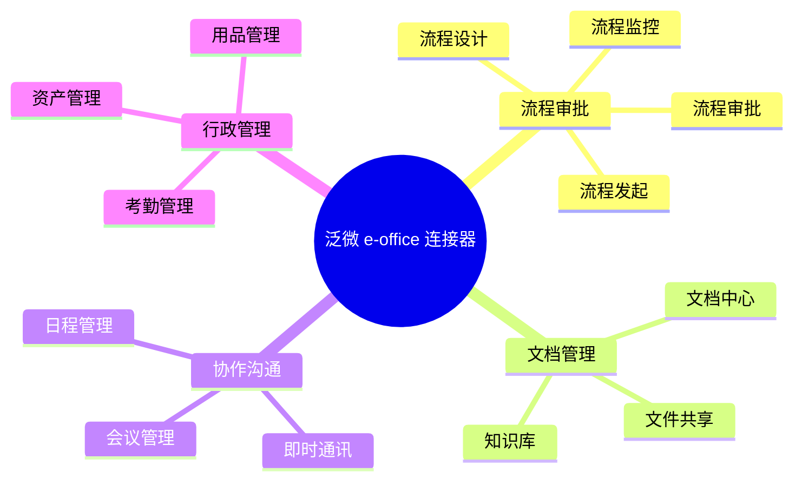

# 泛微 e-office 连接器

泛微 e-office 是面向中小型组织的协同办公平台，提供流程审批、文档管理、协作沟通等功能，操作简单、部署便捷。轻易云 iPaaS 提供专用的 e-office 连接器，帮助企业快速实现 e-office 与业务系统的集成。

## 连接器概述

### 产品简介

泛微 e-office 具有以下特点：

- **轻量部署**：快速部署，轻松上手
- **标准办公**：覆盖日常办公全流程
- **移动办公**：完善的移动端支持
- **开箱即用**：丰富的预置应用
- **灵活集成**：标准接口，支持扩展

### 适用版本

| 版本 | 支持状态 | 说明 |
|-----|---------|------|
| e-office 10.0 | ✅ 支持 | 推荐使用 |
| e-office 9.0 | ✅ 支持 | 稳定版本 |
| e-office 8.0 | ✅ 支持 | 基础功能 |



## 配置说明

### 前置条件

1. **开通 API 权限**
   - 登录 e-office 管理后台
   - 进入【系统管理】→【接口配置】
   - 启用 API 接口访问

2. **获取连接信息**

| 参数 | 说明 | 获取位置 |
|-----|------|---------|
| `baseUrl` | 系统地址 | 系统配置 |
| `appKey` | 应用标识 | 接口配置 |
| `appSecret` | 应用密钥 | 接口配置 |
| `token` | 访问令牌 | 接口调试获取 |

### 连接配置参数

| 参数名 | 类型 | 必填 | 说明 |
|-------|------|------|------|
| `baseUrl` | string | ✅ | e-office 系统地址 |
| `appKey` | string | ✅ | 应用标识 |
| `appSecret` | string | ✅ | 应用密钥 |
| `timeout` | number | — | 超时时间（毫秒） |

### 配置示例

```json
{
  "baseUrl": "http://eoffice-server:8080",
  "appKey": "your-app-key",
  "appSecret": "your-app-secret",
  "timeout": 30000
}
```

## 常用接口

### 流程接口

| 接口名称 | 接口标识 | 类型 | 说明 |
|---------|---------|------|------|
| 发起流程 | `/api/flow/start` | 写入 | 创建流程实例 |
| 查询流程 | `/api/flow/get` | 查询 | 查询流程详情 |
| 查询待办 | `/api/flow/todo` | 查询 | 查询待办列表 |
| 提交审批 | `/api/flow/submit` | 写入 | 提交流程审批 |

### 组织接口

| 接口名称 | 接口标识 | 类型 | 说明 |
|---------|---------|------|------|
| 查询部门 | `/api/org/dept` | 查询 | 查询部门列表 |
| 查询用户 | `/api/org/user` | 查询 | 查询用户信息 |
| 查询角色 | `/api/org/role` | 查询 | 查询角色信息 |

### 文档接口

| 接口名称 | 接口标识 | 类型 | 说明 |
|---------|---------|------|------|
| 上传文件 | `/api/doc/upload` | 写入 | 上传文档 |
| 下载文件 | `/api/doc/download` | 查询 | 下载文档 |
| 查询目录 | `/api/doc/folder` | 查询 | 查询文档目录 |

## 使用示例

### 发起流程

```json
{
  "api": "/api/flow/start",
  "method": "POST",
  "body": {
    "flowId": "1",
    "title": "采购申请-20260313",
    "userId": "1001",
    "data": {
      "field_1": "申请事由",
      "field_2": "5000",
      "field_3": "2026-03-13"
    }
  }
}
```

**响应示例**：

```json
{
  "code": 200,
  "message": "success",
  "data": {
    "runId": "10001",
    "title": "采购申请-20260313",
    "status": 1
  }
}
```

### 查询待办流程

```json
{
  "api": "/api/flow/todo",
  "method": "POST",
  "body": {
    "userId": "1001",
    "page": 1,
    "pageSize": 20
  }
}
```

### 提交审批

```json
{
  "api": "/api/flow/submit",
  "method": "POST",
  "body": {
    "runId": "10001",
    "userId": "1002",
    "opinion": "同意",
    "result": "1"  // 1: 同意, 2: 驳回
  }
}
```

### 查询用户信息

```json
{
  "api": "/api/org/user",
  "method": "POST",
  "body": {
    "userId": "1001"
  }
}
```

## 适配器配置

### 查询适配器

```json
{
  "source": {
    "adapter": "WeaverEofficeQueryAdapter",
    "api": "/api/flow/todo",
    "params": {
      "userId": "{{userId}}",
      "page": 1,
      "pageSize": 50
    }
  }
}
```

### 写入适配器

```json
{
  "target": {
    "adapter": "WeaverEofficeExecuteAdapter",
    "api": "/api/flow/start",
    "mapping": {
      "flowId": "{{flowId}}",
      "title": "{{title}}",
      "userId": "{{userId}}",
      "data": "{{formData}}"
    }
  }
}
```

## 常见问题

### Q: 如何获取流程 ID？

1. 登录 e-office 后台
2. 进入【流程管理】→【流程设计】
3. 查看流程列表中的 ID 列

### Q: 如何获取字段标识？

1. 进入流程表单设计
2. 点击目标字段
3. 查看【字段属性】中的【标识】

### Q: 连接测试失败？

**排查步骤：**

1. 确认 `baseUrl` 地址正确
2. 检查 `appKey` 和 `appSecret` 是否正确
3. 确认 API 接口已启用
4. 检查网络连通性

### Q: 分页查询参数说明？

| 参数 | 说明 | 默认值 | 最大值 |
|-----|------|--------|--------|
| `page` | 当前页码 | 1 | — |
| `pageSize` | 每页条数 | 20 | 100 |

### Q: 流程状态码说明？

| 状态码 | 说明 |
|-------|------|
| `0` | 草稿 |
| `1` | 审批中 |
| `2` | 已通过 |
| `3` | 已驳回 |
| `4` | 已转办 |
| `5` | 已撤销 |

### Q: 如何配置流程回调？

1. 进入【流程管理】→【流程设计】
2. 选择目标流程，点击【高级设置】
3. 配置【接口回调】
4. 设置回调地址：
   ```text
   https://your-domain.com/callback/weaver/eoffice
   ```

## 相关资源

- [泛微官网](https://www.weaver.com.cn/)
- [泛微 e-cology 连接器](./weaver-ecology)
- [OA 连接器概览](../oa)

> [!NOTE]
> e-office 的接口能力可能因版本不同有所差异，建议参考具体版本的接口文档。
