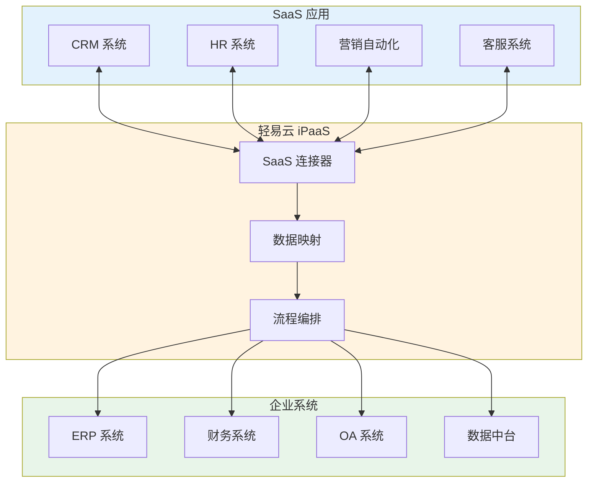
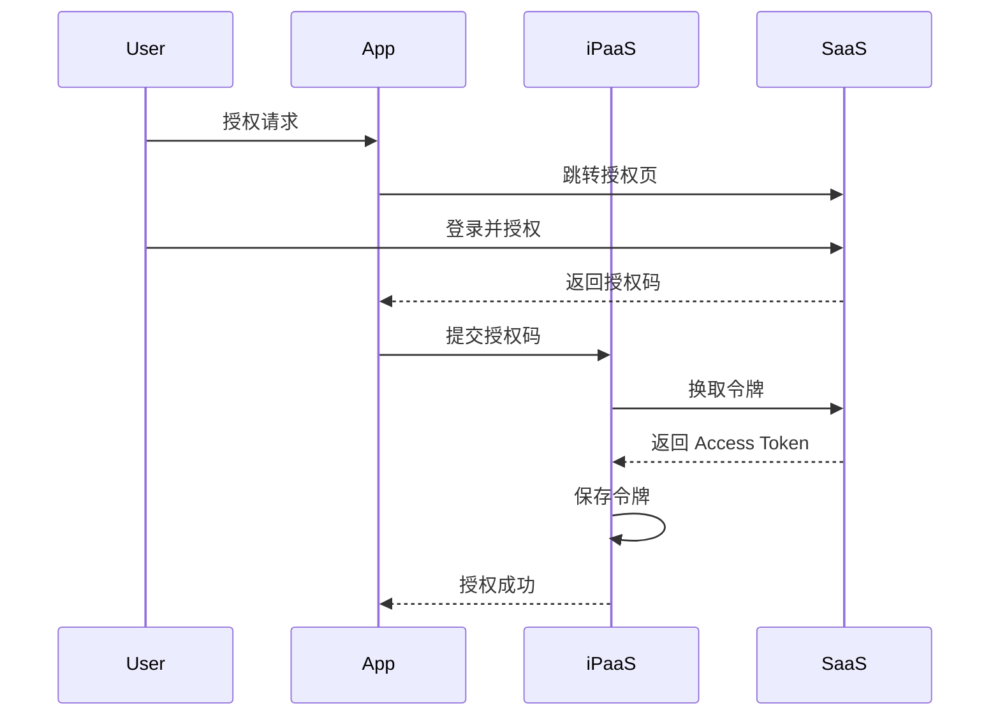
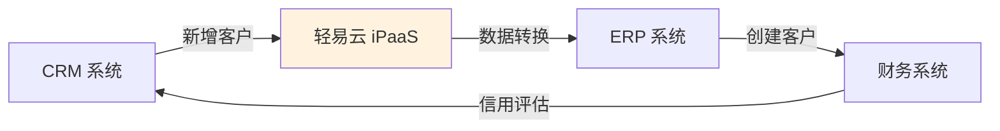
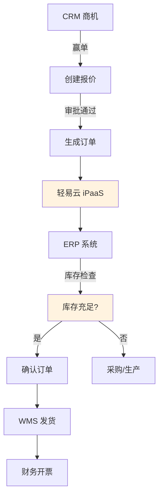
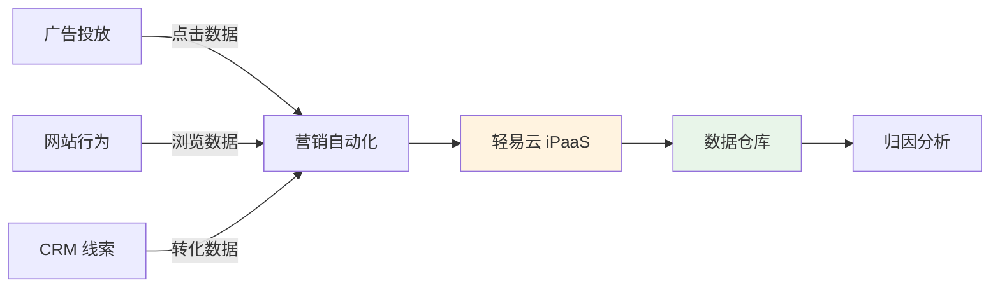
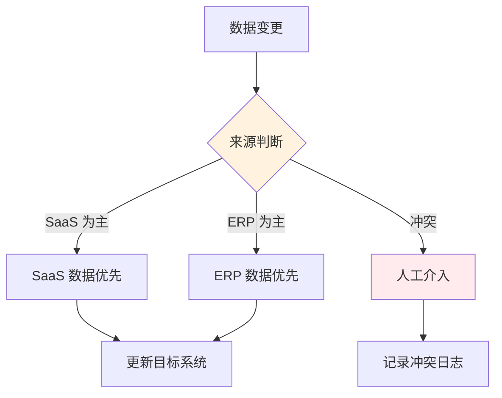
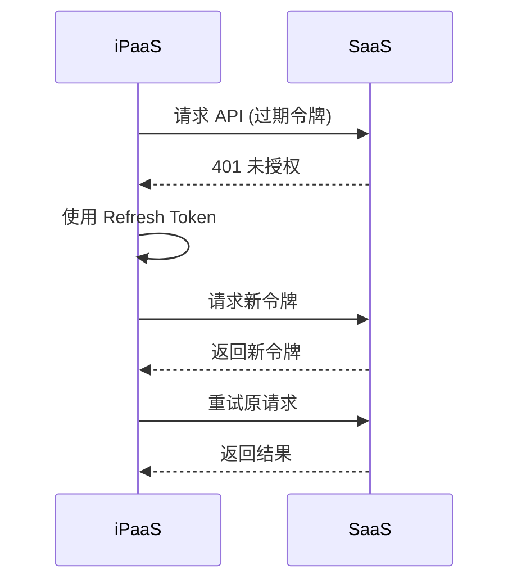

# CRM / SaaS 类连接器概览

轻易云 iPaaS 平台提供丰富的 SaaS 应用连接器，覆盖 CRM、人力资源、营销自动化等多个领域，帮助企业实现 SaaS 应用与企业内部系统的无缝集成。

## SaaS 连接器介绍

SaaS（Software as a Service，软件即服务）连接器帮助企业在云应用与本地系统之间建立数据桥梁，实现以下核心能力：

- **客户数据同步**：CRM 系统与 ERP、电商平台客户信息同步
- **销售流程集成**：销售线索、商机、订单的自动流转
- **营销自动化**：营销数据与客户行为数据的整合分析
- **人力资源集成**：招聘、考勤、薪酬数据的统一管理
- **服务管理对接**：工单、服务请求的全流程跟踪



## 支持的 SaaS 应用列表

### CRM 系统

| 系统名称 | 连接器标识 | 主要功能 | 适用场景 |
|---------|-----------|---------|---------|
| [Salesforce](./saas/salesforce) | `salesforce` | 销售、服务、营销 | 跨国企业 |
| [HubSpot](./saas/hubspot) | `hubspot` | 营销、销售、服务 | 中小企业 |
| [纷享销客](./saas/fenxiangxiaoke) | `fenxiangxiaoke` | 销售管理、CRM | 国内企业 |
| [销售易](./saas/xiaoshouyi) | `xiaoshouyi` | 移动 CRM | 销售团队 |
| [Zoho CRM](./saas/zoho) | `zoho` | 全功能 CRM | 中小企业 |

### 人力资源

| 系统名称 | 连接器标识 | 主要功能 | 适用场景 |
|---------|-----------|---------|---------|
| [北森](./saas/beisen) | `beisen` | 招聘、测评、人事 | 中大型组织 |
| [Moka](./saas/moka) | `moka` | 招聘管理 | 招聘流程 |
| [盖雅工场](./saas/guayagongchang) | `guaya` | 劳动力管理 | 考勤排班 |
| [薪人薪事](./saas/xinrenxinshi) | `xinrenxinshi` | 薪酬管理 | 薪资核算 |

### 营销自动化

| 系统名称 | 连接器标识 | 主要功能 | 适用场景 |
|---------|-----------|---------|---------|
| [ConvertLab](./saas/convertlab) | `convertlab` | 营销自动化 | 数字营销 |
| [神策数据](./saas/sensorsdata) | `sensorsdata` | 用户行为分析 | 数据驱动 |
| [GrowingIO](./saas/growingio) | `growingio` | 增长分析 | 产品优化 |

### 客服与支持

| 系统名称 | 连接器标识 | 主要功能 | 适用场景 |
|---------|-----------|---------|---------|
| [Udesk](./saas/udesk) | `udesk` | 智能客服 | 客户服务 |
| [智齿科技](./saas/zhichi) | `zhichi` | 在线客服 | 客服机器人 |
| [美洽](./saas/meiqia) | `meiqia` | 在线客服 | 网站客服 |

### 其他 SaaS

| 系统名称 | 连接器标识 | 主要功能 | 适用场景 |
|---------|-----------|---------|---------|
| [WordPress](./saas/wordpress) | `wordpress` | 内容管理 | 网站建设 |
| [Outreach](./saas/outreach) | `outreach` | 销售参与 | 销售外联 |
| [管荚婆](./saas/guanjiapo) | `guanjiapo` | 进销存 | 小微企业 |
| [小帮帮](./saas/xiaobangbang) | `xiaobangbang` | 业务管理 | 团队协作 |
| [沃时管家婆](./saas/wsgjp) | `wsgjp` | 进销存 | 小微企业 |
| [指掌天下](./saas/zhizhangtianxia) | `zhizhangtianxia` | 业务管理 | 销售管理 |

## 通用配置说明

### 连接配置参数

| 参数名 | 类型 | 必填 | 说明 |
|-------|------|------|------|
| `client_id` | string | ✅ | 应用客户端 ID |
| `client_secret` | string | ✅ | 应用客户端密钥 |
| `access_token` | string | ✅ | 访问令牌 |
| `refresh_token` | string | — | 刷新令牌 |
| `instance_url` | string | — | 实例地址 |
| `api_version` | string | — | API 版本 |

### OAuth 认证流程



### 适配器选择

| 适配器名称 | 用途 | 适用场景 |
|-----------|------|---------|
| `SaaSQueryAdapter` | 标准查询 | 数据拉取 |
| `SaaSExecuteAdapter` | 标准写入 | 数据推送 |
| `SaaSBatchAdapter` | 批量操作 | 大数据量 |
| `SaaSEventAdapter` | 事件监听 | 实时同步 |

## 集成场景示例

### 场景一：CRM 与 ERP 客户同步



**数据映射**：

| CRM 字段 | ERP 字段 | 转换规则 |
|---------|---------|---------|
| `account_name` | `customer_name` | 直接映射 |
| `industry` | `customer_type` | 行业分类映射 |
| `annual_revenue` | `credit_limit` | 收入转信用额度 |
| `billing_address` | `address` | 地址格式化 |

### 场景二：销售订单全链路集成



### 场景三：营销数据归因分析



## 最佳实践

### 1. 数据一致性保障



### 2. 增量同步策略

```json
{
  "syncStrategy": {
    "mode": "incremental",
    "syncField": "last_modified_time",
    "batchSize": 500,
    "conflictResolution": "source_priority",
    "schedule": "0 */30 * * * *"
  }
}
```

### 3. 异常重试机制

| 异常类型 | 重试策略 | 最大重试次数 |
|---------|---------|-------------|
| 网络超时 | 立即重试 | 3 次 |
| 限流错误 | 指数退避 | 5 次 |
| 授权失效 | 刷新令牌 | 自动处理 |
| 数据错误 | 记录日志 | 人工介入 |

## 常见问题

### Q: 如何处理 SaaS 接口限流？

SaaS 应用通常有 API 调用频率限制，建议：

1. **请求队列化**：使用队列缓冲请求
2. **速率限制**：控制请求频率
3. **缓存策略**：缓存不经常变化的数据
4. **批量操作**：尽可能使用批量接口

```python
# 速率限制示例
import time
from ratelimit import limits, sleep_and_retry

@sleep_and_retry
@limits(calls=100, period=60)  # 每分钟 100 次
def call_api():
    return api_client.request()
```

### Q: OAuth 令牌过期如何处理？

轻易云 iPaaS 支持自动刷新令牌：



### Q: 如何映射不同系统的字段类型？

字段类型映射参考：

| SaaS 类型 | 标准类型 | ERP 类型 | 说明 |
|----------|---------|---------|------|
| `string` | string | VARCHAR | 字符串 |
| `number` | decimal | DECIMAL | 数值 |
| `integer` | int | INT | 整数 |
| `datetime` | datetime | DATETIME | 日期时间 |
| `boolean` | bool | TINYINT | 布尔值 |
| `picklist` | enum | VARCHAR | 枚举值 |

## 相关文档

- [Salesforce 连接器](./saas/salesforce)
- [纷享销客连接器](./saas/fenxiangxiaoke)
- [北森连接器](./saas/beisen)
- [SaaS 集成最佳实践](../standard-schemes/saas-integration)
- [配置连接器](../guide/configure-connector)

> [!NOTE]
> SaaS 应用的 API 会定期更新，请及时关注官方文档和轻易云更新日志，以获取最新功能支持。
