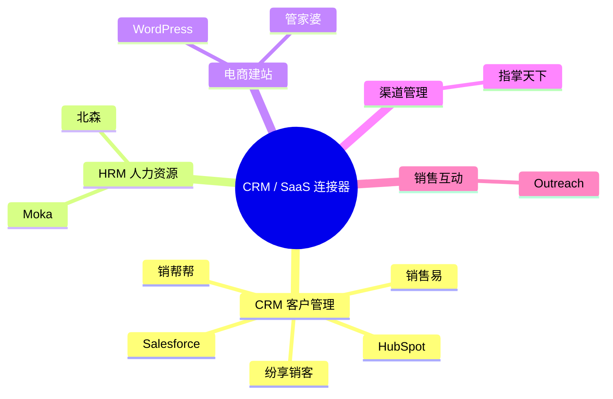
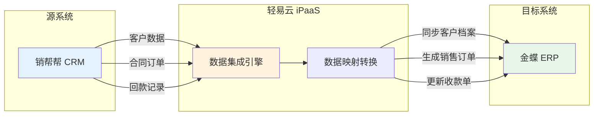
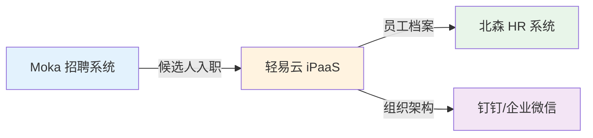
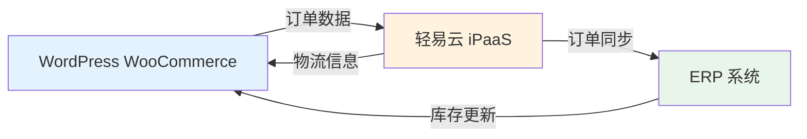

# CRM / SaaS 类连接器

本文档介绍轻易云 iPaaS 平台支持的 CRM 及各类 SaaS 应用连接器，涵盖客户管理、人力资源、电商建站等领域的主流平台集成方案。

## 连接器概览

轻易云 iPaaS 提供丰富的 CRM / SaaS 类连接器，帮助企业快速打通客户关系管理、人力资源、内容管理等系统，实现数据互通与业务协同。

### 连接器分类



## 支持的连接器列表

### CRM 客户管理

| 连接器 | 定位 | 功能特点 | 状态 |
|--------|------|----------|------|
| [销帮帮](./xiaobangbang) | 国产 CRM | 客户管理、合同订单、回款跟踪、进销存一体化 | ✅ 稳定 |
| [纷享销客](./fenxiangxiaoke) | 国产 CRM | 移动 CRM、销售自动化、营销管理 | ✅ 稳定 |
| [销售易](./xiaoshouyi) | 国产 CRM | 企业级 CRM、PaaS 平台、智能分析 | ✅ 稳定 |
| [Salesforce](./salesforce) | 国际 CRM | 全球领先的 CRM 平台、AppExchange 生态 | ✅ 稳定 |
| [HubSpot](./hubspot) | 国际 CRM | 营销自动化、客户成功、内容管理 | ✅ 稳定 |

### HRM 人力资源

| 连接器 | 定位 | 功能特点 | 状态 |
|--------|------|----------|------|
| [Moka](./moka) | 招聘系统 | 智能招聘管理、简历解析、面试协同 | ✅ 稳定 |
| [北森](./beisen) | HR SaaS | 人才测评、绩效管理、人事管理 | ✅ 稳定 |

### 电商与建站

| 连接器 | 定位 | 功能特点 | 状态 |
|--------|------|----------|------|
| [WordPress](./wordpress) | 建站系统 | WooCommerce 电商、内容管理、会员系统 | ✅ 稳定 |
| [管家婆](./wsgjp) | 进销存 ERP | 网上管家婆、OAUTH 授权、库存管理 | ✅ 稳定 |

### 渠道与销售

| 连接器 | 定位 | 功能特点 | 状态 |
|--------|------|----------|------|
| [指掌天下](./zhizhangtianxia) | 渠道 CRM | CRM + 进销存、渠道管理、订货平台 | ✅ 稳定 |
| [Outreach](./outreach) | 销售互动 | 销售参与平台、邮件序列、销售智能 | ✅ 稳定 |

## 集成场景示例

### 场景一：CRM 与 ERP 数据同步



**业务价值**：
- 消除 CRM 与 ERP 间的数据孤岛
- 实现客户信息、订单、回款的自动流转
- 减少人工录入错误，提升数据准确性

### 场景二：招聘系统与 HR 系统打通



**业务价值**：
- 候选人通过面试后自动同步至 HR 系统
- 自动开通企业 IM 账号，缩短入职流程
- 减少 HR 重复录入工作

### 场景三：WordPress 电商订单同步



**业务价值**：
- 电商订单自动同步至 ERP 系统
- 库存数据实时回写至电商平台
- 物流信息自动更新，提升客户体验

## 快速开始

### 配置连接器步骤

1. **创建连接器**
   - 登录轻易云 iPaaS 控制台
   - 进入**连接器管理**页面
   - 点击**新建连接器**，选择目标 SaaS 平台

2. **授权认证**
   - 根据平台要求完成 OAuth 授权或 API Key 配置
   - 部分平台需配置 Webhook 接收地址

3. **测试连接**
   - 点击**测试连接**验证配置是否正确
   - 确认可正常读取目标平台数据

4. **创建集成方案**
   - 新建集成方案，选择已配置的连接器
   - 配置数据映射与转换规则
   - 设置同步策略与调度周期

> [!TIP]
> 每个连接器的详细配置方法，请参考对应连接器的独立文档页面。

## 常见问题

### Q: 如何获取 SaaS 平台的 API 授权？

不同平台的授权方式有所差异：

| 平台类型 | 授权方式 | 说明 |
|----------|----------|------|
| 销帮帮 | API Key | 在后台获取 corpId 和 corpSecret |
| Moka | Webhook | 由 Moka 工作人员配置推送地址 |
| WordPress | Basic Auth | 使用 WooCommerce 生成的 Consumer Key |
| 管家婆 | OAuth 2.0 | 通过授权链接完成 OAuth 授权流程 |
| Outreach | OAuth 2.0 | 通过平台授权页面完成认证 |

### Q: 数据同步出现权限不足怎么办？

1. 检查连接器授权是否过期，重新完成授权流程
2. 确认 SaaS 平台账号具有足够的 API 调用权限
3. 部分功能需要开通高级版本才能访问对应接口

### Q: 如何处理 Webhook 推送的数据？

轻易云 iPaaS 支持直接接收 Webhook 推送：

```json
{{服务域名}}/api/open/{{平台标识}}/{{方案 ID}}
```

示例：
- Moka: `https://pro-service.qliang.cloud/api/open/mokahr/XXXX123456789`

## 相关资源

- [连接器配置指南](../../guide/configure-connector)
- [数据映射配置](../../guide/data-mapping)
- [标准集成方案](../../standard-schemes/crm-integration)

> [!NOTE]
> 如需接入未列出的 SaaS 平台，请联系轻易云技术支持，或通过[自定义连接器开发](../../developer/custom-connector)自行扩展。
