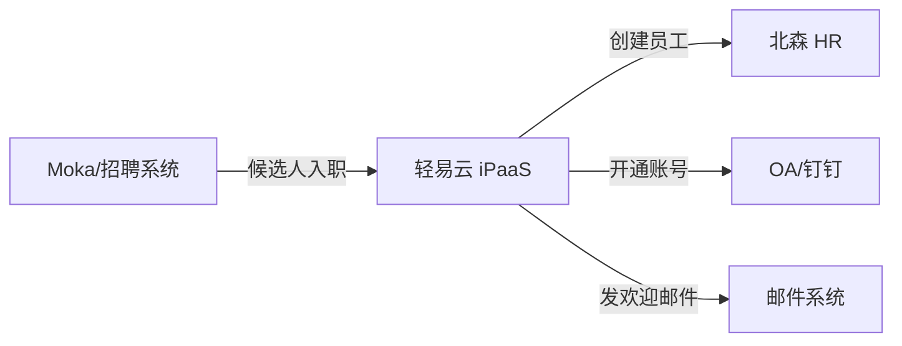

# 北森连接器

本文档介绍轻易云 iPaaS 与北森 HR SaaS 平台的集成配置方法。

## 平台简介

北森是国内领先的一体化 HR SaaS 及人才管理平台，涵盖招聘管理、绩效管理、人事管理、薪酬管理等功能。轻易云 iPaaS 提供北森连接器，支持与招聘系统、OA 系统等的集成。

## 连接配置

### 前置条件

- 北森企业版账号
- 开通 API 接口权限
- 获取 AccessKey 和 SecretKey

### 配置步骤

1. 登录北森管理后台
2. 进入 **系统设置 → 开放集成 → API 管理**
3. 创建应用并获取认证密钥
4. 在轻易云控制台创建连接器

## 集成方案配置

### 常用接口

| 接口 | 说明 |
|------|------|
| 员工信息查询 | 查询员工档案 |
| 组织架构查询 | 获取部门信息 |
| 绩效数据查询 | 获取绩效考核数据 |
| 入职办理 | 新员工入职处理 |

## 典型集成场景

### 招聘到入职自动化

## 参考文档

- [北森开放平台](https://www.beisen.com/)
