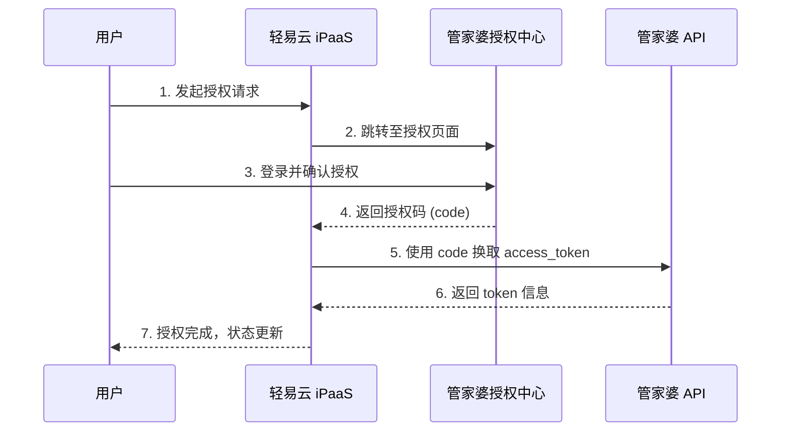
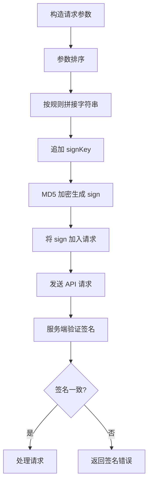
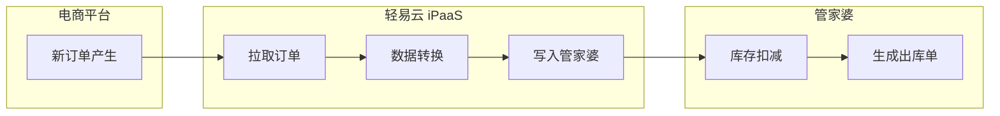
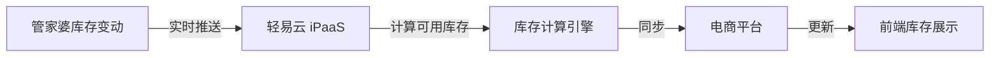

# 管家婆连接器

本文档介绍轻易云 iPaaS 与网上管家婆系统的集成配置方法，涵盖 OAuth 2.0 授权流程、加密解密机制、API 接口调用及典型集成场景。通过本连接器，企业可实现管家婆与 ERP、电商平台、财务系统之间的数据互通。

## 平台简介

网上管家婆是任我行软件旗下针对中小企业的 SaaS 化进销存管理软件，涵盖采购、销售、库存、财务等核心业务模块。轻易云 iPaaS 提供网上管家婆专用连接器，支持与主流 ERP、电商平台的数据对接，实现订单、库存、商品、客户等数据的自动同步。

## 前置条件

在开始配置前，请确保已具备以下条件：

- 网上管家婆系统账号及 API 访问权限
- 轻易云 iPaaS 平台账号
- 获取应用凭证（App Key、App Secret、Sign Key）

> [!NOTE]
> 应用凭证需联系管家婆开放平台或轻易云技术支持获取。

## 连接配置

### OAuth 2.0 授权流程

管家婆采用标准的 OAuth 2.0 授权码模式，完整授权流程如下：



### 授权配置步骤

#### 步骤 1：创建连接器

1. 登录轻易云控制台，进入**连接器管理**页面
2. 点击**新建连接器**，选择**网上管家婆**
3. 填写连接器基本信息，保存后记录连接器 ID（`keyword`）

#### 步骤 2：配置连接器参数

| 参数 | 说明 | 示例 |
|------|------|------|
| `appKey` | 应用标识 | 由管家婆开放平台提供 |
| `appSecret` | 应用密钥 | 由管家婆开放平台提供 |
| `signKey` | 签名密钥 | 用于请求签名加密 |
| 回调地址 | 授权回调 URL | `https://pro-service.qliang.cloud/api/open/Wsgjp/auth` |
| Code 地址 | 授权登录页地址 | `https://authcentral.wsgjp.com/account/login` |
| Token 地址 | 换取 token 的接口 | `http://apigateway.wsgjp.com.cn/api/token` |
| API 地址 | 业务 API 基础地址 | `http://apigateway.wsgjp.com.cn/allnewapi` |

#### 步骤 3：获取授权链接

通过连接器 ID 获取授权链接：

```http
GET https://pro-service.qliang.cloud/api/open/Wsgjp/geturl?keyword={连接器 ID}
```

> [!TIP]
> V2.0 及以上版本支持自动生成授权链接，在控制台点击**获取授权链接**按钮即可复制使用。

#### 步骤 4：完成授权

1. 使用浏览器打开授权链接
2. 使用管家婆账号登录并确认授权
3. 授权成功后，系统将自动获取 `access_token` 和 `refresh_token`
4. 连接器状态更新为**已连接**

授权链接格式示例：

```text
https://authcentral.wsgjp.com/account/login/
  ?appkey={appKey}
  &redirect_url=https://pro-service.qliang.cloud/api/open/Wsgjp/auth
  &keyword={连接器 ID}
```

> [!WARNING]
> 若授权完成后提示参数错误，请检查 `appKey`、`appSecret`、`signKey` 是否填写正确，或联系管家婆技术支持确认凭证有效性。

### 获取访问令牌

授权码换取访问令牌的接口：

```http
POST https://ngpopen.wsgjp.com/oauth2/token
Content-Type: application/x-www-form-urlencoded

app_key={appKey}
&app_secret={appSecret}
&grant_type=authorization_code
&code={授权码}
```

请求示例：

```http
https://ngpopen.wsgjp.com/oauth2/token
  ?app_key=1757619296059545943
  &app_secret=09942ea561638e9712a16ee0ada663ee
  &grant_type=authorization_code
  &code=7b00e2d2c4c7839775fb39d3622e8e13
```

## 加密解密机制

### 签名算法

管家婆 API 采用签名验证机制，所有请求需携带签名参数以确保数据完整性和安全性。

#### 签名生成步骤

1. **参数排序**：将所有业务参数按参数名 ASCII 码从小到大排序
2. **拼接字符串**：将排序后的参数以 `key1=value1&key2=value2` 格式拼接
3. **添加密钥**：在拼接字符串末尾追加 `&key={signKey}`
4. **MD5 加密**：对完整字符串进行 MD5 加密，得到签名

#### 签名示例代码

```javascript
/**
 * 生成管家婆 API 请求签名
 * @param params 业务参数对象
 * @param signKey 签名密钥
 * @returns MD5 签名值
 */
function generateSign(params, signKey) {
  // 1. 过滤空值和 sign 参数
  const filtered = Object.entries(params)
    .filter(([k, v]) => v !== null && v !== undefined && v !== '' && k !== 'sign')
    .sort(([a], [b]) => a.localeCompare(b));
  
  // 2. 拼接参数
  const paramStr = filtered.map(([k, v]) => `${k}=${v}`).join('&');
  
  // 3. 追加密钥
  const signStr = `${paramStr}&key=${signKey}`;
  
  // 4. MD5 加密并转大写
  return md5(signStr).toUpperCase();
}
```

#### 签名验证流程



### 请求参数加密

涉及敏感信息的接口可能需要对特定字段进行加密传输，具体加密方式需参考管家婆开放平台文档。

> [!IMPORTANT]
> 签名密钥（signKey）应妥善保管，避免在客户端暴露。建议在服务端完成签名计算。

## 适配器配置

### 适配器类路径

| 类型 | 适配器类路径 | 说明 |
|------|--------------|------|
| 查询适配器 | `\Adapter\Wsgjp\WsgjpQueryAdapter` | 用于数据查询类接口 |
| 执行适配器 | `\Adapter\Wsgjp\WsgjpExecuteAdapter` | 用于数据写入类接口 |

### 常用接口

#### 查询产品列表

- **调度者**：`ngp.ptype.list`
- **请求方式**：POST
- **请求参数**：

```json
{
  "pageSize": "10",
  "pageIndex": "1"
}
```

#### 创建出库单

- **调度者**：`ngp.bill.outboundbill.save`
- **请求方式**：POST
- **请求参数**：

```json
{
  "number": "CK20241205001",
  "vchcode": 986,
  "date": "2025-12-05",
  "btypeId": 826,
  "bfullname": "客户名称",
  "ktypeId": 964,
  "kfullname": "仓库名称",
  "etypeId": 685,
  "efullname": "经办人",
  "summary": "销售出库",
  "businessType": 508,
  "detail": [
    {
      "ptypeId": 547,
      "pfullname": "商品名称",
      "unitQty": 10,
      "currencyPrice": 100.00,
      "currencyTotal": 1000.00,
      "taxRate": 13,
      "unitName": "件"
    }
  ]
}
```

## 字段映射参考

### 出库单主表字段

| 字段名 | 说明 | 类型 | 必填 |
|--------|------|------|------|
| `number` | 单据编号 | string | ✅ |
| `vchcode` | 凭证代码 | int | — |
| `date` | 单据日期 | date | ✅ |
| `btypeId` | 往来单位 ID | int | ✅ |
| `bfullname` | 往来单位全称 | string | — |
| `ktypeId` | 仓库 ID | int | ✅ |
| `kfullname` | 仓库名称 | string | — |
| `etypeId` | 经办人 ID | int | — |
| `summary` | 摘要 | string | — |
| `memo` | 备注 | string | — |
| `businessType` | 业务类型 | int | — |

### 出库单明细字段

| 字段名 | 说明 | 类型 | 必填 |
|--------|------|------|------|
| `ptypeId` | 商品 ID | int | ✅ |
| `pfullname` | 商品全称 | string | — |
| `skuId` | SKU ID | int | — |
| `skuName` | SKU 名称 | string | — |
| `unitQty` | 数量 | decimal | ✅ |
| `currencyPrice` | 单价 | decimal | — |
| `currencyTotal` | 金额 | decimal | — |
| `taxRate` | 税率 | decimal | — |
| `unitName` | 单位名称 | string | — |
| `batchNo` | 批次号 | string | — |
| `produceDate` | 生产日期 | date | — |
| `expireDate` | 有效期至 | date | — |

### 支付信息字段

| 字段名 | 说明 | 类型 |
|--------|------|------|
| `paymentList` | 支付方式列表 | array |
| `atypeId` | 账户类型 ID | int |
| `atypeFullName` | 账户类型全称 | string |
| `currencyAtypeTotal` | 账户类型金额 | decimal |

## 典型集成场景

### 场景一：电商平台订单同步到管家婆



**配置要点**：

- 电商平台 SKU 与管家婆商品编码映射
- 订单状态与管家婆单据状态对应关系
- 仓库信息匹配（多仓库场景）
- 异常订单处理机制

### 场景二：管家婆库存同步到电商平台



## 参考文档

- [管家婆开放平台](https://ngpopen.wsgjp.com/)
- [开发文档中心](https://ngpopen.wsgjp.com/dev/index.html)
- [轻易云 iPaaS 使用指南](../../guide/configure-connector)

## 常见问题

### Q：授权后提示"参数错误"如何处理？

请按以下顺序排查：

1. 检查 `appKey`、`appSecret`、`signKey` 是否填写正确
2. 确认回调地址配置无误
3. 联系管家婆技术支持确认应用状态是否正常

### Q：签名验证失败的原因有哪些？

- 参数未按 ASCII 码排序
- 拼接字符串格式不正确（缺少 `&` 或 `=`）
- MD5 加密后未转大写
- `signKey` 错误

### Q：Token 过期如何处理？

管家婆 Token 具有有效期，过期后需使用 `refresh_token` 换取新的 `access_token`，或重新进行授权流程。
