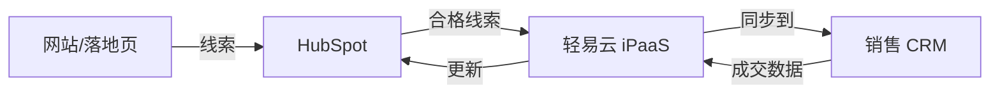

# HubSpot 连接器

本文档介绍轻易云 iPaaS 与 HubSpot 营销自动化平台的集成配置方法。

## 平台简介

HubSpot 是全球知名的营销自动化与 CRM 平台，提供营销、销售、客户服务等一体化解决方案。轻易云 iPaaS 提供 HubSpot 连接器，支持与电商平台、CRM 等系统的集成。

## 连接配置

### 前置条件

- HubSpot 账号
- 获取 Private App Token 或 OAuth 凭证

### 配置步骤

1. 登录 HubSpot
2. 进入 **设置 → 集成 → API 密钥**
3. 创建 Private App 并获取 Token
4. 在轻易云控制台创建连接器

## 集成方案配置

### 常用对象

| 对象 | 说明 |
|------|------|
| Contacts | 联系人 |
| Companies | 公司 |
| Deals | 交易/商机 |
| Tickets | 服务工单 |
| Products | 产品 |

## 典型集成场景

### 营销数据闭环

## 参考文档

- [HubSpot 开发者文档](https://developers.hubspot.com/)
