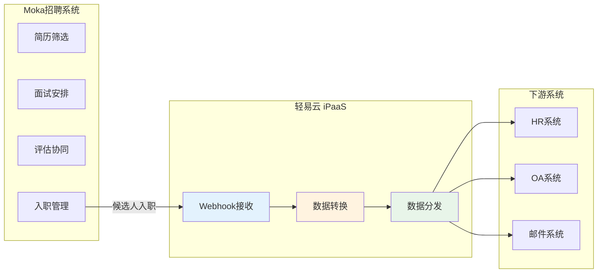
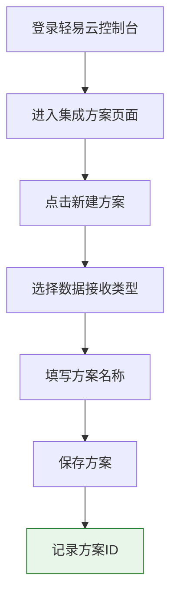
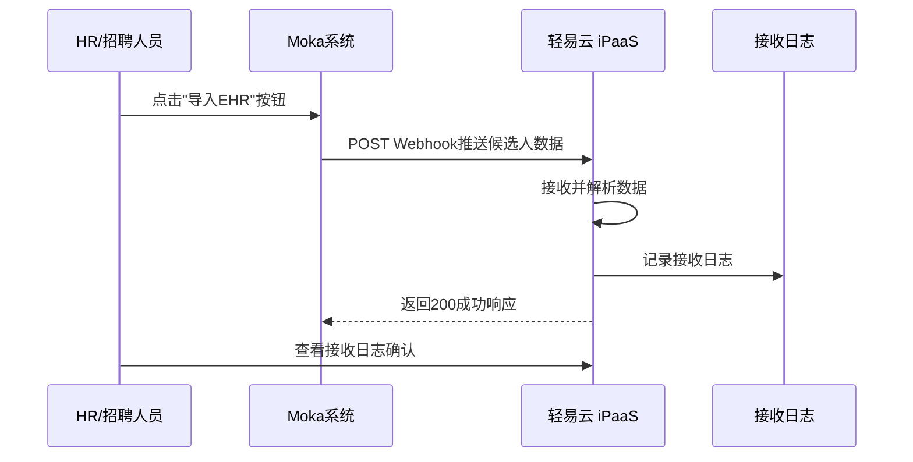
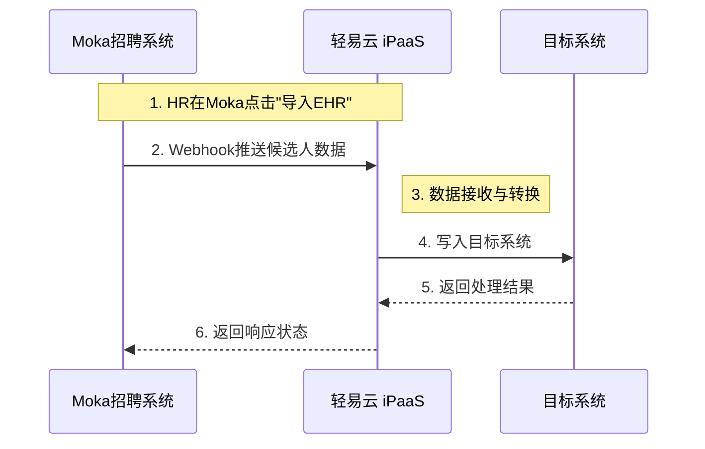
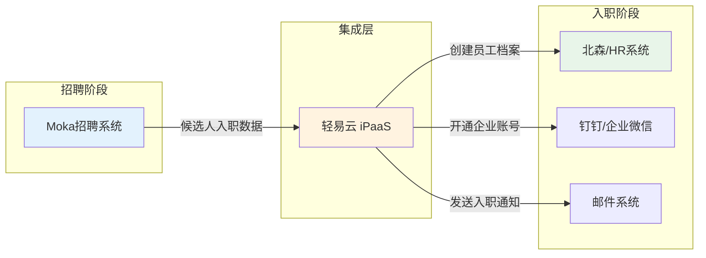
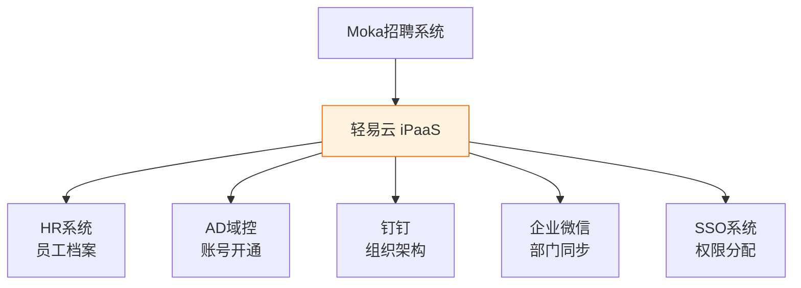

# Moka 连接器

本文档介绍轻易云 iPaaS 与 Moka 招聘管理系统的集成配置方法，帮助您实现招聘数据的实时同步与业务流程自动化。

## 平台简介

Moka 是国内领先的智能招聘管理系统，提供从简历筛选、面试安排、评估协同到入职管理的全流程招聘解决方案。轻易云 iPaaS 通过 Webhook 方式与 Moka 集成，接收候选人数据推送，实现招聘系统与 HR 系统、OA 系统的数据打通。



## 前置条件

在开始配置前，请确保满足以下条件：

| 条件 | 说明 |
|------|------|
| Moka 企业版账号 | 需开通 Webhook 推送功能权限 |
| 轻易云 iPaaS 账号 | 具有创建集成方案的权限 |
| Moka 技术支持联系方式 | 用于配置 Webhook 接收地址 |

> [!NOTE]
> Moka 的 Webhook 推送需要 Moka 工作人员在后台进行配置，请提前联系您的 Moka 客户成功经理或技术支持团队。

## 连接配置

### 步骤一：创建接收方案

1. 登录轻易云 iPaaS 控制台
2. 进入**集成方案**页面，点击**新建方案**
3. 选择方案类型为**数据接收**或**Webhook 接收**
4. 填写方案名称（如：Moka 招聘数据同步）
5. 保存方案并记录**方案 ID**



### 步骤二：配置 Webhook 接收地址

轻易云 iPaaS 为每个集成方案自动生成唯一的 Webhook 接收地址。

#### 接收地址格式

```json
{{服务域名}}/api/open/mokahr/{{方案 ID}}
```

#### 环境地址示例

| 环境 | 地址示例 |
|------|----------|
| 生产环境 | `https://pro-service.qliang.cloud/api/open/mokahr/XXXXXXXX` |
| 测试环境 | `http://test-service.qeasy.cloud:9001/api/open/mokahr/XXXXXXXX` |

> [!IMPORTANT]
> 请将 `XXXXXXXX` 替换为您的实际方案 ID。

#### 配置流程

1. 复制您的 Webhook 接收地址
2. 将地址提供给 Moka 工作人员
3. 由 Moka 技术在后台配置推送地址
4. 确认配置完成后进行测试

### 步骤三：配置方案详情

在轻易云控制台完成方案详情配置：

1. 进入方案详情页
2. 配置**请求调度者**
   - 默认无需特殊操作
   - 请求调度者负责接收原始 Webhook 数据
3. 配置**数据转换规则**（可选）
   - 设置字段映射
   - 配置数据清洗规则
4. 配置**目标平台**
   - 选择数据要写入的下游系统（如 HR 系统、OA 系统）

> [!TIP]
> 请求调度者默认配置即可，Moka 推送的数据会自动被接收，无需额外配置查询参数。

### 步骤四：验证数据接收

完成配置后，进行数据接收验证：

1. 在 Moka 后台找到测试候选人记录
2. 点击**导入 EHR**按钮触发数据推送
3. 在轻易云控制台查看**接收日志**
4. 确认数据格式和字段完整性



## 数据推送机制

### 触发方式

Moka 的数据推送采用**人工触发**机制：

- 候选人通过面试流程后，在 Moka 后台显示为"待入职"状态
- HR 或招聘人员需手动点击**导入 EHR**按钮
- 点击后 Moka 立即推送候选人数据到轻易云

> [!WARNING]
> Moka 不会自动推送数据，必须通过人工点击"导入 EHR"按钮才能触发推送。这是 Moka 系统的设计机制，不是配置问题。

### 数据流转流程



### 推送数据内容

Moka 推送的数据通常包含以下信息：

| 字段类别 | 示例字段 | 说明 |
|----------|----------|------|
| 候选人信息 | 姓名、手机号、邮箱 | 基础个人信息 |
| 职位信息 | 职位名称、部门、职级 | 入职岗位信息 |
| 招聘流程 | 面试轮次、评价结果 | 招聘流程数据 |
| 入职信息 | 预计入职日期、薪资 | 入职相关数据 |

> [!NOTE]
> 具体推送的数据字段取决于 Moka 后台的配置和您的业务需求，可联系 Moka 工作人员调整推送字段。

## 典型集成场景

### 场景一：招聘入职自动化

实现从候选人通过面试到入职的全流程自动化：



**业务价值**：
- 消除 HR 重复录入工作
- 缩短新员工入职准备时间
- 确保各系统数据一致性

### 场景二：多系统数据同步

将 Moka 招聘数据同步至多个下游系统：



**业务价值**：
- 一次操作，多系统同步
- 避免跨系统数据不一致
- 提升 IT 运维效率

## 常见问题

### Q: 为什么在轻易云收不到 Moka 推送的数据？

请按以下顺序排查：

1. **确认 Webhook 地址已配置**
   - 联系 Moka 工作人员确认接收地址已正确配置

2. **检查触发方式**
   - 确认已在 Moka 后台点击**导入 EHR**按钮
   - Moka 不会自动推送，必须人工触发

3. **验证地址可访问性**
   - 确保轻易云服务域名可从外网访问
   - 检查防火墙或安全组设置

4. **查看接收日志**
   - 在轻易云控制台查看方案日志
   - 确认是否有接收记录

### Q: 可以修改推送的数据字段吗？

可以。联系 Moka 工作人员调整 Webhook 推送的数据字段和内容格式，然后在轻易云配置相应的数据映射规则。

### Q: 如何测试 Webhook 推送？

1. 使用 Moka 测试环境的候选人数据进行测试
2. 在轻易云开启调试模式，查看原始数据
3. 验证数据映射和转换是否正确

### Q: 数据推送失败会重试吗？

Moka 的 Webhook 推送具有一定的重试机制。如果轻易云返回非 200 状态码，Moka 会在一定时间内进行重试。建议在轻易云配置异常处理机制，确保数据不丢失。

## 参考文档

- [Moka 官网](https://www.mokahr.com/)
- [连接器配置指南](../../guide/configure-connector)
- [数据映射配置](../../guide/data-mapping)
- [Webhook 配置指南](../../developer/webhook)

> [!TIP]
> 如需更多技术支持，请联系轻易云客户成功团队或访问[轻易云官网](https://www.qeasy.cloud/)。
