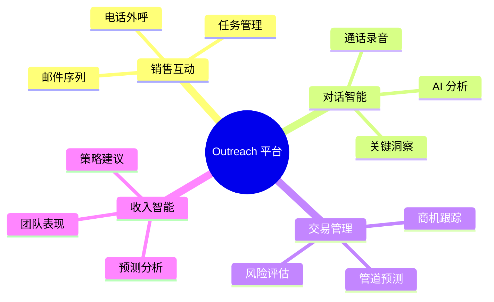
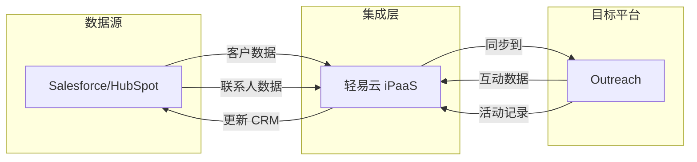
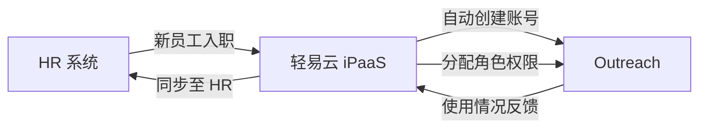
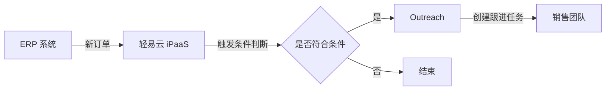

# Outreach 连接器

本文档介绍轻易云 iPaaS 与 Outreach 销售互动平台的集成配置方法，帮助用户实现 Outreach 与 CRM、ERP 等系统的数据同步和流程自动化。

## 平台简介

[Outreach](https://www.outreach.io/) 是一款领先的 AI 驱动收入工作流平台（AI Revenue Workflow Platform），专注于销售互动管理（Sales Engagement）。它帮助销售团队管理客户沟通、自动化销售流程、提升销售效率，并提供销售预测、交易智能和对话分析等功能。



轻易云 iPaaS 提供 Outreach 连接器，支持与企业内部 CRM、ERP、HR 等系统进行深度集成，实现客户数据、商机信息、销售活动的双向同步。

## 连接配置

### 前置条件

在开始配置 Outreach 连接器之前，请确保满足以下条件：

- 拥有 Outreach 平台账号
- 账号具有 API 访问权限
- 了解需要集成的数据对象（如 Prospects、Accounts、Opportunities 等）

> [!NOTE]
> Outreach 采用 OAuth 2.0 授权机制，无需手动管理 API Key。授权过程中会由系统自动获取 Access Token 和 Refresh Token。

### 创建连接器

1. 登录轻易云控制台，进入**连接器管理**页面
2. 点击**新建连接器**，选择 **Outreach** 类型
3. 填写连接器名称（如：Outreach 生产环境）
4. 记录系统分配的**连接器 ID**，后续授权流程需要使用

### OAuth 授权流程

#### 获取授权链接

通过以下 API 获取 OAuth 授权链接：

```bash
GET https://pro-service.qliang.cloud/api/open/outreach/geturl/{{连接器 ID}}
```

| 参数 | 说明 |
|------|------|
| 连接器 ID | 创建连接器时系统分配的唯一标识 |

响应示例：

```json
{
  "code": 0,
  "data": {
    "auth_url": "https://api.outreach.io/oauth/authorize?client_id=xxx&redirect_uri=xxx&response_type=code&scope=prospects.accounts..."
  }
}
```

#### 完成授权

1. 使用浏览器打开授权链接
2. 使用 Outreach 账号登录
3. 在授权页面确认授权应用访问权限
4. 授权成功后，连接器状态将自动更新为**已授权**

> [!TIP]
> 授权完成后，系统会自动获取并存储 Access Token 和 Refresh Token，无需手动配置。Token 过期时会自动刷新。

### 连接器参数说明

| 参数 | 类型 | 说明 |
|------|------|------|
| 连接器 ID | string | 系统分配的唯一标识 |
| Client ID | string | Outreach 应用标识（系统内置） |
| Client Secret | string | Outreach 应用密钥（系统内置） |
| Access Token | string | 访问令牌（授权后自动获取） |
| Refresh Token | string | 刷新令牌（授权后自动获取） |
| Token 过期时间 | datetime | Access Token 过期时间 |

## 集成方案配置

### 适配器信息

在轻易云 iPaaS 集成方案中配置 Outreach 数据源或目标时，需要使用以下适配器：

| 类型 | 适配器类路径 | 说明 |
|------|-------------|------|
| 查询适配器 | `\Adapter\Outreach\OutreachAuthQueryAdapter` | 用于从 Outreach 读取数据 |
| 写入适配器 | `\Adapter\Outreach\OutreachAuthExecuteAdapter` | 用于向 Outreach 写入数据 |

### 常用 API 端点

Outreach API 提供丰富的数据对象访问能力，以下是常用的 API 端点：

| 端点 | 对象类型 | 说明 |
|------|---------|------|
| `/api/v2/prospects` | Prospect | 潜在客户/联系人管理 |
| `/api/v2/accounts` | Account | 客户账户管理 |
| `/api/v2/opportunities` | Opportunity | 商机/销售机会管理 |
| `/api/v2/activities` | Activity | 销售活动记录 |
| `/api/v2/calls` | Call | 通话记录 |
| `/api/v2/mailings` | Mailing | 邮件发送记录 |
| `/api/v2/tasks` | Task | 任务/待办事项 |
| `/api/v2/users` | User | 销售团队成员 |
| `/api/v2/sequences` | Sequence | 销售序列/自动化流程 |

> [!NOTE]
> 完整的 API 文档请参考 [Outreach API Reference](https://developers.outreach.io/api/reference/)。

### 请求配置说明

Outreach API 请求需遵循以下规范：

**请求头配置：**

```json
{
  "headers": {
    "Authorization": "Bearer {access_token}",
    "Content-Type": "application/vnd.api+json",
    "Accept": "application/vnd.api+json"
  }
}
```

**分页参数：**

| 参数 | 类型 | 说明 |
|------|------|------|
| page[number] | integer | 页码，从 1 开始 |
| page[size] | integer | 每页记录数，最大 1000 |

**筛选参数示例：**

```json
{
  "filter": {
    "createdAt[gte]": "2024-01-01T00:00:00Z",
    "owner[id]": "12345"
  }
}
```

更多调用规范请参考 [Outreach API 文档](https://developers.outreach.io/api/making-requests/)。

## 典型集成场景

### 场景一：CRM 与 Outreach 双向同步



**同步内容：**

- 客户账户信息（Accounts）
- 联系人/潜在客户（Prospects）
- 商机/销售机会（Opportunities）
- 邮件/电话活动记录（Activities）
- 任务和待办事项（Tasks）

**业务价值：**

- 销售团队在一个平台管理客户沟通
- CRM 中实时查看 Outreach 互动记录
- 避免数据孤岛，提升销售效率

### 场景二：HR 系统与 Outreach 人员同步



**同步内容：**

- 销售团队成员信息（Users）
- 角色和权限配置（Roles/Permissions）
- 团队结构（Teams）

### 场景三：ERP 订单数据驱动销售跟进



**业务逻辑：**

1. ERP 中产生新订单时触发集成流程
2. 轻易云 iPaaS 判断订单类型和客户价值
3. 符合条件时，在 Outreach 中创建跟进任务
4. 分配给对应的销售人员进行后续跟进

## 数据映射参考

### Prospect（潜在客户）对象映射

| Outreach 字段 | 类型 | 说明 | 常见映射源字段 |
|--------------|------|------|---------------|
| firstName | string | 名 | Contact.FirstName |
| lastName | string | 姓 | Contact.LastName |
| email | string | 邮箱 | Contact.Email |
| phone | string | 电话 | Contact.Phone |
| company | string | 公司名 | Account.Name |
| title | string | 职位 | Contact.Title |
| owner | relationship | 负责人 | User.Id |
| account | relationship | 所属账户 | Account.Id |
| customFields | object | 自定义字段 | - |

### Account（客户账户）对象映射

| Outreach 字段 | 类型 | 说明 | 常见映射源字段 |
|--------------|------|------|---------------|
| name | string | 客户名称 | Account.Name |
| domain | string | 公司域名 | Account.Website |
| industry | string | 行业 | Account.Industry |
| size | string | 公司规模 | Account.NumberOfEmployees |
| owner | relationship | 负责人 | User.Id |
| customFields | object | 自定义字段 | - |

### Opportunity（商机）对象映射

| Outreach 字段 | 类型 | 说明 | 常见映射源字段 |
|--------------|------|------|---------------|
| name | string | 商机名称 | Opportunity.Name |
| amount | number | 金额 | Opportunity.Amount |
| closeDate | date | 预计关闭日期 | Opportunity.CloseDate |
| stage | string | 销售阶段 | Opportunity.StageName |
| probability | number | 赢单概率 | Opportunity.Probability |
| account | relationship | 关联客户 | Account.Id |
| owner | relationship | 负责人 | User.Id |

## 最佳实践

### 1. 数据同步策略

> [!TIP]
> 建议采用增量同步策略，通过 `updatedAt` 字段筛选变更数据，减少 API 调用次数。

**增量同步配置示例：**

```json
{
  "filter": {
    "updatedAt[gte]": "{{lastSyncTime}}"
  },
  "sort": "updatedAt",
  "page": {
    "size": 500
  }
}
```

### 2. 错误处理机制

Outreach API 可能返回以下常见错误：

| HTTP 状态码 | 错误类型 | 排查方法 |
|------------|---------|---------|
| 401 | 未授权 | 检查 Access Token 是否过期，重新授权 |
| 403 | 权限不足 | 确认账号具有访问该资源的权限 |
| 404 | 资源不存在 | 检查对象 ID 是否正确 |
| 422 | 验证错误 | 检查请求参数是否符合 API 规范 |
| 429 | 请求过于频繁 | 降低请求频率，启用限流机制 |

### 3. 性能优化建议

- **批量操作**：尽可能使用批量 API 减少请求次数
- **字段筛选**：使用 `fields` 参数只获取需要的字段
- **并发控制**：合理设置并发数，避免触发限流
- **缓存策略**：对不常变化的数据（如用户列表）进行本地缓存

## 常见问题

### Q: 授权链接无法打开或报错？

**可能原因及解决方案：**

1. **连接器 ID 错误**：确认使用的是正确的连接器 ID
2. **网络问题**：检查网络连接，确保可以访问 Outreach 服务
3. **账号权限**：确认 Outreach 账号具有授权应用的权限

### Q: Token 过期后如何重新授权？

Access Token 有效期通常为 2 小时，系统会自动使用 Refresh Token 续期。如果 Refresh Token 也过期，需要重新执行授权流程：

1. 在连接器详情页点击**重新授权**
2. 按照 OAuth 授权流程重新获取授权

### Q: 如何获取自定义字段数据？

Outreach 支持自定义字段，在 API 请求中可以通过 `customFields` 属性访问：

```json
{
  "fields": {
    "prospect": ["firstName", "lastName", "customFields"]
  }
}
```

### Q: API 调用频率限制是多少？

Outreach API 默认限制为每用户每小时 10,000 次请求。如需提高限额，请联系 Outreach 支持团队。

## 参考文档

- [Outreach 官网](https://www.outreach.io/)
- [Outreach 开发者中心](https://developers.outreach.io/)
- [Outreach API Reference](https://developers.outreach.io/api/reference/)
- [Outreach API 调用指南](https://developers.outreach.io/api/making-requests/)
- [轻易云 iPaaS 配置连接器](../../guide/configure-connector)
- [轻易云 iPaaS 数据映射](../../guide/data-mapping)
