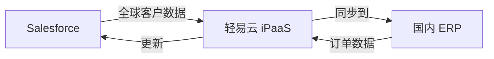

# Salesforce 连接器

本文档介绍轻易云 iPaaS 与 Salesforce CRM 平台的集成配置方法。

## 平台简介

Salesforce 是全球领先的 CRM 平台，提供销售云、服务云、营销云等产品。轻易云 iPaaS 提供 Salesforce 连接器，支持与各类企业应用的数据集成。

## 连接配置

### 前置条件

- Salesforce 账号
- 开通 API 访问权限
- 获取 Consumer Key 和 Consumer Secret

### 配置步骤

1. 登录 Salesforce
2. 进入 **设置 → 应用管理器 → 新建连接应用**
3. 配置 OAuth 设置并获取凭证
4. 在轻易云控制台创建连接器

## 集成方案配置

### 常用对象

| 对象 | 说明 |
|------|------|
| Account | 客户账户 |
| Contact | 联系人 |
| Opportunity | 商机 |
| Lead | 线索 |
| Case | 服务工单 |

## 典型集成场景

### 全球 CRM 数据整合

## 参考文档

- [Salesforce 开发者文档](https://developer.salesforce.com/)
