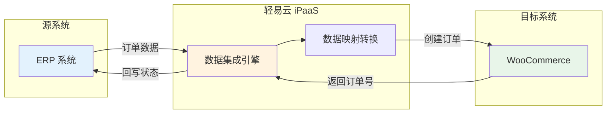

# WordPress / WooCommerce 连接器

本文档介绍轻易云 iPaaS 与 WordPress 平台的集成配置方法，重点说明 WooCommerce 电商系统的对接方案，包括环境配置、API 密钥生成、适配器使用以及常见问题排查。

---

## 概述

WordPress 是全球最流行的开源内容管理系统（CMS），配合 WooCommerce 插件可快速搭建功能完善的电商网站。轻易云 iPaaS 提供 WordPress / WooCommerce 专用连接器，支持以下核心能力：

- **订单同步**：自动同步 WooCommerce 订单至 ERP、OMS 等系统
- **产品管理**：产品信息双向同步，库存实时更新
- **客户数据**：客户信息、会员数据集成
- **优惠券管理**：营销活动数据同步

### 适用版本

| WooCommerce 版本 | 支持状态 | 说明 |
|------------------|----------|------|
| 6.x | ✅ 支持 | 基础功能完全支持 |
| 7.x | ✅ 推荐 | 稳定版本，推荐生产环境使用 |
| 8.x | ✅ 推荐 | 最新特性，性能最佳 |

> [!NOTE]
> 本文档基于 WooCommerce REST API v3 编写，建议使用最新版本以获得最佳兼容性。

---

## 环境配置

### 配置固定链接

WooCommerce REST API 依赖 WordPress 的固定链接功能，必须进行正确配置才能正常使用 API。

1. 登录 WordPress 后台
2. 进入 **设置 → 固定链接**（Settings → Permalinks）
3. 选择除"朴素"以外的任意一种固定链接格式（建议使用"文章名"）
4. 点击**保存更改**

> [!WARNING]
> 如果固定链接配置为"朴素"（Plain）模式，REST API 将无法正常工作，接口调用会返回 404 错误。

### 启用 REST API

WooCommerce 新版默认启用 REST API，无需额外配置。验证方法：

1. 进入 **WooCommerce → 设置 → 高级 → REST API**
2. 确认页面可正常访问，无错误提示

### 关于旧版 API

如使用的是 WooCommerce 新版，建议禁用旧版 REST API 以避免安全隐患：

1. 进入 **WooCommerce → 设置 → 高级 → 旧版 API**
2. 取消勾选 **Enable the legacy REST API**
3. 保存设置

---

## 连接配置

### 前置条件

- WordPress 站点已安装并启用 WooCommerce 插件
- 已正确配置固定链接（Permalinks）
- 站点支持 HTTPS 访问（生产环境必需）
- 具有 WordPress 管理员权限的账号

### 生成 API 密钥

WooCommerce REST API 使用 Basic 认证方式，需要 Consumer Key 和 Consumer Secret 进行身份验证。

1. 登录 WordPress 后台
2. 进入 **WooCommerce → 设置 → 高级 → REST API**
3. 点击**添加 Key**（Generate API keys）
4. 填写以下信息：
   - **描述**：密钥用途说明（如"轻易云 iPaaS 集成"）
   - **用户**：选择具有足够权限的 WordPress 用户
   - **权限**：选择 **读/写**（Read/Write）
5. 点击**生成 API 密钥**
6. 保存页面显示的 **Consumer Key** 和 **Consumer Secret**

```text
Consumer Key:    ck_xxxxxxxxxxxxxxxxxxxxxxxxxxxxxxxxxxxxxxxx
Consumer Secret: cs_xxxxxxxxxxxxxxxxxxxxxxxxxxxxxxxxxxxxxxxx
```

> [!CAUTION]
> API 密钥仅在生成时显示一次，请务必妥善保存。如遗失需重新生成，旧密钥将立即失效。

> [!TIP]
> 安全建议：
> - 为 API 访问创建专用 WordPress 用户，仅授予必要权限
> - 定期轮换 API 密钥
> - 勿将密钥提交到代码仓库或公开文档

### 连接器配置参数

在轻易云 iPaaS 控制台创建 WordPress 连接器时，需要配置以下参数：

| 参数 | 类型 | 必填 | 说明 | 示例 |
|------|------|------|------|------|
| `host` | string | ✅ | WordPress 站点域名 | `https://your-domain.com` |
| `consumer_key` | string | ✅ | API 用户名（ck_ 开头） | `ck_abc123...` |
| `consumer_secret` | string | ✅ | API 密码（cs_ 开头） | `cs_xyz789...` |
| `api_version` | string | — | API 版本 | `v3`（推荐） |
| `verify_ssl` | boolean | — | 是否验证 SSL 证书 | `true`（生产环境） |

#### 配置示例

```json
{
  "host": "https://your-domain.com",
  "consumer_key": "ck_xxxxxxxxxxxxxxxxxxxxxxxxxxxxxxxxxxxxxxxx",
  "consumer_secret": "cs_xxxxxxxxxxxxxxxxxxxxxxxxxxxxxxxxxxxxxxxx",
  "api_version": "v3",
  "verify_ssl": true
}
```

---

## 适配器配置

### 查询适配器

用于从 WooCommerce 读取数据：

```text
\Adapter\WordPress\WooCommerceQueryAdapter
```

### 写入适配器

用于向 WooCommerce 写入数据：

```text
\Adapter\WordPress\WooCommerceExecuteAdapter
```

### 配置示例

在集成方案中配置接口时，API 名称填写 WooCommerce REST API 端点路径：

| 接口类型 | API 名称 | 说明 |
|----------|----------|------|
| 查询 | `products` | 获取产品列表 |
| 查询 | `orders` | 获取订单列表 |
| 写入 | `products` | 创建/更新产品 |
| 写入 | `orders` | 创建/更新订单 |

---

## API 端点参考

WooCommerce REST API v3 常用端点：

| 端点 | 方法 | 说明 |
|------|------|------|
| `/wp-json/wc/v3/products` | GET/POST | 产品列表 / 创建产品 |
| `/wp-json/wc/v3/products/{id}` | GET/PUT/DELETE | 单个产品操作 |
| `/wp-json/wc/v3/orders` | GET/POST | 订单列表 / 创建订单 |
| `/wp-json/wc/v3/orders/{id}` | GET/PUT/DELETE | 单个订单操作 |
| `/wp-json/wc/v3/customers` | GET/POST | 客户列表 / 创建客户 |
| `/wp-json/wc/v3/coupons` | GET/POST | 优惠券列表 / 创建优惠券 |
| `/wp-json/wc/v3/settings` | GET | 获取店铺设置 |

> [!NOTE]
> 完整的 API 文档请参考 [WooCommerce REST API 官方文档](https://woocommerce.github.io/woocommerce-rest-api-docs/)。

---

## 测试与验证

### 手动测试（HTTP）

推荐使用 **VSCode REST Client 插件** 进行 API 测试。

创建 `test-woo.http` 文件，内容如下：

```http
### 获取产品列表（V3 - 推荐）
GET https://your-domain.com/wp-json/wc/v3/products
Authorization: Basic ck_xxx:cs_xxx

### 获取订单列表
GET https://your-domain.com/wp-json/wc/v3/orders
Authorization: Basic ck_xxx:cs_xxx

### 获取单个订单
GET https://your-domain.com/wp-json/wc/v3/orders/123
Authorization: Basic ck_xxx:cs_xxx

### 创建产品示例
POST https://your-domain.com/wp-json/wc/v3/products
Authorization: Basic ck_xxx:cs_xxx
Content-Type: application/json

{
  "name": "测试产品",
  "type": "simple",
  "regular_price": "99.99",
  "description": "产品描述"
}
```

> [!TIP]
> API 版本说明：V1、V2、V3 版本功能差别不大，V3 为当前推荐版本，功能最完善。

---

## 典型集成场景

### 场景：ERP 订单同步到 WooCommerce



**配置要点**：

1. **源平台配置**：选择 ERP 连接器，配置订单查询接口
2. **目标平台配置**：选择 WordPress 连接器，API 使用 `orders`
3. **数据映射**：
   - 客户信息 → billing / shipping
   - 产品 SKU → line_items
   - 订单状态 → status（pending / processing / completed）
4. **回写配置**：订单创建成功后回写 ERP 订单号

---

## 常见问题

### Q: 提示 "Consumer Key 无效"（401 错误）

**错误信息**：

```json
{
  "code": "woocommerce_rest_authentication_error",
  "message": "Consumer Key 无效。",
  "data": { "status": 401 }
}
```

**原因分析**：

WooCommerce REST API 要求使用 **HTTPS** 协议进行身份验证。使用 IP + 端口或 HTTP 方式访问会导致认证失败。

**解决方案**：

#### 方案一：配置 HTTPS 证书（推荐）

为网站配置有效的 SSL 证书，使用 `https://` 访问。生产环境必须使用此方案。

#### 方案二：本地 hosts 映射（开发环境）

本地开发环境可通过修改 hosts 文件实现域名访问：

**Linux / Mac**：

```bash
sudo vim /etc/hosts
```

**Windows**：

编辑文件 `C:\Windows\System32\drivers\etc\hosts`

添加以下内容：

```text
192.168.0.105  your-domain.com
```

然后通过 `https://your-domain.com` 访问（需本地证书信任）。

#### 方案三：使用 OAuth1 认证（HTTP 环境临时方案）

对于非安全连接（HTTP），需要使用 OAuth1 身份验证。

1. 安装 OAuth1 认证插件（如 "WP REST API - OAuth 1.0a Server"）
2. 在轻易云连接器配置中选择 OAuth1 认证方式
3. 提供消费者密钥和消费者密文，其他属性留空

> [!WARNING]
> 此方案仅用于本地临时测试，生产环境必须使用 HTTPS + Basic 认证。

### Q: 提示 "401 Unauthorized" 但密钥正确

**排查步骤**：

1. 检查 WordPress 地址与站点地址配置是否一致：
   - 进入 **设置 → 常规**
   - 确认 "WordPress 地址" 和 "站点地址" 使用相同域名

2. 检查 API Key 权限：
   - 进入 **WooCommerce → 设置 → 高级 → REST API**
   - 确认 Key 的权限包含所需操作（读/写）

3. 检查固定链接配置：
   - 确认已启用固定链接（非"朴素"模式）
   - 尝试重新保存固定链接设置

### Q: 如何获取特定状态的订单？

使用查询参数过滤：

```http
GET https://your-domain.com/wp-json/wc/v3/orders?status=processing
Authorization: Basic ck_xxx:cs_xxx
```

支持的订单状态：`pending`（待付款）、`processing`（处理中）、`on-hold`（保留）、`completed`（已完成）、`cancelled`（已取消）、`refunded`（已退款）、`failed`（失败）。

### Q: 分页查询如何配置？

使用 `page` 和 `per_page` 参数：

```http
GET https://your-domain.com/wp-json/wc/v3/orders?page=1&per_page=50
Authorization: Basic ck_xxx:cs_xxx
```

- `per_page`：每页记录数，最大 100
- `page`：页码，从 1 开始

---

## 参考文档

- [WooCommerce REST API 官方文档](https://woocommerce.github.io/woocommerce-rest-api-docs/)
- [WordPress REST API 手册](https://developer.wordpress.org/rest-api/)
- [WooCommerce 官方文档](https://docs.woocommerce.com/)
- [GitHub: woocommerce/woocommerce](https://github.com/woocommerce/woocommerce)

---

> [!NOTE]
> 如需更多技术支持，请联系轻易云客服团队或查阅 [连接器配置指南](../../guide/configure-connector)。
