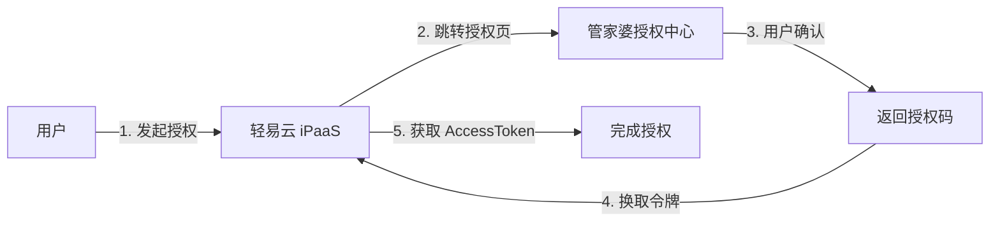

# 管家婆连接器

本文档介绍轻易云 iPaaS 与网上管家婆系统的集成配置方法，包括 OAuth 授权流程和常用接口调用。

## 平台简介

网上管家婆是任我行软件旗下针对中小企业的 SaaS 化进销存管理软件，涵盖采购、销售、库存、财务等核心业务。轻易云 iPaaS 提供网上管家婆专用连接器，支持与主流 ERP、电商平台的数据对接。

## 连接配置

### OAuth 授权流程

管家婆采用 OAuth 2.0 授权机制，需完成以下步骤：



### 授权配置步骤

1. **创建连接器**
   - 在轻易云控制台新建管家婆连接器
   - 记录连接器 ID

2. **获取授权链接**
   ```text
   https://{服务域名}/api/open/Wsgjp/geturl?keyword={连接器 ID}
   ```

3. **完成授权**
   - 使用浏览器打开授权链接
   - 使用管家婆账号登录并确认授权
   - 授权成功后连接器状态更新为"已连接"

### 连接器配置参数

| 参数 | 说明 |
|------|------|
| App Key | 应用标识（由轻易云提供） |
| App Secret | 应用密钥（由轻易云提供） |
| 授权状态 | 连接状态显示 |

## 集成方案配置

### 适配器信息

| 类型 | 适配器类路径 |
|------|--------------|
| 查询适配器 | `\Adapter\Wsgjp\WsgjpQueryAdapter` |
| 执行适配器 | `\Adapter\Wsgjp\WsgjpExecuteAdapter` |

### 常用接口

#### 查询产品列表

- **调度者**：`ngp.ptype.list`
- **请求示例**：
```json
{
  "pageSize": "10",
  "pageIndex": "1"
}
```

#### 创建出库单

- **调度者**：`ngp.bill.outboundbill.save`
- **核心字段**：
  - `number`：单据编号
  - `date`：单据日期
  - `btypeId`：往来单位 ID
  - `detail`：明细列表

## 典型集成场景

### 场景：电商平台订单同步到管家婆


**配置要点**：
- 产品 SKU 与管家婆商品编码映射
- 订单状态与单据状态对应
- 仓库信息匹配

## 字段映射参考

### 出库单主要字段

| 字段名 | 说明 | 类型 |
|--------|------|------|
| number | 单据编号 | string |
| date | 单据日期 | date |
| btypeId | 往来单位 ID | int |
| ktypeId | 仓库 ID | int |
| etypeId | 经办人 ID | int |
| detail | 明细列表 | array |

### 明细字段

| 字段名 | 说明 |
|--------|------|
| ptypeId | 商品 ID |
| unitQty | 数量 |
| currencyPrice | 单价 |
| currencyTotal | 金额 |
| taxRate | 税率 |

## 参考文档

- [管家婆开放平台](https://ngpopen.wsgjp.com/)
- [开发文档中心](https://ngpopen.wsgjp.com/dev/index.html)
