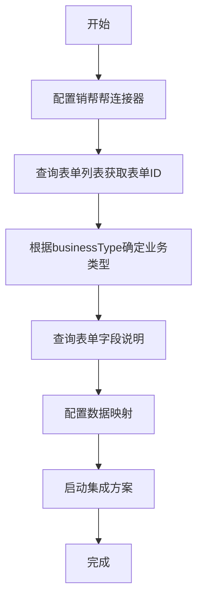
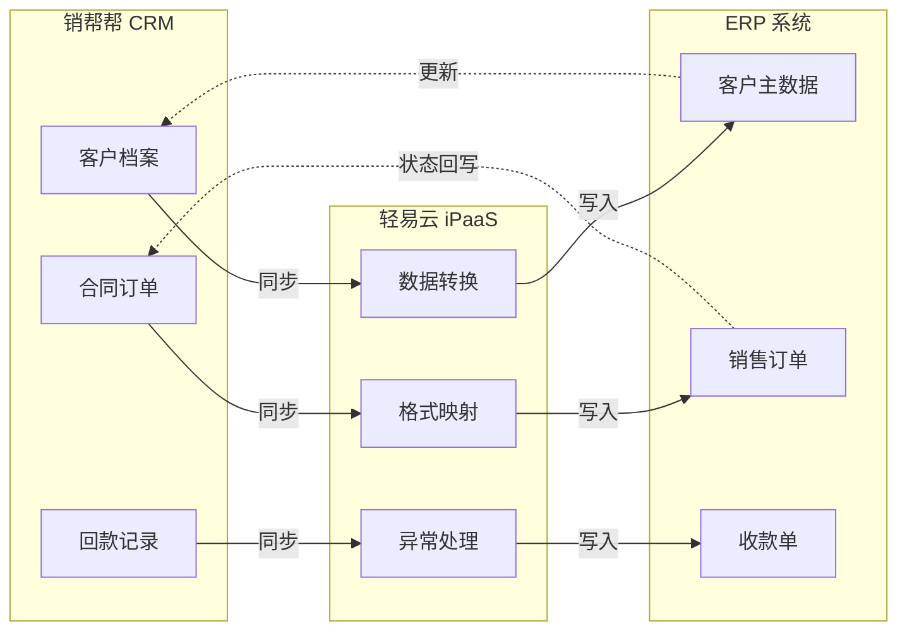
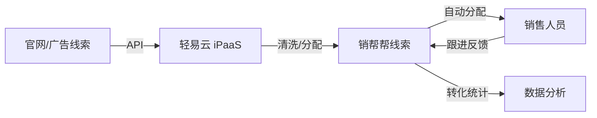
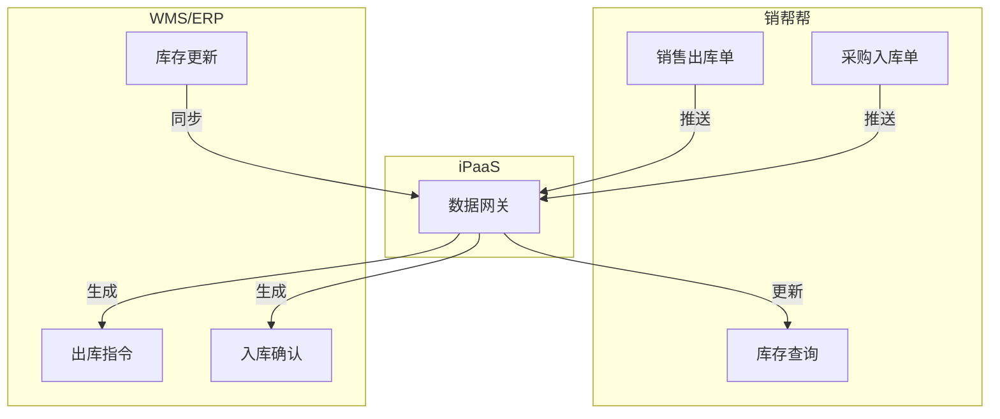

# 销帮帮连接器

本文档介绍轻易云 iPaaS 与销帮帮 CRM 平台的集成配置方法，涵盖连接配置、表单业务类型、接口说明以及典型集成场景。

## 平台简介

销帮帮是一款以客户关系管理（CRM）为基础的 SaaS 型企业管理平台，集团队协作、营销推广、进销存管理、数据分析于一体。平台提供丰富的开放 API 接口，涵盖用户认证、客户信息、销售记录、进销存管理等功能，支持企业进行二次开发和系统集成。

### 核心能力

| 功能模块 | 说明 |
|----------|------|
| 客户管理 | 客户档案、线索管理、联系人维护 |
| 销售管理 | 商机跟进、合同订单、报价管理 |
| 进销存 | 采购入库、销售出库、库存管理 |
| 财务管理 | 回款计划、回款单、发票管理 |
| 协同办公 | 工作报告、任务分配、审批流程 |

## 连接配置

### 前置条件

- 销帮帮企业版账号
- 开通 API 接口权限
- 获取企业认证信息（CorpId 和 CorpSecret）

### 连接器参数

| 参数 | 类型 | 必填 | 说明 | 示例 |
|------|------|------|------|------|
| Host | string | ✅ | API 域名 | `https://proapi.xbongbong.com` |
| CorpId | string | ✅ | 企业 ID | 从销帮帮后台获取 |
| CorpSecret | string | ✅ | 企业密钥 | 从销帮帮后台获取 |

### 配置步骤

1. 登录销帮帮管理后台
2. 进入 **设置 → API 管理**
3. 获取 CorpId 和 CorpSecret
4. 在轻易云控制台创建连接器，选择「销帮帮」类型
5. 填入上述参数完成配置

> [!TIP]
> Host 固定配置为 `https://proapi.xbongbong.com`，请勿使用其他地址。

## 集成方案配置

### 表单业务类型

销帮帮使用 `businessType` 字段标识不同的业务表单类型：

| 业务类型 | Code | 说明 |
|----------|------|------|
| 客户 | 100 | 客户档案管理 |
| 合同订单 | 201 | 销售合同/订单 |
| 退货退款 | 202 | 售后处理 |
| 销售机会 | 301 | 商机管理 |
| 联系人 | 401 | 联系人资料 |
| 跟进记录 | 501 | 客户跟进记录 |
| 访客计划 | 601 | 访客计划管理 |
| 回款计划 | 701 | 收款计划 |
| 回款单 | 702 | 实际收款记录 |
| 销项发票 | 901 | 销售发票 |
| 供应商 | 1001 | 供应商档案 |
| 采购合同 | 1101 | 采购合同管理 |
| 仓库 | 1801 | 仓库基础资料 |
| 采购入库单 | 1404 | 采购入库记录 |
| 其他入库单 | 1406 | 其他入库记录 |
| 销售出库单 | 1504 | 销售出库记录 |
| 其他出库单 | 1506 | 其他出库记录 |
| 调拨单 | 1601 | 库存调拨 |
| 盘点单 | 1701 | 库存盘点 |
| 产品 | 2401 | 产品基础资料 |
| 报价单 | 4700 | 销售报价 |
| 线索 | 8000 | 销售线索 |
| 市场活动 | 8100 | 营销活动 |
| 工作报告 | 2101 | 综合工作报告 |
| 日报 | 2102 | 每日工作汇报 |
| 周报 | 2103 | 每周工作汇报 |
| 月报 | 2104 | 每月工作汇报 |
| 自定义表单 | - | 不传或根据实际配置 |

### 创建集成方案步骤



#### 步骤 1：查询表单列表

调用接口获取企业下的表单列表：

```http
POST /pro/v2/api/form/list
```

**请求参数**：

| 参数 | 类型 | 必填 | 说明 |
|------|------|------|------|
| corpId | string | ✅ | 企业 ID |
| corpSecret | string | ✅ | 企业密钥 |

**响应示例**：

```json
{
  "code": 1,
  "msg": "操作成功",
  "result": [
    {
      "formId": "xxxxxxxx",
      "formName": "合同订单",
      "businessType": 201
    }
  ],
  "success": true
}
```

#### 步骤 2：查询表单字段说明

获取表单 ID 后，查询字段定义：

```http
POST /pro/v2/api/form/get
```

**请求参数**：

| 参数 | 类型 | 必填 | 说明 |
|------|------|------|------|
| corpId | string | ✅ | 企业 ID |
| corpSecret | string | ✅ | 企业密钥 |
| formId | string | ✅ | 表单 ID |

**响应字段说明**：

| 字段 | 类型 | 说明 |
|------|------|------|
| attr | string | 字段标识（API 调用时使用） |
| attrName | string | 字段显示名称 |
| fieldType | int | 字段类型编码 |
| required | int | 是否必填（1=必填，0=可选） |
| items | array | 选项值（下拉/单选/多选字段） |
| subFieldList | array | 子表单字段列表 |

### 常用字段类型说明

| 字段类型 | 编码 | 说明 | 示例 |
|----------|------|------|------|
| 文本 | 1 | 单行文本 | 客户名称、编号 |
| 数值 | 2 | 数字类型 | 金额、数量 |
| 下拉选择 | 3 | 单选下拉 | 状态、类型 |
| 日期 | 4 | 日期选择 | 签订日期 |
| 多行文本 | 7 | 长文本 | 备注说明 |
| 附件 | 8 | 文件上传 | 合同附件 |
| 成员选择 | 10009 | 选择用户 | 签订人 |
| 创建人 | 10013 | 系统字段 | 创建人 |
| 创建时间 | 10014 | 系统字段 | 创建时间 |
| 更新时间 | 10015 | 系统字段 | 更新时间 |
| 负责人 | 10017 | 主负责人 | ownerId |
| 协同人 | 10018 | 协助人员 | coUserId |
| 关联客户 | 20001 | 客户关联 | 客户名称 |
| 关联产品 | 20004 | 产品明细 | 产品子表 |
| 应收款 | 20013 | 回款计划 | 应收明细 |

### 常用接口列表

| 接口 | 方法 | 说明 |
|------|------|------|
| `/pro/v2/api/form/list` | POST | 查询表单列表 |
| `/pro/v2/api/form/get` | POST | 查询表单字段定义 |
| `/pro/v2/api/form/data/list` | POST | 查询表单数据 |
| `/pro/v2/api/form/data/save` | POST | 写入/更新数据 |
| `/pro/v2/api/form/data/del` | POST | 删除数据 |
| `/pro/v2/api/user/list` | POST | 查询用户列表 |
| `/pro/v2/api/department/list` | POST | 查询部门列表 |

> [!NOTE]
> 完整接口文档请参考 [销帮帮开放平台](https://profapi.xbongbong.com/)。

## 数据映射配置

### 字段映射示例

以「合同订单」同步为例：

| 销帮帮字段 | 字段标识 | 类型 | 映射说明 |
|------------|----------|------|----------|
| 合同编号 | serialNo | string | 系统生成，可映射为 ERP 订单号 |
| 客户名称 | text_2 | string | 关联客户字段，需转换为客户编码 |
| 签订人 | text_8 | string | 成员选择，需映射为用户编码 |
| 签订日期 | date_1 | date | 直接日期映射 |
| 合同金额 | num_1 | number | 数值类型直接映射 |
| 合同状态 | text_6 | string | 下拉选项，需值转换映射 |
| 负责人 | ownerId | string | 负责人 ID，需用户映射 |
| 关联产品 | array_4 | array | 子表单，需明细行映射 |

### 子表单字段映射

产品明细（array_4）子字段：

| 子字段 | 字段标识 | 说明 |
|--------|----------|------|
| 产品名称 | text_1 | 产品基础资料关联 |
| 单价 | num_1 | 产品单价 |
| 数量 | num_3 | 销售数量 |
| 折扣 | num_4 | 折扣比例 |
| 售价 | num_6 | 实际售价 |
| 备注 | text_3 | 行备注 |

## 典型集成场景

### 场景一：CRM 与 ERP 数据同步



**集成要点**：

- 客户数据双向同步，以 ERP 客户编码为主键
- 合同订单从销帮帮推送到 ERP 生成销售订单
- 回款数据同步到 ERP 生成收款单
- ERP 库存、价格信息回写到销帮帮

### 场景二：销售线索自动分配



### 场景三：进销存数据集成



## 数据传参说明

### 写入数据格式示例

```json
{
  "corpId": "企业ID",
  "corpSecret": "企业密钥",
  "formId": "表单ID",
  "data": {
    "text_2": "客户名称",
    "date_1": "2024-01-15",
    "num_1": 10000,
    "text_6": "2",
    "ownerId": "负责人ID",
    "array_4": [
      {
        "text_1": "产品名称",
        "num_1": 100,
        "num_3": 10,
        "num_6": 1000
      }
    ]
  }
}
```

### 注意事项

> [!WARNING]
> - 日期格式统一使用 `yyyy-MM-dd` 或 `yyyy-MM-dd HH:mm`
> - 必填字段（`required: 1`）必须传入，否则接口会报错
> - 下拉选项字段需传入选项的 `value` 值，而非显示文本
> - 成员选择字段需传入用户 ID，而非姓名

> [!IMPORTANT]
> 关于入参的详细说明，请参考 [销帮帮 API 参数文档](https://profapi.xbongbong.com/#/params?anchor=入参说明)。

## 故障排查

| 问题现象 | 可能原因 | 解决方案 |
|----------|----------|----------|
| 接口返回鉴权失败 | CorpId 或 CorpSecret 错误 | 检查企业认证信息 |
| 字段写入失败 | 字段类型不匹配 | 检查字段类型和格式 |
| 必填校验失败 | 未传入 required 字段 | 补充必填字段数据 |
| 关联字段失败 | 关联对象不存在 | 确保关联数据已同步 |
| 数据重复 | 唯一字段冲突 | 检查 noRepeat 字段配置 |

## 参考文档

- [销帮帮开放平台](https://profapi.xbongbong.com/)
- [销帮帮 API 参数说明](https://profapi.xbongbong.com/#/params?anchor=入参说明)
- [轻易云数据映射指南](../../guide/data-mapping)
- [轻易云值格式化指南](../../guide/value-formatting)
