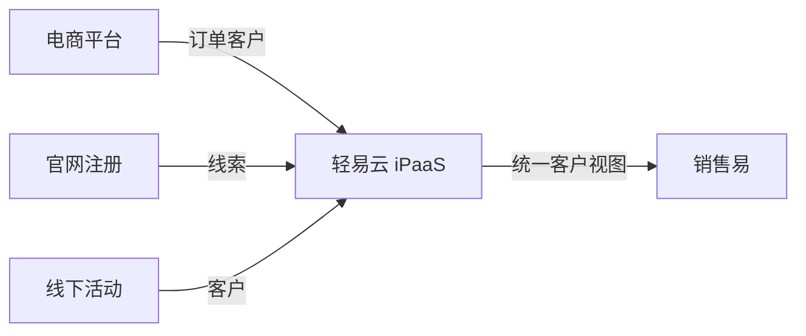

# 销售易连接器

本文档介绍轻易云 iPaaS 与销售易 CRM 平台的集成配置方法。

## 平台简介

销售易是国产企业级 CRM 平台，基于 PaaS 架构构建，提供销售自动化、客户服务、营销自动化等功能。轻易云 iPaaS 提供销售易连接器，支持与各类企业应用的数据集成。

## 连接配置

### 前置条件

- 销售易企业版账号
- 开通 API 接口权限
- 获取 Client ID 和 Client Secret

### 配置步骤

1. 登录销售易管理后台
2. 进入 **系统设置 → 集成管理 → API 配置**
3. 创建应用并获取认证信息
4. 在轻易云控制台创建连接器

## 集成方案配置

### 认证方式

销售易采用 OAuth 2.0 认证机制。

### 常用接口

| 接口 | 说明 |
|------|------|
| 查询对象 | 查询客户、商机、订单等 |
| 创建记录 | 新增数据记录 |
| 更新记录 | 修改数据记录 |
| 删除记录 | 删除数据记录 |

## 典型集成场景

### 全渠道客户数据整合

## 参考文档

- [销售易开放平台](https://www.xiaoshouyi.com/)
