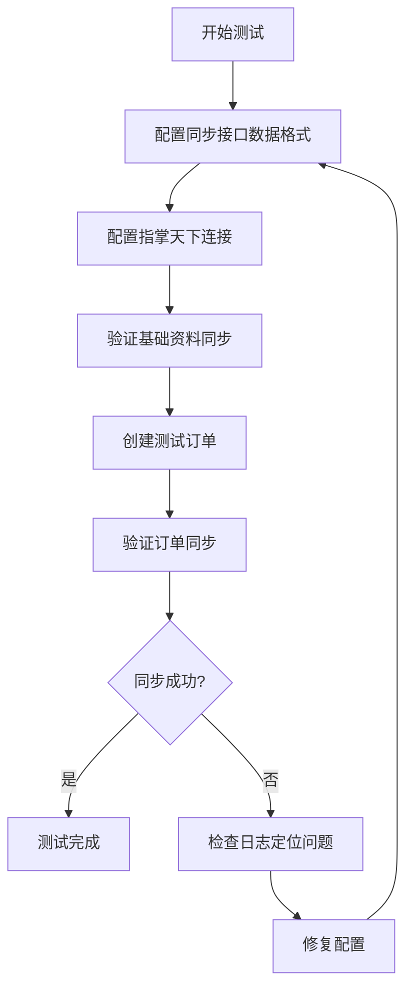
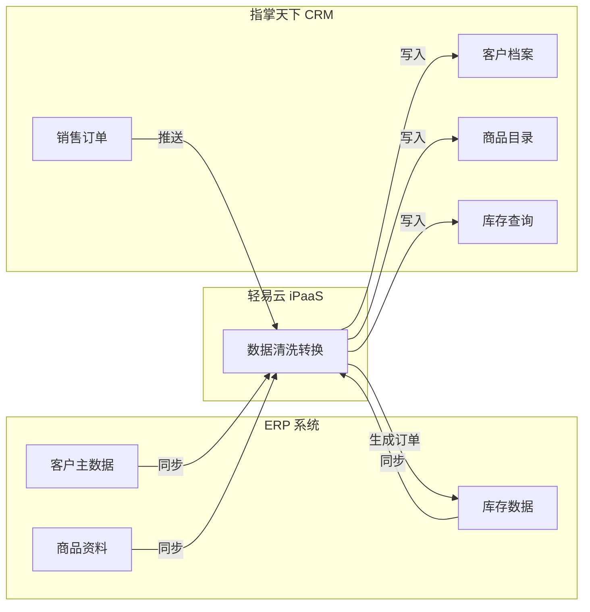
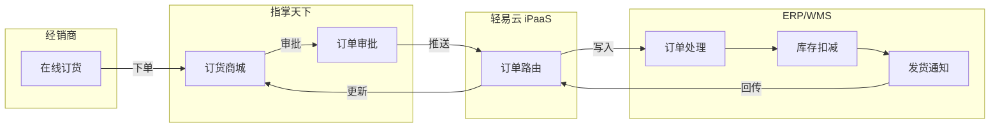

# 指掌天下连接器

本文档介绍轻易云 iPaaS 与指掌天下 CRM 平台的集成配置方法，涵盖平台简介、连接配置、数据同步设置以及典型集成场景。

## 平台简介

指掌天下是一款基于企业微信生态的 CRM + 进销存一体化 SaaS 平台，专注于渠道管理和订货平台建设。平台提供客户管理、进销存管理、在线订货、外勤管理等功能，支持企业通过社交化方式连接上下游，实现业务增长。

### 核心能力

| 功能模块 | 说明 |
|----------|------|
| 客户管理 | 客户档案、线索跟进、联系人管理、客户分级 |
| 进销存管理 | 采购入库、销售出库、库存盘点、库存预警 |
| 在线订货 | B2B 订货商城、价格体系、订单审批、在线支付 |
| 外勤管理 | 拜访计划、轨迹追踪、签到打卡、工作报告 |
| 渠道管理 | 经销商管理、渠道政策、返利计算、促销管理 |
| 数据分析 | 销售报表、库存报表、客户分析、经营看板 |

## 集成架构

```mermaid
flowchart TB
    subgraph 指掌天下 CRM
        A[客户数据]
        B[商品资料]
        C[仓库信息]
        D[销售订单]
    end

    subgraph Python 中间件
        E[数据接收服务<br/>http://xxxxx:5000]
    end

    subgraph 轻易云 iPaaS
        F[数据集成引擎]
        G[数据映射转换]
        H[方案调度执行]
    end

    subgraph 第三方 ERP
        I[ERP 系统]
    end

    A -->|推送| E
    B -->|推送| E
    C -->|推送| E
    D -->|推送| E
    E --> F
    F --> G
    G --> H
    H -->|写入| I
    I -.->|基础资料回写| E
    E -.->|更新| A
    E -.->|更新| B
    E -.->|更新| C

    style 指掌天下 CRM fill:#e3f2fd
    style Python 中间件 fill:#fff3e0
    style 轻易云 iPaaS fill:#e8f5e9
    style 第三方 ERP fill:#f3e5f5
```

## 连接配置

### 前置条件

- 指掌天下企业版账号
- 管理员权限访问 CRM 后台
- Python 中间件服务已部署（由轻易云提供）
- 中间件服务器公网可访问地址

### 配置步骤

#### 步骤 1：登录指掌天下 CRM 后台

访问管理后台地址：

```text
https://pre-hdsaas.facehand.cn/pmweb/erp/set
```

#### 步骤 2：配置第三方 ERP 连接

1. 进入 **第三方 ERP 设置 → 连接配置**
2. 输入 Python 中间件服务地址：
   ```text
   http://xxxxx:5000
   ```
   > 将 `xxxxx` 替换为实际的中间件服务器 IP 或域名

> [!TIP]
> 中间件服务由轻易云技术团队部署，请联系技术支持获取服务地址。

#### 步骤 3：配置基础资料同步

进入 **第三方 ERP 设置 → 同步基础资料**：

| 同步项 | 配置建议 | 说明 |
|--------|----------|------|
| 客户同步 | ✅ 开启 | 客户资料从集成平台同步至指掌天下 |
| 商品同步 | ✅ 开启 | 商品资料从集成平台同步至指掌天下 |
| 仓库同步 | ✅ 开启 | 仓库信息从集成平台同步至指掌天下 |
| 同步到第三方 ERP | ✅ 开启 | 指掌天下新增客户同步至集成平台 |

> [!IMPORTANT]
> 开启「同步到第三方 ERP」选项后，指掌天下 CRM 中新增的客户将自动同步至集成平台，实现双向数据流通。

#### 步骤 4：单据同步设置

进入 **第三方 ERP 设置 → 单据同步设置**：

- 开启「销售订单同步到第三方 ERP」
- 根据业务需求配置同步条件（可选）
- 设置订单状态筛选条件

## 轻易云集成方案配置

### 方案配置要点

在轻易云 iPaaS 控制台配置集成方案时，需注意以下事项：

1. **数据格式对齐**
   - 确保集成方案的数据格式与指掌天下接口标准一致
   - 使用方案返写功能配置指掌天下对应的数据格式映射

2. **数据状态处理**
   - 中间件方案默认只读取「已完成」状态的数据
   - 数据查询完成后，状态会标记为「不处理」
   - 已标记的数据不会再次同步，避免重复处理

> [!WARNING]
> 请确保集成方案中推送的数据状态为「已完成」，否则指掌天下将无法正常接收。

### 接口方案 ID 对照表

| 接口名称 | 方案 ID | 功能说明 |
|----------|---------|----------|
| PushProduct | `dbd51700-07f3-3a9b-bd86-07cc4bce7522` | 推送商品资料 |
| PushProductPrice | `6db24d65-f498-379a-9e3e-564cb278fbb3` | 推送商品价格 |
| PushCustomer | `c76b7c3e-1215-3ce6-8f87-a50db3c71bf9` | 推送客户资料（手工同步） |
| CustomerSynchro | `cb97fc48-ce37-3fd7-8e23-70e844104984` | 客户资料同步 |
| PushWarehouse | `28e60987-53e8-368a-97f6-6cde262da009` | 推送仓库信息 |
| SynchroSaleOrderList | `091e3ed3-00e0-379f-8b81-95f3a67da7b8` | 同步销售订单 |

## 测试验证步骤

### 测试前准备

1. 确认集成方案数据格式已配置完成
2. 确认指掌天下连接配置已保存
3. 确保中间件服务正常运行

### 测试流程



#### 步骤 1：配置数据格式

在轻易云控制台：
1. 进入对应集成方案
2. 配置源平台数据查询节点
3. 配置目标平台数据写入节点
4. 确保数据格式与指掌天下接口标准一致
5. 设置数据状态为「已完成」

#### 步骤 2：验证基础资料同步

在指掌天下 CRM 后台检查：

| 检查项 | 检查路径 | 预期结果 |
|--------|----------|----------|
| 客户资料 | 客户管理 → 客户列表 | 显示同步的客户数据 |
| 商品资料 | 进销存 → 商品管理 | 显示同步的商品数据 |
| 仓库信息 | 进销存 → 仓库管理 | 显示同步的仓库数据 |

#### 步骤 3：创建测试订单

1. 使用同步过来的客户、商品、仓库数据
2. 在指掌天下创建销售订单
3. 保存单据，提交审批（如配置）
4. 检查订单状态是否为「已完成」

#### 步骤 4：验证订单同步

1. 登录轻易云 iPaaS 控制台
2. 进入对应集成方案的执行日志
3. 查看订单数据是否被正确接收
4. 检查目标 ERP 系统是否生成对应单据

## 中间件运维指南

### 服务目录

```text
/www/wwwroot/GrpcService
```

### 启动方式

#### 前台启动（调试使用）

```bash
cd /www/wwwroot/GrpcService
python main.py
```

> [!CAUTION]
> 前台启动模式下，退出终端后程序将终止，仅建议调试时使用。

#### 后台启动（生产环境）

```bash
cd /www/wwwroot/GrpcService
nohup python main.py &
```

### 服务状态检查

```bash
# 查看进程是否存在
ps aux | grep main.py

# 查看端口监听状态
netstat -tlnp | grep 5000

# 查看运行日志
tail -f /www/wwwroot/GrpcService/nohup.out
```

### 常见问题排查

| 问题现象 | 可能原因 | 解决方案 |
|----------|----------|----------|
| 指掌天下无法连接中间件 | 网络不通或防火墙限制 | 检查服务器安全组/防火墙 5000 端口是否开放 |
| 数据同步延迟 | 中间件服务异常 | 检查进程状态，必要时重启服务 |
| 订单未同步到 ERP | 数据状态非「已完成」 | 检查集成方案中数据状态设置 |
| 基础资料未同步 | 同步开关未开启 | 检查指掌天下后台同步配置 |
| 客户数据重复 | 唯一标识映射错误 | 检查客户编码映射配置 |

## 典型集成场景

### 场景一：ERP 与 CRM 数据互通



**业务价值**：
- ERP 基础资料自动同步至 CRM，避免重复录入
- CRM 订单实时推送至 ERP，提升订单处理效率
- 库存数据实时共享，支持销售决策

### 场景二：渠道订货平台集成



**业务价值**：
- 经销商 24 小时在线订货
- 订单自动流转至 ERP/WMS 系统
- 发货状态实时回传，提升客户体验

## 数据映射参考

### 客户资料字段映射

| 指掌天下字段 | 类型 | 说明 | 映射建议 |
|--------------|------|------|----------|
| CustomerCode | string | 客户编码 | 作为主键，与 ERP 客户编码映射 |
| CustomerName | string | 客户名称 | 直接映射 |
| ContactPhone | string | 联系电话 | 直接映射 |
| Address | string | 地址 | 直接映射 |
| Salesman | string | 业务员 | 映射为 ERP 业务员编码 |
| PriceLevel | string | 价格等级 | 需值转换映射 |

### 商品资料字段映射

| 指掌天下字段 | 类型 | 说明 | 映射建议 |
|--------------|------|------|----------|
| ProductCode | string | 商品编码 | 作为主键，与 ERP 商品编码映射 |
| ProductName | string | 商品名称 | 直接映射 |
| Specification | string | 规格型号 | 直接映射 |
| Unit | string | 计量单位 | 直接映射 |
| SalePrice | decimal | 销售价 | 数值映射 |
| InventoryQty | decimal | 库存数量 | 数值映射 |

### 销售订单字段映射

| 指掌天下字段 | 类型 | 说明 | 映射建议 |
|--------------|------|------|----------|
| OrderNo | string | 订单编号 | 作为主键 |
| OrderDate | datetime | 订单日期 | 日期格式转换 |
| CustomerCode | string | 客户编码 | 关联客户主数据 |
| WarehouseCode | string | 仓库编码 | 关联仓库主数据 |
| TotalAmount | decimal | 订单金额 | 数值映射 |
| OrderStatus | int | 订单状态 | 值转换（1=待审核，2=已审核，3=已完成）|
| Details | array | 订单明细 | 子表映射 |

## 参考文档

- [连接器配置指南](../../guide/configure-connector)
- [数据映射配置](../../guide/data-mapping)
- [值格式化指南](../../guide/value-formatting)
- [轻易云 iPaaS 快速入门](../../quick-start/first-integration)

> [!NOTE]
> 如需技术支持或定制开发，请联系轻易云客服团队。
