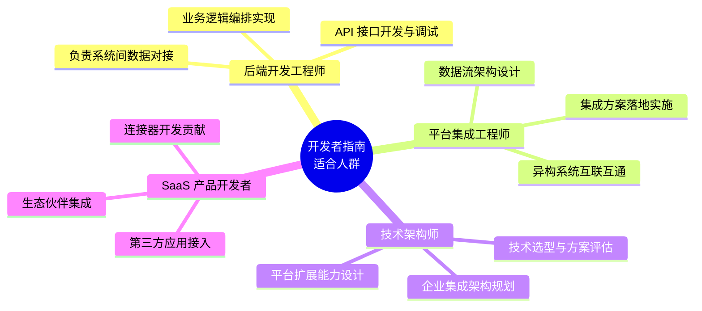
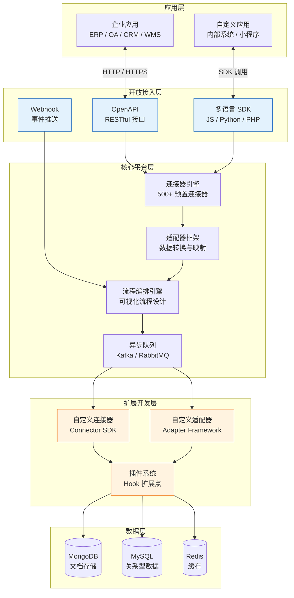

# 开发者指南

本章面向开发者和技术架构师，系统介绍轻易云 iPaaS 平台的开放能力与扩展机制。通过阅读本章，你将掌握如何通过 OpenAPI 与平台进行深度集成，开发自定义连接器扩展平台能力，以及利用 SDK 和 Webhook 构建企业级数据集成解决方案。

> [!IMPORTANT]
> 开发者文档涉及 API 密钥、认证凭证等敏感内容，需要登录后查看完整文档。未登录用户可预览前 25 行内容。

## 适合人群

本章内容主要面向以下技术角色：



| 角色 | 核心关注点 | 推荐阅读章节 |
| ---- | ---------- | ------------ |
| 后端开发工程师 | API 调用、SDK 集成、调试排错 | [认证授权](./authentication)、[SDK 使用](./sdk)、[调试与测试](./debugging-testing) |
| 平台集成工程师 | 连接器开发、数据映射、异常处理 | [自定义连接器开发](./custom-connector)、[适配器开发](./adapter-development) |
| 技术架构师 | 架构设计、安全策略、性能优化 | [开放接口概览](./api-overview)、[插件机制](./plugin-system) |
| SaaS 产品开发者 | 开放生态、标准化接入 | [Webhook 配置](./webhook)、[自定义连接器开发](./custom-connector) |

## 前置知识

在阅读本章前，建议具备以下技术基础：

### 必备技能

- **REST API 基础**：熟悉 HTTP 协议、请求方法（GET/POST/PUT/DELETE）、状态码含义
- **JSON 数据格式**：掌握 JSON 结构定义、序列化与反序列化操作
- **认证授权机制**：了解 API Key、OAuth 2.0、JWT Token 等常见认证方式

### 推荐技能

- **JavaScript / TypeScript**：用于前端集成和 Node.js 后端开发
- **Python**：用于数据处理和自动化脚本编写
- **PHP**：平台适配器开发的主要语言
- **SQL 基础**：用于理解数据查询和存储逻辑

> [!TIP]
> 如果你是初次接触 iPaaS 平台，建议先阅读[快速开始](../quick-start)和[使用指南](../guide)章节，了解平台的基本概念和操作方法后再进入开发者章节。

## 整体架构

轻易云 iPaaS 平台采用分层架构设计，为开发者提供多层次的扩展能力：



### 扩展点说明

| 扩展能力 | 适用场景 | 技术复杂度 | 开发周期 |
| -------- | -------- | ---------- | -------- |
| **OpenAPI 调用** | 外部系统与平台数据交互 | ⭐⭐ 低 | 1~3 天 |
| **Webhook 接收** | 实时接收平台事件通知 | ⭐⭐ 低 | 1~2 天 |
| **SDK 集成** | 嵌入式集成、前端应用 | ⭐⭐⭐ 中 | 3~7 天 |
| **自定义连接器** | 接入新的应用系统 | ⭐⭐⭐⭐ 中高 | 1~2 周 |
| **自定义适配器** | 特殊数据格式转换 | ⭐⭐⭐⭐ 中高 | 1~2 周 |
| **插件开发** | 扩展平台核心能力 | ⭐⭐⭐⭐⭐ 高 | 2~4 周 |

## 章节导航

本章包含以下核心内容，建议按照学习路径循序渐进：

### 入门必读

1. **[开发指南](./guide)** — 开发者快速入门，包含环境准备、第一个 API 调用、常见问题排查
2. **[开放接口概览](./api-overview)** — API 体系架构、能力边界、版本策略、限流规则

### 认证与安全

3. **[认证授权](./authentication)** — API Key 管理、OAuth 2.0 流程、Token 刷新机制、IP 白名单

### 事件驱动

4. **[Webhook 配置](./webhook)** — 事件订阅、签名验证、重试机制、最佳实践

### 工具与 SDK

5. **[SDK 使用](./sdk)** — JavaScript、Python、PHP SDK 安装与使用，代码示例

### 扩展开发

6. **[自定义连接器开发](./custom-connector)** — Connector SDK 使用、生命周期管理、调试发布
7. **[适配器开发](./adapter-development)** — Adapter Framework、数据转换、错误处理
8. **[插件机制](./plugin-system)** — Hook 扩展点、插件生命周期、市场发布

### 调试与优化

9. **[调试与测试](./debugging-testing)** — 本地调试环境、单元测试、日志分析、性能调优

## 快速开始

### 第一步：获取应用授权

访问控制台 **API 网关 > 应用授权**，创建新的应用以获取 `app_key` 和 `app_secret`。

### 第二步：获取访问令牌

```bash
curl -X POST "https://api.qeasy.cloud/v2/oauth" \
  -H "Content-Type: application/json" \
  -d '{
    "app_key": "your_app_key",
    "app_secret": "your_app_secret"
  }'
```

### 第三步：调用业务接口

```bash
curl -X POST "https://api.qeasy.cloud/v2/open-api/business/{scheme_id}/store?access_token=xxx" \
  -H "Content-Type: application/json" \
  -d '{
    "content": [{"field": "value"}]
  }'
```

> [!NOTE]
> 完整的 API 文档和示例代码请参考 [开放接口概览](./api-overview) 和 [API 参考](../api-reference) 章节。

## 开发者支持

| 支持渠道 | 说明 | 响应时间 |
| -------- | ---- | -------- |
| **开发者文档** | 本章及关联章节 | 即时 |
| **技术社区** | [BBS 论坛](https://bbs.qeasy.cloud) | 24 小时内 |
| **工单系统** | 控制台提交技术工单 | 4 工作小时内 |
| **企业微信** | 专属客户群（企业版） | 2 工作小时内 |

## 相关资源

- **[API 参考](../api-reference)** — 完整的接口列表和参数说明
- **[常见问题](../faq)** — 开发者常见问题解答
- **[更新日志](../changelog)** — 平台功能更新和变更记录
- **[标准集成方案](../standard-schemes)** — 典型场景集成方案参考

---

> [!TIP]
> 建议收藏本文档，在开发过程中随时查阅。如有任何疑问，欢迎通过上述支持渠道与我们取得联系。
