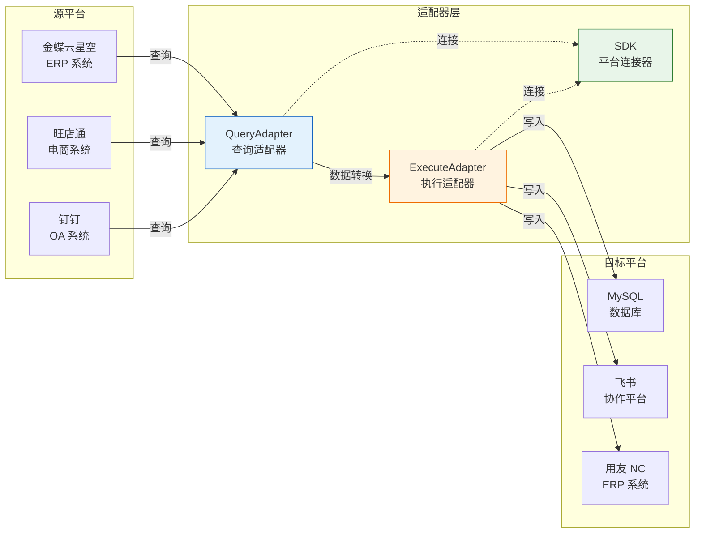
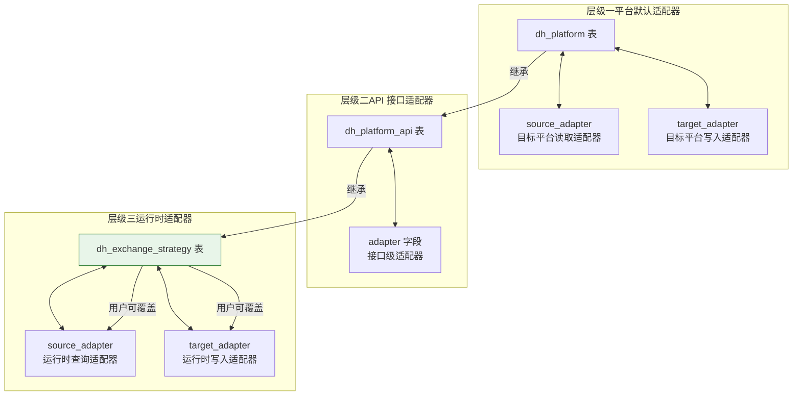
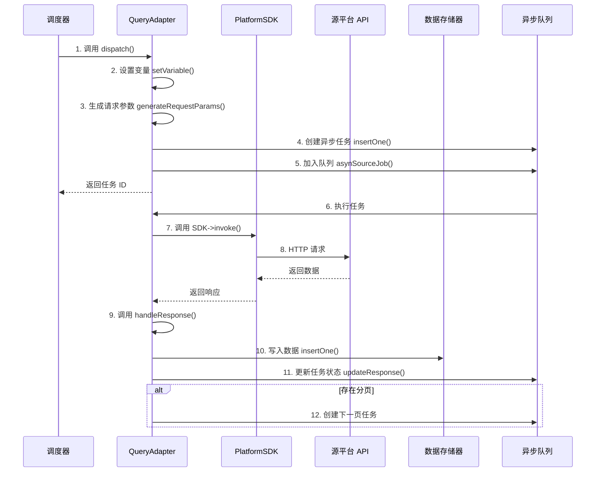
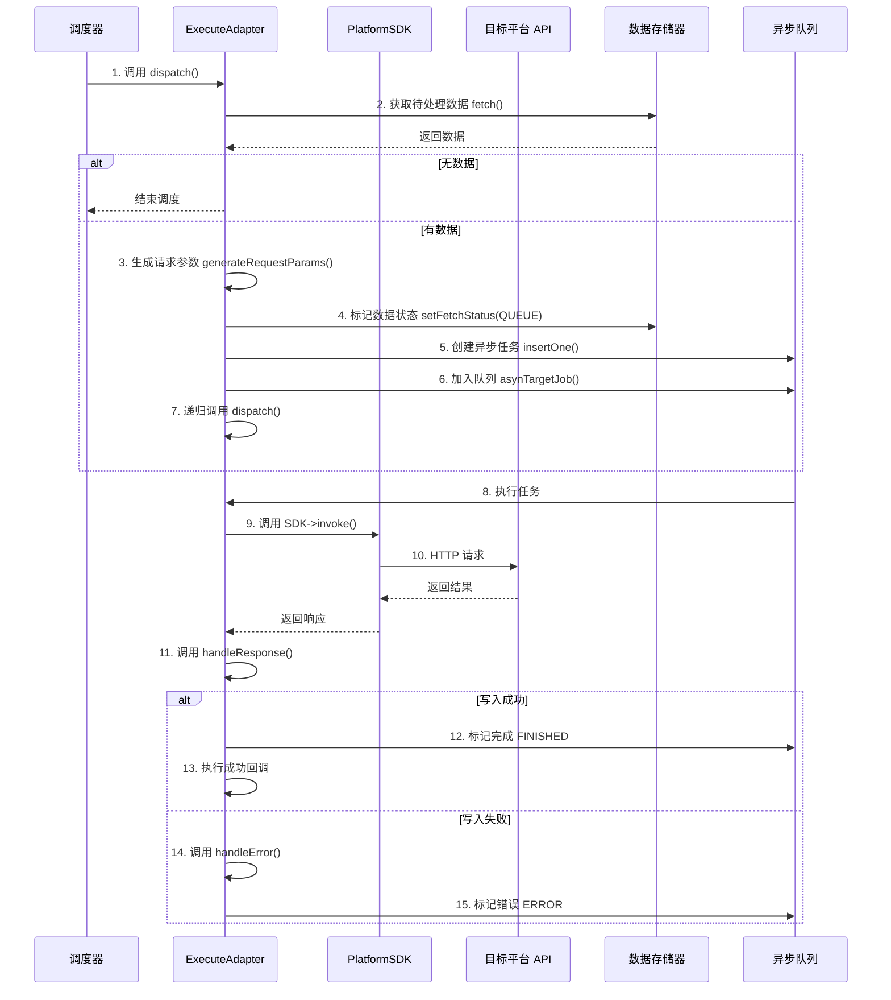
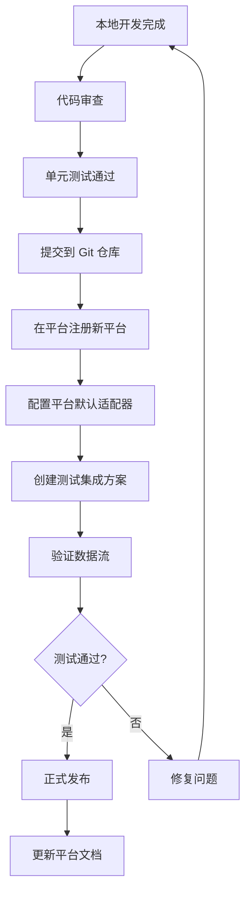

# 适配器开发指南

本文档面向需要在轻易云 iPaaS 平台上开发自定义适配器的开发者。通过阅读本文，你将了解适配器的基本概念、目录结构、生命周期钩子、请求/响应处理、鉴权实现以及测试发布流程。适配器是连接异构系统的桥梁，负责处理数据的查询、转换和写入操作。

> [!IMPORTANT]
> 本文档基于适配器开发 V3 版本编写。V1/V2 版本的差异已在相应章节中以 [!NOTE] 形式标注。建议新开发项目直接使用 V3 版本规范。

## 适配器概述

### 什么是适配器

适配器模式（Adapter Pattern）是作为两个不兼容的接口之间的桥梁，属于结构型设计模式。在轻易云 iPaaS 平台中，适配器负责协调源平台（数据提供方）与目标平台（数据接收方）之间的数据格式差异、协议差异和业务流程差异。



### 适配器类型

| 适配器类型 | 类名后缀 | 用途 | 方向 |
| ---------- | -------- | ---- | ---- |
| **查询适配器** | `QueryAdapter` | 从源平台读取数据 | `source` |
| **执行适配器** | `ExecuteAdapter` | 向目标平台写入数据 | `target` |
| **SDK** | `SDK` | 与具体平台建立连接、调用 API | — |

### 适配器的定义位置

适配器可以在以下三个层级进行定义，优先级从低到高：



1. **平台级适配器**：在 `dh_platform` 表中定义，作为平台的默认适配器
2. **API 级适配器**：在 `dh_platform_api` 表中定义，针对特定接口使用特殊适配器
3. **运行时适配器**：在 `dh_exchange_strategy` 表中定义，用户可在集成方案中自定义

## 目录结构与命名规范

### 目录结构

适配器代码统一存放在 `./adapter` 目录下，使用 PSR-4 自动加载规范，命名空间为 `Adapter`。

```text
adapter/
└── PlatformName/                          # 平台名称（大驼峰命名）
    ├── SDK/
    │   └── PlatformNameSDK.php            # 平台 SDK 类
    ├── Throwable/
    │   └── PlatformNameThrowable.php      # 异常处理类
    ├── PlatformNameQueryAdapter.php       # 查询适配器
    └── PlatformNameExecuteAdapter.php     # 执行适配器
```

### 命名规范

| 元素 | 命名规范 | 示例 |
| ---- | -------- | ---- |
| 目录名 | 大驼峰（PascalCase） | `KingdeeCloud/`、`WangDianTong/` |
| SDK 类名 | `{PlatformName}SDK` | `KingdeeCloudSDK`、`FeiShuSDK` |
| 查询适配器 | `{PlatformName}QueryAdapter` | `KingdeeCloudQueryAdapter` |
| 执行适配器 | `{PlatformName}ExecuteAdapter` | `KingdeeCloudExecuteAdapter` |
| 命名空间 | `Adapter\{PlatformName}` | `Adapter\KingdeeCloud` |

> [!NOTE]
> **V1 版本差异**：V1 版本适配器存放在 `Adapter` 目录（首字母大写），且部分旧适配器使用下划线命名（如 `YxcSDK.php`）。V2/V3 统一改为小写的 `./adapter` 目录。

## SDK 开发

SDK 是与具体软件平台建立连接、发起 API 调用的核心类。所有适配器通过 SDK 与目标平台交互。

### SDK 基础结构

```php
<?php

namespace Adapter\Example\SDK;

use Illuminate\Support\Facades\Cache;

class ExampleSDK
{
    /**
     * 连接器 ID
     */
    protected string $connectorId = '';

    /**
     * 环境标识（dev/test/prod）
     */
    protected string $env = '';

    /**
     * 平台域名或主机地址
     */
    protected string $host = '';

    /**
     * 登录认证参数
     */
    protected array $login = [
        'appKey' => '',
        'appSecret' => '',
    ];

    /**
     * 访问令牌
     */
    protected ?string $token = null;

    /**
     * HTTP 客户端
     */
    protected \GuzzleHttp\Client $client;

    /**
     * 构造方法
     *
     * @param string $connectorId 连接器 ID
     * @param array $params 连接参数（包含 host、appKey、appSecret 等）
     * @param string $env 环境标识
     */
    public function __construct(string $connectorId, array $params, string $env = '')
    {
        $this->connectorId = $connectorId;
        $this->host = rtrim($params['host'], '/');
        $this->login = $params;
        $this->env = $env;
        $this->client = new \GuzzleHttp\Client([
            'timeout' => 30,
            'connect_timeout' => 10,
        ]);
    }

    /**
     * 建立连接，获取访问令牌
     * 针对需要 Token 鉴权的平台，在此方法中实现 Token 获取和缓存
     *
     * @return array 连接结果
     */
    public function connection(): array
    {
        // Token 缓存 Key：连接器 ID + 环境标识
        $cacheKey = $this->connectorId . $this->env;

        // 尝试从缓存获取 Token
        $cachedToken = Cache::get($cacheKey);
        if ($cachedToken) {
            $this->token = $cachedToken;
            return ['status' => true, 'token' => $cachedToken];
        }

        // 调用平台接口获取 Token（示例为飞书接口）
        $url = $this->host . '/open-apis/auth/v3/tenant_access_token/internal';
        $response = $this->client->post($url, [
            'json' => $this->login,
            'headers' => ['Content-Type' => 'application/json'],
        ]);

        $result = json_decode((string) $response->getBody(), true);

        if (isset($result['code']) && $result['code'] === 0) {
            $this->token = $result['tenant_access_token'];
            $expire = ($result['expire'] ?? 7200) - 100; // 提前 100 秒过期

            // 缓存 Token
            Cache::put($cacheKey, $this->token, $expire);

            return ['status' => true, 'token' => $this->token];
        }

        return ['status' => false, 'error' => $result];
    }

    /**
     * 调用平台 API
     *
     * @param string $api API 路径（如 "/open-apis/im/v1/messages"）
     * @param array $params 请求参数
     * @param string $method HTTP 方法（GET/POST/PUT/DELETE）
     * @return array 响应结果
     */
    public function invoke(string $api, array $params = [], string $method = 'POST'): array
    {
        $url = $this->host . $api;

        // 准备请求头
        $headers = [
            'Content-Type' => 'application/json',
        ];

        if ($this->token) {
            $headers['Authorization'] = 'Bearer ' . $this->token;
        }

        // 发起 HTTP 请求
        $options = [
            'headers' => $headers,
            'http_errors' => false, // 不抛出 HTTP 错误异常
        ];

        if (strtoupper($method) === 'GET') {
            $options['query'] = $params;
            $response = $this->client->get($url, $options);
        } else {
            $options['json'] = $params;
            $response = $this->client->request($method, $url, $options);
        }

        $body = (string) $response->getBody();
        return json_decode($body, true) ?? ['raw_body' => $body];
    }
}
```

> [!TIP]
> 如果目标平台不需要 Token 鉴权（如简单的 REST API），`connection()` 方法可以直接返回 `['status' => true]` 或空数组。

### 鉴权实现示例

不同平台的鉴权方式各异，以下是几种常见鉴权模式的实现示例：

#### 1. API Key + Secret 签名鉴权

```php
public function invoke(string $api, array $params = [], string $method = 'POST'): array
{
    $url = $this->host . $api;

    // 生成时间戳和随机数
    $timestamp = time();
    $nonce = uniqid();

    // 构建签名（示例：MD5(appKey + timestamp + nonce + appSecret)）
    $sign = md5($this->login['appKey'] . $timestamp . $nonce . $this->login['appSecret']);

    $headers = [
        'X-App-Key' => $this->login['appKey'],
        'X-Timestamp' => $timestamp,
        'X-Nonce' => $nonce,
        'X-Sign' => $sign,
        'Content-Type' => 'application/json',
    ];

    $response = $this->client->post($url, [
        'headers' => $headers,
        'json' => $params,
        'http_errors' => false,
    ]);

    return json_decode((string) $response->getBody(), true);
}
```

#### 2. OAuth 2.0 鉴权

```php
public function connection(): array
{
    $cacheKey = 'oauth_token_' . $this->connectorId . $this->env;

    // 检查缓存
    if ($token = Cache::get($cacheKey)) {
        $this->token = $token;
        return ['status' => true, 'token' => $token];
    }

    // 请求 OAuth Token
    $url = $this->host . '/oauth/token';
    $response = $this->client->post($url, [
        'form_params' => [
            'grant_type' => 'client_credentials',
            'client_id' => $this->login['clientId'],
            'client_secret' => $this->login['clientSecret'],
        ],
    ]);

    $result = json_decode((string) $response->getBody(), true);

    if (isset($result['access_token'])) {
        $this->token = $result['access_token'];
        $expiresIn = $result['expires_in'] ?? 3600;

        Cache::put($cacheKey, $this->token, $expiresIn - 60);

        return ['status' => true, 'token' => $this->token];
    }

    return ['status' => false, 'error' => $result];
}
```

## 查询适配器开发

查询适配器（Query Adapter）负责从源平台读取数据，并将数据写入平台的临时存储中，供后续转换和写入使用。

### 查询适配器结构

```php
<?php

namespace Adapter\Example;

use Domain\Datahub\Instance\Adapter\Adapter;
use Domain\Datahub\Instance\LogMessage;
use Domain\Datahub\Instance\Storage\DataStatus;
use Domain\Datahub\Instance\Storage\LogStatus;
use Adapter\Example\SDK\ExampleSDK;

class ExampleQueryAdapter extends Adapter
{
    /**
     * 适配器方向：source 表示源平台查询
     */
    const DIRECTION = 'source';

    /**
     * SDK 实例
     */
    protected ?ExampleSDK $SDK = null;

    /**
     * 自定义变量
     */
    protected array $variables = [];

    /**
     * 调度方法：发起数据查询请求
     * 此方法由平台调度器调用，负责生成请求参数并创建异步任务
     *
     * @return array 调度结果
     */
    public function dispatch(): array
    {
        // 设置分页起始页码（V3 版本推荐使用 setVariable）
        $this->setVariable('PAGINATION_START_PAGE', 1);

        // 记录调度开始日志
        $this->getLogStorage()->insertOne(
            ['text' => LogMessage::DISPATCH_SOURCE_BEGIN],
            LogStatus::RECORD
        );

        // 根据元数据配置生成请求参数
        $request = $this->generateRequestParams();

        // 向异步请求队列存储器写入任务，获取任务 ID
        $jobId = $this->getAsynSourceJobStorage()->insertOne(
            $this->metaData['api'],
            $request
        );

        // 将任务加入异步队列，延迟 0 秒执行
        $this->asynSourceJob(0, $jobId);

        // 记录调度完成日志
        $this->getLogStorage()->insertOne(
            ['text' => sprintf(LogMessage::DISPATCH_SOURCE_FINISH, 1)],
            LogStatus::SUCCESS
        );

        return ['status' => true, 'content' => $jobId];
    }

    /**
     * 处理响应方法：处理平台返回的数据
     * 此方法在异步任务执行完成后被调用
     *
     * @param array $response API 响应数据
     * @param string|null $jobId 任务 ID
     * @return bool 处理结果
     */
    public function handleResponse(array $response, $jobId = null): bool
    {
        // 记录原始响应日志
        $this->getLogStorage()->insertOne([
            'text' => '源平台原始响应数据',
            'response' => $response,
        ], LogStatus::RECORD);

        // 判断响应状态，如果失败则交由 handleError 处理
        if (!$this->isSuccessResponse($response)) {
            return $this->handleError($response, $jobId);
        }

        // 获取数据列表键名（可在元数据中配置，默认为 'rows'）
        $listKey = $this->metaData['otherResponse'][0]['value'] ?? 'rows';
        $dataList = $response['data'][$listKey] ?? [];

        // 遍历数据并写入数据存储器
        foreach ($dataList as $item) {
            // 提取数据主键 ID
            $id = $this->getDataKeyValue($item, $this->metaData['id']);

            // 提取数据编码（Number）
            $number = $this->getDataKeyValue($item, $this->metaData['number']);

            // 写入数据存储器
            $this->getDataStorage()->insertOne(
                $id,
                $number,
                $item,
                $this->metaData['idCheck'] ?? true,
                $jobId
            );
        }

        // 标记任务完成
        $this->getAsynSourceJobStorage()->updateResponse(
            $jobId,
            DataStatus::FINISHED,
            $response,
            0,
            $this->active
        );

        // 检查是否需要继续分页查询
        $this->handlePagination($response);

        return true;
    }

    /**
     * 连接 SDK
     * 初始化并连接目标平台的 SDK
     *
     * @return array 连接结果
     */
    public function connect(): array
    {
        // 避免重复实例化
        if ($this->SDK !== null) {
            return ['status' => true];
        }

        // 获取连接器信息
        $connector = \Domain\Datahub\Connector\ConnectorRepository::findOne(
            $this->strategy[$this->direction]->connector_id
        );

        // 获取环境参数字段名
        $envField = 'env_' . $connector->env . '_params';

        // 实例化 SDK
        $this->SDK = new ExampleSDK(
            $this->strategy[$this->direction]->connector_id,
            $connector->$envField,
            $connector->env
        );

        // 执行连接（获取 Token 等）
        return $this->SDK->connection();
    }

    /**
     * 处理错误响应
     *
     * @param array $response 错误响应数据
     * @param string|null $jobId 任务 ID
     * @return bool 处理结果
     */
    protected function handleError(array $response, $jobId = null): bool
    {
        // 标记任务为错误状态
        $this->getAsynSourceJobStorage()->updateResponse(
            $jobId,
            DataStatus::ERROR,
            $response
        );

        // 记录错误日志
        $this->getLogStorage()->insertOne([
            'text' => LogMessage::INVOKE_FAIL,
            'response' => $response,
        ], LogStatus::ERROR);

        // 重新排队（如有必要）
        $this->reQueue();

        return false;
    }

    /**
     * 判断响应是否成功
     *
     * @param array $response 响应数据
     * @return bool 是否成功
     */
    protected function isSuccessResponse(array $response): bool
    {
        // 根据实际平台接口规范判断
        return isset($response['code']) && $response['code'] == 200;
    }

    /**
     * 处理分页逻辑
     *
     * @param array $response 响应数据
     */
    protected function handlePagination(array $response): void
    {
        $listKey = $this->metaData['otherResponse'][0]['value'] ?? 'rows';
        $page = $response['data']['page'] ?? 1;
        $size = $response['data']['size'] ?? 20;
        $total = $response['data']['total'] ?? 0;

        // 判断是否还有更多数据
        if ($page * $size < $total) {
            // 页码加 1
            $this->invokeRequest['page'] = $page + 1;

            // 创建下一页查询任务
            $nextJobId = $this->getAsynSourceJobStorage()->insertOne(
                $this->metaData['api'],
                $this->invokeRequest
            );

            // 延迟 5 秒后执行（避免请求过快）
            $this->asynSourceJob(5, $nextJobId);
        }
    }
}
```

> [!NOTE]
> **V2 版本差异**：V2 版本使用 `$this->_setVariable()`（带下划线）方法设置变量，V3 统一改为 `$this->setVariable()`（不带下划线）。V1 版本部分适配器直接操作 `$this->request` 数组。

### 查询适配器生命周期



## 执行适配器开发

执行适配器（Execute Adapter）负责将转换后的数据写入目标平台。

### 执行适配器结构

```php
<?php

namespace Adapter\Example;

use Domain\Datahub\Instance\Adapter\Adapter;
use Domain\Datahub\Instance\LogMessage;
use Domain\Datahub\Instance\Storage\DataStatus;
use Domain\Datahub\Instance\Storage\LogStatus;
use Adapter\Example\SDK\ExampleSDK;
use Adapter\Example\Throwable\ExampleThrowable;

class ExampleExecuteAdapter extends Adapter
{
    /**
     * 适配器方向：target 表示目标平台写入
     */
    const DIRECTION = 'target';

    /**
     * SDK 实例
     */
    protected ?ExampleSDK $SDK = null;

    /**
     * 调度计数器（防止无限递归）
     */
    private int $times = 0;

    /**
     * 任务 ID 列表
     */
    protected array $jobs = [];

    /**
     * 异步延迟时间（秒）
     */
    protected float $asynTimes = 0;

    /**
     * 调度方法：从数据存储器获取数据并写入目标平台
     *
     * @return bool 调度结果
     */
    public function dispatch(): bool
    {
        // 增加调度计数
        $this->times++;

        // 防止无限递归：超过 30 次则延迟 10 秒后重新调度
        if ($this->times >= 30) {
            $this->asynTargetJobDispatch(10);
            return false;
        }

        // 初始化变量
        $this->_setVariable();

        // 从数据存储器获取待处理数据
        $operation = $this->metaData['operation'] ?? null;
        $data = $this->getDataStorage()->fetch($operation);

        // 如果没有数据，结束调度
        if (empty($data)) {
            return $this->_returnDispatch();
        }

        // 生成请求参数（将平台数据转换为目标平台格式）
        $request = $this->generateRequestParams($data);
        $request = $this->removeNull($request);

        // 检查请求参数是否有效
        if (empty($request)) {
            $this->getLogStorage()->insertOne([
                'text' => LogMessage::DISPATCH_TARGET_REQUEST_ERROR,
                'request' => $request,
            ], LogStatus::ERROR);

            $this->getDataStorage()->setFetchStatus(
                DataStatus::ERROR,
                null,
                ['request' => $request]
            );

            // 递归处理下一条数据
            $this->dispatch();
            return false;
        }

        // 标记数据为队列中状态
        $this->getDataStorage()->setFetchStatus(DataStatus::QUEUE);

        // 创建异步写入任务
        $jobId = $this->getAsynTargetJobStorage()->insertOne(
            $this->metaData['api'],
            [$request],
            $this->getDataStorage()->ids,
            $this->getDataStorage()->dataRange
        );

        // 关联数据与任务 ID
        $this->getDataStorage()->setFetchStatus(
            DataStatus::QUEUE,
            null,
            null,
            new \MongoDB\BSON\ObjectId($jobId)
        );

        $this->jobs[] = $jobId;

        // 加入异步队列（延迟时间递增，避免请求过快）
        $this->asynTargetJob(round($this->asynTimes), $jobId);
        $this->asynTimes += 1.4;

        // 递归处理下一条数据
        $this->dispatch();

        return true;
    }

    /**
     * 处理响应方法
     *
     * @param array $response API 响应数据
     * @param string|null $jobId 任务 ID
     * @return array 处理结果
     */
    public function handleResponse($response, $jobId = null): array
    {
        // 记录响应日志
        $this->getLogStorage()->insertOne([
            'text' => 'handleResponse',
            'response' => $response,
        ], LogStatus::RECORD);

        // 判断响应是否成功（根据目标平台接口规范）
        if (!isset($response['Success']) || $response['Success'] !== true) {
            return $this->handleError($response, $jobId);
        }

        // 标记任务完成
        $this->getAsynTargetJobStorage()->updateResponse(
            $jobId,
            DataStatus::FINISHED,
            $response,
            [],
            null,
            $this->active
        );

        // 执行成功回调（如写入回写等）
        $this->handleSuccessCallback($response, $jobId);

        return $response;
    }

    /**
     * 处理错误响应
     *
     * @param array $response 错误响应数据
     * @param string|null $jobId 任务 ID
     * @return array 处理结果
     */
    public function handleError($response, $jobId = null): array
    {
        // 使用异常处理类收集和处理错误
        $throwable = new ExampleThrowable($this);
        $throwable->handle($jobId, $response);

        // 标记任务为错误状态
        $this->getAsynTargetJobStorage()->updateResponse(
            $jobId,
            DataStatus::ERROR,
            $response,
            [],
            null,
            $this->active
        );

        // 记录错误日志
        $this->getLogStorage()->insertOne([
            'text' => LogMessage::INVOKE_FAIL,
            'response' => $response,
        ], LogStatus::ERROR);

        return $response;
    }

    /**
     * 连接 SDK
     *
     * @return array 连接结果
     */
    public function connect(): array
    {
        if ($this->SDK !== null) {
            return ['status' => true];
        }

        $connector = \Domain\Datahub\Connector\ConnectorRepository::findOne(
            $this->strategy[$this->direction]->connector_id
        );

        $envField = 'env_' . $connector->env . '_params';

        $this->SDK = new ExampleSDK(
            $this->strategy[$this->direction]->connector_id,
            $connector->$envField,
            $connector->env
        );

        return $this->SDK->connection();
    }

    /**
     * 移除请求参数中的 null 值
     *
     * @param array $data 输入数据
     * @return array 处理后的数据
     */
    protected function removeNull(array $data): array
    {
        return array_filter($data, function ($value) {
            return $value !== null;
        });
    }
}
```

### 执行适配器生命周期



## 适配器内置方法参考

### 日志记录

```php
// 记录日志
$this->getLogStorage()->insertOne(
    [
        'text' => '日志内容',
        'extend' => $additionalData, // 可选，附加数据
    ],
    $logStatus // 日志级别
);
```

日志级别常量：

| 常量 | 值 | 用途 |
| ---- | -- | ---- |
| `LogStatus::RECORD` | `record` | 一般记录 |
| `LogStatus::NOTICE` | `notice` | 通知信息 |
| `LogStatus::SUCCESS` | `success` | 成功信息 |
| `LogStatus::ERROR` | `error` | 错误信息 |
| `LogStatus::FATAL` | `fatal` | 致命错误 |

### 数据存储器操作

```php
// 写入一行数据（查询适配器中使用）
$this->getDataStorage()->insertOne(
    $id,           // 数据主键
    $number,       // 数据编码
    $content,      // 数据内容（数组）
    $idCheck,      // 是否检查 ID 重复
    $jobId         // 关联的任务 ID
);

// 获取待处理数据（执行适配器中使用）
$data = $this->getDataStorage()->fetch($operation);

// 设置数据状态
$this->getDataStorage()->setFetchStatus(
    $status,       // 状态常量
    $errorMsg,     // 错误消息（可选）
    $extend,       // 扩展数据（可选）
    $jobId         // 任务 ID（可选）
);
```

数据状态常量：

| 常量 | 值 | 说明 |
| ---- | -- | ---- |
| `DataStatus::PENDING` | `pending` | 待处理 |
| `DataStatus::QUEUE` | `queue` | 队列中 |
| `DataStatus::FINISHED` | `finished` | 已完成 |
| `DataStatus::ERROR` | `error` | 错误 |

### 异步队列操作

```php
// 源平台：创建异步查询任务
$jobId = $this->getAsynSourceJobStorage()->insertOne($api, $request);

// 源平台：将任务加入队列（延迟执行）
$this->asynSourceJob($delaySeconds, $jobId);

// 目标平台：创建异步写入任务
$jobId = $this->getAsynTargetJobStorage()->insertOne(
    $api,
    $request,
    $dataIds,
    $dataRange
);

// 目标平台：将任务加入队列
$this->asynTargetJob($delaySeconds, $jobId);

// 更新任务响应状态
$this->getAsynSourceJobStorage()->updateResponse($jobId, $status, $response);
$this->getAsynTargetJobStorage()->updateResponse($jobId, $status, $response);
```

### 生成请求参数

```php
// 源平台：生成查询请求参数（无需传入数据）
$request = $this->generateRequestParams();

// 目标平台：生成写入请求参数（需传入从存储器获取的数据）
$data = $this->getDataStorage()->fetch();
$request = $this->generateRequestParams($data);
```

### SDK 调用

```php
// 在适配器中直接调用 SDK 方法
$response = $this->SDK->invoke($api, $params, $method);

// 示例：GET 请求
$response = $this->SDK->invoke('/api/users', ['page' => 1], 'GET');

// 示例：POST 请求
$response = $this->SDK->invoke('/api/orders', $orderData, 'POST');
```

## 异常处理

### 异常处理类

建议为每个平台创建专门的异常处理类，统一处理平台返回的错误码：

```php
<?php

namespace Adapter\Example\Throwable;

use Domain\Datahub\Instance\Storage\DataStatus;

class ExampleThrowable
{
    /**
     * 适配器实例
     */
    protected $adapter;

    /**
     * 错误码映射表
     */
    protected array $errorMap = [
        '1001' => '参数错误，请检查请求参数',
        '1002' => '权限不足，请检查 API 权限配置',
        '1003' => '数据不存在，可能已被删除',
        '1004' => '请求频率超限，请降低请求频率',
        '9999' => '系统内部错误，请联系平台支持',
    ];

    public function __construct($adapter)
    {
        $this->adapter = $adapter;
    }

    /**
     * 处理异常
     *
     * @param string|null $jobId 任务 ID
     * @param array $response 错误响应
     */
    public function handle($jobId, array $response): void
    {
        $errorCode = $response['error_code'] ?? 'unknown';
        $errorMsg = $this->errorMap[$errorCode] ?? ($response['message'] ?? '未知错误');

        // 记录详细错误信息
        $this->adapter->getLogStorage()->insertOne([
            'text' => '平台错误：' . $errorMsg,
            'error_code' => $errorCode,
            'response' => $response,
        ], \Domain\Datahub\Instance\Storage\LogStatus::ERROR);

        // 根据错误类型决定处理策略
        switch ($errorCode) {
            case '1004': // 频率限制
                // 延迟重试
                $this->adapter->reQueue(60);
                break;

            case '1003': // 数据不存在
                // 标记为完成（跳过）
                $this->adapter->getAsynTargetJobStorage()->updateResponse(
                    $jobId,
                    DataStatus::FINISHED,
                    $response
                );
                break;

            default:
                // 标记为错误
                $this->adapter->getAsynTargetJobStorage()->updateResponse(
                    $jobId,
                    DataStatus::ERROR,
                    $response
                );
        }
    }
}
```

## 测试与发布

### 本地测试

1. **单元测试**：使用 PHPUnit 编写 SDK 和适配器的单元测试

```php
<?php

namespace Tests\Adapter;

use PHPUnit\Framework\TestCase;
use Adapter\Example\SDK\ExampleSDK;

class ExampleSDKTest extends TestCase
{
    protected ExampleSDK $sdk;

    protected function setUp(): void
    {
        $this->sdk = new ExampleSDK(
            'test-connector-id',
            [
                'host' => 'https://api.example.com',
                'appKey' => 'test_key',
                'appSecret' => 'test_secret',
            ],
            'dev'
        );
    }

    public function testConnection()
    {
        $result = $this->sdk->connection();
        $this->assertArrayHasKey('status', $result);
    }

    public function testInvoke()
    {
        $response = $this->sdk->invoke('/test/api', ['key' => 'value']);
        $this->assertIsArray($response);
    }
}
```

2. **集成测试**：在平台测试环境中创建测试方案，验证适配器端到端功能

### 发布流程



1. **代码提交**：将适配器代码提交到 Git 仓库
2. **平台注册**：在轻易云控制台**连接器管理**中注册新平台
3. **配置适配器**：在平台设置中指定默认的查询和写入适配器类名
4. **接口配置**：为平台配置 API 接口，指定各接口使用的适配器
5. **测试验证**：创建测试集成方案，验证数据查询、转换、写入全流程
6. **文档发布**：更新平台对接文档，说明适配器支持的接口和特性

> [!TIP]
> 建议在正式发布前，先在测试环境充分验证各种边界情况，包括：空数据、大数据量、网络超时、平台返回错误码等场景。

## 版本差异对照表

| 特性 | V1 版本 | V2 版本 | V3 版本（推荐） |
| ---- | ------- | ------- | --------------- |
| 目录命名 | `Adapter`（首字母大写） | `adapter`（小写） | `adapter`（小写） |
| 设置变量 | 直接操作 `$this->request` | `$this->_setVariable()` | `$this->setVariable()` |
| 命名空间 | `Adapter\{Name}` | `Adapter\{Name}` | `Adapter\{Name}` |
| 分页处理 | 手动处理 | 手动处理 | 支持 `invokeRequest` 自动传递 |
| 日志记录 | 基础方法 | 基础方法 | 增加 `LogMessage` 常量 |
| 异常处理 | 各适配器自行处理 | 引入 `Throwable` 类 | 标准化 `Throwable` 类 |

## 相关资源

- [自定义连接器开发](./custom-connector) — 了解如何开发自定义连接器
- [开发者指南](./guide) — 开发者快速入门
- [调试与测试](./debugging-testing) — 本地调试环境和测试方法
- [API 参考](../api-reference) — 平台 OpenAPI 文档
