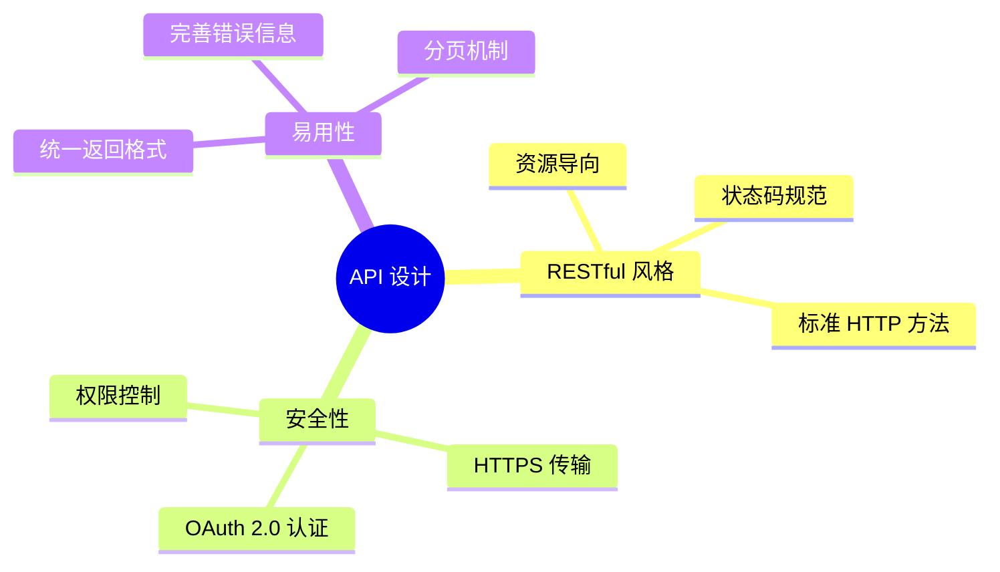

# 开放接口概览

轻易云 iPaaS 提供完善的 OpenAPI，支持通过 API 方式管理平台资源、执行任务、获取数据。

## API 架构

### API 设计原则



### API 分类

| 分类 | 说明 | 典型接口 |
|-----|------|---------|
| 连接器管理 | 管理数据源连接 | 创建、查询、测试连接器 |
| 方案管理 | 管理集成方案 | CRUD、启停、导入导出 |
| 任务管理 | 管理任务执行 | 触发执行、查询状态、停止 |
| 数据管理 | 数据查询操作 | 数据查询、导出、调试 |
| 系统管理 | 系统配置管理 | 用户、权限、日志 |

## 接入准备

### 获取凭证

1. 登录轻易云控制台
2. 进入「开发者中心」→「API 管理」
3. 创建应用，获取 **App Key** 和 **App Secret**
4. 配置 IP 白名单（可选）

### 认证方式

轻易云 iPaaS API 支持以下认证方式：

| 方式 | 适用场景 | 安全等级 |
|-----|---------|---------|
| API Key | 内部系统 | ⭐⭐⭐ |
| OAuth 2.0 | 第三方应用 | ⭐⭐⭐⭐⭐ |
| JWT Token | 前端应用 | ⭐⭐⭐⭐ |

### API Key 认证

在请求头中添加认证信息：

```http
GET /api/v1/schemes HTTP/1.1
Host: api.qeasy.cloud
Authorization: Bearer {your_api_key}
Content-Type: application/json
```

## 核心 API

### 连接器管理

#### 创建连接器

```http
POST /api/v1/connectors
Content-Type: application/json

{
  "name": "MySQL 生产库",
  "type": "mysql",
  "config": {
    "host": "db.example.com",
    "port": 3306,
    "database": "production",
    "username": "admin"
  }
}
```

#### 测试连接

```http
POST /api/v1/connectors/{id}/test

Response:
{
  "success": true,
  "message": "连接成功"
}
```

### 方案管理

#### 查询方案列表

```http
GET /api/v1/schemes?page=1&size=20&status=active

Response:
{
  "code": 0,
  "data": {
    "total": 100,
    "list": [
      {
        "id": "scheme_123",
        "name": "订单同步",
        "status": "active",
        "lastExecuteTime": "2024-01-01T12:00:00Z"
      }
    ]
  }
}
```

#### 触发方案执行

```http
POST /api/v1/schemes/{id}/execute
Content-Type: application/json

{
  "parameters": {
    "syncDate": "2024-01-01",
    "isFullSync": false
  },
  "async": true
}

Response:
{
  "code": 0,
  "data": {
    "taskId": "task_abc123",
    "status": "pending"
  }
}
```

### 任务管理

#### 查询任务状态

```http
GET /api/v1/tasks/{taskId}

Response:
{
  "code": 0,
  "data": {
    "id": "task_abc123",
    "schemeId": "scheme_123",
    "status": "running",
    "progress": 65,
    "startTime": "2024-01-01T12:00:00Z",
    "message": "正在处理..."
  }
}
```

#### 停止任务

```http
POST /api/v1/tasks/{taskId}/stop

Response:
{
  "code": 0,
  "message": "任务已停止"
}
```

## 数据查询 API

### 查询源数据

```http
POST /api/v1/data/query
Content-Type: application/json

{
  "connectorId": "conn_123",
  "query": {
    "table": "orders",
    "where": {
      "createTime": {
        "gte": "2024-01-01",
        "lt": "2024-01-02"
      }
    },
    "limit": 100
  }
}
```

### 数据导出

```http
POST /api/v1/data/export
Content-Type: application/json

{
  "connectorId": "conn_123",
  "query": {...},
  "format": "csv",
  "callback": "https://your-server.com/callback"
}
```

## 错误处理

### 错误码定义

| 错误码 | 说明 | 处理建议 |
|-------|------|---------|
| 0 | 成功 | — |
| 40001 | 参数错误 | 检查请求参数 |
| 40101 | 认证失败 | 检查 API Key |
| 40301 | 权限不足 | 检查账号权限 |
| 40401 | 资源不存在 | 检查资源 ID |
| 42901 | 请求限流 | 降低请求频率 |
| 50001 | 服务器错误 | 联系技术支持 |

### 错误响应格式

```json
{
  "code": 40001,
  "message": "参数错误",
  "detail": {
    "field": "name",
    "error": "名称不能为空"
  },
  "requestId": "req_abc123"
}
```

## 限流说明

### 限流策略

| 级别 | 限流值 | 说明 |
|-----|-------|------|
| 应用级 | 1000 次/分钟 | 单个应用 |
| 账号级 | 5000 次/分钟 | 单个账号 |
| 接口级 | 视接口而定 | 特定接口 |

### 限流响应

当触发限流时，返回 429 状态码：

```http
HTTP/1.1 429 Too Many Requests
Retry-After: 60

{
  "code": 42901,
  "message": "请求过于频繁，请稍后重试",
  "retryAfter": 60
}
```

## SDK 使用

### Java SDK

```java
import com.qeasy.ipaas.ApiClient;
import com.qeasy.ipaas.api.SchemeApi;

ApiClient client = new ApiClient()
    .setBasePath("https://api.qeasy.cloud")
    .setApiKey("your_api_key");

SchemeApi api = new SchemeApi(client);
SchemeListResponse response = api.listSchemes(1, 20);
```

### Python SDK

```python
from qeasy import ApiClient, SchemeApi

client = ApiClient(
    base_url="https://api.qeasy.cloud",
    api_key="your_api_key"
)

api = SchemeApi(client)
response = api.list_schemes(page=1, size=20)
```

### JavaScript SDK

```javascript
import { ApiClient, SchemeApi } from '@qeasy/ipaas-sdk';

const client = new ApiClient({
  basePath: 'https://api.qeasy.cloud',
  apiKey: 'your_api_key'
});

const api = new SchemeApi(client);
const response = await api.listSchemes(1, 20);
```

## 最佳实践

### 1. 异常重试

```python
import time
from requests import RequestException

def api_call_with_retry(func, max_retries=3):
    for i in range(max_retries):
        try:
            return func()
        except RequestException as e:
            if i == max_retries - 1:
                raise
            time.sleep(2 ** i)  # 指数退避
```

### 2. 批量操作

- 尽量使用批量接口减少 API 调用次数
- 合理设置批量大小（建议 100-500）

### 3. 异步处理

对于耗时操作，使用异步方式：

1. 提交异步任务
2. 轮询任务状态
3. 或配置回调地址接收通知

### 4. 日志记录

记录完整的 API 调用日志：

```json
[2024-01-01 12:00:00] POST /api/v1/schemes/scheme_123/execute
Request: {"async": true}
Response: {"code": 0, "data": {"taskId": "task_abc"}}
Duration: 250ms
```
