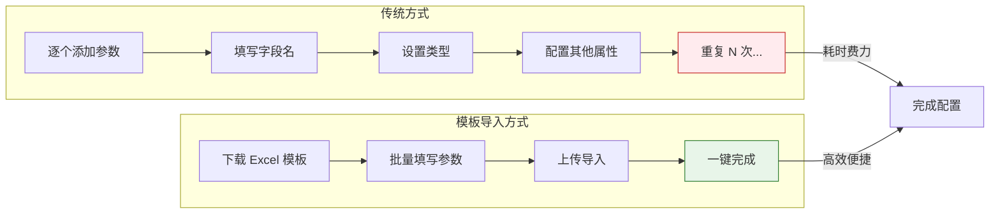
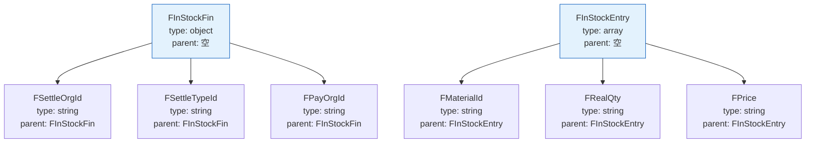
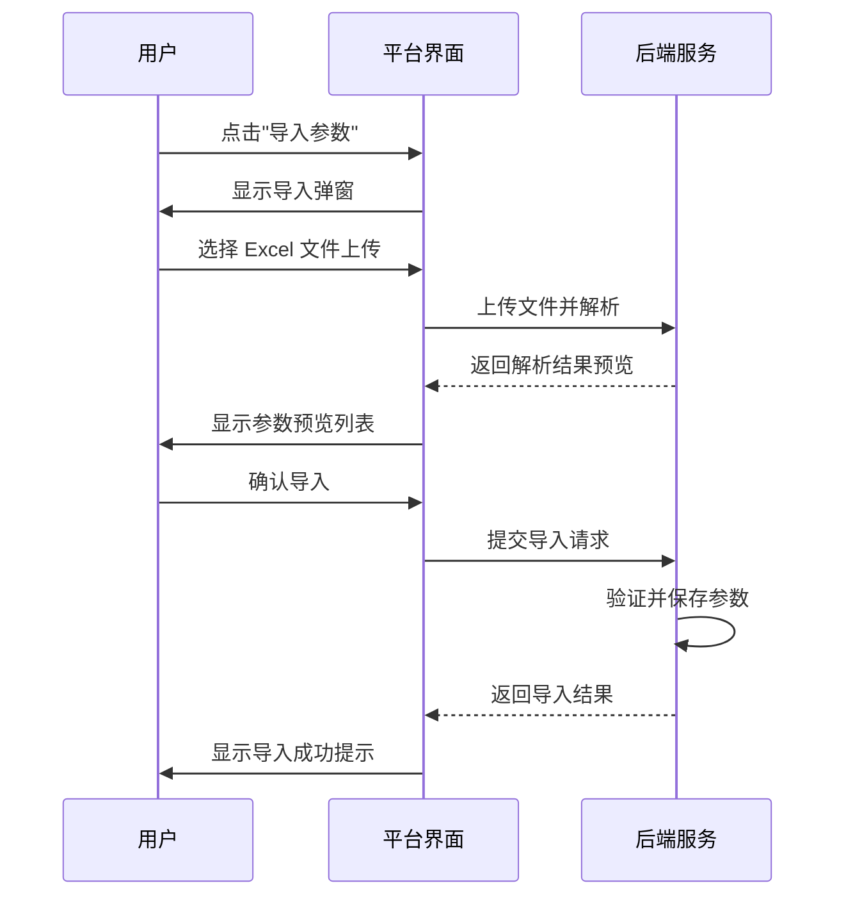

# 标准 API 参数导入模板

本文档介绍如何使用标准 API 参数导入模板，通过 Excel 文件批量配置接口的请求参数和响应参数，大幅提升接口配置效率，避免在界面上逐个手动添加参数的繁琐操作。

## 功能概述

标准 API 参数导入功能适用于以下场景：

- **批量导入接口参数**：当接口包含大量参数（如 ERP 系统的单据接口）时，通过 Excel 模板一次性导入所有参数
- **快速迁移接口配置**：将已有系统的接口文档转换为标准模板格式，快速完成迁移
- **团队协作配置**：产品经理或接口提供方填写模板，开发人员直接导入使用

## 模板文件说明

### 下载模板

在轻易云平台的**接口配置**页面，点击**导入参数**按钮，选择**下载模板**即可获取标准 Excel 模板文件。

> [!TIP]
> 建议每次导入前都重新下载最新版模板，以确保字段格式与平台版本兼容。

### 工作表结构

模板文件包含以下列（字段）：

| 列名 | 必填 | 说明 |
| ---- | ---- | ---- |
| `operation` | — | 操作标识行，用于说明字段含义，请勿删除或修改前两行 |
| `is_request` | ✅ | 参数类型：`1` 表示请求参数，`0` 表示响应参数 |
| `name` | ✅ | 参数显示名称（中文） |
| `field` | ✅ | 参数字段名（英文），必须与接口实际字段一致 |
| `parent` | — | 父字段名称，用于定义嵌套结构（如对象、数组内的字段） |
| `default` | — | 默认值 |
| `type` | ✅ | 数据类型：`string`、`int`、`float`、`boolean`、`object`、`array` |
| `is_required` | ✅ | 是否必填：`1` 表示必填，`0` 表示可选 |
| `parser` | — | 解析器配置，JSON 格式，默认为 `{}` |
| `describe` | — | 字段描述说明 |

> [!IMPORTANT]
> 模板文件的**前两行**为系统保留行（字段说明行和数据说明行），请勿删除或修改，从第 3 行开始填写实际参数数据。

## 字段详细说明

### is_request（参数类型）

用于区分参数是请求参数还是响应参数：

| 值 | 含义 | 说明 |
| -- | ---- | ---- |
| `1` | 请求参数 | 接口调用时需要传入的参数 |
| `0` | 响应参数 | 接口返回的数据字段 |

### type（数据类型）

支持的数据类型如下：

| 类型 | 说明 | 示例值 |
| ---- | ---- | ------ |
| `string` | 字符串 | `"文本内容"`、`"2024-01-01"` |
| `int` | 整数 | `100`、`-50` |
| `float` | 浮点数 | `3.14`、`-0.5` |
| `boolean` | 布尔值 | `true`、`false` |
| `object` | 对象/结构体 | 包含子字段的复合类型 |
| `array` | 数组 | 包含多个同类型元素的集合 |

### parent（父字段）

用于定义参数的层级结构：

- **顶级参数**：`parent` 列留空
- **嵌套参数**：填写所属父字段的 `field` 值

### is_required（是否必填）

| 值 | 含义 | 说明 |
| -- | ---- | ---- |
| `1` | 必填 | 接口调用时必须提供的参数 |
| `0` | 可选 | 接口调用时可以不传的参数 |

### parser（解析器配置）

用于配置字段的解析规则，支持 JSON 格式：

| 解析器类型 | 配置示例 | 说明 |
| ---------- | -------- | ---- |
| 默认 | `{}` | 不进行特殊解析 |
| 日期解析 | `{"type": "date", "format": "yyyy-MM-dd"}` | 将字符串解析为日期 |
| 数值解析 | `{"type": "number", "decimal": 2}` | 指定小数位数 |
| 枚举解析 | `{"type": "enum", "values": ["A", "B"]}` | 限定可选值范围 |

## 填写示例

以下是一个采购入库单接口的参数导入示例：

| operation | is_request | name | field | parent | default | type | is_required | parser | describe |
| --------- | ---------- | ---- | ----- | ------ | ------- | ---- | ----------- | ------ | -------- |
| 勿删该行-字段说明 | 参数类型 | 名称 | 字段 | 所属父字段 | 默认值 | 类型 | 是否必要 | 解析器 | 描述 |
| 勿删该行-数据说明 | 1=>请求参数 0=>响应参数 |  | 必须为英文 |  |  | 默认值 string | 默认值 0 | 默认值 {} |  |
| | 1 | 单据类型 | FBillTypeID | | | string | 1 | {} | 单据类型 |
| | 1 | 业务类型 | FBusinessType | | | string | 1 | {} | 下拉列表 |
| | 1 | 财务信息 | FInStockFin | | | object | 1 | {} | 财务信息对象 |
| | 1 | 结算组织 | FSettleOrgId | FInStockFin | | string | 1 | {} | 组织 |
| | 1 | 结算方式 | FSettleTypeId | FInStockFin | | string | 1 | {} | 基础资料 |
| | 1 | 付款组织 | FPayOrgId | FInStockFin | | string | 1 | {} | 组织 |
| | 1 | 付款条件 | FPayConditionId | FInStockFin | | string | 1 | {} | 基础资料 |
| | 1 | 结算币别 | FSettleCurrId | FInStockFin | | string | 1 | {} | 基础资料 |
| | 1 | 明细信息 | FInStockEntry | | | array | 1 | {} | 明细信息数组 |
| | 1 | 物料编码 | FMaterialId | FInStockEntry | | string | 1 | {} | 基础资料 |
| | 1 | 零售条形码 | FCMKBarCode | FInStockEntry | | string | 0 | {} | 文本 |
| | 1 | 应收数量 | FMustQty | FInStockEntry | | string | 0 | {} | 数量 |
| | 1 | 实收数量 | FRealQty | FInStockEntry | | string | 1 | {} | 数量 |
| | 1 | 单价 | FPrice | FInStockEntry | | string | 0 | {} | 单价 |
| | 1 | 批号 | FLot | FInStockEntry | | string | 0 | {} | 批次 |
| | 1 | 仓库 | FStockId | FInStockEntry | | string | 1 | {} | 基础资料 |
| | 1 | 仓位 | FStockLocId | FInStockEntry | | string | 0 | {} | 维度关联字段 |

> [!NOTE]
> 上述示例展示了采购入库单接口的参数结构，包含基础字段、嵌套对象（`FInStockFin`）和数组（`FInStockEntry`）的定义方式。

## 使用步骤

### 步骤 1：准备模板

1. 登录轻易云平台，进入**接口管理**模块
2. 选择目标接口，点击**参数配置**标签
3. 点击**导入参数**按钮，选择**下载模板**
4. 保存 Excel 模板文件到本地

### 步骤 2：填写参数

1. 使用 Excel 或 WPS 打开模板文件
2. **保留前两行**（字段说明行和数据说明行）不变
3. 从第 3 行开始，按照接口文档填写参数信息：
   - 区分请求参数（`is_request = 1`）和响应参数（`is_request = 0`）
   - 正确设置参数的层级关系（`parent` 字段）
   - 选择合适的数据类型
4. 保存填写完成的 Excel 文件

> [!TIP]
> 建议先在 Excel 中完成所有参数的整理和校验，再统一导入，避免多次重复操作。

### 步骤 3：导入参数

1. 在接口配置页面，点击**导入参数**按钮
2. 选择**上传文件**，上传填写好的 Excel 文件
3. 系统将自动解析文件内容并预览导入结果
4. 检查预览数据无误后，点击**确认导入**
5. 导入完成后，在参数列表中核对导入结果

## 常见问题

### 导入失败如何处理？

| 错误提示 | 可能原因 | 解决方法 |
| -------- | -------- | -------- |
| 文件格式错误 | 非 Excel 格式或文件损坏 | 使用 `.xlsx` 格式，重新下载模板填写 |
| 缺少必要字段 | 必填列（如 `field`、`type`）为空 | 检查并补全所有必填字段 |
| 父字段不存在 | `parent` 填写的字段名不存在 | 确保父字段的 `field` 值拼写正确且已定义 |
| 类型不支持 | `type` 填写了不支持的数据类型 | 使用支持类型：`string`、`int`、`float`、`boolean`、`object`、`array` |
| 解析器格式错误 | `parser` 列不是有效的 JSON | 检查 JSON 格式，确保使用英文双引号 |

### 如何导入嵌套结构？

对于复杂的嵌套结构（对象包含对象、数组包含对象等），需要按照**从内到外**的顺序定义：

1. 先定义最内层的字段（`parent` 指向直接父级）
2. 确保父级字段的 `type` 为 `object` 或 `array`
3. 子级字段的 `parent` 值必须与父级字段的 `field` 值完全匹配（区分大小写）

### 能否覆盖已有参数？

导入参数默认会**追加**到现有参数列表中。如需替换已有参数，建议：

1. 先在界面中删除原有参数
2. 再执行导入操作
3. 或使用**全量导入**模式（如有该选项）

## 最佳实践

1. **分类管理**：建议将请求参数和响应参数分别整理在不同的工作表中，或分两次导入
2. **命名规范**：`field` 字段名使用英文，遵循接口文档的标准命名（注意大小写敏感）
3. **类型一致性**：同一字段在请求和响应中应保持类型一致
4. **必填标记**：根据业务需求合理设置 `is_required`，避免因必填校验导致接口调用失败
5. **版本控制**：保留 Excel 模板文件作为配置备份，便于后续维护和迁移

> [!WARNING]
> 导入操作会直接影响接口的运行行为，建议在测试环境验证通过后再应用到生产环境。

## 相关文档

- [自定义连接器开发](./custom-connector) - 了解如何开发自定义连接器
- [适配器开发](./adapter-development) - 学习适配器开发规范
- [开放接口概览](./api-overview) - 查看平台开放接口文档
