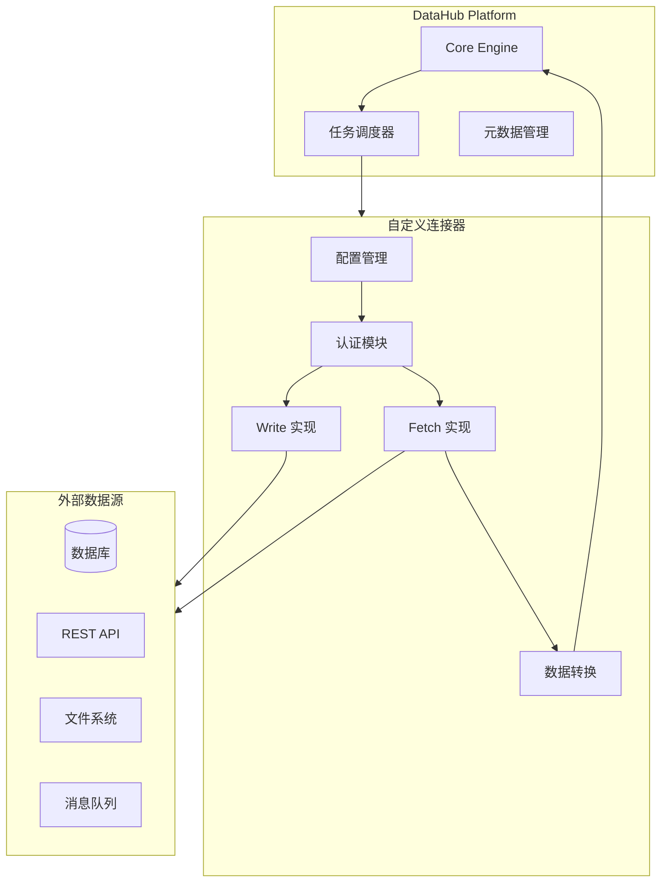
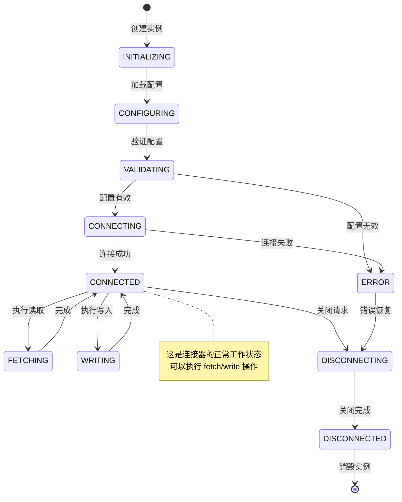
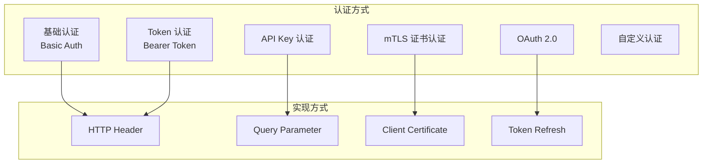

# 自定义连接器开发指南

自定义连接器是轻易云 DataHub 的核心扩展机制，允许开发者对接自定义数据源，实现数据的灵活集成。本文档详细介绍自定义连接器的完整开发流程。

## 连接器概述

连接器（Connector）是 DataHub 与外部数据源之间的桥梁，负责数据的读取（fetch）和写入（write）操作。通过开发自定义连接器，您可以集成企业内部的专有系统、遗留数据库或第三方服务。

### 连接器架构



### 连接器类型对比

| 连接器类型 | 适用场景 | 开发复杂度 | 性能特点 | 维护成本 |
|------------|----------|------------|----------|----------|
| 数据库连接器 | MySQL、PostgreSQL、Oracle 等 | 低 | 高吞吐量 | 低 |
| API 连接器 | RESTful、GraphQL 服务 | 中 | 受限于 API | 中 |
| 文件连接器 | CSV、JSON、Parquet 文件 | 低 | 批量处理 | 低 |
| 消息队列连接器 | Kafka、RabbitMQ | 中 | 实时流式 | 中 |
| 自定义协议连接器 | 专有协议系统 | 高 | 因系统而异 | 高 |

## 开发环境准备

### 环境要求

在开始开发之前，请确保您的开发环境满足以下要求：

```bash
# 基础环境
- Java 11+ 或 Python 3.8+
- Maven 3.6+ 或 pip
- Docker 20.10+（用于本地测试）
- Git 2.30+

# 推荐 IDE
- IntelliJ IDEA / VS Code
- 安装 Lombok 插件（Java 开发）
```

### SDK 依赖配置

#### Java 连接器 SDK

```xml
<dependency>
    <groupId>com.qingyiyun.datahub</groupId>
    <artifactId>connector-sdk-java</artifactId>
    <version>2.5.0</version>
</dependency>

<!-- 测试依赖 -->
<dependency>
    <groupId>com.qingyiyun.datahub</groupId>
    <artifactId>connector-test-kit</artifactId>
    <version>2.5.0</version>
    <scope>test</scope>
</dependency>
```

#### Python 连接器 SDK

```bash
pip install datahub-connector-sdk
```

```python
# requirements.txt
datahub-connector-sdk>=1.8.0
pydantic>=2.0.0
pytest>=7.0.0
pytest-asyncio>=0.21.0
```

## 连接器生命周期

连接器实例具有完整的生命周期，理解生命周期对于正确实现连接器至关重要。



### 生命周期回调方法

| 阶段 | Java 方法 | Python 方法 | 说明 |
|------|-----------|-------------|------|
| 初始化 | `initialize()` | `initialize()` | 执行一次性初始化 |
| 配置 | `configure(Config)` | `configure(config)` | 接收并应用配置 |
| 验证 | `validate()` | `validate()` | 验证配置有效性 |
| 连接 | `connect()` | `connect()` | 建立数据源连接 |
| 读取 | `fetch(FetchRequest)` | `fetch(request)` | 从数据源读取数据 |
| 写入 | `write(WriteRequest)` | `write(request)` | 向数据源写入数据 |
| 断开 | `disconnect()` | `disconnect()` | 关闭连接释放资源 |
| 销毁 | `destroy()` | `destroy()` | 清理资源 |

## Fetch 方法实现

Fetch 方法负责从外部数据源读取数据，是连接器最核心的功能之一。

### Java Fetch 实现示例

```java
package com.example.connector;

import com.qingyiyun.datahub.connector.*;
import java.sql.*;
import java.util.*;

public class MySQLConnector implements SourceConnector {
    
    private Connection connection;
    private MySQLConfig config;
    
    @Override
    public void configure(Map<String, Object> configMap) {
        this.config = MySQLConfig.fromMap(configMap);
    }
    
    @Override
    public void connect() throws ConnectionException {
        try {
            String url = String.format("jdbc:mysql://%s:%d/%s",
                config.getHost(), config.getPort(), config.getDatabase());
            
            this.connection = DriverManager.getConnection(
                url, config.getUsername(), config.getPassword());
            
            // 验证连接
            if (!connection.isValid(5)) {
                throw new ConnectionException("Connection validation failed");
            }
        } catch (SQLException e) {
            throw new ConnectionException("Failed to connect to MySQL", e);
        }
    }
    
    @Override
    public FetchResult fetch(FetchRequest request) throws FetchException {
        try {
            // 构建查询 SQL
            String sql = buildQuerySQL(request);
            
            try (PreparedStatement stmt = connection.prepareStatement(sql)) {
                // 设置查询参数
                setQueryParameters(stmt, request);
                
                // 设置分页
                stmt.setMaxRows(request.getLimit());
                
                try (ResultSet rs = stmt.executeQuery()) {
                    return extractData(rs, request);
                }
            }
        } catch (SQLException e) {
            throw new FetchException("Failed to fetch data", e);
        }
    }
    
    private String buildQuerySQL(FetchRequest request) {
        StringBuilder sql = new StringBuilder();
        sql.append("SELECT ").append(String.join(",", request.getFields()));
        sql.append(" FROM ").append(request.getTable());
        
        // 添加 WHERE 条件
        if (request.hasFilters()) {
            sql.append(" WHERE ").append(buildWhereClause(request.getFilters()));
        }
        
        // 添加排序
        if (request.hasSort()) {
            sql.append(" ORDER BY ").append(buildOrderClause(request.getSort()));
        }
        
        // 添加分页
        sql.append(" LIMIT ? OFFSET ?");
        
        return sql.toString();
    }
    
    private FetchResult extractData(ResultSet rs, FetchRequest request) 
            throws SQLException {
        List<Map<String, Object>> records = new ArrayList<>();
        ResultSetMetaData metaData = rs.getMetaData();
        int columnCount = metaData.getColumnCount();
        
        while (rs.next()) {
            Map<String, Object> record = new LinkedHashMap<>();
            for (int i = 1; i <= columnCount; i++) {
                String columnName = metaData.getColumnName(i);
                Object value = rs.getObject(i);
                record.put(columnName, value);
            }
            records.add(record);
        }
        
        // 构建结果元数据
        List<FieldSchema> schema = new ArrayList<>();
        for (int i = 1; i <= columnCount; i++) {
            schema.add(new FieldSchema(
                metaData.getColumnName(i),
                mapSQLTypeToDataHubType(metaData.getColumnType(i)),
                metaData.isNullable(i) == ResultSetMetaData.columnNullable
            ));
        }
        
        return FetchResult.builder()
            .records(records)
            .schema(schema)
            .totalCount(records.size())
            .hasMore(records.size() == request.getLimit())
            .build();
    }
}
```

### Python Fetch 实现示例

```python
from datahub_connector_sdk import SourceConnector, FetchRequest, FetchResult
from datahub_connector_sdk.types import FieldSchema, DataType
import aiohttp
import asyncio
from typing import Dict, List, Any

class RESTAPIConnector(SourceConnector):
    """REST API 数据源连接器示例"""
    
    def __init__(self):
        self.session = None
        self.config = None
        self.base_url = None
    
    def configure(self, config: Dict[str, Any]) -> None:
        """配置连接器"""
        self.config = config
        self.base_url = config.get('base_url')
        self.api_key = config.get('api_key')
        self.timeout = config.get('timeout', 30)
    
    async def connect(self) -> None:
        """建立 HTTP 连接会话"""
        self.session = aiohttp.ClientSession(
            headers={
                'Authorization': f'Bearer {self.api_key}',
                'Content-Type': 'application/json',
                'Accept': 'application/json'
            },
            timeout=aiohttp.ClientTimeout(total=self.timeout)
        )
        
        # 验证连接
        async with self.session.get(f'{self.base_url}/health') as resp:
            if resp.status != 200:
                raise ConnectionError(f'API health check failed: {resp.status}')
    
    async def fetch(self, request: FetchRequest) -> FetchResult:
        """从 REST API 获取数据"""
        # 构建请求 URL
        endpoint = request.table  # 使用 table 作为 API endpoint
        params = self._build_query_params(request)
        
        url = f'{self.base_url}/{endpoint}'
        
        async with self.session.get(url, params=params) as resp:
            if resp.status != 200:
                raise FetchException(f'API request failed: {resp.status}')
            
            data = await resp.json()
            
            # 解析响应数据
            records = data.get('items', [])
            total = data.get('total', len(records))
            
            # 推断 schema
            schema = self._infer_schema(records) if records else []
            
            return FetchResult(
                records=records,
                schema=schema,
                total_count=total,
                has_more=total > request.offset + len(records)
            )
    
    def _build_query_params(self, request: FetchRequest) -> Dict[str, str]:
        """构建查询参数"""
        params = {}
        
        # 分页参数
        params['limit'] = str(request.limit)
        params['offset'] = str(request.offset)
        
        # 过滤条件
        if request.filters:
            for filter in request.filters:
                params[f'filter_{filter.field}'] = str(filter.value)
        
        # 排序
        if request.sort:
            sort_str = ','.join([f'{s.field}:{s.direction}' for s in request.sort])
            params['sort'] = sort_str
        
        # 字段选择
        if request.fields:
            params['fields'] = ','.join(request.fields)
        
        return params
    
    def _infer_schema(self, records: List[Dict]) -> List[FieldSchema]:
        """从记录推断 schema"""
        if not records:
            return []
        
        schema = []
        sample = records[0]
        
        for field_name, value in sample.items():
            data_type = self._python_type_to_datahub_type(type(value))
            schema.append(FieldSchema(
                name=field_name,
                type=data_type,
                nullable=True
            ))
        
        return schema
    
    def _python_type_to_datahub_type(self, py_type: type) -> DataType:
        """映射 Python 类型到 DataHub 类型"""
        type_mapping = {
            str: DataType.STRING,
            int: DataType.INTEGER,
            float: DataType.DOUBLE,
            bool: DataType.BOOLEAN,
            list: DataType.ARRAY,
            dict: DataType.OBJECT
        }
        return type_mapping.get(py_type, DataType.STRING)
    
    async def disconnect(self) -> None:
        """关闭连接"""
        if self.session:
            await self.session.close()
```

## Write 方法实现

Write 方法负责将数据写入外部数据源，支持批量写入和事务控制。

### Java Write 实现示例

```java
@Override
public WriteResult write(WriteRequest request) throws WriteException {
    Connection conn = null;
    PreparedStatement stmt = null;
    
    try {
        conn = dataSource.getConnection();
        
        // 根据操作类型选择处理方式
        switch (request.getOperation()) {
            case INSERT:
                return doInsert(conn, request);
            case UPDATE:
                return doUpdate(conn, request);
            case UPSERT:
                return doUpsert(conn, request);
            case DELETE:
                return doDelete(conn, request);
            default:
                throw new WriteException("Unsupported operation: " + request.getOperation());
        }
    } catch (SQLException e) {
        throw new WriteException("Write operation failed", e);
    } finally {
        closeQuietly(stmt);
        closeQuietly(conn);
    }
}

private WriteResult doInsert(Connection conn, WriteRequest request) throws SQLException {
    String table = request.getTable();
    List<Map<String, Object>> records = request.getRecords();
    
    if (records.isEmpty()) {
        return WriteResult.success(0);
    }
    
    // 获取所有字段
    Set<String> allFields = new LinkedHashSet<>();
    for (Map<String, Object> record : records) {
        allFields.addAll(record.keySet());
    }
    
    List<String> fields = new ArrayList<>(allFields);
    String sql = buildInsertSQL(table, fields);
    
    try (PreparedStatement stmt = conn.prepareStatement(sql)) {
        int batchSize = 0;
        int successCount = 0;
        List<WriteError> errors = new ArrayList<>();
        
        for (int i = 0; i < records.size(); i++) {
            Map<String, Object> record = records.get(i);
            
            // 设置参数
            for (int j = 0; j < fields.size(); j++) {
                stmt.setObject(j + 1, record.get(fields.get(j)));
            }
            
            stmt.addBatch();
            batchSize++;
            
            // 执行批量插入
            if (batchSize >= request.getBatchSize() || i == records.size() - 1) {
                try {
                    int[] results = stmt.executeBatch();
                    successCount += Arrays.stream(results).filter(r -> r > 0).count();
                    stmt.clearBatch();
                    batchSize = 0;
                } catch (BatchUpdateException e) {
                    // 处理批量插入中的错误
                    errors.addAll(handleBatchError(e, i, batchSize));
                    batchSize = 0;
                }
            }
        }
        
        return WriteResult.builder()
            .successCount(successCount)
            .failedCount(records.size() - successCount)
            .errors(errors)
            .build();
    }
}

private String buildInsertSQL(String table, List<String> fields) {
    String columns = String.join(", ", fields);
    String placeholders = fields.stream()
        .map(f -> "?")
        .collect(Collectors.joining(", "));
    
    return String.format("INSERT INTO %s (%s) VALUES (%s)", 
        table, columns, placeholders);
}
```

## 认证处理

连接器需要处理各种认证方式，确保与数据源的安全连接。

### 支持的认证方式



| 认证方式 | 安全级别 | 实现复杂度 | 适用场景 |
|----------|----------|------------|----------|
| Basic Auth | 中 | 低 | 内部系统、快速原型 |
| Bearer Token | 高 | 低 | REST API、微服务 |
| API Key | 中 | 低 | 第三方服务集成 |
| OAuth 2.0 | 高 | 高 | 需要授权码流程的场景 |
| mTLS | 极高 | 中 | 金融、政府等高安全场景 |

### OAuth 2.0 认证实现

```python
import time
import requests
from typing import Dict, Optional

class OAuth2Authenticator:
    """OAuth 2.0 认证处理器"""
    
    def __init__(self, config: Dict[str, str]):
        self.client_id = config['client_id']
        self.client_secret = config['client_secret']
        self.token_url = config['token_url']
        self.scope = config.get('scope', '')
        self.access_token: Optional[str] = None
        self.refresh_token: Optional[str] = None
        self.expires_at: float = 0
    
    def get_access_token(self) -> str:
        """获取有效的访问令牌"""
        if self.access_token and time.time() < self.expires_at - 60:
            return self.access_token
        
        if self.refresh_token:
            return self._refresh_access_token()
        
        return self._fetch_new_token()
    
    def _fetch_new_token(self) -> str:
        """获取新令牌"""
        response = requests.post(
            self.token_url,
            data={
                'grant_type': 'client_credentials',
                'client_id': self.client_id,
                'client_secret': self.client_secret,
                'scope': self.scope
            }
        )
        response.raise_for_status()
        
        token_data = response.json()
        self.access_token = token_data['access_token']
        self.refresh_token = token_data.get('refresh_token')
        expires_in = token_data.get('expires_in', 3600)
        self.expires_at = time.time() + expires_in
        
        return self.access_token
    
    def _refresh_access_token(self) -> str:
        """刷新访问令牌"""
        try:
            response = requests.post(
                self.token_url,
                data={
                    'grant_type': 'refresh_token',
                    'refresh_token': self.refresh_token,
                    'client_id': self.client_id,
                    'client_secret': self.client_secret
                }
            )
            response.raise_for_status()
            
            token_data = response.json()
            self.access_token = token_data['access_token']
            self.refresh_token = token_data.get('refresh_token', self.refresh_token)
            expires_in = token_data.get('expires_in', 3600)
            self.expires_at = time.time() + expires_in
            
            return self.access_token
        except requests.RequestException:
            # 刷新失败，获取新令牌
            return self._fetch_new_token()
```

## 错误处理

良好的错误处理机制是连接器稳定运行的关键。

### 错误分类

```java
public class ConnectorException extends RuntimeException {
    private final ErrorCode errorCode;
    private final Map<String, Object> context;
    
    public enum ErrorCode {
        // 连接错误
        CONNECTION_FAILED("连接失败"),
        AUTHENTICATION_FAILED("认证失败"),
        TIMEOUT("连接超时"),
        
        // 数据错误
        DATA_VALIDATION_FAILED("数据验证失败"),
        SCHEMA_MISMATCH("Schema 不匹配"),
        DATA_TYPE_ERROR("数据类型错误"),
        
        // 操作错误
        OPERATION_NOT_SUPPORTED("不支持的操作"),
        RESOURCE_NOT_FOUND("资源不存在"),
        PERMISSION_DENIED("权限不足"),
        
        // 系统错误
        RATE_LIMITED("请求过于频繁"),
        SERVICE_UNAVAILABLE("服务不可用"),
        INTERNAL_ERROR("内部错误");
        
        private final String description;
        
        ErrorCode(String description) {
            this.description = description;
        }
    }
}
```

### 错误恢复策略

```python
from enum import Enum
from typing import Callable
import functools
import time
import logging

logger = logging.getLogger(__name__)

class RecoveryStrategy(Enum):
    """错误恢复策略"""
    IMMEDIATE_FAIL = "立即失败"
    RETRY_WITH_BACKOFF = "退避重试"
    SKIP_AND_CONTINUE = "跳过继续"
    CIRCUIT_BREAKER = "熔断"

class RetryConfig:
    """重试配置"""
    def __init__(self, 
                 max_retries: int = 3,
                 base_delay: float = 1.0,
                 max_delay: float = 60.0,
                 exponential_base: float = 2.0):
        self.max_retries = max_retries
        self.base_delay = base_delay
        self.max_delay = max_delay
        self.exponential_base = exponential_base

def with_retry(config: RetryConfig = None):
    """重试装饰器"""
    if config is None:
        config = RetryConfig()
    
    def decorator(func: Callable):
        @functools.wraps(func)
        def wrapper(*args, **kwargs):
            last_exception = None
            
            for attempt in range(config.max_retries + 1):
                try:
                    return func(*args, **kwargs)
                except TransientError as e:
                    last_exception = e
                    if attempt < config.max_retries:
                        delay = min(
                            config.base_delay * (config.exponential_base ** attempt),
                            config.max_delay
                        )
                        logger.warning(
                            f"Operation failed (attempt {attempt + 1}), "
                            f"retrying in {delay}s: {e}"
                        )
                        time.sleep(delay)
                    else:
                        logger.error(f"Operation failed after {config.max_retries + 1} attempts")
            
            raise last_exception
        return wrapper
    return decorator

# 使用示例
class ReliableConnector:
    @with_retry(RetryConfig(max_retries=5, base_delay=2.0))
    def fetch_data(self, request):
        """带重试机制的数据获取"""
        return self._do_fetch(request)
```

## 测试和调试

### 单元测试

```java
@Test
public void testFetchWithFilters() throws Exception {
    // 准备测试数据
    Map<String, Object> config = new HashMap<>();
    config.put("host", "localhost");
    config.put("port", 3306);
    config.put("database", "test");
    
    // 创建连接器
    MySQLConnector connector = new MySQLConnector();
    connector.configure(config);
    
    // 使用内存数据库进行测试
    connector.setDataSource(testDataSource);
    connector.connect();
    
    // 构建请求
    FetchRequest request = FetchRequest.builder()
        .table("users")
        .fields(Arrays.asList("id", "name", "email"))
        .filters(Arrays.asList(
            Filter.builder()
                .field("status")
                .operator(Operator.EQ)
                .value("active")
                .build()
        ))
        .limit(100)
        .build();
    
    // 执行测试
    FetchResult result = connector.fetch(request);
    
    // 验证结果
    assertNotNull(result);
    assertTrue(result.getRecords().size() <= 100);
    
    // 验证所有记录都满足过滤条件
    for (Map<String, Object> record : result.getRecords()) {
        assertEquals("active", record.get("status"));
    }
}
```

### 集成测试

```python
import pytest
import docker
from datahub_connector_sdk.testing import ConnectorTestHarness

@pytest.fixture(scope="module")
def mysql_container():
    """启动 MySQL Docker 容器用于测试"""
    client = docker.from_env()
    container = client.containers.run(
        "mysql:8.0",
        environment={
            "MYSQL_ROOT_PASSWORD": "test",
            "MYSQL_DATABASE": "testdb"
        },
        ports={'3306/tcp': 13306},
        detach=True,
        remove=True
    )
    
    # 等待数据库就绪
    time.sleep(10)
    
    yield container
    
    container.stop()

@pytest.fixture
def test_connector(mysql_container):
    """创建测试连接器实例"""
    config = {
        "host": "localhost",
        "port": 13306,
        "database": "testdb",
        "username": "root",
        "password": "test"
    }
    
    connector = MySQLConnector()
    connector.configure(config)
    connector.connect()
    
    yield connector
    
    connector.disconnect()

def test_end_to_end_sync(test_connector):
    """端到端同步测试"""
    harness = ConnectorTestHarness(test_connector)
    
    # 运行标准测试套件
    results = harness.run_standard_tests()
    
    assert results.passed
    assert results.record_count > 0
    assert results.sync_duration < 30  # 同步应在 30 秒内完成
```

## 部署发布

### 打包规范

连接器需要按照标准格式打包，以便 DataHub 平台正确加载。

```text
connector-package/
├── META-INF/
│   └── MANIFEST.MF          # 包元数据
├── connector.yaml           # 连接器配置
├── lib/
│   └── *.jar                # 依赖库
├── resources/
│   ├── icon.png             # 连接器图标
│   └── schema.json          # 配置 Schema
└── README.md                # 说明文档
```

### connector.yaml 配置

```yaml
connector:
  name: custom-mysql-connector
  displayName: 自定义 MySQL 连接器
  version: 1.0.0
  description: 支持高级查询功能的 MySQL 连接器
  
  # 入口配置
  entry:
    class: com.example.connector.MySQLConnector
    
  # 作者信息
  author:
    name: Your Name
    email: your.email@example.com
    
  # 支持的数据源类型
  sourceTypes:
    - mysql
    - mariadb
    
  # 能力声明
  capabilities:
    - fetch
    - write
    - batch_write
    - streaming
    
  # 配置参数定义
  configSchema:
    type: object
    properties:
      host:
        type: string
        description: 数据库主机地址
        required: true
      port:
        type: integer
        description: 数据库端口
        default: 3306
      database:
        type: string
        description: 数据库名称
        required: true
      username:
        type: string
        description: 用户名
        required: true
      password:
        type: string
        description: 密码
        required: true
        secret: true
```

### 发布流程

```mermaid
sequenceDiagram
    participant Dev as 开发者
    participant CI as CI/CD
    plugin Reg as 注册中心
    participant Hub as DataHub

    Dev->>Dev: 本地测试通过
    Dev->>CI: 提交代码/触发构建
    CI->>CI: 执行单元测试
    CI->>CI: 执行集成测试
    CI->>CI: 打包连接器
    CI->>CI: 安全扫描
    CI->>Reg: 上传包到注册中心
    Reg->>Reg: 签名验证
    Hub->>Reg: 查询可用连接器
    Reg-->>Hub: 返回连接器列表
    Hub->>Hub: 用户选择安装
    Hub->>Reg: 下载连接器包
    Hub->>Hub: 加载并初始化
```

> **Note**: 发布到生产环境前，请确保连接器已通过所有测试，并文档齐全。

> **Warning**: 连接器代码中不要硬编码敏感信息，使用环境变量或配置中心管理密钥。
