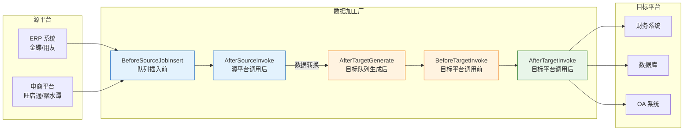
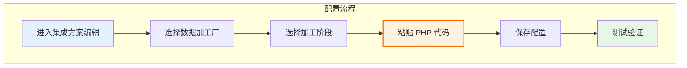

# 自定义数据加工厂

自定义数据加工厂（Custom Data Processor）是轻易云 iPaaS 平台提供的一种数据中间处理层扩展机制，允许开发者在数据集成流程的关键节点注入自定义业务逻辑。通过数据加工厂，你可以对源平台返回的数据进行转换、过滤、补全，或者在写入目标平台前进行预处理，实现复杂的数据映射和业务规则处理。

> [!IMPORTANT]
> 本文档面向具备 PHP 开发基础的开发者。数据加工厂使用 PHP 类实现，运行在平台托管环境中，无需部署额外服务器。

## 概述

### 什么是数据加工厂

数据加工厂是一种 Hook 机制，在数据集成流程的特定阶段被触发，允许开发者通过编写 PHP 代码来干预数据处理流程。它位于源平台与目标平台之间的数据流转路径上，是实现复杂数据转换的理想选择。



### 适用场景

| 场景类型 | 示例 | 推荐加工厂 |
| -------- | ---- | ---------- |
| **数据补全** | 根据订单号查询商品详情补全到订单数据 | `AfterSourceInvoke` |
| **数据拆分** | 将一个订单按商品拆分为多条记录 | `AfterSourceInvoke` |
| **数据合并** | 合并多个关联单据为一条记录 | `AfterSourceInvoke` |
| **字段计算** | 计算订单金额、税费、折扣等 | `AfterTargetGenerate` |
| **前置校验** | 写入前检查数据完整性 | `BeforeTargetInvoke` |
| **回写更新** | 将目标平台返回的 ID 回写源数据 | `AfterTargetInvoke` |

### 执行时机

```mermaid
sequenceDiagram
    participant S as 调度器
    participant P1 as BeforeSourceJobInsert
    participant SRC as 源平台 API
    participant P2 as AfterSourceInvoke
    participant STORE as 数据存储器
    participant P3 as AfterTargetGenerate
    participant P4 as BeforeTargetInvoke
    participant TGT as 目标平台 API
    participant P5 as AfterTargetInvoke

    S->>P1: 1. 队列插入前加工
    P1-->>S: 修改后的响应数据
    S->>SRC: 2. 调用源平台接口
    SRC-->>S: 返回原始数据
    S->>P2: 3. 源平台调用后加工
    P2-->>S: 处理后的数据
    S->>STORE: 4. 写入数据存储器
    S->>P3: 5. 目标队列生成后加工
    P3-->>S: 修改后的请求参数
    S->>P4: 6. 目标平台调用前加工
    P4-->>S: 最终的请求参数
    S->>TGT: 7. 调用目标平台接口
    TGT-->>S: 返回响应
    S->>P5: 8. 目标平台调用后加工
    P5-->>S: 处理完成

    style P1 fill:#e3f2fd
    style P2 fill:#e3f2fd
    style P3 fill:#fff3e0
    style P4 fill:#fff3e0
    style P5 fill:#e8f5e9
```

## 加工厂类型详解

### BeforeSourceJobInsert：源平台队列插入前

在源平台数据被插入到异步处理队列之前触发，允许修改调用接口返回的原始响应数据。适用于在数据进入队列前进行初步过滤或格式化。

#### 接口定义

```php
<?php

class BeforeSourceJobInsert
{
    /**
     * 响应数据（引用传递）
     * @var array
     */
    protected $response;

    /**
     * 适配器实例
     * @var object
     */
    protected $adapter;

    /**
     * 构造函数
     *
     * @param array $response 引用传递，调用接口返回的原始响应数组
     * @param object $adapter 适配器类实例
     */
    public function __construct(&$response, $adapter)
    {
        $this->response = &$response;
        $this->adapter = $adapter;
    }

    /**
     * 工厂事件执行函数
     *
     * @return void
     */
    public function run()
    {
        // 自定义处理逻辑
    }
}
```

#### 使用示例

以下示例展示如何在队列插入前过滤掉失败的响应，并为包含运费的订单追加运费分录：

```php
<?php

class BeforeSourceJobInsert
{
    protected $response;
    protected $adapter;

    public function __construct(&$response, $adapter)
    {
        $this->response = &$response;
        $this->adapter = $adapter;
    }

    public function run()
    {
        // 如果响应 code 大于 0，表示调用失败，不进行数据加工
        if ($this->response['code'] > 0) {
            return;
        }

        // 遍历单据列表
        foreach ($this->response['stockout_list'] as &$item) {
            // 如果存在运费，追加运费分录
            if (floatval($item['post_fee']) > 0) {
                $item['details_list'][] = [
                    'spec_code' => 'FREIGHT-001',
                    'goods_count' => 1,
                    'price' => floatval($item['post_fee']),
                    'warehouse_no' => '440001',
                    'remark' => '订单运费'
                ];
            }
        }
    }
}
```

> [!TIP]
> `$response` 以引用方式传递，直接修改 `$this->response` 即可影响后续流程的数据。

---

### AfterSourceInvoke：源平台调用后

在源平台 API 调用完成后触发，但数据尚未写入数据存储器。适用于对原始响应数据进行复杂的转换、拆分、合并等操作。

#### 接口定义

```php
<?php

class AfterSourceInvoke
{
    /**
     * 响应数据（引用传递）
     * @var array
     */
    protected $response;

    /**
     * 适配器实例
     * @var object
     */
    protected $adapter;

    /**
     * 构造函数
     *
     * @param array $response 引用传递，调用接口返回的原始响应数组
     * @param object $adapter 适配器类实例
     */
    public function __construct(&$response, $adapter)
    {
        $this->response = &$response;
        $this->adapter = $adapter;
    }

    /**
     * 工厂事件执行函数
     *
     * @return void
     */
    public function run()
    {
        // 自定义处理逻辑
    }
}
```

#### 使用示例

以下示例展示如何将组装拆卸单中的产品和原材料分离到不同的字段：

```php
<?php

class AfterSourceInvoke
{
    protected $response;
    protected $adapter;

    public function __construct(&$response, $adapter)
    {
        $this->response = &$response;
        $this->adapter = $adapter;
    }

    public function run()
    {
        // 检查响应状态
        if ($this->response['code'] != 200) {
            return;
        }

        // 遍历数据列表
        foreach ($this->response['result']['data'] as &$item) {
            $product = [];
            $material = [];

            // 根据 inOutType 区分产品和原材料
            foreach ($item['stockAssembleDetailsDto'] as $entry) {
                if ($entry['inOutType'] == 107) {
                    // 107 表示产品（入库）
                    $product[] = $entry;
                } else {
                    // 其他表示原材料（出库）
                    $material[] = $entry;
                }
            }

            // 将分离后的数据赋值给新字段
            $item['product'] = $product;
            $item['material'] = $material;
        }
    }
}
```

> [!NOTE]
> `AfterSourceInvoke` 与 `BeforeSourceJobInsert` 的接口定义相同，但执行时机不同。前者在数据进入存储器前执行，后者在入队前执行。

---

### AfterTargetGenerate：目标队列生成后

在目标平台请求参数生成完成后触发，但尚未调用目标平台 API。适用于对生成的请求参数进行最终修改，如计算字段值、补充额外参数等。

#### 接口定义

```php
<?php

class AfterTargetGenerate
{
    /**
     * 请求参数（引用传递）
     * @var array
     */
    protected $params = [];

    /**
     * 关联的源数据 IDs
     * @var array
     */
    protected $ids = [];

    /**
     * 构造函数
     *
     * @param array $params 目标队列生成的请求参数内容（引用传递）
     * @param array $ids 目标队列所关联的原始数据 IDs（MongoDB ObjectId）
     */
    public function __construct(&$params, $ids)
    {
        $this->params = &$params;
        $this->ids = $ids;
    }

    /**
     * 工厂事件执行函数
     *
     * @return void
     */
    public function run()
    {
        // 自定义处理逻辑
    }
}
```

#### 使用示例

以下示例展示如何在提交订单前计算订单的实际支付金额：

```php
<?php

class AfterTargetGenerate
{
    protected $params = [];
    protected $ids = [];

    public function __construct(&$params, $ids)
    {
        $this->params = &$params;
        $this->ids = $ids;
    }

    public function run()
    {
        $paid = 0;

        // 遍历订单明细，计算总金额
        foreach ($this->params['trade_list']['order_list'] as $item) {
            $paid += $item['price'] * $item['num'];
        }

        // 将计算结果赋值到请求参数
        $this->params['trade_list']['paid'] = $paid;
    }
}
```

> [!IMPORTANT]
> `AfterTargetGenerate` 不接收 `$adapter` 参数，如需使用适配器功能，建议在 `BeforeTargetInvoke` 中实现。

---

### BeforeTargetInvoke：目标平台调用前

在调用目标平台 API 之前触发。适用于需要在写入前执行额外操作的场景，如先执行反审核、检查数据状态等。

#### 接口定义

```php
<?php

class BeforeTargetInvoke
{
    /**
     * 请求参数（引用传递）
     * @var array
     */
    protected $request;

    /**
     * 适配器实例
     * @var object
     */
    protected $adapter;

    /**
     * 队列任务对象
     * @var object
     */
    protected $job;

    /**
     * 构造函数
     *
     * @param array $request 引用传递，调用接口请求参数
     * @param object $adapter 适配器类实例
     * @param object $job MongoDB 队列任务对象
     */
    public function __construct(&$request, $adapter, $job)
    {
        $this->request = &$request;
        $this->adapter = $adapter;
        $this->job = $job;
    }

    /**
     * 工厂事件执行函数
     *
     * @return void
     */
    public function run()
    {
        // 自定义处理逻辑
    }
}
```

#### 使用示例

以下示例展示如何在修改金蝶单据前执行反审核操作：

```php
<?php

class BeforeTargetInvoke
{
    protected $request;
    protected $adapter;
    protected $job;

    public function __construct(&$request, $adapter, $job)
    {
        $this->request = &$request;
        $this->adapter = $adapter;
        $this->job = $job;
    }

    public function run()
    {
        // 构建反审核请求参数
        $unAuditRequest = [];
        $unAuditRequest[0] = $this->request[0];
        $unAuditRequest[1] = [
            'CreateOrgId' => 0,
            'Numbers' => [],
            'Ids' => $this->request[1]['Model'][0]['FMATERIALID'],
            'InterationFlags' => '',
            'NetworkCtrl' => ''
        ];

        // 记录操作日志
        $this->adapter->getLogStorage()->insertOne([
            'text' => '执行反审核操作前',
            'unAuditRequest' => $unAuditRequest
        ], 1);

        // 调用反审核接口
        $res = $this->adapter->SDK->invoke('unAudit', $unAuditRequest);

        // 记录操作结果
        $this->adapter->getLogStorage()->insertOne([
            'text' => '执行反审核操作后',
            'response' => $res
        ], 1);
    }
}
```

> [!WARNING]
> 在 `BeforeTargetInvoke` 中执行额外 API 调用会增加整体处理时间，请确保操作的必要性，并处理好异常情况。

---

### AfterTargetInvoke：目标平台调用后

在目标平台 API 调用完成后触发。适用于处理响应数据，如将目标平台返回的 ID 回写到源数据，或者根据响应结果更新本地状态。

#### 接口定义

```php
<?php

class AfterTargetInvoke
{
    /**
     * 响应数据（引用传递）
     * @var array
     */
    protected $response;

    /**
     * 适配器实例
     * @var object
     */
    protected $adapter;

    /**
     * 队列任务对象
     * @var object
     */
    protected $job;

    /**
     * 构造函数
     *
     * @param array $response 引用传递，调用接口返回的原始响应数组
     * @param object $adapter 适配器类实例
     * @param object $job MongoDB 队列任务对象
     */
    public function __construct(&$response, $adapter, $job)
    {
        $this->response = &$response;
        $this->adapter = $adapter;
        $this->job = $job;
    }

    /**
     * 工厂事件执行函数
     *
     * @return void
     */
    public function run()
    {
        // 自定义处理逻辑
    }
}
```

#### 使用示例

以下示例展示如何将目标平台返回的 ID 回写到源数据存储器中：

```php
<?php

class AfterTargetInvoke
{
    protected $response;
    protected $adapter;
    protected $job;

    public function __construct(&$response, $adapter, $job)
    {
        $this->response = &$response;
        $this->adapter = $adapter;
        $this->job = $job;
    }

    public function run()
    {
        // 检查响应是否成功
        if ($this->response['success'] !== true) {
            return;
        }

        // 获取数据存储器
        $storage = $this->adapter->getDataStorage();

        // 查询源数据
        $data = $storage->collection->findOne([
            '_id' => $this->job->ids[0]
        ]);

        // 更新源数据，记录目标平台返回的 ID
        $content = $data['content'];
        $content['resultId'] = $this->response['result'];

        $storage->collection->updateOne(
            ['_id' => $data->_id],
            ['$set' => ['content' => $content]]
        );
    }
}
```

## 参数对照表

### 构造函数参数对照

| 加工厂类型 | 参数 | 类型 | 传递方式 | 说明 |
| ---------- | ---- | ---- | -------- | ---- |
| `BeforeSourceJobInsert` | `$response` | array | 引用传递 | 源平台响应数据 |
| | `$adapter` | object | 值传递 | 适配器实例 |
| `AfterSourceInvoke` | `$response` | array | 引用传递 | 源平台响应数据 |
| | `$adapter` | object | 值传递 | 适配器实例 |
| `AfterTargetGenerate` | `$params` | array | 引用传递 | 目标平台请求参数 |
| | `$ids` | array | 值传递 | 关联的源数据 IDs |
| `BeforeTargetInvoke` | `$request` | array | 引用传递 | 目标平台请求参数 |
| | `$adapter` | object | 值传递 | 适配器实例 |
| | `$job` | object | 值传递 | 队列任务对象 |
| `AfterTargetInvoke` | `$response` | array | 引用传递 | 目标平台响应数据 |
| | `$adapter` | object | 值传递 | 适配器实例 |
| | `$job` | object | 值传递 | 队列任务对象 |

### 适配器可用方法

在 `BeforeSourceJobInsert`、`AfterSourceInvoke`、`BeforeTargetInvoke`、`AfterTargetInvoke` 中，可以通过 `$adapter` 访问以下方法：

| 方法 | 说明 | 示例 |
| ---- | ---- | ---- |
| `$adapter->getLogStorage()` | 获取日志存储器 | `$adapter->getLogStorage()->insertOne(['text' => '日志内容'], 1)` |
| `$adapter->getDataStorage()` | 获取数据存储器 | `$adapter->getDataStorage()->collection->findOne([...])` |
| `$adapter->SDK` | 访问平台 SDK | `$adapter->SDK->invoke($api, $params)` |

## 注册与配置

### 在集成方案中配置

数据加工厂通过集成方案的配置界面进行注册。在方案编辑页面的**数据加工厂**（或**自定义处理器**）区域，选择对应的加工阶段并粘贴 PHP 代码。



### 代码格式要求

1. **类名固定**：根据加工阶段使用对应的类名（如 `AfterSourceInvoke`）
2. **包含构造函数**：必须实现文档规定的构造函数
3. **实现 run 方法**：业务逻辑写在 `run()` 方法中
4. **无需命名空间**：代码运行在平台托管环境中，不需要声明 `namespace`

### 配置示例

以下是一个完整的 `AfterSourceInvoke` 配置示例：

```php
<?php

class AfterSourceInvoke
{
    protected $response;
    protected $adapter;

    public function __construct(&$response, $adapter)
    {
        $this->response = &$response;
        $this->adapter = $adapter;
    }

    public function run()
    {
        // 业务逻辑
        if ($this->response['code'] != 200) {
            return;
        }

        foreach ($this->response['data']['list'] as &$item) {
            $item['processed'] = true;
            $item['process_time'] = date('Y-m-d H:i:s');
        }
    }
}
```

## 错误处理

### 异常捕获

数据加工厂运行在平台托管环境中，异常会被自动捕获并记录到日志中。建议遵循以下错误处理原则：

1. **检查响应状态**：在处理前检查响应状态码，避免处理错误数据
2. **提前返回**：遇到异常情况时使用 `return` 提前退出，避免后续代码执行
3. **记录日志**：使用 `$adapter->getLogStorage()->insertOne()` 记录关键操作和错误信息

### 错误处理示例

```php
<?php

class AfterSourceInvoke
{
    protected $response;
    protected $adapter;

    public function __construct(&$response, $adapter)
    {
        $this->response = &$response;
        $this->adapter = $adapter;
    }

    public function run()
    {
        // 检查响应状态
        if (!isset($this->response['code']) || $this->response['code'] != 200) {
            // 记录错误日志
            $this->adapter->getLogStorage()->insertOne([
                'text' => '源平台响应异常',
                'response' => $this->response
            ], 2); // 2 表示错误级别

            return; // 提前退出
        }

        // 检查数据是否存在
        if (empty($this->response['data']['list'])) {
            $this->adapter->getLogStorage()->insertOne([
                'text' => '源平台返回空数据'
            ], 1); // 1 表示记录级别

            return;
        }

        // 正常业务逻辑
        foreach ($this->response['data']['list'] as &$item) {
            try {
                // 可能抛出异常的操作
                $item['calculated'] = $this->calculate($item);
            } catch (\Exception $e) {
                // 记录异常信息
                $this->adapter->getLogStorage()->insertOne([
                    'text' => '计算字段异常',
                    'error' => $e->getMessage(),
                    'item' => $item
                ], 2);

                // 设置默认值，避免中断整个流程
                $item['calculated'] = 0;
            }
        }
    }

    private function calculate($item)
    {
        // 计算逻辑
        return $item['price'] * $item['quantity'];
    }
}
```

> [!CAUTION]
> 数据加工厂中的异常不会影响整个集成流程的执行，但可能导致数据处理不完整。建议对关键操作添加充分的错误处理。

## 最佳实践

### 性能优化

| 建议 | 说明 |
| ---- | ---- |
| **避免大量循环** | 尽量减少嵌套循环的层级，大数据量考虑分批处理 |
| **减少 API 调用** | 在加工厂中调用外部 API 会增加延迟，谨慎使用 |
| **使用引用传递** | 直接修改引用变量，避免创建大量临时数组 |
| **提前返回** | 条件不满足时立即 return，减少不必要的处理 |

### 代码组织

```php
<?php

class AfterSourceInvoke
{
    protected $response;
    protected $adapter;

    public function __construct(&$response, $adapter)
    {
        $this->response = &$response;
        $this->adapter = $adapter;
    }

    public function run()
    {
        // 1. 前置检查
        if (!$this->validate()) {
            return;
        }

        // 2. 主处理逻辑
        $this->processData();

        // 3. 后置处理（如记录日志）
        $this->afterProcess();
    }

    /**
     * 验证响应数据
     */
    private function validate(): bool
    {
        return isset($this->response['code']) 
            && $this->response['code'] == 200
            && !empty($this->response['data']);
    }

    /**
     * 处理数据
     */
    private function processData(): void
    {
        foreach ($this->response['data'] as &$item) {
            $item = $this->transform($item);
        }
    }

    /**
     * 转换单条数据
     */
    private function transform(array $item): array
    {
        $item['processed_at'] = date('Y-m-d H:i:s');
        return $item;
    }

    /**
     * 后置处理
     */
    private function afterProcess(): void
    {
        $this->adapter->getLogStorage()->insertOne([
            'text' => '数据处理完成',
            'count' => count($this->response['data'])
        ], 1);
    }
}
```

### 调试技巧

1. **使用日志记录中间状态**：在关键步骤记录日志，便于排查问题
2. **分阶段测试**：先编写简单的代码验证流程，再逐步添加复杂逻辑
3. **检查原始数据**：在加工厂开头记录原始响应，确认数据格式

```php
public function run()
{
    // 记录原始数据用于调试
    $this->adapter->getLogStorage()->insertOne([
        'text' => '原始响应数据',
        'response' => $this->response
    ], 1);

    // 业务逻辑...
}
```

## 常见问题

### Q: 数据加工厂修改后的数据如何传递给后续流程？

A: 构造函数中标记为「引用传递」的参数（`&$response`、`&$params`、`&$request`），直接修改 `$this->xxx` 即可影响后续流程。注意必须使用引用赋值操作符 `&`。

### Q: 一个集成方案可以使用多个数据加工厂吗？

A: 可以。每个加工阶段（BeforeSourceJobInsert、AfterSourceInvoke 等）都可以配置独立的加工厂，它们会按照执行时序依次调用。

### Q: 数据加工厂支持哪些 PHP 特性？

A: 平台运行环境支持 PHP 8.0+ 的大部分特性，包括类型声明、匿名类、箭头函数等。但不支持文件操作、网络请求（除通过 `$adapter->SDK`）等可能危害系统安全的函数。

### Q: 如何测试数据加工厂？

A: 建议在测试环境中创建测试集成方案，使用少量测试数据验证加工厂逻辑。可以通过 `$adapter->getLogStorage()->insertOne()` 记录调试信息，在控制台查看执行日志。

### Q: 数据加工厂执行失败会影响整个集成流程吗？

A: 加工厂中的异常会被捕获并记录，不会中断整个集成流程。但异常可能导致该批次数据处理不完整，建议对关键操作添加错误处理和日志记录。

## 相关资源

- [适配器开发](./adapter-development) — 了解适配器的开发方法
- [适配器生命周期](./lifecycle) — 深入了解适配器的执行流程
- [自定义连接器开发](./custom-connector) — 开发自定义平台连接器
- [调试与测试](./debugging-testing) — 学习调试技巧和测试方法
