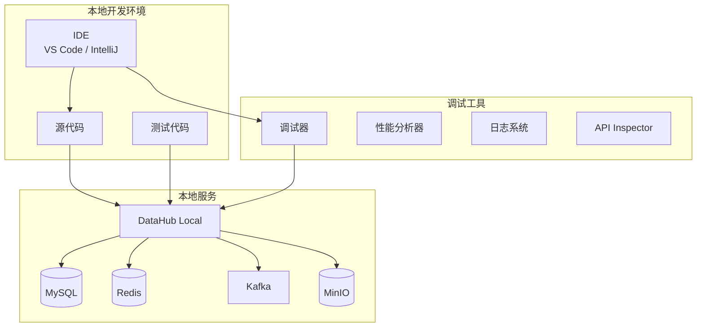
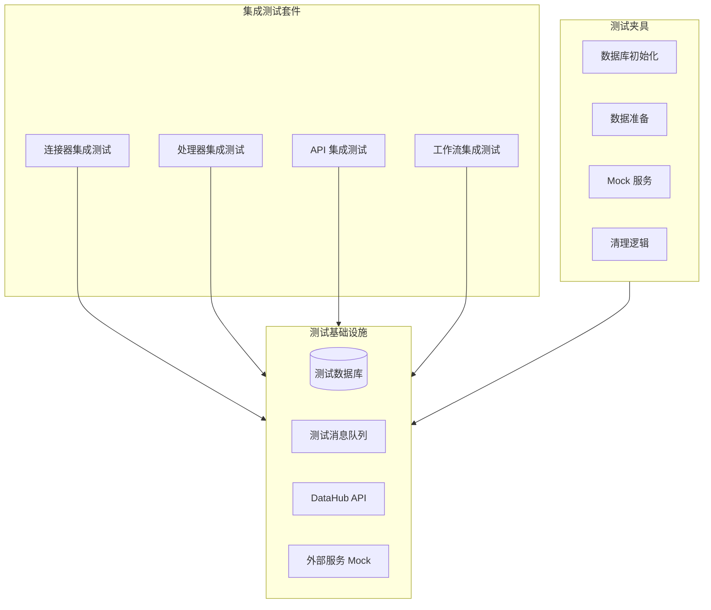
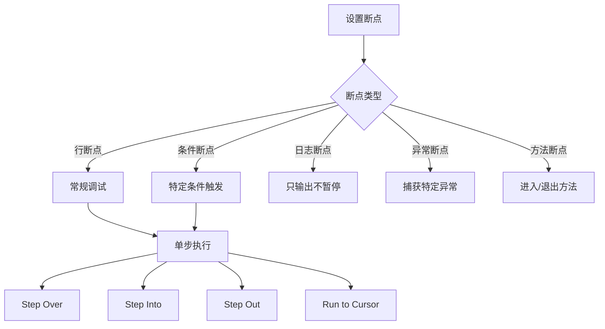
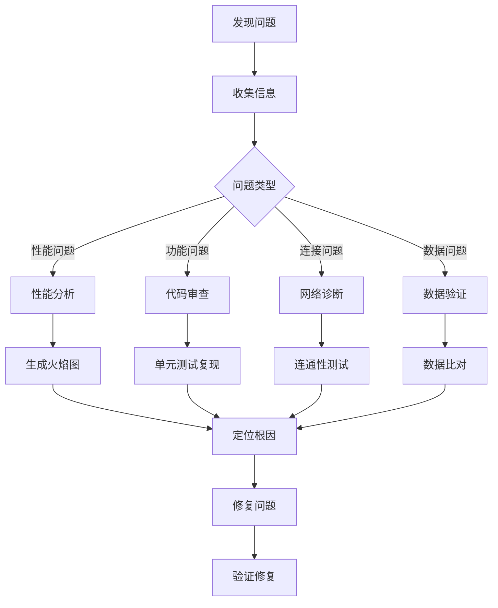

# 调试与测试指南

本文档详细介绍轻易云 DataHub 开发过程中的调试技巧和测试策略，帮助开发者提高开发效率和代码质量。

## 本地调试环境搭建

### 开发环境架构



### Docker Compose 开发环境

```yaml
# docker-compose.dev.yml
version: '3.8'

services:
  datahub:
    image: qingyiyun/datahub:latest-dev
    ports:
      - "8080:8080"
      - "5005:5005"  # 远程调试端口
    environment:
      - DATAHUB_MODE=development
      - DEBUG=true
      - JVM_OPTS=-agentlib:jdwp=transport=dt_socket,server=y,suspend=n,address=*:5005
    volumes:
      - ./logs:/app/logs
      - ./plugins:/app/plugins
      - ./config:/app/config
    depends_on:
      - mysql
      - redis
      - kafka

  mysql:
    image: mysql:8.0
    ports:
      - "3306:3306"
    environment:
      MYSQL_ROOT_PASSWORD: dev_password
      MYSQL_DATABASE: datahub_dev
    volumes:
      - mysql_data:/var/lib/mysql
      - ./sql/init.sql:/docker-entrypoint-initdb.d/init.sql

  redis:
    image: redis:7-alpine
    ports:
      - "6379:6379"
    volumes:
      - redis_data:/data

  kafka:
    image: confluentinc/cp-kafka:latest
    ports:
      - "9092:9092"
    environment:
      KAFKA_ZOOKEEPER_CONNECT: zookeeper:2181
      KAFKA_ADVERTISED_LISTENERS: PLAINTEXT://localhost:9092
    depends_on:
      - zookeeper

  zookeeper:
    image: confluentinc/cp-zookeeper:latest
    environment:
      ZOOKEEPER_CLIENT_PORT: 2181

volumes:
  mysql_data:
  redis_data:
```

### 启动本地环境

```bash
# 克隆开发环境模板
git clone https://github.com/qingyiyun/datahub-dev-env.git
cd datahub-dev-env

# 启动所有服务
docker-compose -f docker-compose.dev.yml up -d

# 查看服务状态
docker-compose ps

# 查看日志
docker-compose logs -f datahub

# 停止环境
docker-compose down
```

## 单元测试编写

### 测试框架选择

| 语言 | 推荐框架 | 特性 | 适用场景 |
|------|----------|------|----------|
| Java | JUnit 5 + Mockito | 成熟、功能丰富 | 企业级开发 |
| Python | pytest | 简洁、插件丰富 | 数据科学、快速开发 |
| JavaScript | Jest | 零配置、快照测试 | 前端、Node.js |
| Go | testing + testify | 标准库支持 | 云原生开发 |

### Java 单元测试示例

```java
package com.qingyiyun.datahub.processor;

import org.junit.jupiter.api.*;
import org.junit.jupiter.api.extension.ExtendWith;
import org.mockito.*;
import org.mockito.junit.jupiter.MockitoExtension;
import static org.mockito.Mockito.*;
import static org.assertj.core.api.Assertions.*;

@ExtendWith(MockitoExtension.class)
@DisplayName("数据验证处理器测试")
public class DataValidationProcessorTest {

    @InjectMocks
    private DataValidationProcessor processor;
    
    @Mock
    private ValidationService validationService;
    
    @Captor
    private ArgumentCaptor<ValidationRequest> requestCaptor;
    
    @BeforeEach
    void setUp() {
        processor = new DataValidationProcessor();
        processor.setValidationService(validationService);
    }
    
    @Nested
    @DisplayName("基本验证测试")
    class BasicValidationTests {
        
        @Test
        @DisplayName("应该通过有效的数据记录")
        void shouldPassValidRecord() {
            // 准备测试数据
            DataRecord record = DataRecord.builder()
                .field("email", "user@example.com")
                .field("age", 25)
                .build();
            
            ProcessContext context = createMockContext();
            
            when(validationService.validate(any()))
                .thenReturn(ValidationResult.valid());
            
            // 执行测试
            ProcessResult result = processor.process(context, record);
            
            // 验证结果
            assertThat(result.getStatus()).isEqualTo(ProcessStatus.SUCCESS);
            verify(validationService).validate(requestCaptor.capture());
            assertThat(requestCaptor.getValue().getEmail())
                .isEqualTo("user@example.com");
        }
        
        @Test
        @DisplayName("应该拒绝无效的数据记录")
        void shouldRejectInvalidRecord() {
            DataRecord record = DataRecord.builder()
                .field("email", "invalid-email")
                .build();
            
            ProcessContext context = createMockContext();
            
            when(validationService.validate(any()))
                .thenReturn(ValidationResult.invalid("Invalid email format"));
            
            ProcessResult result = processor.process(context, record);
            
            assertThat(result.getStatus()).isEqualTo(ProcessStatus.REJECTED);
            assertThat(result.getErrorMessage()).contains("Invalid email format");
        }
    }
    
    @Nested
    @DisplayName("边界条件测试")
    class EdgeCaseTests {
        
        @Test
        @DisplayName("应该处理空记录")
        void shouldHandleEmptyRecord() {
            DataRecord record = DataRecord.empty();
            ProcessContext context = createMockContext();
            
            ProcessResult result = processor.process(context, record);
            
            assertThat(result.getStatus()).isEqualTo(ProcessStatus.SUCCESS);
        }
        
        @Test
        @DisplayName("应该处理超大记录")
        void shouldHandleLargeRecord() {
            // 生成 1MB 大小的记录
            String largeData = "x".repeat(1024 * 1024);
            DataRecord record = DataRecord.builder()
                .field("data", largeData)
                .build();
            
            ProcessContext context = createMockContext();
            
            assertThatCode(() -> processor.process(context, record))
                .doesNotThrowAnyException();
        }
    }
    
    @ParameterizedTest
    @CsvSource({
        "user@example.com, true",
        "invalid-email, false",
        "test@domain.org, true",
        "@nodomain.com, false"
    })
    @DisplayName("应该正确验证各种邮箱格式")
    void shouldValidateEmailFormats(String email, boolean expectedValid) {
        DataRecord record = DataRecord.builder()
            .field("email", email)
            .build();
        
        ProcessContext context = createMockContext();
        
        when(validationService.validate(any()))
            .thenReturn(expectedValid ? ValidationResult.valid() 
                : ValidationResult.invalid("Invalid"));
        
        ProcessResult result = processor.process(context, record);
        
        if (expectedValid) {
            assertThat(result.getStatus()).isEqualTo(ProcessStatus.SUCCESS);
        } else {
            assertThat(result.getStatus()).isEqualTo(ProcessStatus.REJECTED);
        }
    }
    
    private ProcessContext createMockContext() {
        ProcessContext context = mock(ProcessContext.class);
        when(context.getFlowId()).thenReturn("test-flow-001");
        when(context.getLogger()).thenReturn(mock(Logger.class));
        return context;
    }
}
```

### Python 单元测试示例

```python
import pytest
from unittest.mock import Mock, patch, MagicMock
from dataclasses import dataclass
from typing import List, Optional

from datahub.processor import DataValidationProcessor
from datahub.models import DataRecord, ProcessContext, ProcessResult


@pytest.fixture
def processor():
    """创建处理器实例"""
    return DataValidationProcessor()


@pytest.fixture
def mock_context():
    """创建模拟上下文"""
    context = Mock(spec=ProcessContext)
    context.flow_id = "test-flow-001"
    context.logger = Mock()
    return context


class TestDataValidationProcessor:
    """数据验证处理器测试类"""
    
    def test_process_valid_record(self, processor, mock_context):
        """测试处理有效记录"""
        # 准备测试数据
        record = DataRecord({
            "email": "user@example.com",
            "age": 25
        })
        
        # 模拟验证服务
        with patch.object(processor, 'validation_service') as mock_service:
            mock_service.validate.return_value = {"valid": True}
            
            # 执行测试
            result = processor.process(mock_context, record)
            
            # 验证结果
            assert result.status == "SUCCESS"
            assert result.record == record
            mock_service.validate.assert_called_once()
    
    def test_process_invalid_record(self, processor, mock_context):
        """测试处理无效记录"""
        record = DataRecord({
            "email": "invalid-email"
        })
        
        with patch.object(processor, 'validation_service') as mock_service:
            mock_service.validate.return_value = {
                "valid": False,
                "errors": ["Invalid email format"]
            }
            
            result = processor.process(mock_context, record)
            
            assert result.status == "REJECTED"
            assert "Invalid email format" in result.error_message
    
    def test_process_empty_record(self, processor, mock_context):
        """测试处理空记录"""
        record = DataRecord({})
        
        result = processor.process(mock_context, record)
        
        assert result.status == "SUCCESS"
    
    @pytest.mark.parametrize("email,expected_valid", [
        ("user@example.com", True),
        ("test@domain.org", True),
        ("invalid-email", False),
        ("@nodomain.com", False),
        ("", False),
    ])
    def test_email_validation(self, processor, mock_context, email, expected_valid):
        """参数化测试邮箱验证"""
        record = DataRecord({"email": email})
        
        with patch.object(processor, 'validation_service') as mock_service:
            mock_service.validate.return_value = {
                "valid": expected_valid,
                "errors": [] if expected_valid else ["Invalid email"]
            }
            
            result = processor.process(mock_context, record)
            
            assert (result.status == "SUCCESS") == expected_valid
    
    @pytest.fixture
    def batch_records(self):
        """批量测试数据"""
        return [
            DataRecord({"email": f"user{i}@example.com", "age": 20 + i})
            for i in range(100)
        ]
    
    def test_batch_processing(self, processor, mock_context, batch_records):
        """测试批量处理性能"""
        import time
        
        with patch.object(processor, 'validation_service') as mock_service:
            mock_service.validate.return_value = {"valid": True}
            
            start_time = time.time()
            results = processor.process_batch(mock_context, batch_records)
            duration = time.time() - start_time
            
            # 验证所有记录都被处理
            assert len(results) == len(batch_records)
            
            # 验证性能（100 条记录应在 1 秒内完成）
            assert duration < 1.0
            
            # 验证批量验证只调用一次
            mock_service.validate_batch.assert_called_once()


# 使用 pytest 的 fixture 进行依赖注入
@pytest.fixture(scope="session")
def test_database():
    """创建测试数据库"""
    # 启动内存数据库
    db = create_in_memory_db()
    yield db
    # 清理
    db.close()


# 异步测试示例
@pytest.mark.asyncio
async def test_async_processing(processor, mock_context):
    """测试异步处理"""
    record = DataRecord({"email": "async@example.com"})
    
    with patch.object(processor, 'async_validate') as mock_validate:
        mock_validate.return_value = {"valid": True}
        
        result = await processor.process_async(mock_context, record)
        
        assert result.status == "SUCCESS"
        mock_validate.assert_awaited_once()
```

## 集成测试

### 集成测试架构



### Java 集成测试示例

```java
@SpringBootTest(webEnvironment = SpringBootTest.WebEnvironment.RANDOM_PORT)
@Testcontainers
@AutoConfigureMockMvc
@DisplayName("连接器集成测试")
public class ConnectorIntegrationTest {

    @Container
    static MySQLContainer<?> mysql = new MySQLContainer<>("mysql:8.0")
        .withDatabaseName("testdb")
        .withUsername("test")
        .withPassword("test")
        .withInitScript("schema.sql");
    
    @Container
    static GenericContainer<?> redis = new GenericContainer<>("redis:7-alpine")
        .withExposedPorts(6379);
    
    @DynamicPropertySource
    static void configureProperties(DynamicPropertyRegistry registry) {
        registry.add("spring.datasource.url", mysql::getJdbcUrl);
        registry.add("spring.datasource.username", mysql::getUsername);
        registry.add("spring.datasource.password", mysql::getPassword);
        registry.add("spring.redis.host", redis::getHost);
        registry.add("spring.redis.port", redis::getFirstMappedPort);
    }
    
    @Autowired
    private TestRestTemplate restTemplate;
    
    @Autowired
    private JdbcTemplate jdbcTemplate;
    
    @BeforeEach
    void setUp() {
        // 准备测试数据
        jdbcTemplate.execute("""
            INSERT INTO connectors (id, name, type, config) VALUES 
            ('conn-001', 'Test MySQL', 'mysql', '{"host":"localhost"}'),
            ('conn-002', 'Test PostgreSQL', 'postgresql', '{"host":"localhost"}')
        """);
    }
    
    @AfterEach
    void tearDown() {
        // 清理数据
        jdbcTemplate.execute("TRUNCATE TABLE connectors");
    }
    
    @Test
    @DisplayName("应该成功创建连接器")
    void shouldCreateConnector() {
        // 准备请求
        CreateConnectorRequest request = CreateConnectorRequest.builder()
            .name("New MySQL Connector")
            .type("mysql")
            .config(Map.of(
                "host", "localhost",
                "port", 3306,
                "database", "test"
            ))
            .build();
        
        // 发送请求
        ResponseEntity<ConnectorResponse> response = restTemplate.postForEntity(
            "/api/v1/connectors",
            request,
            ConnectorResponse.class
        );
        
        // 验证响应
        assertThat(response.getStatusCode()).isEqualTo(HttpStatus.CREATED);
        assertThat(response.getBody()).isNotNull();
        assertThat(response.getBody().getName()).isEqualTo("New MySQL Connector");
        
        // 验证数据库
        Integer count = jdbcTemplate.queryForObject(
            "SELECT COUNT(*) FROM connectors WHERE name = ?",
            Integer.class,
            "New MySQL Connector"
        );
        assertThat(count).isEqualTo(1);
    }
    
    @Test
    @DisplayName("应该测试连接器连通性")
    void shouldTestConnectorConnectivity() throws JsonProcessingException {
        // 启动 WireMock 服务器模拟外部 API
        WireMockServer wireMockServer = new WireMockServer(8089);
        wireMockServer.start();
        
        wireMockServer.stubFor(post(urlEqualTo("/api/test"))
            .willReturn(aResponse()
                .withStatus(200)
                .withHeader("Content-Type", "application/json")
                .withBody("{\"status\":\"ok\"}")));
        
        try {
            // 准备测试请求
            TestConnectionRequest request = TestConnectionRequest.builder()
                .type("rest")
                .config(Map.of("url", "http://localhost:8089/api/test"))
                .build();
            
            ResponseEntity<ConnectionTestResult> response = restTemplate.postForEntity(
                "/api/v1/connectors/test",
                request,
                ConnectionTestResult.class
            );
            
            assertThat(response.getStatusCode()).isEqualTo(HttpStatus.OK);
            assertThat(response.getBody().isSuccess()).isTrue();
        } finally {
            wireMockServer.stop();
        }
    }
}
```

### Python 集成测试示例

```python
import pytest
import requests
from testcontainers.mysql import MySqlContainer
from testcontainers.redis import RedisContainer
import docker


@pytest.fixture(scope="module")
def test_env():
    """设置集成测试环境"""
    with MySqlContainer("mysql:8.0") as mysql:
        with RedisContainer("redis:7-alpine") as redis:
            # 启动 DataHub 服务
            client = docker.from_env()
            container = client.containers.run(
                "qingyiyun/datahub:latest",
                environment={
                    "DB_URL": mysql.get_connection_url(),
                    "REDIS_URL": redis.get_connection_url(),
                    "MODE": "test"
                },
                ports={'8080/tcp': 18080},
                detach=True
            )
            
            # 等待服务就绪
            wait_for_service("http://localhost:18080/health")
            
            yield {
                "api_url": "http://localhost:18080",
                "mysql": mysql,
                "redis": redis
            }
            
            # 清理
            container.stop()


def wait_for_service(url, timeout=60):
    """等待服务就绪"""
    import time
    start = time.time()
    while time.time() - start < timeout:
        try:
            response = requests.get(url, timeout=5)
            if response.status_code == 200:
                return
        except:
            pass
        time.sleep(1)
    raise TimeoutError(f"Service not ready after {timeout}s")


class TestConnectorIntegration:
    """连接器集成测试"""
    
    def test_create_and_fetch_connector(self, test_env):
        """测试创建和获取连接器"""
        api_url = test_env["api_url"]
        
        # 创建连接器
        create_payload = {
            "name": "Integration Test MySQL",
            "type": "mysql",
            "config": {
                "host": "localhost",
                "port": 3306,
                "database": "test",
                "username": "root",
                "password": "test"
            }
        }
        
        create_response = requests.post(
            f"{api_url}/api/v1/connectors",
            json=create_payload
        )
        
        assert create_response.status_code == 201
        connector_id = create_response.json()["id"]
        
        # 获取连接器
        get_response = requests.get(
            f"{api_url}/api/v1/connectors/{connector_id}"
        )
        
        assert get_response.status_code == 200
        assert get_response.json()["name"] == "Integration Test MySQL"
    
    def test_data_sync_workflow(self, test_env):
        """测试完整的数据同步工作流"""
        api_url = test_env["api_url"]
        
        # 1. 创建源连接器
        source = requests.post(f"{api_url}/api/v1/connectors", json={
            "name": "Source DB",
            "type": "mysql",
            "config": {"host": "source-db", "database": "source"}
        }).json()
        
        # 2. 创建目标连接器
        target = requests.post(f"{api_url}/api/v1/connectors", json={
            "name": "Target DB",
            "type": "postgresql",
            "config": {"host": "target-db", "database": "target"}
        }).json()
        
        # 3. 创建同步任务
        task = requests.post(f"{api_url}/api/v1/tasks", json={
            "name": "Integration Sync",
            "source_connector_id": source["id"],
            "target_connector_id": target["id"],
            "config": {
                "source_table": "users",
                "target_table": "users_backup",
                "sync_mode": "full"
            }
        }).json()
        
        # 4. 执行任务
        execute_response = requests.post(
            f"{api_url}/api/v1/tasks/{task['id']}/execute"
        )
        
        assert execute_response.status_code == 202
        
        # 5. 等待任务完成
        job_id = execute_response.json()["job_id"]
        wait_for_job_completion(api_url, job_id)
        
        # 6. 验证同步结果
        status = requests.get(
            f"{api_url}/api/v1/jobs/{job_id}"
        ).json()
        
        assert status["status"] == "COMPLETED"
        assert status["records_processed"] > 0


def wait_for_job_completion(api_url, job_id, timeout=300):
    """等待任务完成"""
    import time
    start = time.time()
    while time.time() - start < timeout:
        response = requests.get(f"{api_url}/api/v1/jobs/{job_id}")
        status = response.json()["status"]
        if status in ["COMPLETED", "FAILED"]:
            return
        time.sleep(2)
    raise TimeoutError(f"Job not completed after {timeout}s")
```

## 性能测试

### 性能测试指标

| 指标名称 | 说明 | 目标值 | 测试方法 |
|----------|------|--------|----------|
| 吞吐量 | 每秒处理记录数 | > 10000 RPS | 负载测试 |
| 延迟 | 端到端处理延迟 | P99 < 100ms | 压力测试 |
| 并发 | 最大并发连接数 | > 1000 | 并发测试 |
| 内存 | 内存占用峰值 | < 4GB | 内存分析 |
| CPU | CPU 使用率峰值 | < 80% | 性能分析 |

### JMeter 性能测试脚本

```xml
<?xml version="1.0" encoding="UTF-8"?>
<jmeterTestPlan version="1.2">
  <hashTree>
    <TestPlan guiclass="TestPlanGui" testname="DataHub 性能测试">
      <elementProp name="TestPlan.user_defined_variables">
        <collectionProp name="Arguments.arguments">
          <elementProp name="base_url" elementType="Argument">
            <stringProp name="Argument.value">${__P(base_url,http://localhost:8080)}</stringProp>
          </elementProp>
        </collectionProp>
      </elementProp>
    </TestPlan>
    
    <ThreadGroup guiclass="ThreadGroupGui" testname="数据写入负载">
      <intProp name="ThreadGroup.num_threads">100</intProp>
      <intProp name="ThreadGroup.ramp_time">60</intProp>
      <longProp name="ThreadGroup.duration">300</longProp>
      
      <HTTPSamplerProxy guiclass="HttpTestSampleGui" testname="写入数据">
        <elementProp name="HTTPsampler.Arguments">
          <collectionProp name="Arguments.arguments">
            <elementProp name="" elementType="HTTPArgument">
              <boolProp name="HTTPArgument.always_encode">false</boolProp>
              <stringProp name="Argument.value">{"records":${__RandomString(100,abcdefghijklmnopqrstuvwxyz)}}</stringProp>
              <stringProp name="Argument.metadata">=</stringProp>
            </elementProp>
          </collectionProp>
        </elementProp>
        <stringProp name="HTTPSampler.domain">${base_url}</stringProp>
        <stringProp name="HTTPSampler.path">/api/v1/data/write</stringProp>
        <stringProp name="HTTPSampler.method">POST</stringProp>
      </HTTPSamplerProxy>
      
      <ResultCollector guiclass="StatVisualizer" testname="聚合报告">
        <boolProp name="ResultCollector.error_logging">false</boolProp>
        <objProp>
          <name>saveConfig</name>
          <value class="SampleSaveConfiguration">
            <time>true</time>
            <latency>true</latency>
            <timestamp>true</timestamp>
            <success>true</success>
            <label>true</label>
            <code>true</code>
            <message>true</message>
            <threadName>true</threadName>
          </value>
        </objProp>
      </ResultCollector>
    </ThreadGroup>
  </hashTree>
</jmeterTestPlan>
```

### Python 性能测试

```python
import asyncio
import aiohttp
import time
from statistics import mean, median
import matplotlib.pyplot as plt


class PerformanceTester:
    """性能测试工具"""
    
    def __init__(self, base_url: str):
        self.base_url = base_url
        self.results = []
    
    async def send_request(self, session: aiohttp.ClientSession) -> float:
        """发送单个请求并返回延迟"""
        start = time.time()
        try:
            async with session.post(
                f"{self.base_url}/api/v1/data/write",
                json={"data": "test"}
            ) as response:
                await response.text()
                latency = time.time() - start
                return latency
        except Exception as e:
            print(f"Request failed: {e}")
            return -1
    
    async def run_load_test(
        self, 
        concurrent_users: int, 
        requests_per_user: int
    ) -> dict:
        """运行负载测试"""
        all_latencies = []
        
        async with aiohttp.ClientSession() as session:
            # 预热
            await self.send_request(session)
            
            # 正式测试
            start_time = time.time()
            
            tasks = []
            for _ in range(concurrent_users):
                for _ in range(requests_per_user):
                    tasks.append(self.send_request(session))
            
            results = await asyncio.gather(*tasks)
            total_time = time.time() - start_time
            
            # 过滤失败请求
            latencies = [r for r in results if r > 0]
            failed_count = len(results) - len(latencies)
            
            # 计算指标
            metrics = {
                "concurrent_users": concurrent_users,
                "total_requests": len(results),
                "successful_requests": len(latencies),
                "failed_requests": failed_count,
                "throughput_rps": len(latencies) / total_time,
                "total_time": total_time,
                "latency_avg": mean(latencies) if latencies else 0,
                "latency_median": median(latencies) if latencies else 0,
                "latency_p99": sorted(latencies)[int(len(latencies) * 0.99)] if latencies else 0,
                "latency_min": min(latencies) if latencies else 0,
                "latency_max": max(latencies) if latencies else 0
            }
            
            return metrics
    
    def generate_report(self, results: list, output_file: str = "perf_report.html"):
        """生成性能测试报告"""
        # 创建图表
        fig, axes = plt.subplots(2, 2, figsize=(12, 10))
        
        # 吞吐量图表
        users = [r["concurrent_users"] for r in results]
        throughput = [r["throughput_rps"] for r in results]
        axes[0, 0].plot(users, throughput, marker='o')
        axes[0, 0].set_xlabel('并发用户数')
        axes[0, 0].set_ylabel('吞吐量 (RPS)')
        axes[0, 0].set_title('吞吐量随并发数变化')
        axes[0, 0].grid(True)
        
        # 延迟图表
        avg_latency = [r["latency_avg"] * 1000 for r in results]
        p99_latency = [r["latency_p99"] * 1000 for r in results]
        axes[0, 1].plot(users, avg_latency, marker='o', label='平均延迟')
        axes[0, 1].plot(users, p99_latency, marker='s', label='P99 延迟')
        axes[0, 1].set_xlabel('并发用户数')
        axes[0, 1].set_ylabel('延迟 (ms)')
        axes[0, 1].set_title('延迟随并发数变化')
        axes[0, 1].legend()
        axes[0, 1].grid(True)
        
        plt.tight_layout()
        plt.savefig(output_file.replace('.html', '.png'))
        print(f"报告已保存: {output_file}")


# 运行性能测试
async def main():
    tester = PerformanceTester("http://localhost:8080")
    
    # 不同并发级别的测试
    results = []
    for concurrent_users in [10, 50, 100, 200, 500]:
        print(f"\n测试并发用户数: {concurrent_users}")
        result = await tester.run_load_test(concurrent_users, requests_per_user=100)
        results.append(result)
        
        print(f"  吞吐量: {result['throughput_rps']:.2f} RPS")
        print(f"  平均延迟: {result['latency_avg'] * 1000:.2f} ms")
        print(f"  P99 延迟: {result['latency_p99'] * 1000:.2f} ms")
    
    # 生成报告
    tester.generate_report(results)


if __name__ == "__main__":
    asyncio.run(main())
```

## 调试技巧

### 远程调试配置

#### Java 远程调试

```bash
# 启动参数
java -agentlib:jdwp=transport=dt_socket,server=y,suspend=n,address=5005 \
     -jar datahub-server.jar

# 或者使用 Docker
docker run -p 8080:8080 -p 5005:5005 \
  -e JVM_OPTS="-agentlib:jdwp=transport=dt_socket,server=y,suspend=n,address=*:5005" \
  qingyiyun/datahub:latest
```

VS Code 配置：
```json
{
    "version": "0.2.0",
    "configurations": [
        {
            "type": "java",
            "name": "Debug DataHub",
            "request": "attach",
            "hostName": "localhost",
            "port": 5005
        }
    ]
}
```

#### Python 远程调试

```python
# 使用 debugpy
import debugpy

# 监听调试连接
debugpy.listen(("0.0.0.0", 5678))
print("等待调试器连接...")
debugpy.wait_for_client()
print("调试器已连接")

# 你的代码
from datahub.server import start_server
start_server()
```

### 日志调试技巧

```java
// 结构化日志
import org.slf4j.Logger;
import org.slf4j.LoggerFactory;
import net.logstash.logback.marker.Markers;

@Slf4j
public class DataProcessor {
    
    public ProcessResult process(ProcessContext ctx, DataRecord record) {
        // 使用 MDC 添加上下文信息
        MDC.put("flowId", ctx.getFlowId());
        MDC.put("recordId", record.getId());
        MDC.put("traceId", ctx.getTraceId());
        
        try {
            log.info("开始处理记录");
            
            // 详细调试日志
            if (log.isDebugEnabled()) {
                log.debug("记录详情: {}", record.toJson());
            }
            
            // 性能计时
            long start = System.currentTimeMillis();
            ProcessResult result = doProcess(record);
            long duration = System.currentTimeMillis() - start;
            
            // 结构化日志输出
            log.info(Markers.append("duration_ms", duration)
                      .and(Markers.append("status", result.getStatus())),
                "记录处理完成");
            
            return result;
        } catch (Exception e) {
            // 错误日志包含完整上下文
            log.error("处理记录失败", e);
            throw e;
        } finally {
            MDC.clear();
        }
    }
}
```

### 断点调试技巧



## 常见问题排查

### 问题排查流程



### 常见问题速查表

| 问题现象 | 可能原因 | 排查方法 | 解决方案 |
|----------|----------|----------|----------|
| 连接超时 | 网络不通、防火墙 | `telnet`/`ping` | 检查网络配置 |
| 认证失败 | 密钥错误、过期 | 查看认证日志 | 更新密钥 |
| 数据丢失 | 事务未提交 | 检查事务配置 | 启用事务 |
| 内存溢出 | 大数据集未分页 | 内存分析 | 增加分页 |
| 性能下降 | 索引缺失 | 查询分析 | 添加索引 |
| 死锁 | 并发冲突 | 锁监控 | 优化并发 |

### 诊断脚本示例

```python
#!/usr/bin/env python3
"""
DataHub 诊断工具
"""
import sys
import requests
import psutil
import json
from datetime import datetime


def check_service_health(base_url: str) -> dict:
    """检查服务健康状态"""
    results = {
        "timestamp": datetime.now().isoformat(),
        "checks": []
    }
    
    # 1. API 连通性检查
    try:
        response = requests.get(f"{base_url}/health", timeout=5)
        results["checks"].append({
            "name": "API Health",
            "status": "PASS" if response.status_code == 200 else "FAIL",
            "details": response.json() if response.status_code == 200 else response.text
        })
    except Exception as e:
        results["checks"].append({
            "name": "API Health",
            "status": "FAIL",
            "details": str(e)
        })
    
    # 2. 数据库连接检查
    try:
        response = requests.get(f"{base_url}/api/v1/status/database", timeout=5)
        results["checks"].append({
            "name": "Database Connection",
            "status": "PASS" if response.status_code == 200 else "FAIL",
            "latency_ms": response.elapsed.total_seconds() * 1000
        })
    except Exception as e:
        results["checks"].append({
            "name": "Database Connection",
            "status": "FAIL",
            "details": str(e)
        })
    
    # 3. 系统资源检查
    results["checks"].append({
        "name": "System Resources",
        "status": "INFO",
        "details": {
            "cpu_percent": psutil.cpu_percent(),
            "memory_percent": psutil.virtual_memory().percent,
            "disk_usage": psutil.disk_usage('/').percent
        }
    })
    
    return results


def analyze_logs(log_file: str, since: str = None) -> list:
    """分析日志文件"""
    errors = []
    
    with open(log_file, 'r') as f:
        for line_num, line in enumerate(f, 1):
            # 查找错误日志
            if 'ERROR' in line or 'EXCEPTION' in line:
                errors.append({
                    "line": line_num,
                    "content": line.strip()
                })
    
    return errors


def main():
    if len(sys.argv) < 2:
        print("Usage: python diagnose.py <base_url> [log_file]")
        sys.exit(1)
    
    base_url = sys.argv[1]
    
    print("=" * 60)
    print("DataHub 诊断报告")
    print("=" * 60)
    
    # 执行健康检查
    health = check_service_health(base_url)
    print("\n健康检查:")
    print(json.dumps(health, indent=2, ensure_ascii=False))
    
    # 分析日志
    if len(sys.argv) > 2:
        log_file = sys.argv[2]
        print(f"\n日志分析 ({log_file}):")
        errors = analyze_logs(log_file)
        if errors:
            print(f"发现 {len(errors)} 个错误:")
            for error in errors[:10]:  # 只显示前 10 个
                print(f"  行 {error['line']}: {error['content'][:100]}")
        else:
            print("未发现错误")
    
    print("\n" + "=" * 60)


if __name__ == "__main__":
    main()
```

> **Note**: 定期运行诊断脚本可以帮助及早发现潜在问题。

> **Warning**: 生产环境调试时请谨慎操作，避免影响线上服务。
