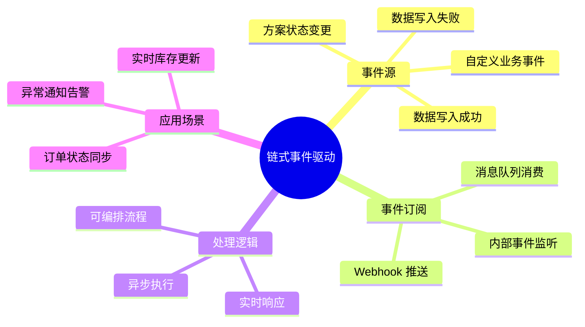
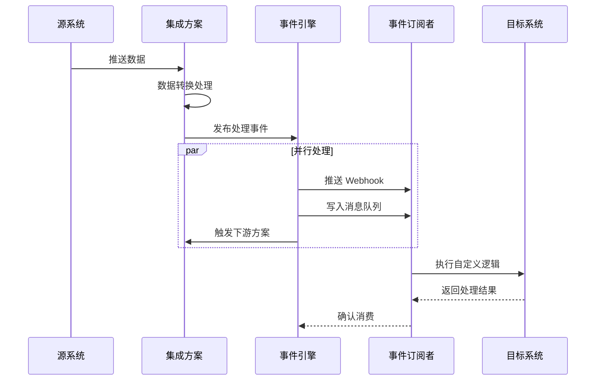
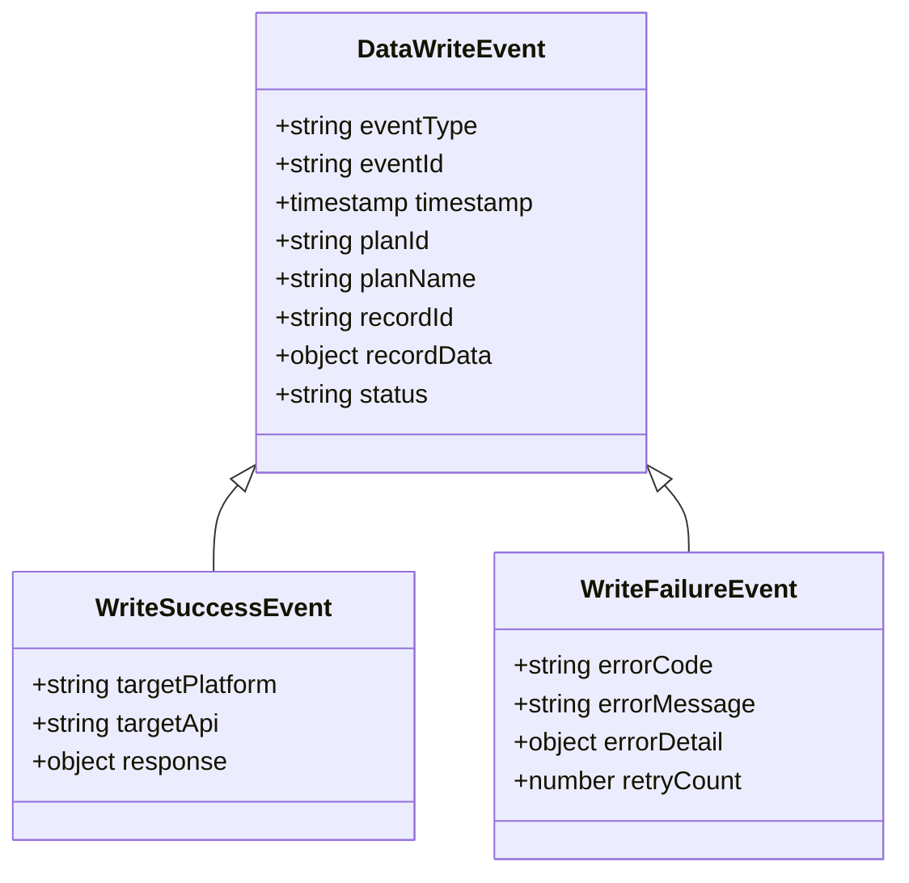
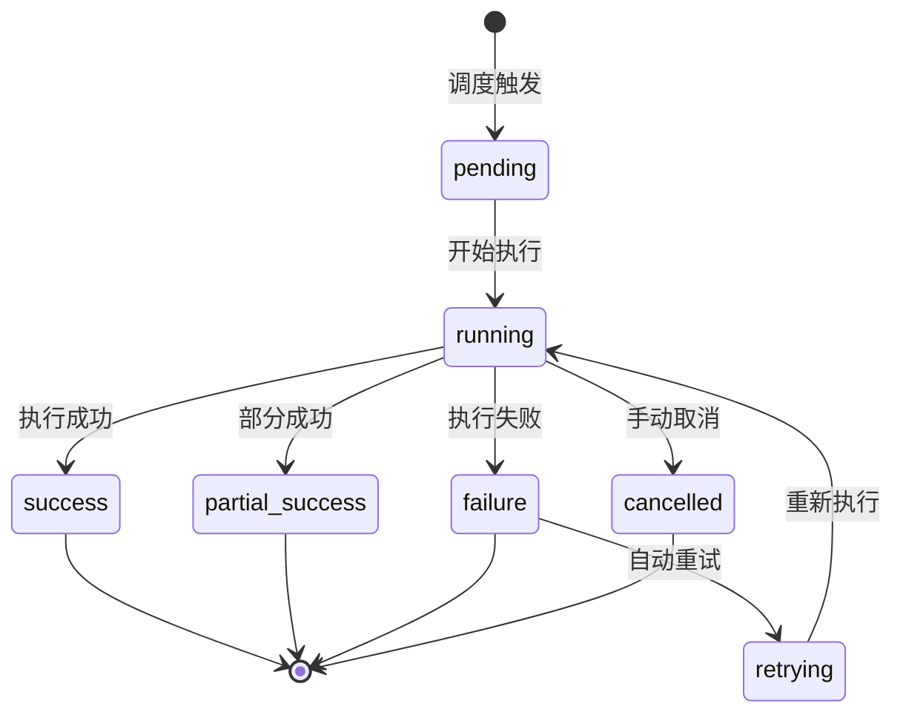
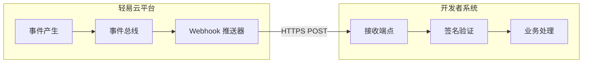
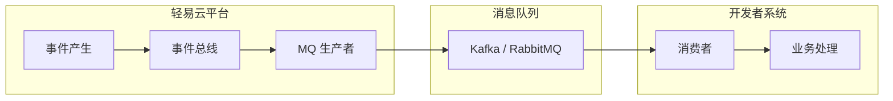
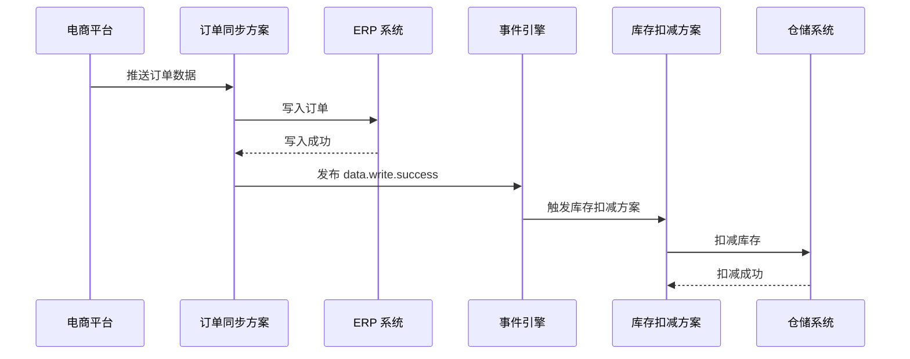
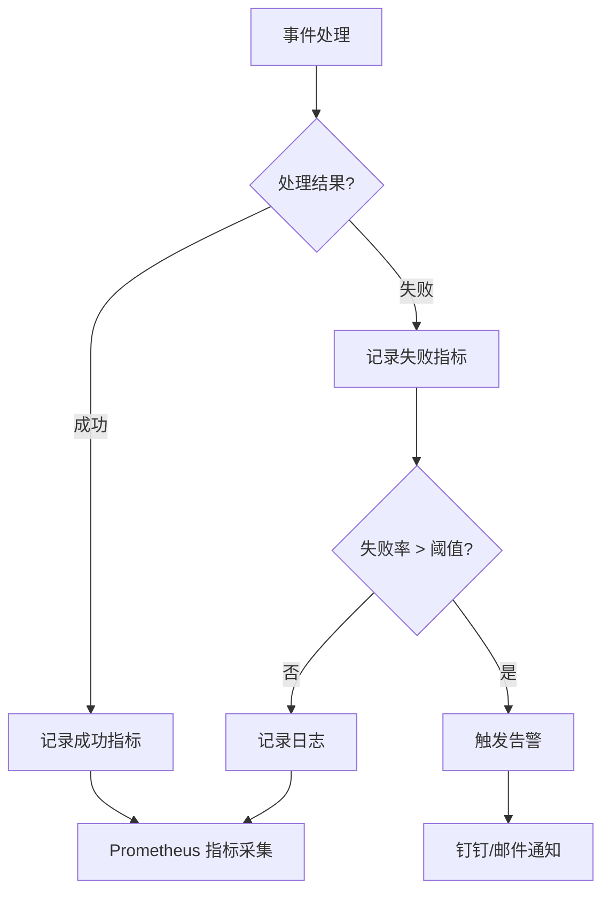

# 链式事件驱动

链式事件驱动是轻易云 iPaaS 平台提供的一种细粒度事件响应机制，允许在单个数据记录处理完成后立即触发下游逻辑。与方案级的[链式触发](../advanced/chain-trigger)不同，链式事件驱动聚焦于数据级联动，适用于需要实时响应单条数据变更的场景。

> [!IMPORTANT]
> 本文档涉及事件订阅、Webhook 配置等开发者功能，需要登录后查看完整内容。未登录用户可预览前 25 行内容。

## 核心概念



### 链式事件驱动的工作流程



### 与链式触发的对比

| 对比维度 | 链式事件驱动（数据级） | 链式触发（方案级） |
| -------- | ---------------------- | ------------------ |
| **触发时机** | 单条数据处理完成 | 整个方案执行完成 |
| **响应延迟** | 毫秒级实时响应 | 秒级异步响应 |
| **数据粒度** | 单条记录 | 批次上下文 |
| **适用场景** | 实时联动、即时响应 | 批量处理、流程编排 |
| **配置位置** | 数据映射 / 转换配置 | 目标平台配置 |
| **失败影响** | 单条失败不影响其他 | 方案级重试机制 |

## 平台内部事件类型

轻易云 iPaaS 平台定义了以下几类核心事件，开发者可以订阅这些事件以触发自定义逻辑。

### 数据写入事件



#### 数据写入成功事件

当单条数据成功写入目标系统后触发。

| 字段 | 类型 | 说明 |
| ---- | ---- | ---- |
| `eventType` | string | 固定值：`data.write.success` |
| `eventId` | string | 事件唯一标识 |
| `timestamp` | timestamp | 事件产生时间（ISO 8601 格式） |
| `planId` | string | 产生事件的集成方案 ID |
| `planName` | string | 集成方案名称 |
| `recordId` | string | 数据记录唯一标识 |
| `recordData` | object | 写入的数据内容（脱敏后） |
| `targetPlatform` | string | 目标平台标识 |
| `targetApi` | string | 调用的目标 API |

事件示例：

```json
{
  "eventType": "data.write.success",
  "eventId": "evt_abc123def456",
  "timestamp": "2026-03-13T10:30:00.123Z",
  "planId": "plan_order_sync_001",
  "planName": "订单同步方案",
  "recordId": "ORD202403130001",
  "recordData": {
    "orderId": "ORD202403130001",
    "customerId": "CUST001",
    "amount": 1999.00,
    "status": "confirmed"
  },
  "targetPlatform": "kingdee-cloud",
  "targetApi": "order.create",
  "response": {
    "code": 0,
    "data": {
      "kingdeeOrderId": "KD202403130001"
    }
  }
}
```

#### 数据写入失败事件

当单条数据写入目标系统失败时触发，可用于错误通知、补偿处理等场景。

| 字段 | 类型 | 说明 |
| ---- | ---- | ---- |
| `eventType` | string | 固定值：`data.write.failure` |
| `errorCode` | string | 错误码 |
| `errorMessage` | string | 错误描述 |
| `errorDetail` | object | 详细错误信息 |
| `retryCount` | number | 已重试次数 |
| `willRetry` | boolean | 是否会自动重试 |

事件示例：

```json
{
  "eventType": "data.write.failure",
  "eventId": "evt_xyz789abc012",
  "timestamp": "2026-03-13T10:30:05.456Z",
  "planId": "plan_order_sync_001",
  "planName": "订单同步方案",
  "recordId": "ORD202403130002",
  "recordData": {
    "orderId": "ORD202403130002",
    "customerId": "CUST002",
    "amount": 5999.00
  },
  "targetPlatform": "kingdee-cloud",
  "targetApi": "order.create",
  "errorCode": "INVENTORY_INSUFFICIENT",
  "errorMessage": "库存不足，无法创建订单",
  "errorDetail": {
    "productId": "SKU001",
    "requestedQty": 100,
    "availableQty": 50,
    "warehouseId": "WH001"
  },
  "retryCount": 2,
  "willRetry": false
}
```

### 方案状态变更事件

当集成方案的执行状态发生变更时触发。



#### 方案执行状态事件

| 事件类型 | 状态值 | 说明 |
| -------- | ------ | ---- |
| `plan.execution.started` | running | 方案开始执行 |
| `plan.execution.success` | success | 方案执行成功 |
| `plan.execution.partial_success` | partial_success | 部分成功（部分记录失败） |
| `plan.execution.failure` | failure | 方案执行失败 |
| `plan.execution.cancelled` | cancelled | 方案被取消 |

事件示例：

```json
{
  "eventType": "plan.execution.success",
  "eventId": "evt_plan_success_001",
  "timestamp": "2026-03-13T10:35:00.000Z",
  "planId": "plan_order_sync_001",
  "planName": "订单同步方案",
  "executionId": "exec_202403130001",
  "executionContext": {
    "triggerType": "scheduled",
    "triggerTime": "2026-03-13T10:30:00.000Z",
    "sourceRecordCount": 150,
    "successRecordCount": 150,
    "failureRecordCount": 0,
    "executionDuration": 12500
  }
}
```

### 自定义业务事件

开发者可以在适配器或自定义脚本中触发自定义事件。

```json
{
  "eventType": "custom.business.event",
  "eventId": "evt_custom_001",
  "timestamp": "2026-03-13T10:40:00.000Z",
  "planId": "plan_custom_001",
  "customEventName": "vip.order.created",
  "customData": {
    "customerTier": "VIP",
    "orderAmount": 50000,
    "specialHandling": true
  }
}
```

## 事件订阅方式

轻易云 iPaaS 平台提供多种事件订阅方式，满足不同场景的需求。

### Webhook 推送

通过 HTTP 回调方式将事件推送到指定端点。



#### 配置 Webhook 订阅

1. 进入控制台 **开发者中心 > 事件订阅**
2. 点击**新建订阅**，选择订阅类型为 **Webhook**
3. 配置订阅参数：

| 参数 | 必填 | 说明 |
| ---- | ---- | ---- |
| 订阅名称 | ✅ | 订阅规则名称 |
| 端点 URL | ✅ | 接收事件的 HTTPS 地址 |
| 订阅事件 | ✅ | 选择要订阅的事件类型 |
| 重试策略 | — | 推送失败时的重试配置 |
| 签名密钥 | — | 用于验证请求签名 |

#### Webhook 推送格式

```http
POST /webhook/event-handler HTTP/1.1
Host: your-server.com
Content-Type: application/json
X-QEasy-Event-Id: evt_abc123def456
X-QEasy-Event-Type: data.write.success
X-QEasy-Signature: sha256=xxxxxxxxxxxxxxxx
X-QEasy-Timestamp: 1710325800123

{
  "eventType": "data.write.success",
  "eventId": "evt_abc123def456",
  "timestamp": "2026-03-13T10:30:00.123Z",
  "planId": "plan_order_sync_001",
  ...
}
```

#### 签名验证

为确保 Webhook 请求的安全性，建议验证请求签名：

```javascript
const crypto = require('crypto');

function verifyWebhookSignature(payload, signature, secret) {
  const expectedSignature = crypto
    .createHmac('sha256', secret)
    .update(payload)
    .digest('hex');
  
  return crypto.timingSafeEqual(
    Buffer.from(signature),
    Buffer.from(`sha256=${expectedSignature}`)
  );
}

// Express 示例
app.post('/webhook/event-handler', (req, res) => {
  const signature = req.headers['x-qeasy-signature'];
  const payload = JSON.stringify(req.body);
  
  if (!verifyWebhookSignature(payload, signature, WEBHOOK_SECRET)) {
    return res.status(401).send('Invalid signature');
  }
  
  // 处理事件
  handleEvent(req.body);
  res.status(200).send('OK');
});
```

```python
import hmac
import hashlib
from flask import Flask, request, abort

app = Flask(__name__)
WEBHOOK_SECRET = b'your_webhook_secret'

def verify_signature(payload, signature, secret):
    expected = hmac.new(
        secret,
        payload.encode('utf-8'),
        hashlib.sha256
    ).hexdigest()
    return hmac.compare_digest(f'sha256={expected}', signature)

@app.route('/webhook/event-handler', methods=['POST'])
def handle_webhook():
    signature = request.headers.get('X-QEasy-Signature')
    payload = request.get_data(as_text=True)
    
    if not verify_signature(payload, signature, WEBHOOK_SECRET):
        abort(401)
    
    event = request.json
    handle_event(event)
    return 'OK'
```

#### 重试机制

当 Webhook 推送失败（HTTP 状态码非 2xx 或连接超时）时，平台会自动重试：

| 重试次数 | 延迟时间 | 说明 |
| -------- | -------- | ---- |
| 第 1 次 | 立即 | 首次推送失败 |
| 第 2 次 | 30 秒后 | 第 1 次重试 |
| 第 3 次 | 2 分钟后 | 第 2 次重试 |
| 第 4 次 | 10 分钟后 | 第 3 次重试 |
| 第 5 次 | 30 分钟后 | 最后尝试 |

> [!WARNING]
> 如果 5 次重试均失败，事件将被移至死信队列，需要手动处理。建议实现幂等处理逻辑，防止重复处理同一事件。

### 消息队列消费

对于高吞吐量场景，可以通过消息队列（MQ）订阅事件。



#### 支持的 MQ 类型

| MQ 类型 | 适用场景 | 配置复杂度 |
| -------- | -------- | ---------- |
| Kafka | 高吞吐量、流处理 | 中 |
| RabbitMQ | 路由灵活、延迟队列 | 低 |
| RocketMQ | 事务消息、顺序消息 | 中 |

#### Kafka 消费示例

```javascript
const { Kafka } = require('kafkajs');

const kafka = new Kafka({
  clientId: 'qeasy-event-consumer',
  brokers: ['kafka.qeasy.cloud:9092'],
  ssl: true,
  sasl: {
    mechanism: 'plain',
    username: 'your_consumer_key',
    password: 'your_consumer_secret'
  }
});

const consumer = kafka.consumer({ groupId: 'order-sync-group' });

await consumer.connect();
await consumer.subscribe({ topic: 'qeasy.data.write.events' });

await consumer.run({
  eachMessage: async ({ topic, partition, message }) => {
    const event = JSON.parse(message.value.toString());
    
    if (event.eventType === 'data.write.success') {
      await handleWriteSuccess(event);
    } else if (event.eventType === 'data.write.failure') {
      await handleWriteFailure(event);
    }
  }
});
```

```python
from kafka import KafkaConsumer
import json

consumer = KafkaConsumer(
    'qeasy.data.write.events',
    bootstrap_servers=['kafka.qeasy.cloud:9092'],
    security_protocol='SSL',
    ssl_cafile='ca-cert.pem',
    ssl_certfile='client-cert.pem',
    ssl_keyfile='client-key.pem',
    value_deserializer=lambda m: json.loads(m.decode('utf-8'))
)

for message in consumer:
    event = message.value
    
    if event['eventType'] == 'data.write.success':
        handle_write_success(event)
    elif event['eventType'] == 'data.write.failure':
        handle_write_failure(event)
```

### 内部事件监听（适配器内）

在自定义适配器中监听事件并执行同步逻辑。

```php
<?php

namespace App\Adapter;

use QEasy\Adapter\BaseAdapter;
use QEasy\Event\EventSubscriberInterface;

class OrderSyncAdapter extends BaseAdapter implements EventSubscriberInterface
{
    /**
     * 返回订阅的事件类型列表
     */
    public static function getSubscribedEvents(): array
    {
        return [
            'data.write.success' => 'onWriteSuccess',
            'data.write.failure' => 'onWriteFailure',
            'plan.execution.success' => 'onPlanSuccess'
        ];
    }
    
    /**
     * 数据写入成功事件处理
     */
    public function onWriteSuccess(array $event): void
    {
        $recordId = $event['recordId'];
        $recordData = $event['recordData'];
        
        // 执行业务逻辑，如：更新缓存、发送通知等
        $this->logger->info("订单 {$recordId} 同步成功");
        
        // 触发下游处理
        $this->triggerDownstreamProcess($recordData);
    }
    
    /**
     * 数据写入失败事件处理
     */
    public function onWriteFailure(array $event): void
    {
        $recordId = $event['recordId'];
        $errorMessage = $event['errorMessage'];
        
        // 记录错误日志
        $this->logger->error("订单 {$recordId} 同步失败: {$errorMessage}");
        
        // 发送告警通知
        $this->sendAlertNotification($event);
        
        // 写入失败记录表，供后续人工处理
        $this->recordFailureForManualReview($event);
    }
    
    /**
     * 方案执行成功事件处理
     */
    public function onPlanSuccess(array $event): void
    {
        $executionContext = $event['executionContext'];
        
        // 生成执行报告
        $this->generateExecutionReport($executionContext);
    }
}
```

## 实战场景

### 场景一：实时库存扣减

当订单数据写入 ERP 系统成功后，立即触发库存扣减。



配置步骤：

1. 在订单同步方案的数据映射中配置事件触发：

```json
{
  "mappings": [
    {
      "source": "order_id",
      "target": "orderId"
    },
    {
      "source": "items",
      "target": "orderItems",
      "transform": {
        "type": "chain_event",
        "trigger": {
          "condition": "{{status}} === 'paid'",
          "targetPlanId": "inventory_deduct_plan",
          "passData": {
            "orderId": "{{order_id}}",
            "items": "{{items}}",
            "warehouseId": "{{warehouse_id}}"
          },
          "eventName": "inventory.deduct.request"
        }
      }
    }
  ]
}
```

2. 库存扣减方案监听事件：

```json
{
  "source": {
    "type": "EVENT",
    "strategy": "event",
    "listenEvent": "inventory.deduct.request",
    "contextMapping": {
      "orderId": "{{context.orderId}}",
      "items": "{{context.items}}",
      "warehouseId": "{{context.warehouseId}}"
    }
  },
  "target": {
    "platform": "wms",
    "api": "inventory.deduct"
  }
}
```

### 场景二：异常订单告警

当数据写入失败时，立即发送告警通知。

```javascript
// Webhook 处理器示例
app.post('/webhook/error-alert', async (req, res) => {
  const event = req.body;
  
  if (event.eventType === 'data.write.failure') {
    const { recordId, errorMessage, errorDetail, planName } = event;
    
    // 构建告警消息
    const alertMessage = {
      msgtype: 'markdown',
      markdown: {
        title: '数据同步失败告警',
        text: `### ⚠️ 数据同步失败告警
        
**方案名称**：${planName}

**记录 ID**：${recordId}

**错误信息**：${errorMessage}

**详细信息**：
\`\`\`json
${JSON.stringify(errorDetail, null, 2)}
\`\`\`

**处理建议**：请检查目标系统状态和数据合法性
        `
      }
    };
    
    // 发送钉钉告警
    await sendDingTalkAlert(alertMessage);
    
    // 写入故障记录
    await logFailureToDatabase(event);
  }
  
  res.status(200).send('OK');
});
```

### 场景三：数据一致性补偿

当数据写入失败时，自动执行补偿逻辑。

```php
<?php

namespace App\Handler;

use QEasy\Compensation\CompensationHandlerInterface;

class OrderSyncCompensationHandler implements CompensationHandlerInterface
{
    /**
     * 补偿处理入口
     */
    public function compensate(array $event): CompensationResult
    {
        $recordData = $event['recordData'];
        $errorCode = $event['errorCode'];
        
        // 根据错误类型执行不同的补偿策略
        switch ($errorCode) {
            case 'DUPLICATE_ORDER':
                return $this->handleDuplicateOrder($recordData);
                
            case 'INVENTORY_INSUFFICIENT':
                return $this->handleInsufficientInventory($recordData);
                
            case 'CUSTOMER_NOT_FOUND':
                return $this->handleCustomerNotFound($recordData);
                
            default:
                return $this->defaultCompensation($event);
        }
    }
    
    /**
     * 处理重复订单：更新而非插入
     */
    private function handleDuplicateOrder(array $recordData): CompensationResult
    {
        // 调用更新接口
        $result = $this->erpClient->updateOrder($recordData);
        
        if ($result['success']) {
            return CompensationResult::success('订单已更新');
        }
        
        return CompensationResult::failure($result['error'], true); // 需要人工介入
    }
    
    /**
     * 处理库存不足：标记为缺货订单
     */
    private function handleInsufficientInventory(array $recordData): CompensationResult
    {
        // 创建缺货订单
        $backorderData = array_merge($recordData, [
            'status' => 'backorder',
            'priority' => 'high'
        ]);
        
        $result = $this->erpClient->createBackorder($backorderData);
        
        // 通知采购部门补货
        $this->notifyPurchasingTeam($recordData);
        
        return CompensationResult::success('已创建缺货订单并通知采购');
    }
}
```

## 最佳实践

### 1. 事件过滤与路由

避免处理无关事件，提高处理效率：

```javascript
// 事件过滤器配置
const eventFilter = {
  // 只处理特定方案的事件
  planIds: ['plan_order_sync_001', 'plan_order_sync_002'],
  
  // 只处理特定平台的事件
  targetPlatforms: ['kingdee-cloud', 'yonyou-nc'],
  
  // 只处理特定状态
  statuses: ['success'],
  
  // 自定义过滤条件
  condition: (event) => {
    return event.recordData.amount > 1000; // 只处理大额订单
  }
};

function shouldProcess(event, filter) {
  if (filter.planIds && !filter.planIds.includes(event.planId)) {
    return false;
  }
  if (filter.targetPlatforms && !filter.targetPlatforms.includes(event.targetPlatform)) {
    return false;
  }
  if (filter.condition && !filter.condition(event)) {
    return false;
  }
  return true;
}
```

### 2. 幂等性设计

确保重复事件不会导致数据异常：

```python
import redis

redis_client = redis.Redis(host='localhost', port=6379, db=0)

def process_event_with_idempotency(event):
    event_id = event['eventId']
    
    # 检查是否已处理
    if redis_client.get(f"processed:{event_id}"):
        print(f"事件 {event_id} 已处理，跳过")
        return
    
    try:
        # 执行业务逻辑
        process_event(event)
        
        # 标记为已处理（24 小时过期）
        redis_client.setex(f"processed:{event_id}", 86400, "1")
        
    except Exception as e:
        print(f"处理事件失败: {e}")
        raise
```

### 3. 批量处理优化

对于高频率事件，采用批量处理减少资源消耗：

```javascript
class BatchEventProcessor {
  constructor(batchSize = 100, flushInterval = 5000) {
    this.batch = [];
    this.batchSize = batchSize;
    this.flushInterval = flushInterval;
    
    // 定时 flush
    setInterval(() => this.flush(), flushInterval);
  }
  
  add(event) {
    this.batch.push(event);
    
    if (this.batch.length >= this.batchSize) {
      this.flush();
    }
  }
  
  async flush() {
    if (this.batch.length === 0) return;
    
    const events = this.batch.splice(0);
    
    // 批量处理
    await this.processBatch(events);
  }
  
  async processBatch(events) {
    // 按类型分组处理
    const grouped = events.reduce((acc, event) => {
      const type = event.eventType;
      if (!acc[type]) acc[type] = [];
      acc[type].push(event);
      return acc;
    }, {});
    
    for (const [type, typeEvents] of Object.entries(grouped)) {
      await this.processByType(type, typeEvents);
    }
  }
}
```

### 4. 监控与告警



关键监控指标：

| 指标 | 说明 | 建议阈值 |
| ---- | ---- | -------- |
| 事件处理成功率 | 成功处理的事件比例 | > 99.5% |
| 平均处理延迟 | 从事件产生到处理完成的平均时间 | < 500 ms |
| 事件堆积数量 | 待处理事件队列长度 | < 1000 |
| 重复事件率 | 重复收到同一事件的比例 | < 1% |

## 故障排查

### 常见问题

#### Q: Webhook 未收到推送？

排查步骤：

1. 检查端点 URL 是否可访问
   ```bash
   curl -X POST https://your-server.com/webhook \
     -H "Content-Type: application/json" \
     -d '{"test": true}'
   ```

2. 检查订阅配置中的事件类型是否匹配

3. 查看平台**事件日志**，确认事件是否产生

4. 检查 Webhook 投递记录中的失败原因

#### Q: 事件处理出现乱序？

轻易云不保证事件的严格顺序性，建议：

- 使用时间戳判断事件新鲜度
- 实现基于版本号的冲突解决机制
- 对于需要顺序保证的场景，使用消息队列的顺序消息功能

```javascript
function handleEventWithOrdering(event) {
  const currentVersion = event.recordData.version;
  const lastVersion = getLastProcessedVersion(event.recordId);
  
  if (currentVersion < lastVersion) {
    console.log('收到过期事件，忽略');
    return;
  }
  
  processEvent(event);
  updateLastProcessedVersion(event.recordId, currentVersion);
}
```

#### Q: 如何测试事件订阅？

使用平台提供的**事件模拟器**：

1. 进入 **开发者中心 > 事件订阅 > 测试工具**
2. 选择要测试的事件类型
3. 编辑事件 payload
4. 点击发送测试事件
5. 查看接收端日志确认收到

## 相关文档

- [链式触发](../advanced/chain-trigger) — 方案级的级联触发配置
- [Webhook 配置](./webhook) — Webhook 详细配置指南
- [自定义适配器开发](./adapter-development) — 在适配器中处理事件
- [适配器生命周期](./lifecycle) — 适配器生命周期与事件集成
- [异常处理机制](../advanced/error-handling) — 事件处理异常恢复策略
