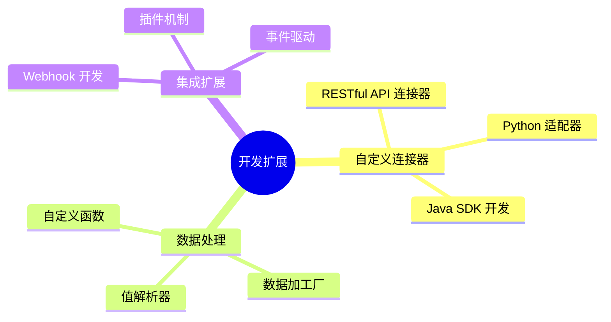
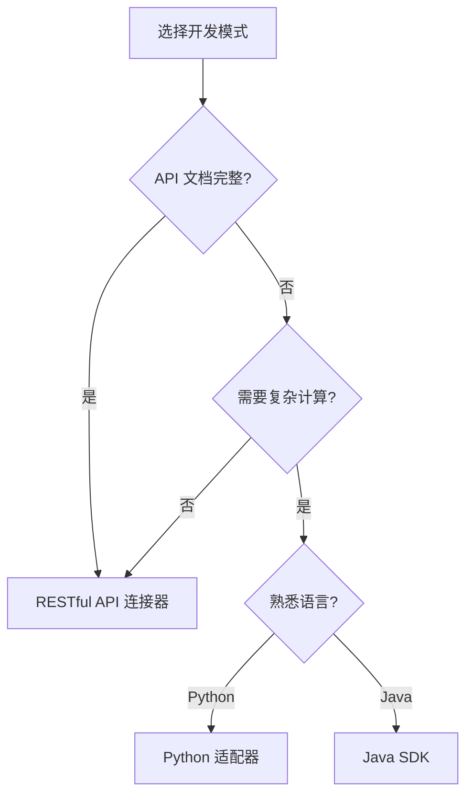

# 开发指南

本文档为开发者提供轻易云 iPaaS 平台的开发指南，帮助您快速上手自定义开发和扩展。

## 开发概述

### 开发能力矩阵

轻易云 iPaaS 为开发者提供以下扩展能力：



### 开发环境准备

在开始开发前，请确保您已具备：

| 组件 | 版本要求 | 说明 |
|-----|---------|------|
| 轻易云账号 | — | 开发者权限 |
| Python | 3.8+ | Python 适配器开发 |
| Java | 11+ | Java SDK 开发 |
| Node.js | 16+ | 前端插件开发 |
| IDE | — | PyCharm/IDEA/VS Code |

## 开发模式选择

### 模式对比

| 开发模式 | 难度 | 灵活性 | 适用场景 |
|---------|------|-------|---------|
| RESTful API 连接器 | ⭐ 低 | ⭐⭐ 中 | 标准 REST API |
| Python 适配器 | ⭐⭐ 中 | ⭐⭐⭐ 高 | 复杂数据处理 |
| Java SDK | ⭐⭐⭐ 高 | ⭐⭐⭐ 高 | 企业级连接器 |
| 数据加工厂 | ⭐⭐ 中 | ⭐⭐⭐ 高 | 数据转换逻辑 |

### 选择建议



## RESTful API 连接器

### 快速开始

最简单的自定义连接器开发方式：

1. 在控制台选择「新建连接器」
2. 选择「RESTful API」类型
3. 配置 API 基本信息
4. 定义认证方式
5. 配置接口参数

### 配置示例

```json
{
  "name": "Custom API",
  "baseUrl": "https://api.example.com",
  "auth": {
    "type": "bearer",
    "token": "${apiToken}"
  },
  "headers": {
    "Content-Type": "application/json"
  },
  "endpoints": {
    "fetch": {
      "method": "GET",
      "path": "/data/list",
      "parameters": {
        "page": "${pageNum}",
        "size": "${pageSize}"
      }
    },
    "write": {
      "method": "POST",
      "path": "/data/create",
      "body": {
        "orderNo": "${orderNo}",
        "amount": "${amount}"
      }
    }
  }
}
```

## Python 适配器开发

### 开发流程


### 基础结构

Python 适配器的基本结构：

```python
from qeasy import Adapter, Context

class MyAdapter(Adapter):
    """自定义适配器"""
    
    def init(self, context: Context):
        """初始化"""
        self.config = context.config
        self.client = self.create_client()
    
    def fetch(self, context: Context):
        """获取数据"""
        params = {
            "page": context.parameter("page", 1),
            "size": context.parameter("size", 100)
        }
        response = self.client.get("/api/data", params=params)
        return response.json()["data"]
    
    def write(self, context: Context, data: list):
        """写入数据"""
        for item in data:
            self.client.post("/api/create", json=item)
        return len(data)
```

## Java SDK 开发

### SDK 引入

Maven 依赖配置：

```xml
<dependency>
    <groupId>com.qeasy</groupId>
    <artifactId>ipaas-connector-sdk</artifactId>
    <version>3.5.0</version>
</dependency>
```

### 连接器开发

```java
import com.qeasy.ipaas.sdk.Adapter;
import com.qeasy.ipaas.sdk.Context;
import com.qeasy.ipaas.sdk.annotation.Connector;

@Connector(name = "my-connector", version = "1.0.0")
public class MyConnector implements Adapter {
    
    private ApiClient client;
    
    @Override
    public void init(Context context) {
        String apiKey = context.getConfig("apiKey");
        this.client = new ApiClient(apiKey);
    }
    
    @Override
    public List<Map<String, Object>> fetch(Context context) {
        return client.fetchData(
            context.getParameter("startTime"),
            context.getParameter("endTime")
        );
    }
    
    @Override
    public int write(Context context, List<Map<String, Object>> data) {
        return client.batchCreate(data);
    }
}
```

## 调试与测试

### 本地调试

使用 SDK 提供的本地调试工具：

```bash
# 安装调试工具
pip install qeasy-cli

# 启动本地调试服务
qeasy dev --port 8080

# 运行测试
qeasy test --config config.json
```

### 单元测试

编写单元测试用例：

```python
import unittest
from my_adapter import MyAdapter

class TestMyAdapter(unittest.TestCase):
    
    def setUp(self):
        self.adapter = MyAdapter()
        self.context = MockContext()
    
    def test_fetch(self):
        result = self.adapter.fetch(self.context)
        self.assertIsNotNone(result)
        self.assertIsInstance(result, list)
    
    def test_write(self):
        data = [{"id": 1, "name": "test"}]
        count = self.adapter.write(self.context, data)
        self.assertEqual(count, 1)
```

## 部署发布

### 上传适配器

```bash
# 打包适配器
qeasy package --output my-adapter.zip

# 上传到平台
qeasy upload --file my-adapter.zip --name my-adapter
```

### 版本管理

遵循语义化版本规范：

| 版本变化 | 说明 | 示例 |
|---------|------|------|
| 主版本 | 不兼容的 API 修改 | 1.0.0 → 2.0.0 |
| 次版本 | 向下兼容的功能新增 | 1.0.0 → 1.1.0 |
| 修订号 | 向下兼容的问题修复 | 1.0.0 → 1.0.1 |

## 最佳实践

### 1. 错误处理

完善的错误处理机制：

```python
def fetch(self, context: Context):
    try:
        response = self.client.get("/api/data")
        response.raise_for_status()
        return response.json()
    except RequestException as e:
        context.logger.error(f"请求失败: {e}")
        raise AdapterException(f"获取数据失败: {e}")
```

### 2. 日志记录

记录关键操作和异常：

```python
context.logger.info(f"开始获取数据，参数: {params}")
context.logger.debug(f"API 响应: {response.text}")
context.logger.warning(f"数据异常: {error_msg}")
context.logger.error(f"处理失败: {exception}")
```

### 3. 性能优化

- 使用连接池复用连接
- 批量处理减少 API 调用
- 合理设置超时时间
- 使用缓存减少重复请求

### 4. 安全防护

- 不在代码中硬编码密钥
- 敏感信息使用加密存储
- 验证输入参数防止注入
- 使用 HTTPS 进行通信

## 获取帮助

### 开发资源

| 资源 | 链接 | 说明 |
|-----|------|------|
| 开发文档 | /docs/developer | 完整开发文档 |
| API 参考 | /docs/api-reference | OpenAPI 文档 |
| SDK 下载 | GitHub | SDK 源码和示例 |
| 社区论坛 | /community | 开发者交流 |

### 技术支持

开发过程中遇到问题：

- 查阅 [FAQ](../faq) 常见问题
- 在开发者社区提问
- 联系技术支持团队
