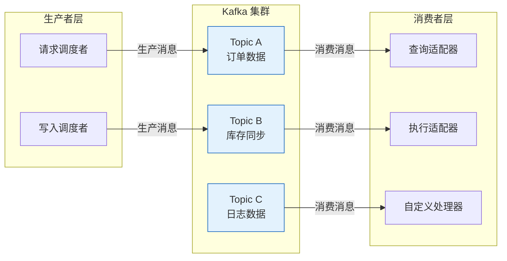
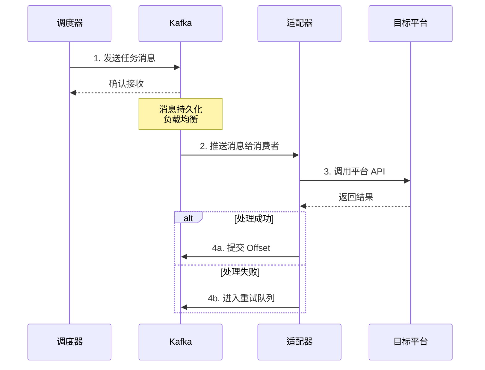
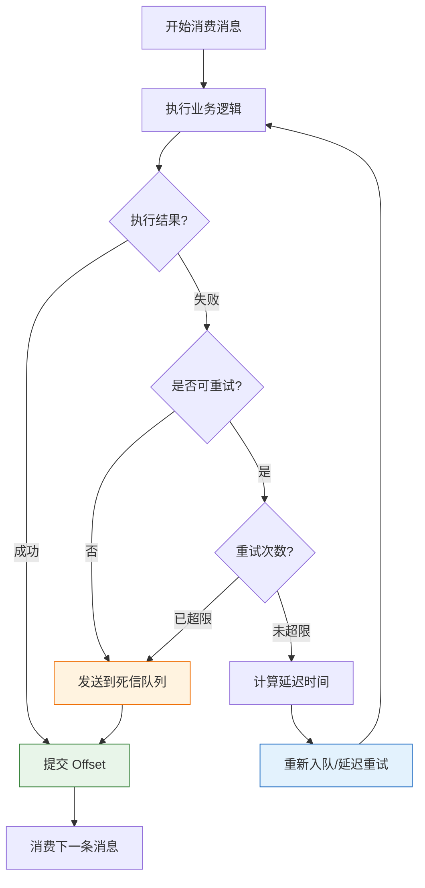
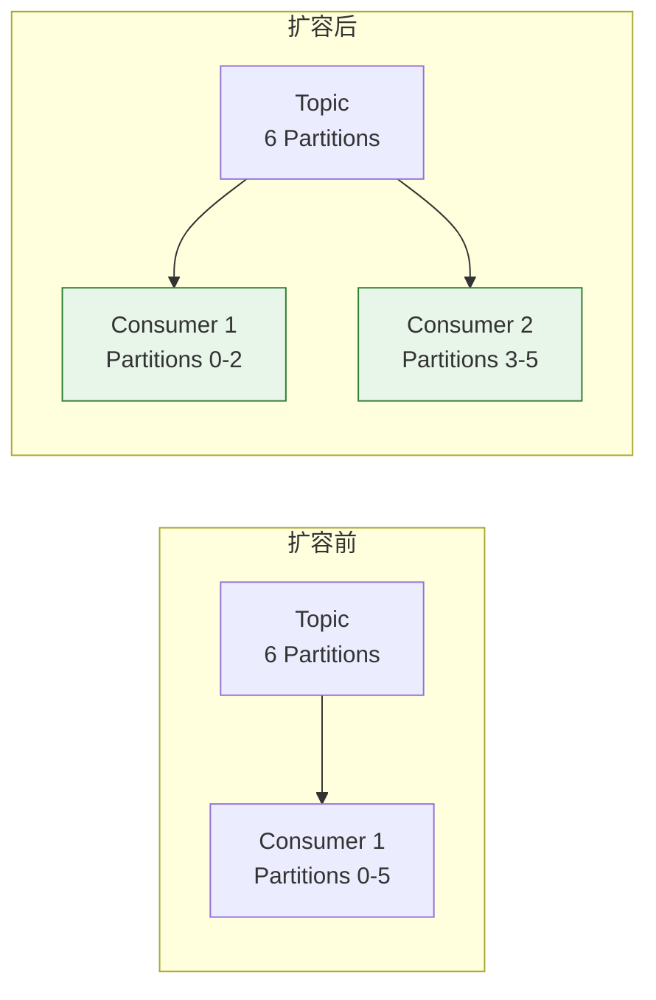

# Kafka 消息中间件集成

本文档面向需要在轻易云 iPaaS 平台中深度集成 Kafka 消息中间件的开发者。通过阅读本文，你将了解 Kafka 的核心概念、平台与 Kafka 的集成机制、连接配置方法、Topic 订阅与消息反序列化处理，以及错误重试策略的实现方式。

> [!IMPORTANT]
> 本文档涉及开发者高级功能，需要登录后查看完整内容。基础概念部分可自由访问。

## Kafka 核心概念

### 什么是 Kafka

Apache Kafka 是一个分布式流处理平台，主要用于构建实时数据管道和流式应用程序。在轻易云 iPaaS 平台中，Kafka 作为核心的消息队列中间件，负责任务的异步调度、流量削峰和数据缓冲。



### 核心术语

| 术语 | 英文 | 说明 |
| ---- | ---- | ---- |
| **Producer** | 生产者 | 消息的生产方，负责将数据发送到 Kafka Topic |
| **Consumer** | 消费者 | 消息的消费方，从 Kafka Topic 订阅并处理消息 |
| **Consumer Group** | 消费者组 | 由多个消费者组成的逻辑组，同组内消费者共同消费一个 Topic |
| **Topic** | 主题 | 消息的分类标识，逻辑上的消息通道 |
| **Partition** | 分区 | Topic 的物理分片，实现数据的水平扩展和负载均衡 |
| **Broker** | 代理节点 | Kafka 服务器实例，负责消息的存储和转发 |
| **Replication** | 副本 | 分区的数据副本，保障数据高可用性 |
| **Offset** | 偏移量 | 消息在分区中的唯一标识，用于消费位点管理 |

> [!NOTE]
> 在 Kafka 的设计中，同一个分区的数据只能被消费者组中的某一个消费者消费。同一消费者组的消费者可以消费同一 Topic 的不同分区数据，以此提高整体吞吐量。

### 平台与 Kafka 的关系

轻易云 iPaaS 平台采用 Kafka 作为底层消息队列池管理：

- **请求调度者**生产的查询任务通过 Kafka 分发到查询适配器
- **写入调度者**生产的写入任务通过 Kafka 分发到执行适配器
- 平台默认自动管理 Kafka 队列，开发者无需关注底层细节
- 如需更高吞吐量或自定义重试机制，可通过自定义脚本接管 Kafka 消费



## 连接配置

### 基础连接参数

在自定义脚本中接管 Kafka 前，需要配置以下连接参数：

| 参数 | 类型 | 必填 | 说明 |
| ---- | ---- | ---- | ---- |
| `bootstrap.servers` | string | ✅ | Kafka 集群地址，格式：`host1:port1,host2:port2` |
| `security.protocol` | string | — | 安全协议：`PLAINTEXT`、`SSL`、`SASL_PLAINTEXT`、`SASL_SSL` |
| `sasl.mechanism` | string | — | SASL 认证机制：`PLAIN`、`SCRAM-SHA-256`、`SCRAM-SHA-512` |
| `sasl.username` | string | — | SASL 认证用户名 |
| `sasl.password` | string | — | SASL 认证密码 |
| `ssl.ca.location` | string | — | SSL CA 证书路径 |
| `ssl.certificate.location` | string | — | SSL 客户端证书路径 |
| `ssl.key.location` | string | — | SSL 客户端私钥路径 |

### 生产者配置

```php
<?php

namespace Custom\Kafka;

use RdKafka\Producer;
use RdKafka\ProducerTopic;

class KafkaProducer
{
    /**
     * Kafka 生产者实例
     */
    protected Producer $producer;

    /**
     * Topic 实例缓存
     */
    protected array $topics = [];

    /**
     * 构造方法
     *
     * @param array $config 连接配置
     */
    public function __construct(array $config)
    {
        $conf = new \RdKafka\Conf();
        
        // 设置集群地址
        $conf->set('bootstrap.servers', $config['bootstrap_servers']);
        
        // 配置 ACK 确认机制
        $conf->set('acks', $config['acks'] ?? 'all');
        
        // 配置重试次数
        $conf->set('retries', $config['retries'] ?? 3);
        
        // 配置压缩类型
        $conf->set('compression.type', $config['compression'] ?? 'snappy');
        
        // 配置批处理大小（提升吞吐量）
        $conf->set('batch.size', $config['batch_size'] ?? 16384);
        
        // 配置 SASL 认证（如需）
        if (!empty($config['sasl_mechanism'])) {
            $conf->set('security.protocol', $config['security_protocol'] ?? 'SASL_PLAINTEXT');
            $conf->set('sasl.mechanism', $config['sasl_mechanism']);
            $conf->set('sasl.username', $config['sasl_username']);
            $conf->set('sasl.password', $config['sasl_password']);
        }

        $this->producer = new Producer($conf);
    }

    /**
     * 发送消息到指定 Topic
     *
     * @param string $topicName Topic 名称
     * @param string $message 消息内容
     * @param string|null $key 消息 Key（用于分区路由）
     * @param array $headers 消息头
     * @return bool 发送结果
     */
    public function send(string $topicName, string $message, ?string $key = null, array $headers = []): bool
    {
        $topic = $this->getTopic($topicName);
        
        // 构建消息头
        $headerList = new \RdKafka\MessageHeaders();
        foreach ($headers as $hKey => $hValue) {
            $headerList->write($hKey, $hValue);
        }
        
        // 发送消息（RD_KAFKA_PARTITION_UA 表示使用默认分区策略）
        $topic->produce(
            RD_KAFKA_PARTITION_UA,
            0,
            $message,
            $key,
            $headerList
        );
        
        // 触发消息发送（非阻塞）
        $this->producer->poll(0);
        
        return true;
    }

    /**
     * 刷新并等待消息发送完成
     *
     * @param int $timeout 超时时间（毫秒）
     * @return int 剩余未发送消息数
     */
    public function flush(int $timeout = 10000): int
    {
        return $this->producer->flush($timeout);
    }

    /**
     * 获取 Topic 实例
     *
     * @param string $topicName
     * @return ProducerTopic
     */
    protected function getTopic(string $topicName): ProducerTopic
    {
        if (!isset($this->topics[$topicName])) {
            $this->topics[$topicName] = $this->producer->newTopic($topicName);
        }
        
        return $this->topics[$topicName];
    }
}
```

### 消费者配置

```php
<?php

namespace Custom\Kafka;

use RdKafka\KafkaConsumer;
use RdKafka\Message;

class KafkaConsumer
{
    /**
     * Kafka 消费者实例
     */
    protected KafkaConsumer $consumer;

    /**
     * 消费回调函数
     */
    protected ?callable $messageHandler = null;

    /**
     * 构造方法
     *
     * @param array $config 连接配置
     */
    public function __construct(array $config)
    {
        $conf = new \RdKafka\Conf();
        
        // 设置集群地址
        $conf->set('bootstrap.servers', $config['bootstrap_servers']);
        
        // 设置消费者组 ID
        $conf->set('group.id', $config['group_id'] ?? 'qeasy-ipaas-group');
        
        // 设置消费位点重置策略
        $conf->set('auto.offset.reset', $config['offset_reset'] ?? 'latest');
        
        // 配置自动提交间隔
        $conf->set('auto.commit.interval.ms', $config['commit_interval'] ?? 5000);
        
        // 配置会话超时时间
        $conf->set('session.timeout.ms', $config['session_timeout'] ?? 10000);
        
        // 配置心跳间隔
        $conf->set('heartbeat.interval.ms', $config['heartbeat_interval'] ?? 3000);
        
        // 配置 SASL 认证（如需）
        if (!empty($config['sasl_mechanism'])) {
            $conf->set('security.protocol', $config['security_protocol'] ?? 'SASL_PLAINTEXT');
            $conf->set('sasl.mechanism', $config['sasl_mechanism']);
            $conf->set('sasl.username', $config['sasl_username']);
            $conf->set('sasl.password', $config['sasl_password']);
        }

        // 配置重平衡回调
        $conf->setRebalanceCb(function ($kafka, $err, $partitions) {
            switch ($err) {
                case RD_KAFKA_RESP_ERR__ASSIGN_PARTITIONS:
                    // 分配分区
                    $kafka->assign($partitions);
                    break;
                case RD_KAFKA_RESP_ERR__REVOKE_PARTITIONS:
                    // 回收分区
                    $kafka->assign(null);
                    break;
                default:
                    throw new \Exception('重平衡错误: ' . $err);
            }
        });

        $this->consumer = new KafkaConsumer($conf);
    }

    /**
     * 订阅 Topic
     *
     * @param array $topics Topic 列表
     */
    public function subscribe(array $topics): void
    {
        $this->consumer->subscribe($topics);
    }

    /**
     * 设置消息处理回调
     *
     * @param callable $handler
     */
    public function onMessage(callable $handler): void
    {
        $this->messageHandler = $handler;
    }

    /**
     * 开始消费消息（阻塞模式）
     *
     * @param int $timeout 超时时间（毫秒）
     */
    public function consume(int $timeout = 1000): void
    {
        while (true) {
            $message = $this->consumer->poll($timeout);
            
            if ($message === null) {
                continue;
            }

            switch ($message->err) {
                case RD_KAFKA_RESP_ERR_NO_ERROR:
                    // 正常消息
                    $this->processMessage($message);
                    break;
                    
                case RD_KAFKA_RESP_ERR__PARTITION_EOF:
                    // 分区数据读取完毕
                    // 可记录日志或触发特定逻辑
                    break;
                    
                case RD_KAFKA_RESP_ERR__TIMED_OUT:
                    // 消费超时
                    break;
                    
                default:
                    // 消费错误
                    throw new \Exception('消费错误: ' . $message->errstr());
            }
        }
    }

    /**
     * 处理单条消息
     *
     * @param Message $message
     */
    protected function processMessage(Message $message): void
    {
        if ($this->messageHandler === null) {
            return;
        }

        try {
            $result = call_user_func($this->messageHandler, $message);
            
            if ($result !== false) {
                // 手动提交 Offset
                $this->consumer->commit($message);
            }
        } catch (\Exception $e) {
            // 处理异常，进入重试逻辑
            $this->handleConsumeError($message, $e);
        }
    }

    /**
     * 处理消费异常
     *
     * @param Message $message
     * @param \Exception $exception
     */
    protected function handleConsumeError(Message $message, \Exception $exception): void
    {
        // 实现自定义错误处理逻辑
        // 如：发送到死信队列、记录错误日志等
    }

    /**
     * 关闭消费者
     */
    public function close(): void
    {
        $this->consumer->close();
    }
}
```

> [!TIP]
> 建议为每个集成方案配置独立的消费者组（`group.id`），避免不同方案之间的消费位点互相影响。

## Topic 订阅

### 单 Topic 订阅

```php
<?php

// 初始化消费者
$consumer = new KafkaConsumer([
    'bootstrap_servers' => 'kafka1:9092,kafka2:9092',
    'group_id' => 'order-sync-group',
    'offset_reset' => 'earliest', // 从最早的消息开始消费
]);

// 订阅单个 Topic
$consumer->subscribe(['order-topic']);

// 设置消息处理逻辑
$consumer->onMessage(function (\RdKafka\Message $message) {
    $data = json_decode($message->payload, true);
    
    // 业务处理逻辑
    processOrder($data);
    
    return true; // 返回 true 表示处理成功，会自动提交 Offset
});

// 开始消费
$consumer->consume();
```

### 多 Topic 订阅

```php
<?php

// 订阅多个相关 Topic
$consumer->subscribe([
    'order-created',
    'order-updated',
    'order-cancelled',
]);

// 根据 Topic 路由到不同处理器
$consumer->onMessage(function (\RdKafka\Message $message) {
    $data = json_decode($message->payload, true);
    
    switch ($message->topic_name) {
        case 'order-created':
            return handleOrderCreated($data);
        case 'order-updated':
            return handleOrderUpdated($data);
        case 'order-cancelled':
            return handleOrderCancelled($data);
        default:
            return false; // 未知 Topic，不提交 Offset
    }
});
```

### 正则表达式订阅

```php
<?php

// 使用正则表达式订阅符合模式的 Topic
// 订阅所有以 "inventory-" 开头的 Topic
$consumer->subscribe(['/^inventory-.*/']);

$consumer->onMessage(function (\RdKafka\Message $message) {
    // 动态获取实际 Topic 名称
    $topic = $message->topic_name;
    
    // 根据 Topic 名称动态处理
    $handler = str_replace('-', '_', $topic) . '_handler';
    
    if (function_exists($handler)) {
        return $handler(json_decode($message->payload, true));
    }
    
    return false;
});
```

> [!WARNING]
> 使用正则订阅时，消费者会定期拉取集群中的 Topic 列表进行匹配，频繁变动的 Topic 列表可能导致不必要的重平衡。

## 消息反序列化

### JSON 反序列化

最常用的消息格式，平台默认采用 JSON 进行消息传输：

```php
<?php

class JsonDeserializer
{
    /**
     * 反序列化 JSON 消息
     *
     * @param string $payload 原始消息内容
     * @return array 解析后的数据
     * @throws \Exception
     */
    public function deserialize(string $payload): array
    {
        $data = json_decode($payload, true);
        
        if (json_last_error() !== JSON_ERROR_NONE) {
            throw new \Exception('JSON 解析失败: ' . json_last_error_msg());
        }
        
        return $data;
    }
}
```

### Avro 反序列化

适用于 Schema 约束严格的场景：

```php
<?php

use FlixTech\SchemaRegistryApi\Registry;
use FlixTech\AvroSerializer\Objects\RecordSerializer;
use FlixTech\AvroSerializer\Common\WireFormatEncoder;

class AvroDeserializer
{
    /**
     * Schema Registry 客户端
     */
    protected Registry $registry;

    /**
     * 构造方法
     *
     * @param string $registryUrl Schema Registry 地址
     */
    public function __construct(string $registryUrl)
    {
        $this->registry = new Registry($registryUrl);
    }

    /**
     * 反序列化 Avro 消息
     *
     * @param string $payload 原始消息内容（含 Wire Format Header）
     * @return array 解析后的数据
     * @throws \Exception
     */
    public function deserialize(string $payload): array
    {
        // 解析 Wire Format Header
        $magicByte = ord($payload[0]);
        if ($magicByte !== 0) {
            throw new \Exception('无效的 Avro 消息格式');
        }
        
        // 提取 Schema ID
        $schemaId = unpack('N', substr($payload, 1, 4))[1];
        
        // 从 Registry 获取 Schema
        $schema = $this->registry->schemaForId($schemaId);
        
        // 提取实际数据
        $binaryData = substr($payload, 5);
        
        // 使用 Avro 库反序列化
        $datumReader = new \AvroDatumReader($schema, $schema);
        $io = new \AvroStringIO($binaryData);
        $decoder = new \AvroIOBinaryDecoder($io);
        
        return $datumReader->read($decoder);
    }
}
```

### Protocol Buffers 反序列化

适用于高性能场景：

```php
<?php

class ProtobufDeserializer
{
    /**
     * 消息类型映射
     */
    protected array $messageTypes = [];

    /**
     * 注册消息类型
     *
     * @param string $topic Topic 名称
     * @param string $className 消息类名
     */
    public function registerMessageType(string $topic, string $className): void
    {
        $this->messageTypes[$topic] = $className;
    }

    /**
     * 反序列化 Protobuf 消息
     *
     * @param string $topic Topic 名称
     * @param string $payload 原始消息内容
     * @return object 解析后的消息对象
     * @throws \Exception
     */
    public function deserialize(string $topic, string $payload): object
    {
        if (!isset($this->messageTypes[$topic])) {
            throw new \Exception("未注册的 Topic 类型: {$topic}");
        }

        $className = $this->messageTypes[$topic];
        
        if (!class_exists($className)) {
            throw new \Exception("消息类不存在: {$className}");
        }

        return $className::decode($payload);
    }
}
```

### 自定义消息格式

平台支持的消息结构示例：

```php
<?php

/**
 * 轻易云标准消息结构
 */
interface QeasyMessage
{
    /**
     * 消息唯一标识
     */
    public function getMessageId(): string;

    /**
     * 消息产生时间（Unix 时间戳，毫秒）
     */
    public function getTimestamp(): int;

    /**
     * 业务数据内容
     */
    public function getPayload(): array;

    /**
     * 消息元数据
     */
    public function getMetadata(): array;
}

/**
 * 标准消息反序列化器
 */
class QeasyMessageDeserializer
{
    /**
     * 反序列化消息
     *
     * @param string $payload
     * @return QeasyMessage
     */
    public function deserialize(string $payload): QeasyMessage
    {
        $data = json_decode($payload, true);
        
        if (!isset($data['message_id'], $data['timestamp'], $data['payload'])) {
            throw new \Exception('无效的消息格式');
        }
        
        return new class($data) implements QeasyMessage {
            private array $data;
            
            public function __construct(array $data)
            {
                $this->data = $data;
            }
            
            public function getMessageId(): string
            {
                return $this->data['message_id'];
            }
            
            public function getTimestamp(): int
            {
                return $this->data['timestamp'];
            }
            
            public function getPayload(): array
            {
                return $this->data['payload'];
            }
            
            public function getMetadata(): array
            {
                return $this->data['metadata'] ?? [];
            }
        };
    }
}
```

## 错误重试机制

### 重试策略设计



### 指数退避重试

```php
<?php

class RetryManager
{
    /**
     * 最大重试次数
     */
    protected int $maxRetries;

    /**
     * 初始延迟时间（秒）
     */
    protected float $initialDelay;

    /**
     * 退避乘数
     */
    protected float $backoffMultiplier;

    /**
     * 最大延迟时间（秒）
     */
    protected float $maxDelay;

    public function __construct(
        int $maxRetries = 3,
        float $initialDelay = 1.0,
        float $backoffMultiplier = 2.0,
        float $maxDelay = 60.0
    ) {
        $this->maxRetries = $maxRetries;
        $this->initialDelay = $initialDelay;
        $this->backoffMultiplier = $backoffMultiplier;
        $this->maxDelay = $maxDelay;
    }

    /**
     * 计算下次重试的延迟时间
     *
     * @param int $attemptCount 已尝试次数
     * @return float 延迟时间（秒）
     */
    public function calculateDelay(int $attemptCount): float
    {
        // 指数退避：delay = initialDelay * (multiplier ^ attemptCount)
        $delay = $this->initialDelay * pow($this->backoffMultiplier, $attemptCount);
        
        // 添加随机抖动（±20%），避免重试风暴
        $jitter = $delay * 0.2 * (mt_rand() / mt_getrandmax() - 0.5);
        $delay += $jitter;
        
        return min($delay, $this->maxDelay);
    }

    /**
     * 检查是否还可以重试
     *
     * @param int $attemptCount
     * @return bool
     */
    public function canRetry(int $attemptCount): bool
    {
        return $attemptCount < $this->maxRetries;
    }
}
```

### 重试队列实现

```php
<?php

class KafkaRetryHandler
{
    /**
     * 主消费者
     */
    protected KafkaConsumer $consumer;

    /**
     * 重试生产者
     */
    protected KafkaProducer $retryProducer;

    /**
     * 死信队列生产者
     */
    protected KafkaProducer $dlqProducer;

    /**
     * 重试管理器
     */
    protected RetryManager $retryManager;

    /**
     * 重试 Topic 模板
     */
    protected string $retryTopicTemplate = '{topic}-retry-{delay}';

    /**
     * 死信队列 Topic
     */
    protected string $dlqTopic = 'dead-letter-queue';

    public function __construct(
        KafkaConsumer $consumer,
        KafkaProducer $retryProducer,
        KafkaProducer $dlqProducer,
        RetryManager $retryManager
    ) {
        $this->consumer = $consumer;
        $this->retryProducer = $retryProducer;
        $this->dlqProducer = $dlqProducer;
        $this->retryManager = $retryManager;
    }

    /**
     * 处理消费失败的消息
     *
     * @param \RdKafka\Message $message
     * @param \Exception $exception
     * @param int $attemptCount 已尝试次数
     */
    public function handleFailure(\RdKafka\Message $message, \Exception $exception, int $attemptCount): void
    {
        // 检查是否还可以重试
        if (!$this->retryManager->canRetry($attemptCount)) {
            // 超过最大重试次数，发送到死信队列
            $this->sendToDLQ($message, $exception, $attemptCount);
            return;
        }

        // 判断异常类型是否可重试
        if (!$this->isRetryableException($exception)) {
            // 不可重试异常，直接发送到死信队列
            $this->sendToDLQ($message, $exception, $attemptCount);
            return;
        }

        // 计算延迟时间
        $delay = $this->retryManager->calculateDelay($attemptCount);
        
        // 发送到重试队列
        $this->sendToRetryQueue($message, $attemptCount, $delay);
    }

    /**
     * 发送到重试队列
     *
     * @param \RdKafka\Message $message
     * @param int $attemptCount
     * @param float $delay
     */
    protected function sendToRetryQueue(\RdKafka\Message $message, int $attemptCount, float $delay): void
    {
        // 确定重试 Topic（按延迟时间分桶）
        $delayBucket = $this->getDelayBucket($delay);
        $retryTopic = str_replace(
            ['{topic}', '{delay}'],
            [$message->topic_name, $delayBucket],
            $this->retryTopicTemplate
        );

        // 构建重试消息头
        $headers = [];
        if ($message->headers) {
            $headers = iterator_to_array($message->headers);
        }
        
        $headers['x-retry-count'] = (string) ($attemptCount + 1);
        $headers['x-original-topic'] = $message->topic_name;
        $headers['x-original-partition'] = (string) $message->partition;
        $headers['x-original-offset'] = (string) $message->offset;
        $headers['x-retry-delay'] = (string) $delay;
        $headers['x-first-failure-time'] = $headers['x-first-failure-time'] ?? (string) time();

        // 发送到重试 Topic
        $this->retryProducer->send(
            $retryTopic,
            $message->payload,
            $message->key,
            $headers
        );
        
        $this->retryProducer->flush();
    }

    /**
     * 发送到死信队列
     *
     * @param \RdKafka\Message $message
     * @param \Exception $exception
     * @param int $attemptCount
     */
    protected function sendToDLQ(\RdKafka\Message $message, \Exception $exception, int $attemptCount): void
    {
        $dlqMessage = [
            'original_topic' => $message->topic_name,
            'original_partition' => $message->partition,
            'original_offset' => $message->offset,
            'original_key' => $message->key,
            'original_payload' => $message->payload,
            'error_message' => $exception->getMessage(),
            'error_class' => get_class($exception),
            'retry_count' => $attemptCount,
            'failed_at' => date('Y-m-d H:i:s'),
            'stack_trace' => $exception->getTraceAsString(),
        ];

        $this->dlqProducer->send(
            $this->dlqTopic,
            json_encode($dlqMessage),
            $message->key
        );
        
        $this->dlqProducer->flush();
    }

    /**
     * 判断异常是否可重试
     *
     * @param \Exception $exception
     * @return bool
     */
    protected function isRetryableException(\Exception $exception): bool
    {
        $retryableExceptions = [
            \RdKafka\Exception::class,
            \GuzzleHttp\Exception\ConnectException::class,
            \GuzzleHttp\Exception\ServerException::class,
        ];

        foreach ($retryableExceptions as $retryableClass) {
            if ($exception instanceof $retryableClass) {
                return true;
            }
        }

        // 根据错误码判断
        $retryableCodes = [408, 429, 500, 502, 503, 504];
        if (method_exists($exception, 'getCode')) {
            return in_array($exception->getCode(), $retryableCodes);
        }

        return false;
    }

    /**
     * 获取延迟分桶
     *
     * @param float $delay
     * @return string
     */
    protected function getDelayBucket(float $delay): string
    {
        if ($delay <= 1) {
            return '1s';
        } elseif ($delay <= 5) {
            return '5s';
        } elseif ($delay <= 30) {
            return '30s';
        } elseif ($delay <= 60) {
            return '1m';
        } else {
            return '5m';
        }
    }
}
```

### 重试消费者配置

```php
<?php

// 重试队列消费者配置
$retryConsumer = new KafkaConsumer([
    'bootstrap_servers' => 'kafka1:9092,kafka2:9092',
    'group_id' => 'retry-consumer-group',
    'offset_reset' => 'earliest',
]);

// 订阅所有重试 Topic
$retryConsumer->subscribe([
    'order-topic-retry-1s',
    'order-topic-retry-5s',
    'order-topic-retry-30s',
    'order-topic-retry-1m',
    'order-topic-retry-5m',
]);

$retryConsumer->onMessage(function (\RdKafka\Message $message) {
    $headers = iterator_to_array($message->headers);
    
    // 检查延迟时间是否已到
    $originalTime = (int) ($headers['x-first-failure-time'] ?? time());
    $retryDelay = (float) ($headers['x-retry-delay'] ?? 0);
    $elapsed = time() - $originalTime;
    
    if ($elapsed < $retryDelay) {
        // 延迟时间未到，不处理（等待下次 poll）
        // 注意：此实现简化处理，生产环境建议使用 Kafka 延迟队列插件
        return false;
    }
    
    // 获取重试次数
    $retryCount = (int) ($headers['x-retry-count'] ?? 0);
    
    try {
        // 执行业务逻辑
        $result = processMessage($message);
        
        if ($result) {
            // 处理成功，提交 Offset
            return true;
        } else {
            // 处理失败，再次进入重试
            throw new \Exception('业务处理失败');
        }
    } catch (\Exception $e) {
        // 再次失败，交给重试处理器
        $retryHandler->handleFailure($message, $e, $retryCount);
        return true; // 提交当前 Offset，避免阻塞
    }
});
```

## 完整示例

### 集成方案中的 Kafka 消费者

```php
<?php

namespace Adapter\Custom;

use Domain\Datahub\Instance\Adapter\Adapter;
use Custom\Kafka\KafkaConsumer;
use Custom\Kafka\RetryManager;
use Custom\Kafka\KafkaRetryHandler;

class CustomKafkaAdapter extends Adapter
{
    const DIRECTION = 'source';

    /**
     * Kafka 消费者
     */
    protected ?KafkaConsumer $consumer = null;

    /**
     * 重试处理器
     */
    protected ?KafkaRetryHandler $retryHandler = null;

    /**
     * 初始化 Kafka 连接
     */
    public function connect(): array
    {
        $config = $this->getKafkaConfig();
        
        $this->consumer = new KafkaConsumer($config);
        $this->consumer->subscribe([$config['topic']]);
        
        // 初始化重试处理器
        $retryManager = new RetryManager(
            maxRetries: 3,
            initialDelay: 1.0,
            backoffMultiplier: 2.0
        );
        
        $this->retryHandler = new KafkaRetryHandler(
            $this->consumer,
            new KafkaProducer($config),
            new KafkaProducer($config),
            $retryManager
        );

        return ['status' => true];
    }

    /**
     * 调度方法：消费 Kafka 消息
     */
    public function dispatch(): array
    {
        $this->connect();
        
        // 设置消息处理回调
        $this->consumer->onMessage(function ($message) {
            return $this->processKafkaMessage($message);
        });
        
        // 消费一条消息（非阻塞）
        $this->consumer->consume(10000);
        
        return ['status' => true];
    }

    /**
     * 处理 Kafka 消息
     *
     * @param \RdKafka\Message $message
     * @return bool
     */
    protected function processKafkaMessage($message): bool
    {
        try {
            // 反序列化消息
            $data = json_decode($message->payload, true);
            
            // 记录日志
            $this->getLogStorage()->insertOne([
                'text' => '接收到 Kafka 消息',
                'topic' => $message->topic_name,
                'offset' => $message->offset,
            ], 'record');
            
            // 写入数据存储器
            $this->getDataStorage()->insertOne(
                $data['id'] ?? uniqid(),
                $data['number'] ?? null,
                $data,
                true,
                null
            );
            
            return true;
        } catch (\Exception $e) {
            // 处理失败，进入重试逻辑
            $retryCount = $this->getRetryCount($message);
            $this->retryHandler->handleFailure($message, $e, $retryCount);
            return false;
        }
    }

    /**
     * 获取 Kafka 配置
     *
     * @return array
     */
    protected function getKafkaConfig(): array
    {
        $connector = \Domain\Datahub\Connector\ConnectorRepository::findOne(
            $this->strategy[$this->direction]->connector_id
        );
        
        $envField = 'env_' . $connector->env . '_params';
        $params = $connector->$envField;
        
        return [
            'bootstrap_servers' => $params['kafka_servers'] ?? 'localhost:9092',
            'topic' => $params['kafka_topic'] ?? 'default-topic',
            'group_id' => $params['kafka_group_id'] ?? 'qeasy-custom-group',
            'sasl_mechanism' => $params['sasl_mechanism'] ?? null,
            'sasl_username' => $params['sasl_username'] ?? null,
            'sasl_password' => $params['sasl_password'] ?? null,
        ];
    }

    /**
     * 从消息头获取重试次数
     *
     * @param \RdKafka\Message $message
     * @return int
     */
    protected function getRetryCount($message): int
    {
        if (!$message->headers) {
            return 0;
        }
        
        $headers = iterator_to_array($message->headers);
        return (int) ($headers['x-retry-count'] ?? 0);
    }
}
```

## 性能优化建议

### 批量消费

```php
<?php

class BatchConsumer
{
    /**
     * 批量大小
     */
    protected int $batchSize = 100;

    /**
     * 批量超时时间（毫秒）
     */
    protected int $batchTimeout = 5000;

    /**
     * 批量消费消息
     *
     * @param callable $batchHandler
     */
    public function consumeBatch(callable $batchHandler): void
    {
        $batch = [];
        $startTime = hrtime(true);

        while (true) {
            $message = $this->consumer->poll(100);
            
            if ($message && $message->err === RD_KAFKA_RESP_ERR_NO_ERROR) {
                $batch[] = $message;
            }
            
            $elapsed = (hrtime(true) - $startTime) / 1e6; // 转换为毫秒
            
            // 触发批量处理条件：达到批量大小或超时
            if (count($batch) >= $this->batchSize || ($elapsed >= $this->batchTimeout && !empty($batch))) {
                try {
                    // 批量处理
                    $result = $batchHandler($batch);
                    
                    if ($result) {
                        // 批量提交 Offset
                        $this->commitBatch($batch);
                    }
                } catch (\Exception $e) {
                    // 批量处理失败，可改为逐条处理或记录错误
                    $this->handleBatchError($batch, $e);
                }
                
                // 重置批量状态
                $batch = [];
                $startTime = hrtime(true);
            }
        }
    }
}
```

### 消费者组扩容



> [!TIP]
> 消费者组内的消费者数量建议与 Topic 的分区数保持一致或成倍数关系，以实现最优的负载均衡效果。

## 监控与告警

### 关键指标

| 指标 | 说明 | 告警阈值建议 |
| ---- | ---- | ------------ |
| `consumer_lag` | 消费者延迟（未消费消息数） | > 10000 |
| `consume_rate` | 消费速率（消息/秒） | < 正常值的 50% |
| `error_rate` | 错误率（错误消息/总消息） | > 1% |
| `retry_queue_size` | 重试队列积压 | > 1000 |
| `dlq_rate` | 死信队列产生速率 | > 10/分钟 |

### 健康检查接口

```php
<?php

class KafkaHealthChecker
{
    /**
     * 执行健康检查
     *
     * @return array
     */
    public function check(): array
    {
        $checks = [
            'broker_connection' => $this->checkBrokerConnection(),
            'consumer_group_lag' => $this->checkConsumerLag(),
            'topic_existence' => $this->checkTopicExistence(),
        ];
        
        $healthy = !in_array(false, array_column($checks, 'healthy'), true);
        
        return [
            'healthy' => $healthy,
            'checks' => $checks,
            'timestamp' => time(),
        ];
    }

    /**
     * 检查 Broker 连接
     *
     * @return array
     */
    protected function checkBrokerConnection(): array
    {
        try {
            $metadata = $this->consumer->getMetadata(true, null, 5000);
            return [
                'healthy' => true,
                'brokers' => count($metadata->getBrokers()),
            ];
        } catch (\Exception $e) {
            return [
                'healthy' => false,
                'error' => $e->getMessage(),
            ];
        }
    }
}
```

## 相关资源

- [自定义适配器开发](./adapter-development) — 深入了解适配器开发模式
- [适配器生命周期](./lifecycle) — 掌握适配器生命周期管理
- [连接器配置](../guide/configure-connector) — 学习连接器基础配置
- [Apache Kafka 官方文档](https://kafka.apache.org/documentation/) — Kafka 官方权威参考
- [librdkafka 文档](https://github.com/confluentinc/librdkafka) — PHP Kafka 客户端底层库文档

---

> [!TIP]
> 如需更高级的 Kafka 集成方案（如流处理、 exactly-once 语义等），请联系轻易云技术支持团队获取企业级方案。