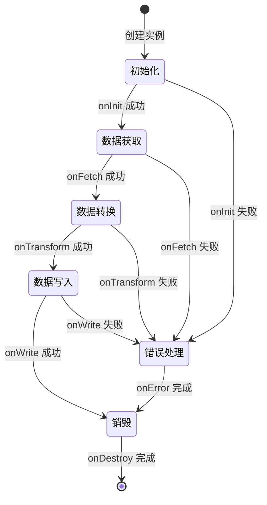
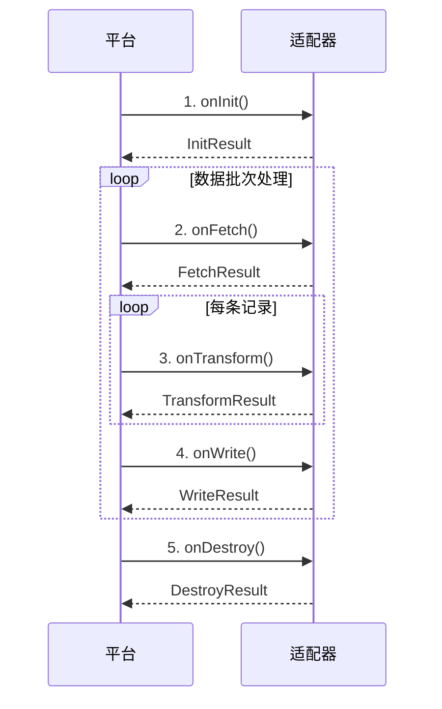
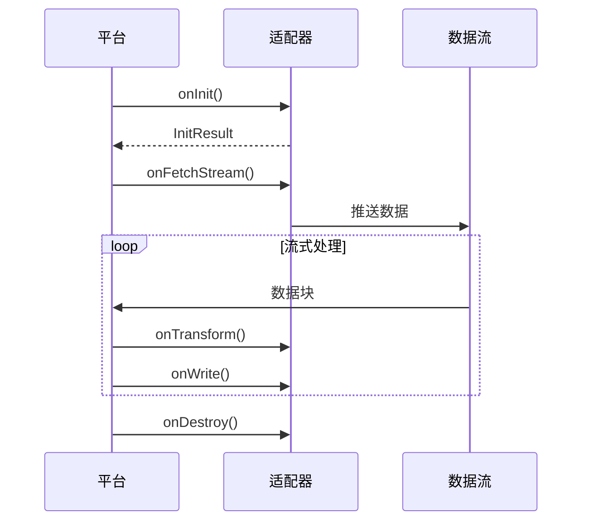

# 适配器生命周期

本文档详细阐述轻易云 iPaaS 平台中适配器（Adapter）的完整生命周期管理机制。理解生命周期钩子函数的触发时机、参数结构和返回值规范，是开发高质量自定义适配器的基础。

## 生命周期概览

适配器生命周期描述了从初始化到销毁的完整执行流程。平台通过一系列钩子函数（Hook Functions）为开发者提供介入点，实现对数据集成各阶段的精细控制。



### 执行流程说明

| 阶段 | 钩子函数 | 主要职责 |
|------|----------|----------|
| 初始化 | `onInit` | 建立连接、加载配置、初始化资源 |
| 数据获取 | `onFetch` | 从源系统读取数据 |
| 数据转换 | `onTransform` | 数据清洗、格式转换、字段映射 |
| 数据写入 | `onWrite` | 向目标系统写入数据 |
| 错误处理 | `onError` | 异常捕获、日志记录、重试策略 |
| 销毁 | `onDestroy` | 释放资源、关闭连接、清理临时文件 |

## onInit — 初始化

`onInit` 是适配器生命周期的第一个钩子函数，在适配器实例创建后立即执行。此阶段适合进行资源配置和连接初始化。

### 触发时机

- 集成方案启动时
- 定时任务触发时
- 手动重新初始化时

### 参数结构

```typescript
interface InitContext {
  /** 适配器配置参数 */
  config: Record<string, any>;
  /** 集成方案元数据 */
  integration: {
    id: string;
    name: string;
    version: string;
  };
  /** 运行时环境变量 */
  env: {
    workspaceId: string;
    tenantId: string;
    region: string;
  };
  /** 全局上下文 */
  global: Record<string, any>;
}
```

### 返回值规范

```typescript
interface InitResult {
  /** 初始化是否成功 */
  success: boolean;
  /** 错误信息（失败时必填） */
  error?: {
    code: string;
    message: string;
    detail?: string;
  };
  /** 初始化后的状态数据 */
  state?: Record<string, any>;
}
```

### 代码示例

```typescript
async function onInit(context: InitContext): Promise<InitResult> {
  const { config, env } = context;

  try {
    // 建立数据库连接
    const connection = await createConnection({
      host: config.host,
      port: config.port,
      username: config.username,
      password: config.password,
      database: config.database,
    });

    // 验证连接可用性
    await connection.ping();

    // 保存连接实例到全局状态
    return {
      success: true,
      state: { connection, connectedAt: Date.now() },
    };
  } catch (error) {
    return {
      success: false,
      error: {
        code: 'INIT_CONNECTION_FAILED',
        message: '数据库连接初始化失败',
        detail: error.message,
      },
    };
  }
}
```

> [!TIP]
> 建议在 `onInit` 中进行连接池预热，避免首次数据操作时产生延迟。

## onFetch — 数据获取

`onFetch` 负责从源系统读取原始数据。平台支持分页获取、增量同步等多种数据获取模式。

### 触发时机

- 全量同步任务启动时
- 增量同步检测到数据变更时
- 分页获取下一页数据时

### 参数结构

```typescript
interface FetchContext {
  /** 当前批次信息 */
  batch: {
    index: number;
    size: number;
  };
  /** 增量同步游标（增量模式时可用） */
  cursor?: {
    lastSyncTime: string;
    lastId: string;
  };
  /** 查询条件 */
  query?: {
    fields: string[];
    filters: FilterCondition[];
    sort: SortOption[];
  };
  /** onInit 传递的状态 */
  state: Record<string, any>;
}

interface FilterCondition {
  field: string;
  operator: 'eq' | 'ne' | 'gt' | 'gte' | 'lt' | 'lte' | 'in' | 'like';
  value: any;
}

interface SortOption {
  field: string;
  direction: 'asc' | 'desc';
}
```

### 返回值规范

```typescript
interface FetchResult {
  /** 获取的数据记录数组 */
  records: Record<string, any>[];
  /** 是否有更多数据 */
  hasMore: boolean;
  /** 下一页游标（分页时必填） */
  nextCursor?: string;
  /** 数据元数据 */
  meta?: {
    totalCount?: number;
    fetchedAt: string;
    sourceVersion?: string;
  };
}
```

### 代码示例

```typescript
async function onFetch(context: FetchContext): Promise<FetchResult> {
  const { batch, cursor, query, state } = context;
  const { connection } = state;

  // 构建 SQL 查询
  const whereClause = buildWhereClause(query?.filters, cursor);
  const offset = batch.index * batch.size;

  const sql = `
    SELECT ${query?.fields?.join(', ') || '*'}
    FROM ${context.config.tableName}
    WHERE ${whereClause}
    ORDER BY ${query?.sort?.map(s => `${s.field} ${s.direction}`).join(', ') || 'id ASC'}
    LIMIT ${batch.size} OFFSET ${offset}
  `;

  const [rows] = await connection.execute(sql);

  return {
    records: rows,
    hasMore: rows.length === batch.size,
    nextCursor: rows.length > 0 ? rows[rows.length - 1].id : undefined,
    meta: {
      fetchedAt: new Date().toISOString(),
    },
  };
}
```

> [!IMPORTANT]
> 确保 `hasMore` 返回准确值，错误的返回可能导致数据重复或遗漏。

## onTransform — 数据转换

`onTransform` 负责对获取的原始数据进行清洗、转换和映射。这是数据质量保障的关键阶段。

### 触发时机

- `onFetch` 成功返回数据后
- 每条记录独立触发转换
- 支持批量转换模式

### 参数结构

```typescript
interface TransformContext {
  /** 待转换的原始记录 */
  record: Record<string, any>;
  /** 原始记录索引 */
  index: number;
  /** 批次上下文 */
  batch: {
    total: number;
    current: number;
  };
  /** 目标字段映射规则 */
  mapping: FieldMapping[];
  /** 转换配置 */
  config: {
    skipNullValues: boolean;
    trimStrings: boolean;
    dateFormat: string;
  };
  /** onInit 传递的状态 */
  state: Record<string, any>;
}

interface FieldMapping {
  source: string;
  target: string;
  transform?: string;
  required: boolean;
  defaultValue?: any;
}
```

### 返回值规范

```typescript
interface TransformResult {
  /** 转换后的记录 */
  record: Record<string, any>;
  /** 是否跳过此记录 */
  skip?: boolean;
  /** 跳过原因 */
  skipReason?: string;
  /** 转换日志 */
  logs?: TransformLog[];
}

interface TransformLog {
  level: 'info' | 'warn' | 'error';
  field: string;
  message: string;
  originalValue?: any;
  transformedValue?: any;
}
```

### 代码示例

```typescript
async function onTransform(context: TransformContext): Promise<TransformResult> {
  const { record, mapping, config } = context;
  const transformed: Record<string, any> = {};
  const logs: TransformLog[] = [];

  for (const rule of mapping) {
    let value = record[rule.source];

    // 处理空值
    if (value == null) {
      if (rule.required && rule.defaultValue == null) {
        return {
          record: {},
          skip: true,
          skipReason: `必填字段 ${rule.target} 缺失`,
        };
      }
      value = rule.defaultValue;
    }

    // 字符串处理
    if (typeof value === 'string' && config.trimStrings) {
      value = value.trim();
    }

    // 执行自定义转换
    if (rule.transform) {
      try {
        const originalValue = value;
        value = applyTransform(value, rule.transform);
        logs.push({
          level: 'info',
          field: rule.target,
          message: '字段转换成功',
          originalValue,
          transformedValue: value,
        });
      } catch (error) {
        logs.push({
          level: 'error',
          field: rule.target,
          message: `转换失败: ${error.message}`,
          originalValue: value,
        });
      }
    }

    transformed[rule.target] = value;
  }

  return { record: transformed, logs };
}
```

> [!NOTE]
> 返回 `skip: true` 将跳过当前记录的后续处理，不会进入 `onWrite` 阶段。

## onWrite — 数据写入

`onWrite` 负责将转换后的数据写入目标系统。支持批量写入、事务控制等高级特性。

### 触发时机

- `onTransform` 成功返回记录后
- 批量攒批达到阈值时
- 事务提交点时

### 参数结构

```typescript
interface WriteContext {
  /** 待写入的记录（单条或批量） */
  records: Record<string, any>[];
  /** 写入模式 */
  mode: 'insert' | 'update' | 'upsert' | 'delete';
  /** 目标配置 */
  target: {
    type: string;
    table?: string;
    endpoint?: string;
    primaryKey?: string;
  };
  /** 事务上下文 */
  transaction?: {
    id: string;
    beginTime: string;
  };
  /** onInit 传递的状态 */
  state: Record<string, any>;
}
```

### 返回值规范

```typescript
interface WriteResult {
  /** 写入是否成功 */
  success: boolean;
  /** 写入的记录的标识 */
  ids?: string[];
  /** 影响行数 */
  affectedCount: number;
  /** 错误信息（失败时） */
  error?: {
    code: string;
    message: string;
    failedRecords?: number[];
  };
  /** 响应元数据 */
  meta?: {
    writtenAt: string;
    targetVersion?: string;
  };
}
```

### 代码示例

```typescript
async function onWrite(context: WriteContext): Promise<WriteResult> {
  const { records, mode, target, state } = context;
  const { connection } = state;

  try {
    const results: string[] = [];

    // 开启事务
    await connection.beginTransaction();

    for (const record of records) {
      let sql: string;
      let params: any[];

      switch (mode) {
        case 'insert':
          sql = `INSERT INTO ${target.table} SET ?`;
          params = [record];
          break;
        case 'update':
          sql = `UPDATE ${target.table} SET ? WHERE ${target.primaryKey} = ?`;
          params = [record, record[target.primaryKey]];
          break;
        case 'upsert':
          sql = `INSERT INTO ${target.table} SET ? ON DUPLICATE KEY UPDATE ?`;
          params = [record, record];
          break;
        default:
          throw new Error(`不支持的写入模式: ${mode}`);
      }

      const [result] = await connection.execute(sql, params);
      results.push(result.insertId || record[target.primaryKey]);
    }

    // 提交事务
    await connection.commit();

    return {
      success: true,
      ids: results,
      affectedCount: records.length,
      meta: {
        writtenAt: new Date().toISOString(),
      },
    };
  } catch (error) {
    // 回滚事务
    await connection.rollback();

    return {
      success: false,
      affectedCount: 0,
      error: {
        code: 'WRITE_FAILED',
        message: `数据写入失败: ${error.message}`,
      },
    };
  }
}
```

> [!WARNING]
> 批量写入时建议启用事务控制，确保数据一致性。单条失败时根据业务需求决定回滚或继续。

## onError — 错误处理

`onError` 在生命周期任何阶段发生错误时触发，提供统一的异常处理和恢复机制。

### 触发时机

- `onInit`、`onFetch`、`onTransform`、`onWrite` 抛出异常时
- 网络超时、连接断开等运行时错误时
- 业务校验失败时

### 参数结构

```typescript
interface ErrorContext {
  /** 错误来源阶段 */
  phase: 'init' | 'fetch' | 'transform' | 'write' | 'destroy';
  /** 错误对象 */
  error: {
    code: string;
    message: string;
    stack?: string;
    originalError?: any;
  };
  /** 当前处理的记录（若有） */
  currentRecord?: Record<string, any>;
  /** 重试次数 */
  retryCount: number;
  /** 最大重试次数 */
  maxRetries: number;
  /** onInit 传递的状态 */
  state: Record<string, any>;
}
```

### 返回值规范

```typescript
interface ErrorResult {
  /** 处理策略 */
  action: 'retry' | 'skip' | 'abort' | 'fallback';
  /** 延迟重试时间（毫秒，retry 时可用） */
  retryDelay?: number;
  /** 降级处理配置（fallback 时可用） */
  fallbackConfig?: Record<string, any>;
  /** 记录的错误信息 */
  logMessage?: string;
  /** 是否发送告警 */
  sendAlert?: boolean;
}
```

### 代码示例

```typescript
async function onError(context: ErrorContext): Promise<ErrorResult> {
  const { phase, error, retryCount, maxRetries } = context;

  // 网络错误，启用重试
  if (isNetworkError(error.code) && retryCount < maxRetries) {
    return {
      action: 'retry',
      retryDelay: Math.pow(2, retryCount) * 1000, // 指数退避
      logMessage: `${phase} 阶段网络错误，第 ${retryCount + 1} 次重试`,
    };
  }

  // 数据格式错误，跳过当前记录
  if (isValidationError(error.code)) {
    return {
      action: 'skip',
      logMessage: `跳过错误记录: ${error.message}`,
      sendAlert: false,
    };
  }

  // 连接错误，尝试降级
  if (phase === 'init' && error.code === 'CONNECTION_REFUSED') {
    return {
      action: 'fallback',
      fallbackConfig: { useBackupEndpoint: true },
      logMessage: '主连接失败，切换至备用端点',
      sendAlert: true,
    };
  }

  // 其他错误，终止任务
  return {
    action: 'abort',
    logMessage: `${phase} 阶段发生不可恢复错误: ${error.message}`,
    sendAlert: true,
  };
}
```

> [!CAUTION]
> `abort` 策略将终止整个集成任务，请谨慎使用。建议对可恢复错误优先使用 `retry` 或 `skip`。

## onDestroy — 资源释放

`onDestroy` 是适配器生命周期的最后一个钩子函数，负责资源清理和优雅关闭。

### 触发时机

- 集成任务正常完成时
- 任务被手动停止时
- 发生不可恢复错误终止时
- 进程接收到终止信号时

### 参数结构

```typescript
interface DestroyContext {
  /** 销毁原因 */
  reason: 'completed' | 'stopped' | 'error' | 'timeout' | 'signal';
  /** 执行统计 */
  stats: {
    startTime: string;
    endTime: string;
    duration: number;
    recordsFetched: number;
    recordsTransformed: number;
    recordsWritten: number;
    errors: number;
  };
  /** onInit 传递的状态 */
  state: Record<string, any>;
}
```

### 返回值规范

```typescript
interface DestroyResult {
  /** 清理是否成功 */
  success: boolean;
  /** 清理日志 */
  logs?: string[];
  /** 未释放资源列表（如有） */
  unreleasedResources?: string[];
}
```

### 代码示例

```typescript
async function onDestroy(context: DestroyContext): Promise<DestroyResult> {
  const { reason, stats, state } = context;
  const { connection } = state;
  const logs: string[] = [];

  try {
    // 关闭数据库连接
    if (connection) {
      await connection.end();
      logs.push('数据库连接已关闭');
    }

    // 清理临时文件
    if (state.tempFiles?.length > 0) {
      for (const file of state.tempFiles) {
        await fs.unlink(file);
        logs.push(`临时文件已删除: ${file}`);
      }
    }

    // 记录执行摘要
    logs.push(`任务执行摘要: 获取 ${stats.recordsFetched} 条, 写入 ${stats.recordsWritten} 条, 耗时 ${stats.duration}ms`);

    return {
      success: true,
      logs,
    };
  } catch (error) {
    return {
      success: false,
      logs,
      unreleasedResources: ['connection', 'tempFiles'],
    };
  }
}
```

> [!TIP]
> 建议使用 `try-finally` 或 `try-catch` 确保关键资源（如数据库连接）在任何情况下都能被释放。

## 生命周期执行模式

### 同步模式



### 异步流式模式



## 最佳实践

### 1. 状态管理

- 使用 `onInit` 的 `state` 传递连接实例、缓存等跨阶段数据
- 避免在全局变量中存储状态，确保线程安全
- 对大型对象使用懒加载，减少内存占用

### 2. 错误处理策略

| 错误类型 | 建议策略 | 说明 |
|----------|----------|------|
| 网络超时 | retry | 使用指数退避算法 |
| 数据格式错误 | skip | 记录日志，继续处理 |
| 认证失败 | abort | 需要人工介入 |
| 目标系统限流 | retry | 增加延迟重试 |
| 主键冲突 | skip/upsert | 根据业务逻辑选择 |

### 3. 性能优化

- **批量处理**：在 `onFetch` 和 `onWrite` 中尽可能使用批量操作
- **连接复用**：在 `onInit` 建立连接，在 `onDestroy` 关闭
- **流式处理**：大数据量时使用流式接口，避免内存溢出
- **缓存策略**：对不频繁变更的元数据进行缓存

### 4. 日志记录

```typescript
// 建议的日志级别使用
console.debug('调试信息，仅在开发环境显示');
console.info('关键节点状态变更');
console.warn('可恢复的错误或异常情况');
console.error('需要人工介入的严重错误');
```

## 完整示例

以下是一个完整的 MySQL 适配器生命周期实现示例：

```typescript
import { createConnection, Connection } from 'mysql2/promise';

class MySQLAdapter {
  private connection: Connection | null = null;

  async onInit(context: InitContext): Promise<InitResult> {
    const { config } = context;

    try {
      this.connection = await createConnection({
        host: config.host,
        port: config.port,
        user: config.username,
        password: config.password,
        database: config.database,
        connectTimeout: 30000,
      });

      await this.connection.ping();

      return {
        success: true,
        state: { connected: true },
      };
    } catch (error) {
      return {
        success: false,
        error: {
          code: 'CONNECTION_FAILED',
          message: error.message,
        },
      };
    }
  }

  async onFetch(context: FetchContext): Promise<FetchResult> {
    const { batch, cursor, query } = context;

    const offset = batch.index * batch.size;
    const where = cursor ? `id > ${cursor.lastId}` : '1=1';

    const [rows] = await this.connection!.execute(
      `SELECT * FROM ${context.config.table} WHERE ${where} LIMIT ? OFFSET ?`,
      [batch.size, offset]
    );

    return {
      records: rows as Record<string, any>[],
      hasMore: (rows as any[]).length === batch.size,
    };
  }

  async onTransform(context: TransformContext): Promise<TransformResult> {
    const { record, mapping } = context;
    const transformed: Record<string, any> = {};

    for (const rule of mapping) {
      transformed[rule.target] = record[rule.source];
    }

    return { record: transformed };
  }

  async onWrite(context: WriteContext): Promise<WriteResult> {
    const { records, target } = context;

    await this.connection!.beginTransaction();

    try {
      for (const record of records) {
        await this.connection!.execute(
          `INSERT INTO ${target.table} SET ?`,
          [record]
        );
      }

      await this.connection!.commit();

      return {
        success: true,
        affectedCount: records.length,
      };
    } catch (error) {
      await this.connection!.rollback();
      throw error;
    }
  }

  async onError(context: ErrorContext): Promise<ErrorResult> {
    const { error, retryCount } = context;

    if (error.code === 'ECONNRESET' && retryCount < 3) {
      return { action: 'retry', retryDelay: 1000 };
    }

    return { action: 'abort' };
  }

  async onDestroy(context: DestroyContext): Promise<DestroyResult> {
    if (this.connection) {
      await this.connection.end();
    }

    return { success: true };
  }
}
```

## 相关文档

- [适配器开发指南](./adapter-development) — 适配器开发完整教程
- [Python 适配器开发](./python-adapter) — 使用 Python 开发适配器
- [自定义连接器开发](./custom-connector) — 连接器开发规范
- [调试与测试](./debugging-testing) — 适配器调试技巧
