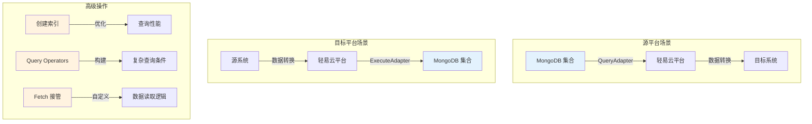
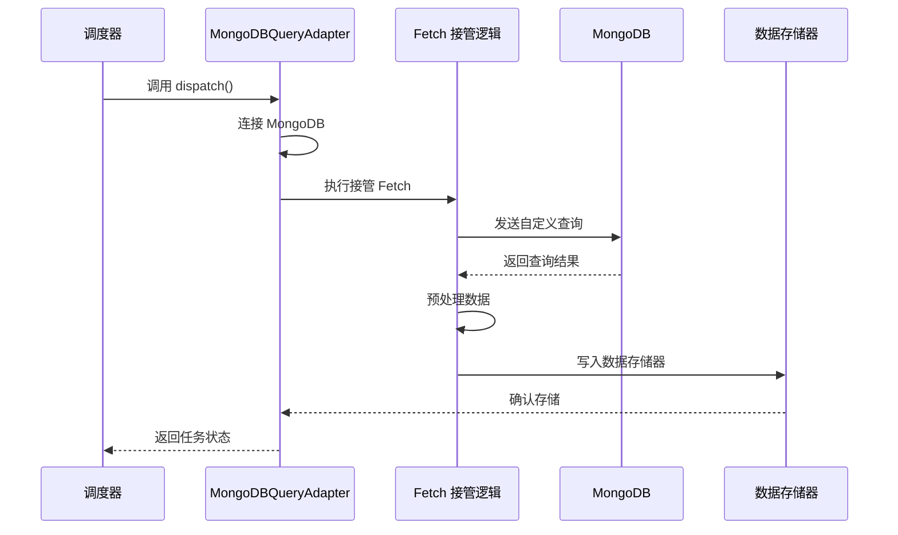
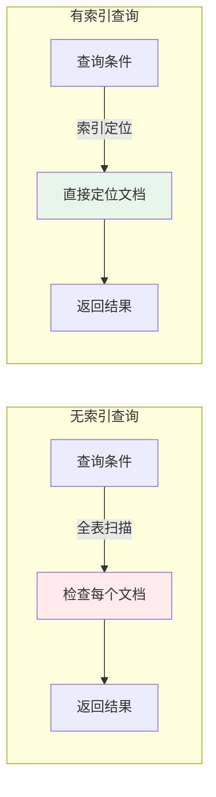
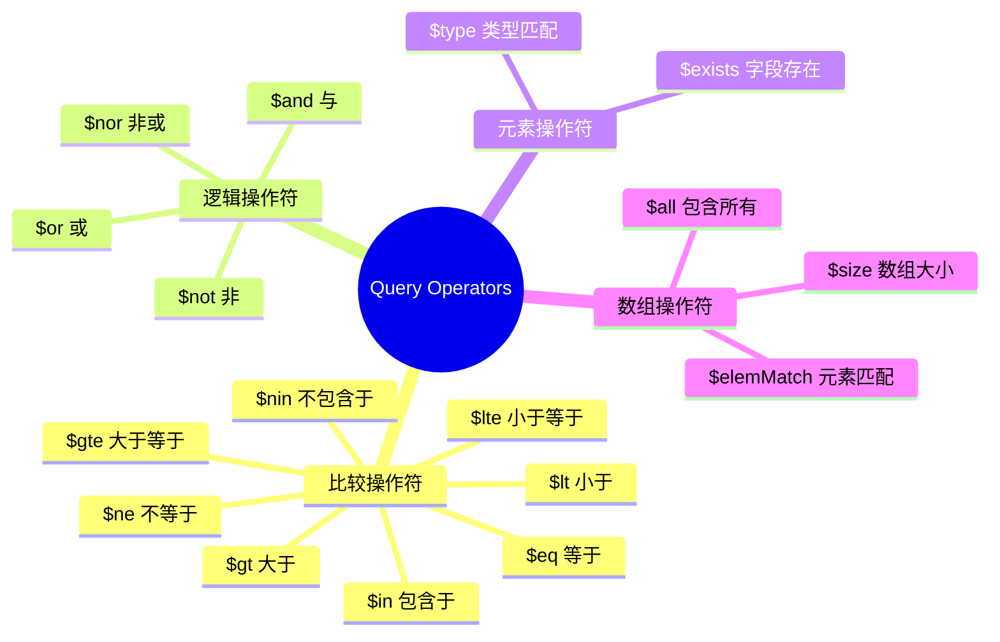
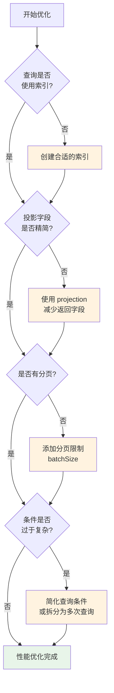

# MongoDB 高级集成

本文档介绍在轻易云 iPaaS 平台中集成 MongoDB 的高级用法，包括查询适配器接管 Fetch 操作、创建索引优化查询性能，以及使用 Query Operators 构建复杂查询条件。掌握这些技术可以帮助你更高效地处理 MongoDB 数据集成场景。

> [!IMPORTANT]
> 本文档适用于需要使用 MongoDB 作为源平台或目标平台的高级场景。基础连接配置请参考 [MongoDB 连接器](../connectors/database/mongodb)。

---

## 概述

### MongoDB 在数据集成中的角色



### 适用场景

| 场景 | 说明 | 技术要点 |
|------|------|----------|
| **大数据量查询** | 从 MongoDB 读取千万级数据 | 分页查询 + 索引优化 |
| **复杂条件筛选** | 多字段组合查询 | Query Operators |
| **嵌套文档处理** | 处理内嵌数组和对象 | 文档路径表达式 |
| **性能优化** | 提升查询响应速度 | 索引创建与管理 |

---

## 接管 MongoDB Fetch

### 功能说明

接管 Fetch 是指在 MongoDB 查询适配器中自定义数据读取逻辑，替代默认的查询行为。通过接管 Fetch，你可以：

- 自定义查询条件和投影字段
- 实现特殊的分页逻辑
- 处理复杂的聚合查询
- 对查询结果进行预处理



### 适配器配置

在集成方案的源平台配置中，使用以下适配器类：

| 配置项 | 值 | 说明 |
|--------|-----|------|
| 适配器 | `\Adapter\MongoDB\MongoDBQueryAdapter` | MongoDB 查询适配器 |
| API 接口 | `fetch` / `aggregate` | 查询或聚合操作 |

### 基础配置示例

在源平台配置的【源码视图】中添加 `fetchOverride` 参数：

```json
{
  "fetchOverride": {
    "enabled": true,
    "collection": "orders",
    "filter": {
      "status": "completed",
      "createTime": {
        "$gte": "{{lastSyncTime|datetime}}"
      }
    },
    "projection": {
      "orderNo": 1,
      "customer": 1,
      "items": 1,
      "totalAmount": 1
    },
    "sort": {
      "createTime": -1
    },
    "batchSize": 1000
  }
}
```

### 配置参数说明

| 参数 | 类型 | 必填 | 说明 |
|------|------|------|------|
| `enabled` | boolean | 是 | 是否启用 Fetch 接管 |
| `collection` | string | 是 | 集合名称 |
| `filter` | object | 否 | 查询过滤条件 |
| `projection` | object | 否 | 投影字段（1 包含，0 排除） |
| `sort` | object | 否 | 排序规则（1 升序，-1 降序） |
| `batchSize` | number | 否 | 每批次读取数量，默认 1000 |
| `skip` | number | 否 | 跳过的文档数 |
| `limit` | number | 否 | 最大返回文档数 |

### 分页查询示例

对于大数据量场景，建议使用分页读取：

```json
{
  "fetchOverride": {
    "enabled": true,
    "collection": "logs",
    "filter": {
      "level": "error"
    },
    "sort": {
      "_id": 1
    },
    "batchSize": 500,
    "pagination": {
      "enabled": true,
      "field": "_id",
      "lastValue": "{{lastId}}"
    }
  }
}
```

### 聚合管道示例

使用 `aggregate` API 进行复杂数据处理：

```json
{
  "fetchOverride": {
    "enabled": true,
    "type": "aggregate",
    "collection": "orders",
    "pipeline": [
      {
        "$match": {
          "status": "completed",
          "createTime": {
            "$gte": "{{startTime|datetime}}",
            "$lt": "{{endTime|datetime}}"
          }
        }
      },
      {
        "$group": {
          "_id": "$customerId",
          "totalOrders": { "$sum": 1 },
          "totalAmount": { "$sum": "$amount" }
        }
      },
      {
        "$sort": {
          "totalAmount": -1
        }
      }
    ]
  }
}
```

### 嵌套文档拍扁

处理内嵌数组时使用 `unwind` 选项：

```json
{
  "fetchOverride": {
    "enabled": true,
    "collection": "orders",
    "unwind": "items",
    "projection": {
      "orderNo": 1,
      "itemName": "$items.name",
      "itemQty": "$items.quantity",
      "itemPrice": "$items.price"
    }
  }
}
```

> [!TIP]
> 使用 `unwind` 会将包含数组的文档拆分为多条记录，每条记录包含数组中的一个元素。这在处理订单明细等场景时非常有用。

---

## 创建索引

### 功能说明

索引是提升 MongoDB 查询性能的关键。在数据集成场景中，合理的索引可以：

- 大幅减少查询响应时间
- 优化排序操作性能
- 加速分页查询
- 支持高效的去重操作



### 适配器配置

使用 MongoDB 执行适配器创建索引：

| 配置项 | 值 | 说明 |
|--------|-----|------|
| 适配器 | `\Adapter\MongoDB\MongoDBQueryAdapter` | MongoDB 查询适配器 |
| API 接口 | `createIndex` | 创建索引操作 |

### 创建索引配置

```json
{
  "data": {
    "index1": {
      "key": "content.FID",
      "sort": 1
    },
    "index2": {
      "key": "content.FBillNo",
      "sort": -1
    }
  },
  "collectionName": "60dabfe6-8949-3623-a772-c79c2289eba5_ADATA"
}
```

### 参数说明

| 参数 | 类型 | 必填 | 说明 |
|------|------|------|------|
| `data` | object | 是 | 索引配置信息，支持多个索引 |
| `indexN` | object | 是 | 单个索引配置，key 为索引名称 |
| `key` | string | 是 | 索引字段路径，支持嵌套文档路径 |
| `sort` | number | 是 | 排序方向：1 为升序，-1 为降序 |
| `collectionName` | string | 是 | 目标集合名称 |

### 复合索引示例

创建包含多个字段的复合索引：

```json
{
  "data": {
    "idx_status_time": {
      "key": ["status", "createTime"],
      "sort": [1, -1]
    }
  },
  "collectionName": "orders"
}
```

### 常用索引类型

| 索引类型 | 配置示例 | 适用场景 |
|----------|----------|----------|
| **单字段索引** | `{"key": "field", "sort": 1}` | 单字段查询、排序 |
| **复合索引** | `{"key": ["a", "b"], "sort": [1, -1]}` | 多字段组合查询 |
| **嵌套字段索引** | `{"key": "content.FID", "sort": 1}` | 内嵌文档字段查询 |
| **数组索引** | `{"key": "tags", "sort": 1}` | 数组元素查询 |

### 索引最佳实践

> [!TIP]
> 1. **选择性原则**：优先为查询条件中选择性高的字段创建索引
> 2. **最左前缀**：复合索引的字段顺序应与查询条件匹配
> 3. **避免过多索引**：每个集合建议不超过 5 个索引，过多的索引会影响写入性能
> 4. **定期检查**：使用 `db.collection.getIndexes()` 检查现有索引，删除无用索引

### 索引维护

在集成方案中定期重建索引：

```json
{
  "data": {
    "rebuildIndex": {
      "key": "content.FUpdateTime",
      "sort": -1,
      "background": true
    }
  },
  "collectionName": "sync_data"
}
```

> [!WARNING]
> 重建索引会锁定集合，生产环境建议使用 `background: true` 进行后台重建。

---

## Query Operators 查询操作符

### 功能说明

MongoDB 提供丰富的查询操作符，支持构建复杂的查询条件。在轻易云平台中，你可以在 `filter` 配置中使用这些操作符来实现精确的数据筛选。



### 与 SQL 的对比

下表展示了 MongoDB 操作符与 SQL 的对应关系：

| 操作 | MongoDB 格式 | 示例 | SQL 等效语句 |
|------|-------------|------|-------------|
| 等于 | `{ $eq: value }` | `{ "status": { "$eq": "active" } }` | `WHERE status = 'active'` |
| 不等于 | `{ $ne: value }` | `{ "status": { "$ne": "deleted" } }` | `WHERE status != 'deleted'` |
| 大于 | `{ $gt: value }` | `{ "age": { "$gt": 18 } }` | `WHERE age > 18` |
| 大于等于 | `{ $gte: value }` | `{ "score": { "$gte": 60 } }` | `WHERE score >= 60` |
| 小于 | `{ $lt: value }` | `{ "price": { "$lt": 100 } }` | `WHERE price < 100` |
| 小于等于 | `{ $lte: value }` | `{ "qty": { "$lte": 50 } }` | `WHERE qty <= 50` |
| 包含于 | `{ $in: array }` | `{ "status": { "$in": ["A", "B"] } }` | `WHERE status IN ('A', 'B')` |
| 不包含于 | `{ $nin: array }` | `{ "type": { "$nin": ["X", "Y"] } }` | `WHERE type NOT IN ('X', 'Y')` |

### 比较操作符示例

```json
{
  "fetchOverride": {
    "filter": {
      "amount": {
        "$gte": 1000,
        "$lte": 10000
      },
      "status": {
        "$in": ["pending", "processing"]
      }
    }
  }
}
```

### 逻辑操作符

#### $and - 与条件

所有条件必须同时满足：

```json
{
  "$and": [
    { "status": "active" },
    { "age": { "$gte": 18 } },
    { "region": "APAC" }
  ]
}
```

简写形式（默认即为 AND）：

```json
{
  "status": "active",
  "age": { "$gte": 18 },
  "region": "APAC"
}
```

#### $or - 或条件

满足任一条件即可：

```json
{
  "$or": [
    { "status": "urgent" },
    { "priority": { "$gte": 5 } },
    { "tags": { "$in": ["vip", "enterprise"] } }
  ]
}
```

#### $not - 非条件

条件取反：

```json
{
  "status": {
    "$not": { "$eq": "deleted" }
  }
}
```

等效于：

```json
{
  "status": { "$ne": "deleted" }
}
```

### 组合逻辑示例

复杂的业务查询场景：

```json
{
  "$and": [
    {
      "$or": [
        { "status": "active" },
        { "status": "pending" }
      ]
    },
    {
      "$or": [
        { "priority": { "$gte": 3 } },
        { "isVip": true }
      ]
    },
    {
      "createTime": {
        "$gte": "{{lastSyncTime|datetime}}"
      }
    }
  ]
}
```

对应 SQL：

```sql
WHERE (
  status = 'active' OR status = 'pending'
) AND (
  priority >= 3 OR isVip = true
) AND (
  createTime >= '2024-01-01 00:00:00'
)
```

### 元素操作符

#### $exists - 字段存在性

```json
{
  "fetchOverride": {
    "filter": {
      "deletedAt": {
        "$exists": false
      },
      "email": {
        "$exists": true
      }
    }
  }
}
```

#### $type - 类型匹配

```json
{
  "fetchOverride": {
    "filter": {
      "amount": {
        "$type": "number"
      },
      "code": {
        "$type": "string"
      }
    }
  }
}
```

### 数组操作符

#### $all - 包含所有元素

```json
{
  "tags": {
    "$all": ["important", "urgent"]
  }
}
```

#### $elemMatch - 数组元素匹配

匹配数组中至少一个元素满足所有条件：

```json
{
  "items": {
    "$elemMatch": {
      "status": "pending",
      "amount": { "$gt": 100 }
    }
  }
}
```

#### $size - 数组长度

```json
{
  "comments": {
    "$size": 5
  }
}
```

### 数组查询示例

查询包含特定商品的订单：

```json
{
  "fetchOverride": {
    "collection": "orders",
    "filter": {
      "items": {
        "$elemMatch": {
          "productId": "PROD001",
          "quantity": { "$gte": 10 }
        }
      },
      "tags": {
        "$all": ["wholesale", "confirmed"]
      }
    }
  }
}
```

### 时间范围查询

结合变量进行增量同步：

```json
{
  "fetchOverride": {
    "filter": {
      "$and": [
        {
          "updateTime": {
            "$gte": "{{lastSyncTime|datetime}}"
          }
        },
        {
          "updateTime": {
            "$lt": "{{currentTime|datetime}}"
          }
        }
      ]
    },
    "sort": {
      "updateTime": 1
    }
  }
}
```

---

## 高级应用示例

### 场景一：增量同步 + 索引优化

结合索引和增量查询实现高效数据同步：

```json
{
  "fetchOverride": {
    "enabled": true,
    "collection": "business_data",
    "filter": {
      "content.FModifyDate": {
        "$gte": "{{lastSyncTime|datetime}}"
      },
      "content.FDocumentStatus": {
        "$in": ["A", "B", "C"]
      }
    },
    "projection": {
      "content.FBillNo": 1,
      "content.FDate": 1,
      "content.FEntity_FEntryID": 1,
      "content.FMaterialId": 1
    },
    "sort": {
      "content.FModifyDate": 1
    },
    "batchSize": 500
  },
  "indexConfig": {
    "data": {
      "idx_modify_date": {
        "key": "content.FModifyDate",
        "sort": 1
      },
      "idx_status": {
        "key": "content.FDocumentStatus",
        "sort": 1
      }
    },
    "collectionName": "business_data"
  }
}
```

### 场景二：复杂聚合查询

使用聚合管道进行数据汇总：

```json
{
  "fetchOverride": {
    "enabled": true,
    "type": "aggregate",
    "collection": "sales",
    "pipeline": [
      {
        "$match": {
          "date": {
            "$gte": "{{startDate|date}}",
            "$lte": "{{endDate|date}}"
          },
          "status": { "$ne": "cancelled" }
        }
      },
      {
        "$unwind": "$items"
      },
      {
        "$group": {
          "_id": {
            "region": "$region",
            "product": "$items.productId"
          },
          "totalQty": { "$sum": "$items.quantity" },
          "totalAmount": { "$sum": "$items.amount" },
          "orderCount": { "$addToSet": "$orderNo" }
        }
      },
      {
        "$project": {
          "region": "$_id.region",
          "productId": "$_id.product",
          "totalQty": 1,
          "totalAmount": 1,
          "orderCount": { "$size": "$orderCount" }
        }
      },
      {
        "$sort": {
          "totalAmount": -1
        }
      }
    ]
  }
}
```

### 场景三：嵌套文档查询

处理复杂嵌套结构：

```json
{
  "fetchOverride": {
    "collection": "invoices",
    "filter": {
      "header.companyCode": "C001",
      "header.invoiceDate": {
        "$gte": "{{startDate|date}}"
      },
      "details": {
        "$elemMatch": {
          "taxRate": { "$gt": 0 },
          "amount": { "$gte": 10000 }
        }
      },
      "attachments": {
        "$exists": true,
        "$not": { "$size": 0 }
      }
    },
    "projection": {
      "header.invoiceNo": 1,
      "header.totalAmount": 1,
      "details.itemCode": 1,
      "details.itemName": 1,
      "details.amount": 1
    }
  }
}
```

---

## 性能优化建议

### 查询性能检查清单



### 索引设计原则

| 原则 | 说明 | 示例 |
|------|------|------|
| **等值优先** | 等值查询字段放前面 | `{ "status": 1, "date": -1 }` |
| **范围在后** | 范围查询字段放后面 | 先 `status` 后 `date` |
| **排序一致** | 索引顺序与排序一致 | 查询 `sort({date: -1})`，索引 `{date: -1}` |
| **覆盖查询** | 索引包含所有查询字段 | 避免回表查询 |

### 避免常见陷阱

> [!WARNING]
> 1. **正则查询**：`{ $regex: /^prefix/ }` 可以使用索引，`{ $regex: /suffix$/ }` 无法使用索引
> 2. **$where 操作符**：避免使用 `$where`，性能极差且无法使用索引
> 3. **大偏移分页**：`skip(100000)` 性能很差，建议使用基于字段的分页
> 4. **内存排序**：大数据量排序时注意 `allowDiskUse` 选项

---

## 常见问题

### Q: Fetch 接管后数据没有写入？

检查以下几点：

1. 确认 `enabled` 设置为 `true`
2. 检查 `collection` 名称是否正确
3. 验证 `filter` 条件是否过于严格导致无匹配数据
4. 查看平台日志中的详细错误信息

### Q: 索引创建失败？

可能原因及解决方法：

| 错误 | 原因 | 解决 |
|------|------|------|
| `Index already exists` | 索引已存在 | 先删除旧索引再重建 |
| `Index key too large` | 索引键值超过 1024 字节 | 使用哈希索引或缩短字段 |
| `Cannot create index` | 权限不足 | 检查数据库用户权限 |

### Q: 复杂查询性能差？

优化建议：

1. 使用 `explain()` 分析查询执行计划
2. 确保查询条件字段都有索引
3. 考虑将复杂查询拆分为多个简单查询
4. 对于聚合查询，适当使用 `$match` 提前过滤数据

### Q: 如何处理 ObjectId 字段？

在查询中使用字符串形式的 ObjectId：

```json
{
  "filter": {
    "_id": "507f1f77bcf86cd799439011",
    "parentId": { "$exists": false }
  }
}
```

平台会自动处理字符串到 ObjectId 的转换。

---

## 相关文档

- [MongoDB 连接器](../connectors/database/mongodb) - MongoDB 基础连接配置
- [适配器开发指南](./adapter-development) - 自定义适配器开发
- [源平台特殊操作](./source-special-operations) - 更多高级查询技巧
- [高级查询条件引擎](../advanced/advanced-query) - 通用查询条件配置
