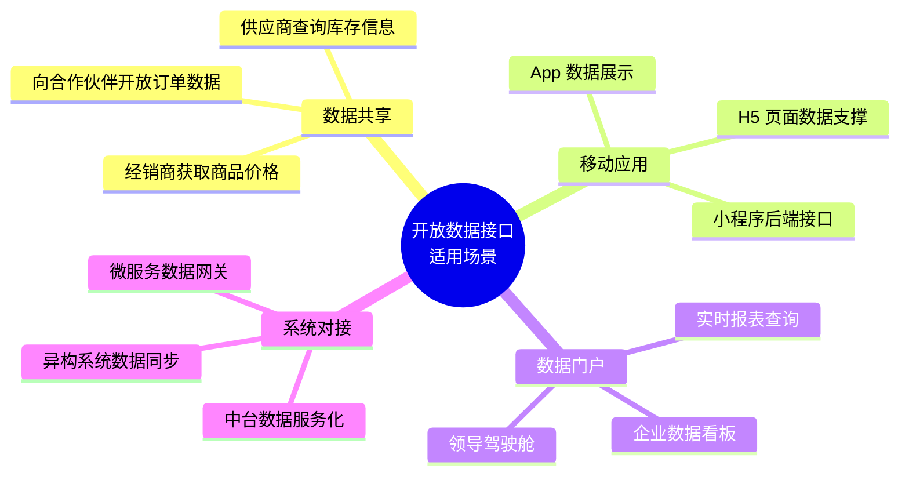
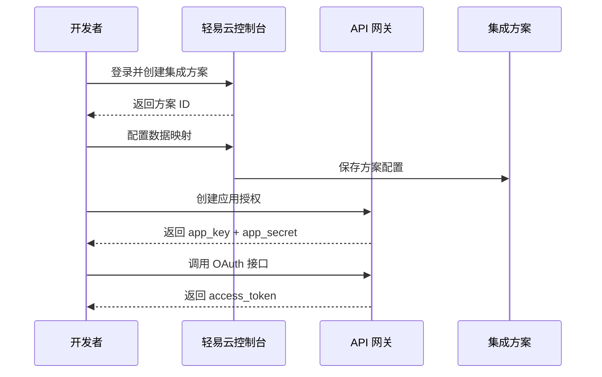
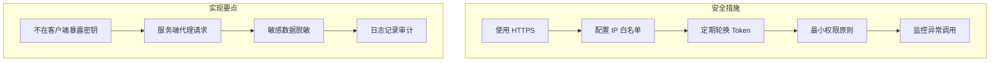
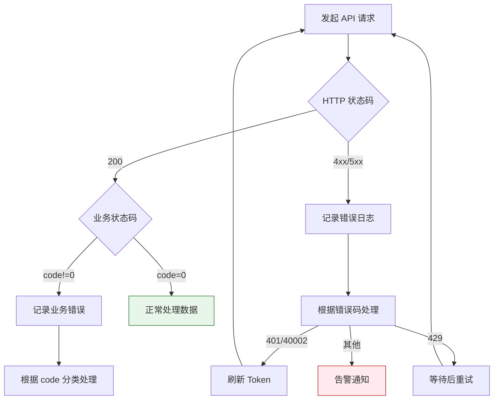

# 对外开放数据接口（查询）

本文档介绍如何将轻易云 iPaaS 平台内经过集成的数据对外暴露为标准化查询接口。通过开放数据接口，企业可以将内部系统的数据安全、高效地共享给外部合作伙伴、移动端应用或第三方系统，实现数据价值的最大化利用。

> [!IMPORTANT]
> 开放数据接口涉及敏感数据访问，请确保仅向可信对象授权，并合理配置 IP 白名单和访问令牌有效期。

## 适用场景



| 场景 | 数据流向 | 技术特点 | 示例 |
| ---- | -------- | -------- | ---- |
| **合作伙伴数据共享** | 平台 → 外部系统 | 按需授权、限时访问 | 向物流商开放发货单数据 |
| **移动应用支撑** | 平台 → App/小程序 | 高频查询、轻量化响应 | 移动端实时查询库存 |
| **数据门户构建** | 平台 → 可视化系统 | 大数据量、分页查询 | BI 报表数据接口 |
| **系统间数据同步** | 平台 ↔ 外部系统 | 增量同步、断点续传 | 每日增量同步销售数据 |

## 接口版本说明

轻易云提供两个版本的开放数据查询接口，分别适用于不同的认证场景：

| 版本 | 认证方式 | 适用场景 | 接口路径 |
| ---- | -------- | -------- | -------- |
| **V1** | Token 直接认证 | 快速接入、内部系统 | `/api/open/operation/{scheme_id}/query` |
| **V2** | OAuth 2.0 + Access Token | 生产环境、第三方接入 | `/v2/open-api/business/{scheme_id}/query` |

> [!TIP]
> 建议新接入项目优先使用 V2 版本，其基于 OAuth 2.0 的认证机制更加安全可靠，且支持更细粒度的权限控制。

## 前置准备

### 1. 创建集成方案

在调用开放接口前，你需要先在轻易云平台创建并配置好集成方案：

1. 登录轻易云控制台，进入**集成方案**页面
2. 点击**新建方案**，配置源平台和目标平台
3. 完成数据映射和转换规则的配置
4. 保存并发布方案，记录方案 ID（UUID 格式）

### 2. 获取访问凭证

根据所选接口版本，获取相应的访问凭证：

**V1 版本（Token 认证）**：

1. 进入集成方案的**更多信息**页签
2. 复制**访问令牌**（Token）
3. 该令牌长期有效，可重置

**V2 版本（OAuth 2.0）**：

1. 进入**API 网关 > 应用授权**
2. 点击**新增应用授权**，填写应用名称和描述
3. 保存后获取 `app_key` 和 `app_secret`
4. 通过 OAuth 接口换取 `access_token`



## V1 版本接口（Token 认证）

### 接口基本信息

| 属性 | 值 |
| ---- | -- |
| **请求方法** | `POST` |
| **请求路径** | `/api/open/operation/{scheme_id}/query` |
| **Content-Type** | `application/x-www-form-urlencoded` |
| **认证方式** | Token（请求参数传递） |

其中 `{scheme_id}` 为集成方案的唯一标识，格式如：`0c869589-c142-395c-b9a7-ed1d12ae1160`

### 完整请求 URL

```text
https://{host}/api/open/operation/{scheme_id}/query
```

- 生产环境：`https://pro-service.qliang.cloud/api/open/operation/{scheme_id}/query`
- 测试环境：`https://test-service.qliang.cloud/api/open/operation/{scheme_id}/query`

> [!NOTE]
> 请根据你的部署环境替换 `{host}` 为实际的服务域名。

### 请求参数

#### 公共参数

| 参数 | 类型 | 必填 | 说明 |
| ---- | ---- | ---- | ---- |
| `token` | string | ✅ | 访问令牌，从集成方案"更多信息"页签获取 |
| `page` | int | ✅ | 页码，从 1 开始，每页默认返回 10 条数据 |
| `pageSize` | int | — | 每页数据条数，范围 1~100，默认 10 |
| `begin_at` | int | ✅ | 开始时间戳（Unix 时间戳，秒级），查询数据的起始时间 |
| `end_at` | int | ✅ | 结束时间戳（Unix 时间戳，秒级），查询数据的截止时间 |

#### 查询条件参数

| 参数格式 | 类型 | 必填 | 说明 |
| -------- | ---- | ---- | ---- |
| `condition[field]` | mixed | — | 自定义过滤条件，支持 MongoDB 查询语法 |
| `condition[field][$eq]` | string/number | — | 等于条件 |
| `condition[field][$gte]` | string/number | — | 大于等于条件 |
| `condition[field][$lte]` | string/number | — | 小于等于条件 |

> [!TIP]
> 时间戳范围（`begin_at` / `end_at`）指的是数据被轻易云平台获取的时间，而非业务数据本身的创建时间。

### 响应参数

#### 响应结构

| 字段 | 类型 | 说明 |
| ---- | ---- | ---- |
| `success` | boolean | 请求是否成功，`true` 表示成功，`false` 表示失败 |
| `code` | int | 响应代码，`0` 表示成功，非零值表示错误 |
| `message` | string | 响应提示信息 |
| `content` | object | 响应数据内容 |
| `content.rows` | array | 查询结果数据数组，每条记录为一个对象 |
| `content.total` | int | 符合条件的总记录数，用于分页计算 |
| `content.condition` | object | 实际执行的查询条件 |

#### 成功响应示例

```json
{
  "success": true,
  "code": 0,
  "message": "success",
  "content": {
    "rows": [
      {
        "id": "64a1b2c3d4e5f6g7h8i9j0k1",
        "content": {
          "PurchaseOrgId_Number": "100",
          "PurchaseOrgId_Name": "采购一部",
          "BillNo": "PO20240301001",
          "CreateDate": "2024-03-01 10:30:00",
          "Amount": 158000.00
        },
        "created_at": 1709262600
      }
    ],
    "total": 156,
    "condition": {
      "created_at": {
        "$gte": 1706745600,
        "$lte": 1709260799
      }
    }
  }
}
```

#### 错误响应示例

```json
{
  "success": false,
  "code": 401,
  "message": "Token 无效或已过期",
  "content": null
}
```

### 代码示例

#### Python (requests)

```python
import requests
import urllib.parse

# 接口配置
host = "pro-service.qliang.cloud"
scheme_id = "0c869589-c142-395c-b9a7-ed1d12ae1160"
url = f"https://{host}/api/open/operation/{scheme_id}/query"

# 构建请求参数
params = {
    "token": "ZE9mQGrC2kBlooEV7MLuGv8Zyhq90qG",
    "page": 1,
    "pageSize": 20,
    "begin_at": 1706745600,  # 2024-02-01 00:00:00
    "end_at": 1709260799,    # 2024-03-01 23:59:59
}

# 添加自定义查询条件（可选）
conditions = {
    "condition[content.PurchaseOrgId_Number][$eq]": "100",
    "condition[content.CreateDate][$gte]": "2024-02-26 16:00:01",
    "condition[content.CreateDate][$lte]": "2024-03-26 17:43:01"
}
params.update(conditions)

# 发送请求
headers = {
    "Content-Type": "application/x-www-form-urlencoded"
}
response = requests.post(url, data=params, headers=headers)

# 处理响应
if response.status_code == 200:
    result = response.json()
    if result["success"]:
        print(f"查询成功，共 {result['content']['total']} 条记录")
        for row in result["content"]["rows"]:
            print(f"单据号: {row['content']['BillNo']}")
    else:
        print(f"查询失败: {result['message']}")
else:
    print(f"HTTP 错误: {response.status_code}")
```

#### Python (http.client)

```python
import http.client
import urllib.parse

conn = http.client.HTTPSConnection("pro-service.qliang.cloud")

# URL 编码表单数据
payload = urllib.parse.urlencode({
    "token": "ZE9mQGrC2kBlooEV7MLuGv8Zyhq90qG",
    "page": 1,
    "begin_at": 1706745600,
    "end_at": 1709260799,
    "condition[content.PurchaseOrgId_Number][$eq]": "100"
})

headers = {
    "Content-Type": "application/x-www-form-urlencoded"
}

scheme_id = "0c869589-c142-395c-b9a7-ed1d12ae1160"
conn.request(
    "POST",
    f"/api/open/operation/{scheme_id}/query",
    payload,
    headers
)

res = conn.getresponse()
data = res.read()
print(data.decode("utf-8"))
```

#### Java (OkHttp)

```java
import okhttp3.*;

public class QueryOpenApi {
    public static void main(String[] args) throws Exception {
        String schemeId = "0c869589-c142-395c-b9a7-ed1d12ae1160";
        String url = "https://pro-service.qliang.cloud/api/open/operation/" 
                     + schemeId + "/query";
        
        OkHttpClient client = new OkHttpClient().newBuilder().build();
        
        MediaType mediaType = MediaType.parse("application/x-www-form-urlencoded");
        RequestBody body = RequestBody.create(mediaType,
            "token=ZE9mQGrC2kBlooEV7MLuGv8Zyhq90qG" +
            "&page=1" +
            "&begin_at=1706745600" +
            "&end_at=1709260799" +
            "&condition[content.PurchaseOrgId_Number][$eq]=100"
        );
        
        Request request = new Request.Builder()
            .url(url)
            .method("POST", body)
            .addHeader("Content-Type", "application/x-www-form-urlencoded")
            .build();
            
        Response response = client.newCall(request).execute();
        System.out.println(response.body().string());
    }
}
```

#### cURL

```bash
curl -X POST "https://pro-service.qliang.cloud/api/open/operation/0c869589-c142-395c-b9a7-ed1d12ae1160/query" \
  -H "Content-Type: application/x-www-form-urlencoded" \
  -d "token=ZE9mQGrC2kBlooEV7MLuGv8Zyhq90qG" \
  -d "page=1" \
  -d "begin_at=1706745600" \
  -d "end_at=1709260799" \
  -d "condition[content.PurchaseOrgId_Number][$eq]=100"
```

## V2 版本接口（OAuth 2.0）

### 接口基本信息

| 属性 | 值 |
| ---- | -- |
| **请求方法** | `POST` |
| **请求路径** | `/v2/open-api/business/{scheme_id}/query` |
| **Content-Type** | `application/json` |
| **认证方式** | Bearer Token（URL 参数传递） |

### 接口规范

| 规范项 | 要求 |
| ------ | ---- |
| **协议** | HTTPS |
| **编码** | UTF-8 |
| **字符支持** | 半角字符、中文、英文、数字、基本标点符号 |
| **请求频率** | 每分钟不超过 60 次 |
| **超限处理** | 频率超限后需等待 5 分钟后重新调用 |

> [!WARNING]
> 请保持合理的调用频率（1 分钟内 60 次以内）。如果接口响应提示请求太频繁，请在 5 分钟后重试。建议实现退避重试机制。

### 完整请求 URL

```text
https://{host}/v2/open-api/business/{scheme_id}/query?access_token={access_token}
```

### 第一步：获取 Access Token

在调用业务接口前，需先通过 OAuth 接口获取 `access_token`：

**请求信息**：

| 属性 | 值 |
| ---- | -- |
| **请求方法** | `POST` |
| **请求路径** | `/v2/oauth` |
| **Content-Type** | `application/json` |

**请求参数**：

| 参数 | 类型 | 必填 | 说明 |
| ---- | ---- | ---- | ---- |
| `app_key` | string | ✅ | 应用授权的 12 位字符串标识 |
| `app_secret` | string | ✅ | 应用授权的 20 位密钥字符串 |

**请求示例**：

```bash
curl -X POST "https://api.qeasy.cloud/v2/oauth" \
  -H "Content-Type: application/json" \
  -d '{
    "app_key": "012345678911",
    "app_secret": "11111111115555555555"
  }'
```

**响应参数**：

| 字段 | 类型 | 说明 |
| ---- | ---- | ---- |
| `success` | boolean | 请求是否成功 |
| `code` | int | 响应代码，`0` 表示成功 |
| `message` | string | 响应提示信息 |
| `content.access_token` | string | 访问令牌 |
| `content.expires_in` | int | 令牌有效期（单位：秒） |

**响应示例**：

```json
{
  "success": true,
  "code": 0,
  "message": "success",
  "content": {
    "access_token": "PSJthMmsVmc62d4c8528567be9b92435f0266cde05",
    "expires_in": 7200
  }
}
```

### 第二步：调用查询接口

#### 请求参数

**URL 参数**：

| 参数 | 类型 | 必填 | 说明 |
| ---- | ---- | ---- | ---- |
| `access_token` | string | ✅ | OAuth 接口获取的访问令牌 |

**Body 参数（JSON）**：

| 参数 | 类型 | 必填 | 说明 |
| ---- | ---- | ---- | ---- |
| `page` | int | ✅ | 页码，从 1 开始 |
| `pageSize` | int | ✅ | 每页数据条数，范围 1~100 |
| `begin_at` | int | ✅ | 开始时间戳（Unix 时间戳，秒级） |
| `end_at` | int | ✅ | 结束时间戳（Unix 时间戳，秒级） |
| `CONTENT_{field}` | mixed | — | 自定义过滤条件，支持 MongoDB 查询语法 |

#### 查询条件语法

V2 版本支持灵活的查询条件，可直接在请求体中指定字段过滤：

| 查询方式 | 参数格式 | 示例 | 说明 |
| -------- | -------- | ---- | ---- |
| **精确匹配** | `CONTENT_FieldName` | `"CONTENT_Status": "已审核"` | 字符串精确匹配 |
| **模糊搜索** | `CONTENT_FieldName` | `"CONTENT_BillNo": "PO2024"` | 字符串包含匹配 |
| **范围查询** | `CONTENT_FieldName` | `"CONTENT_Amount": {"$gte": 10000}` | 使用 MongoDB 操作符 |
| **多条件组合** | 多个字段 | 同时指定多个 `CONTENT_` 前缀字段 | 条件之间为 AND 关系 |

> [!NOTE]
> MongoDB 查询操作符参考：`$eq`（等于）、`$ne`（不等于）、`$gt`（大于）、`$gte`（大于等于）、`$lt`（小于）、`$lte`（小于等于）、`$in`（在数组中）、`$nin`（不在数组中）。

#### 请求示例

```bash
curl -X POST "https://api.qeasy.cloud/v2/open-api/business/0166a725-2b9a-30e4-91c5-3529176302c4/query?access_token=PSJthMmsVmc62d4c8528567be9b92435f0266cde05" \
  -H "Content-Type: application/json" \
  -d '{
    "page": 1,
    "pageSize": 50,
    "begin_at": 1706745600,
    "end_at": 1709260799,
    "CONTENT_Status": "已审核",
    "CONTENT_Amount": {
      "$gte": 10000
    }
  }'
```

#### 响应参数

| 字段 | 类型 | 说明 |
| ---- | ---- | ---- |
| `success` | boolean | 请求是否成功 |
| `code` | int | 响应代码，`0` 表示成功 |
| `message` | string | 响应提示信息 |
| `content` | array | 查询结果数据数组 |
| `content[].field` | mixed | 方案中定义的返回字段 |

#### 完整代码示例（Python）

```python
import requests
import time

class QeasyOpenAPI:
    def __init__(self, host, app_key, app_secret):
        self.host = host
        self.app_key = app_key
        self.app_secret = app_secret
        self.access_token = None
        self.token_expires_at = 0
    
    def _get_access_token(self):
        """获取 OAuth Access Token"""
        # 检查 Token 是否有效
        if self.access_token and time.time() < self.token_expires_at:
            return self.access_token
        
        url = f"https://{self.host}/v2/oauth"
        payload = {
            "app_key": self.app_key,
            "app_secret": self.app_secret
        }
        headers = {
            "Content-Type": "application/json"
        }
        
        response = requests.post(url, json=payload, headers=headers)
        result = response.json()
        
        if result["success"]:
            self.access_token = result["content"]["access_token"]
            expires_in = result["content"]["expires_in"]
            self.token_expires_at = time.time() + expires_in - 300  # 提前 5 分钟刷新
            return self.access_token
        else:
            raise Exception(f"获取 Token 失败: {result['message']}")
    
    def query_data(self, scheme_id, page=1, page_size=50, 
                   begin_at=None, end_at=None, conditions=None):
        """
        查询集成方案数据
        
        :param scheme_id: 集成方案 ID
        :param page: 页码，从 1 开始
        :param page_size: 每页条数，1~100
        :param begin_at: 开始时间戳
        :param end_at: 结束时间戳
        :param conditions: 自定义查询条件，字典格式
        :return: 查询结果
        """
        token = self._get_access_token()
        url = f"https://{self.host}/v2/open-api/business/{scheme_id}/query"
        
        params = {
            "access_token": token
        }
        
        payload = {
            "page": page,
            "pageSize": page_size,
            "begin_at": begin_at or int(time.time()) - 86400,  # 默认昨天
            "end_at": end_at or int(time.time())
        }
        
        # 添加自定义查询条件
        if conditions:
            for key, value in conditions.items():
                payload[f"CONTENT_{key}"] = value
        
        headers = {
            "Content-Type": "application/json"
        }
        
        response = requests.post(url, params=params, json=payload, headers=headers)
        return response.json()


# 使用示例
if __name__ == "__main__":
    api = QeasyOpenAPI(
        host="api.qeasy.cloud",
        app_key="your_app_key",
        app_secret="your_app_secret"
    )
    
    # 查询数据
    result = api.query_data(
        scheme_id="0166a725-2b9a-30e4-91c5-3529176302c4",
        page=1,
        page_size=20,
        begin_at=1706745600,
        end_at=1709260799,
        conditions={
            "Status": "已审核",
            "Amount": {"$gte": 10000}
        }
    )
    
    if result["success"]:
        print(f"查询成功，获取 {len(result['content'])} 条记录")
        for item in result["content"]:
            print(item)
    else:
        print(f"查询失败: {result['message']}")
```

## 数据链路查询（V2）

除了普通的数据列表查询，V2 版本还支持查询数据的完整链路信息，包括源平台和目标平台的调度、任务和响应详情。

### 接口信息

| 属性 | 值 |
| ---- | -- |
| **请求方法** | `POST` |
| **请求路径** | `/v2/open-api/business/{scheme_id}/data-link` |
| **Content-Type** | `application/json` |

### 请求参数

与普通查询接口相同，参考 V2 版本请求参数。

### 响应参数

| 字段 | 类型 | 说明 |
| ---- | ---- | ---- |
| `content.links` | array | 数据链路数组 |
| `content.links[].source` | object | 源系统信息 |
| `content.links[].source.dispatch` | object | 源系统调度者信息 |
| `content.links[].source.job` | object | 源系统队列任务信息 |
| `content.links[].source.response` | object | 源系统响应信息 |
| `content.links[].target` | object | 目标系统信息 |
| `content.links[].target.dispatch` | object | 目标系统调度者信息 |
| `content.links[].target.job` | object | 目标系统队列任务信息 |
| `content.links[].target.response` | object | 目标系统响应信息 |
| `content.total` | int | 总记录数 |
| `content.condition` | object | MongoDB 查询条件 |

### 响应示例

```json
{
  "success": true,
  "code": 0,
  "message": "success",
  "content": {
    "links": [
      {
        "source": {
          "dispatch": {
            "trigger_begin": 1646892733.15547,
            "adapter_class": "\\Adapter\\Kingdee\\KingdeeAdapter",
            "trigger_end": 1646892733.15547
          },
          "job": {
            "created_at": 1646892733.15547,
            "handle_at": 1646892733.430782,
            "response_at": 1646892733.425977,
            "protocol": "http",
            "SDK": "\\Adapter\\Kingdee\\SDK\\KingdeeSDK",
            "api": "/k3cloud/Kingdee.BOS.WebApi.ServicesStub.DynamicFormService.ExecuteBillQuery.common.kdsvc",
            "exec": {
              "url": "https://api.kingdee.com/k3cloud",
              "method": "POST",
              "header": {
                "content-type": "application/json"
              },
              "content": {
                "FormId": "BD_MATERIAL",
                "FilterString": "FMaterialId>0"
              }
            }
          },
          "response": {
            "code": "200",
            "message": "操作成功",
            "data": {
              "FMaterialId": 100001
            }
          }
        },
        "target": {
          "dispatch": {
            "trigger_begin": 1646892733.612526,
            "adapter_class": "\\Adapter\\Wangdiantong\\WangdiantongAdapter",
            "trigger_end": 1646892733.656357
          },
          "job": {
            "created_at": 1646892733.656357,
            "handle_at": 1646892733.93131,
            "response_at": 1646892733.926631,
            "protocol": "http",
            "SDK": "\\Adapter\\Wangdiantong\\SDK\\WangdiantongSDK",
            "api": "/openapi/goods/push",
            "exec": {
              "url": "https://api.wangdiantong.com",
              "method": "POST",
              "header": [
                "Content-Type: application/x-www-form-urlencoded"
              ],
              "content": {
                "goods_list": "[{\"goods_no\":\"SKU001\"}]"
              }
            }
          },
          "response": {
            "flag": "success",
            "code": 0,
            "message": "推送成功"
          }
        }
      }
    ],
    "total": 1,
    "condition": {
      "created_at": {
        "$gte": 1646892000,
        "$lte": 1646895600
      }
    }
  }
}
```

## 单条数据查询（V2）

根据数据主键查询单条记录的详细信息。

### 接口信息

| 属性 | 值 |
| ---- | -- |
| **请求方法** | `GET` |
| **请求路径** | `/v2/open-api/business/{scheme_id}/find-one/{primary_key}` |
| **Content-Type** | `application/json` |

### 请求参数

| 参数 | 类型 | 必填 | 说明 |
| ---- | ---- | ---- | ---- |
| `access_token` | string | ✅ | URL 参数，OAuth 访问令牌 |
| `primary_key` | string | ✅ | 路径参数，数据主键 ID |

### 请求示例

```bash
curl -X GET "https://api.qeasy.cloud/v2/open-api/business/0166a725-2b9a-30e4-91c5-3529176302c4/find-one/64a1b2c3d4e5f6g7h8i9j0k1?access_token=xxx" \
  -H "Content-Type: application/json"
```

## 错误码说明

### V1 版本错误码

| 错误码 | 含义 | 排查方法 |
| ------ | ---- | -------- |
| `0` | 成功 | — |
| `401` | Token 无效或已过期 | 检查 token 是否正确，或在控制台重新获取 |
| `403` | 无权限访问该方案 | 确认 token 对应的方案 ID 是否正确 |
| `404` | 方案不存在 | 检查 scheme_id 是否正确 |
| `429` | 请求过于频繁 | 降低请求频率，等待 5 分钟后重试 |
| `500` | 服务器内部错误 | 联系技术支持 |

### V2 版本错误码

| 错误码 | 含义 | 排查方法 |
| ------ | ---- | -------- |
| `0` | 成功 | — |
| `40001` | app_key 或 app_secret 错误 | 检查应用授权凭证 |
| `40002` | access_token 无效或已过期 | 重新调用 OAuth 接口获取 Token |
| `40003` | 方案 ID 不存在 | 检查 scheme_id 是否正确 |
| `40004` | 无权限访问该方案 | 确认应用授权已配置该方案权限 |
| `40005` | 查询参数错误 | 检查请求参数格式和值范围 |
| `40029` | 请求过于频繁 | 降低请求频率 |
| `50000` | 服务器内部错误 | 联系技术支持 |

## 最佳实践

### 1. 安全建议



- **HTTPS 强制**：所有接口必须通过 HTTPS 调用，禁止明文 HTTP 传输
- **Token 保管**：`app_secret` 和 `access_token` 应存储在服务端，禁止暴露在前端代码中
- **IP 白名单**：在生产环境配置可调用的 IP 地址白名单
- **定期轮换**：建议每 90 天轮换一次应用授权凭证

### 2. 性能优化

| 优化项 | 建议 |
| ------ | ---- |
| **分页策略** | 根据数据量选择合适分页大小，建议 50~100 条/页 |
| **时间窗口** | 缩小 `begin_at` / `end_at` 范围，减少单次查询数据量 |
| **条件过滤** | 使用 `condition` 参数在服务端过滤，减少网络传输 |
| **缓存机制** | 对不频繁变化的数据，在应用层实现本地缓存 |
| **增量同步** | 记录上次同步时间戳，下次从该时间点开始查询 |

### 3. 重试机制

```python
import time
import random

def query_with_retry(api_client, scheme_id, max_retries=3):
    """带退避重试的查询"""
    for attempt in range(max_retries):
        try:
            result = api_client.query_data(scheme_id)
            if result["success"]:
                return result
            elif result["code"] == 429:  # 频率限制
                wait_time = (2 ** attempt) + random.uniform(0, 1)
                time.sleep(wait_time)
            else:
                raise Exception(result["message"])
        except Exception as e:
            if attempt == max_retries - 1:
                raise
            time.sleep(2 ** attempt)
    return None
```

### 4. 异常处理流程



## 常见问题

### Q1: Token 和 Access Token 有什么区别？

**Token（V1）**：
- 与具体集成方案绑定
- 长期有效，除非手动重置
- 适用于内部系统快速接入

**Access Token（V2）**：
- 与应用授权绑定，可访问授权的多个方案
- 有有效期（默认 2 小时），需要定期刷新
- 适用于生产环境和第三方接入

### Q2: 时间戳参数具体指什么时间？

`begin_at` 和 `end_at` 参数指的是**数据被轻易云平台获取的时间**（`created_at`），而非业务数据本身的创建时间。例如：

- 采购单在金蝶中创建于 2024-01-01
- 轻易云平台在 2024-03-01 同步该采购单
- 查询时需使用 `begin_at=1709251200`（2024-03-01）才能查到该记录

### Q3: 如何查询大量数据（百万级）？

建议采用**时间窗口分页**策略：

1. 将大时间范围拆分为小的时间窗口（如每小时）
2. 在每个时间窗口内使用分页查询
3. 记录最后一条数据的时间戳作为下次起点
4. 避免单次查询过大的时间范围

```python
def batch_query_large_data(api, scheme_id, start_time, end_time):
    """批量查询大量数据"""
    window_size = 3600  # 1 小时窗口
    all_data = []
    
    current = start_time
    while current < end_time:
        window_end = min(current + window_size, end_time)
        page = 1
        
        while True:
            result = api.query_data(
                scheme_id=scheme_id,
                page=page,
                begin_at=current,
                end_at=window_end
            )
            
            if not result["content"]:
                break
                
            all_data.extend(result["content"])
            
            if len(result["content"]) < page_size:
                break
            page += 1
        
        current = window_end
    
    return all_data
```

### Q4: 接口返回的数据格式是什么？

返回的数据为 JSON 格式，每条记录包含以下标准字段：

```json
{
  "id": "数据主键",
  "content": {
    // 业务数据字段，与集成方案的数据映射配置一致
  },
  "created_at": 1709262600,
  "updated_at": 1709262600
}
```

### Q5: 调试接口时如何快速验证？

建议使用以下工具和方法：

1. **Postman / Apifox**：导入接口参数，保存为集合方便复用
2. **cURL**：命令行快速测试
3. **平台日志**：在轻易云控制台查看**数据与队列管理**中的请求日志
4. **时间戳转换**：使用 [Unix 时间戳转换工具](https://tool.lu/timestamp/) 确认时间范围

## 相关文档

- [认证授权](./authentication) — 详细了解 OAuth 2.0 认证流程
- [Webhook 配置](./webhook) — 接收平台实时事件推送
- [SDK 使用](./sdk) — 使用官方 SDK 简化开发
- [API 参考](../api-reference/README) — 完整 API 列表和参数说明
- [自定义连接器开发](./custom-connector) — 扩展平台接入能力
