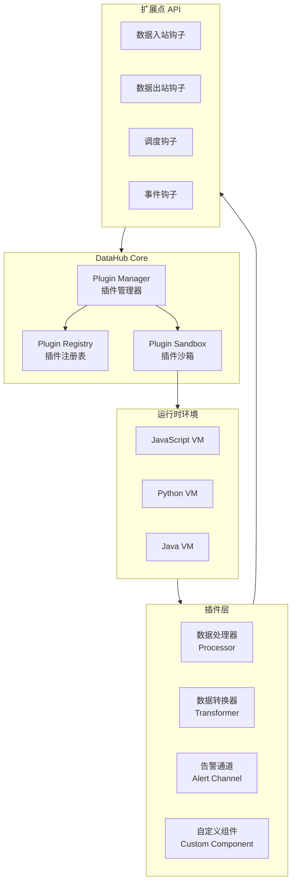
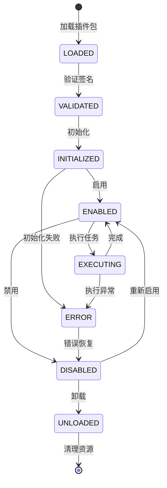
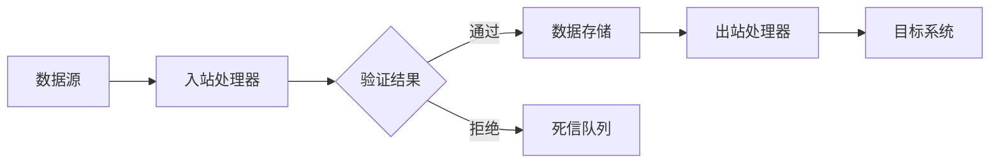
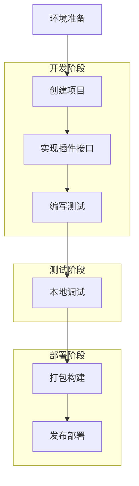
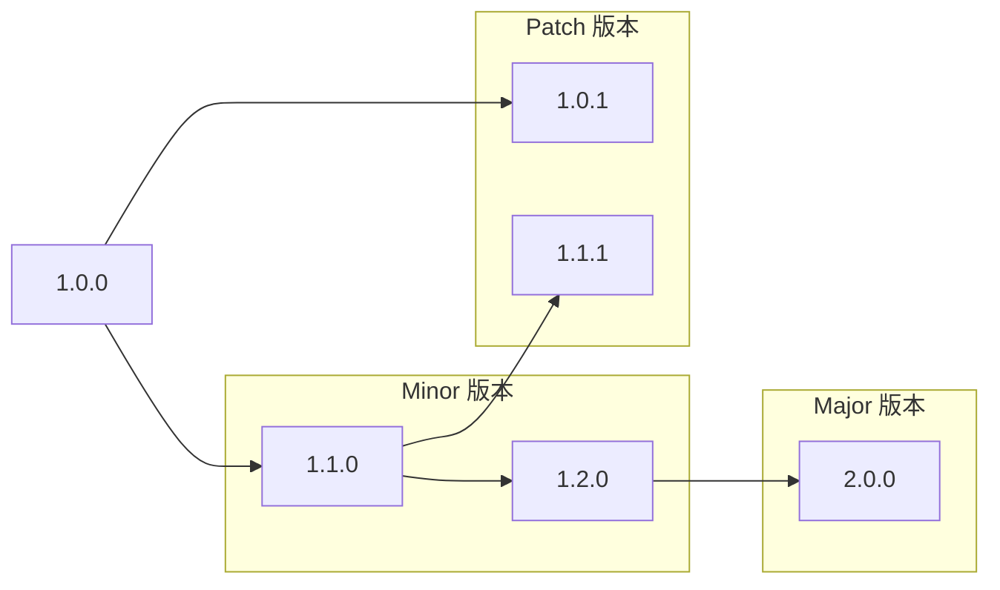

# 插件机制详解

轻易云 DataHub 的插件机制是其可扩展性的核心，允许开发者通过标准化接口扩展平台功能。本文档详细介绍插件架构、开发流程和最佳实践。

## 插件架构介绍

DataHub 插件系统采用模块化设计，支持在运行时动态加载和卸载插件，无需重启服务。

### 整体架构



### 插件生命周期



## 插件类型

DataHub 支持多种类型的插件，每种类型对应特定的功能扩展点。

### 插件类型对比

| 插件类型 | 功能描述 | 执行时机 | 性能要求 | 开发难度 |
|----------|----------|----------|----------|----------|
| 数据处理器 | 数据清洗、验证、过滤 | 数据入站/出站 | 高 | 中 |
| 数据转换器 | 格式转换、字段映射 | 数据流转过程 | 高 | 中 |
| 告警通道 | 告警通知发送 | 告警触发时 | 中 | 低 |
| 调度器 | 自定义调度策略 | 任务调度时 | 中 | 高 |
| 存储引擎 | 自定义存储后端 | 数据持久化 | 极高 | 高 |

### 1. 数据处理器（Processor）

数据处理器用于在数据流入或流出时进行实时处理。



#### Processor 接口定义

```java
public interface DataProcessor extends Plugin {
    /**
     * 处理数据记录
     * @param context 处理上下文
     * @param record 数据记录
     * @return 处理结果
     */
    ProcessResult process(ProcessContext context, DataRecord record);
    
    /**
     * 批量处理
     * @param context 处理上下文
     * @param records 数据记录列表
     * @return 处理结果列表
     */
    List<ProcessResult> processBatch(ProcessContext context, List<DataRecord> records);
}

public class ProcessResult {
    public enum Status {
        SUCCESS,      // 处理成功
        FILTERED,     // 被过滤
        ERROR,        // 处理错误
        RETRYABLE     // 可重试错误
    }
    
    private Status status;
    private DataRecord record;
    private String errorMessage;
    private Map<String, Object> metadata;
}
```

### 2. 数据转换器（Transformer）

数据转换器负责数据格式转换、字段映射和结构重组。

```java
public interface DataTransformer extends Plugin {
    /**
     * 转换数据
     * @param source 源数据
     * @param targetSchema 目标 Schema
     * @return 转换后的数据
     */
    DataRecord transform(DataRecord source, Schema targetSchema);
    
    /**
     * 获取支持的转换类型
     */
    List<TransformType> getSupportedTypes();
}

// 实现示例：字段映射转换器
@Component
public class FieldMappingTransformer implements DataTransformer {
    
    @Override
    public DataRecord transform(DataRecord source, Schema targetSchema) {
        Map<String, Object> mappedData = new HashMap<>();
        Map<String, Object> sourceData = source.getData();
        
        for (Field targetField : targetSchema.getFields()) {
            String sourceField = getMapping(targetField.getName());
            Object value = sourceData.get(sourceField);
            
            // 类型转换
            value = convertType(value, targetField.getType());
            
            mappedData.put(targetField.getName(), value);
        }
        
        return new DataRecord(mappedData, targetSchema);
    }
    
    private Object convertType(Object value, DataType targetType) {
        if (value == null) return null;
        
        switch (targetType) {
            case INTEGER:
                return Integer.valueOf(value.toString());
            case DOUBLE:
                return Double.valueOf(value.toString());
            case STRING:
                return value.toString();
            case BOOLEAN:
                return Boolean.valueOf(value.toString());
            case TIMESTAMP:
                return parseTimestamp(value);
            default:
                return value;
        }
    }
}
```

### 3. 告警通道（Alert Channel）

告警通道插件用于将告警信息发送到各种通知渠道。

```java
public interface AlertChannel extends Plugin {
    /**
     * 发送告警
     * @param alert 告警信息
     * @return 发送结果
     */
    SendResult send(Alert alert);
    
    /**
     * 验证通道配置
     */
    ValidationResult validateConfig(Map<String, Object> config);
    
    /**
     * 测试通道连接
     */
    boolean testConnection();
}

// Webhook 告警通道实现
@Component
public class WebhookAlertChannel implements AlertChannel {
    
    @Autowired
    private HttpClient httpClient;
    
    @Override
    public SendResult send(Alert alert) {
        WebhookConfig config = getConfig();
        
        try {
            Map<String, Object> payload = buildPayload(alert);
            
            HttpRequest request = HttpRequest.newBuilder()
                .uri(URI.create(config.getUrl()))
                .header("Content-Type", "application/json")
                .header("Authorization", "Bearer " + config.getToken())
                .POST(BodyPublishers.ofString(JsonUtils.toJson(payload)))
                .build();
            
            HttpResponse<String> response = httpClient.send(
                request, BodyHandlers.ofString());
            
            if (response.statusCode() == 200) {
                return SendResult.success(alert.getId());
            } else {
                return SendResult.failure(
                    alert.getId(), 
                    "HTTP " + response.statusCode() + ": " + response.body()
                );
            }
        } catch (Exception e) {
            return SendResult.failure(alert.getId(), e.getMessage());
        }
    }
    
    private Map<String, Object> buildPayload(Alert alert) {
        Map<String, Object> payload = new HashMap<>();
        payload.put("alertId", alert.getId());
        payload.put("level", alert.getLevel().name());
        payload.put("title", alert.getTitle());
        payload.put("message", alert.getMessage());
        payload.put("timestamp", alert.getTimestamp().toEpochMilli());
        payload.put("source", alert.getSource());
        payload.put("metadata", alert.getMetadata());
        
        return payload;
    }
}
```

## 插件开发流程

### 开发步骤



### 1. 环境准备

```bash
# 安装 DataHub CLI 工具
npm install -g @qingyiyun/datahub-cli

# 验证安装
datahub --version

# 登录到 DataHub 平台
datahub login
```

### 2. 创建插件项目

```bash
# 使用 CLI 创建插件项目模板
datahub plugin create --name my-custom-processor --type processor --lang typescript

# 项目结构
my-custom-processor/
├── src/
│   ├── index.ts          # 插件入口
│   ├── processor.ts      # 处理器实现
│   ├── config.ts         # 配置定义
│   └── types.ts          # 类型定义
├── tests/
│   └── processor.test.ts # 测试文件
├── package.json
├── tsconfig.json
├── plugin.yaml           # 插件配置
└── README.md
```

### 3. 实现插件接口

```typescript
// src/processor.ts
import { 
  DataProcessor, 
  ProcessContext, 
  DataRecord, 
  ProcessResult,
  PluginConfig 
} from '@qingyiyun/plugin-sdk';

interface DataFilterConfig extends PluginConfig {
  filterField: string;
  filterValue: string | number | boolean;
  operator: 'eq' | 'ne' | 'gt' | 'lt' | 'contains';
  action: 'pass' | 'reject' | 'modify';
  modifyValue?: any;
}

export class DataFilterProcessor implements DataProcessor {
  private config: DataFilterConfig;

  async initialize(config: DataFilterConfig): Promise<void> {
    this.config = config;
    
    // 验证配置
    if (!config.filterField) {
      throw new Error('filterField is required');
    }
    
    console.log(`DataFilterProcessor initialized with field: ${config.filterField}`);
  }

  async process(context: ProcessContext, record: DataRecord): Promise<ProcessResult> {
    const fieldValue = record.get(this.config.filterField);
    const matches = this.evaluateCondition(fieldValue, this.config.filterValue);

    switch (this.config.action) {
      case 'pass':
        return matches 
          ? ProcessResult.success(record)
          : ProcessResult.filtered(record, 'Condition not met');
      
      case 'reject':
        return matches
          ? ProcessResult.filtered(record, 'Condition matched - rejected')
          : ProcessResult.success(record);
      
      case 'modify':
        if (matches) {
          const modifiedRecord = record.clone();
          modifiedRecord.set(this.config.filterField, this.config.modifyValue);
          return ProcessResult.success(modifiedRecord);
        }
        return ProcessResult.success(record);
      
      default:
        return ProcessResult.error(record, 'Unknown action');
    }
  }

  async processBatch(
    context: ProcessContext, 
    records: DataRecord[]
  ): Promise<ProcessResult[]> {
    // 并行处理批量数据
    const promises = records.map(record => this.process(context, record));
    return Promise.all(promises);
  }

  private evaluateCondition(actual: any, expected: any): boolean {
    switch (this.config.operator) {
      case 'eq': return actual === expected;
      case 'ne': return actual !== expected;
      case 'gt': return actual > expected;
      case 'lt': return actual < expected;
      case 'contains': 
        return String(actual).includes(String(expected));
      default: return false;
    }
  }

  async destroy(): Promise<void> {
    console.log('DataFilterProcessor destroyed');
  }
}
```

### 4. 插件配置定义

```typescript
// src/config.ts
import { PluginSchema } from '@qingyiyun/plugin-sdk';

export const configSchema: PluginSchema = {
  type: 'object',
  properties: {
    filterField: {
      type: 'string',
      title: '过滤字段',
      description: '要进行过滤的数据字段名称',
      required: true
    },
    filterValue: {
      type: ['string', 'number', 'boolean'],
      title: '过滤值',
      description: '用于比较的目标值',
      required: true
    },
    operator: {
      type: 'string',
      title: '操作符',
      description: '比较操作符',
      enum: ['eq', 'ne', 'gt', 'lt', 'contains'],
      default: 'eq'
    },
    action: {
      type: 'string',
      title: '处理方式',
      description: '当条件匹配时的处理方式',
      enum: ['pass', 'reject', 'modify'],
      default: 'pass'
    },
    modifyValue: {
      type: 'any',
      title: '修改值',
      description: '当 action 为 modify 时使用的新值'
    }
  }
};
```

### 5. 插件入口文件

```typescript
// src/index.ts
import { DataFilterProcessor } from './processor';
import { configSchema } from './config';

export default {
  // 插件元数据
  metadata: {
    name: 'data-filter-processor',
    displayName: '数据过滤处理器',
    version: '1.0.0',
    description: '根据条件过滤或修改数据记录',
    author: 'Your Name',
    type: 'processor'
  },
  
  // 配置 Schema
  configSchema,
  
  // 插件类
  processor: DataFilterProcessor,
  
  // 钩子注册
  hooks: {
    'beforeProcess': (context) => {
      console.log('Before processing:', context.recordId);
    },
    'afterProcess': (context, result) => {
      console.log('After processing:', context.recordId, result.status);
    }
  }
};
```

## 插件 API

### 核心 API 列表

| API 类别 | 方法/接口 | 说明 |
|----------|-----------|------|
| 数据处理 | `DataProcessor.process()` | 单条数据处理 |
| 数据处理 | `DataProcessor.processBatch()` | 批量数据处理 |
| 数据转换 | `DataTransformer.transform()` | 数据格式转换 |
| 告警发送 | `AlertChannel.send()` | 发送告警通知 |
| 上下文 | `ProcessContext.getMetadata()` | 获取处理元数据 |
| 上下文 | `ProcessContext.getConfig()` | 获取插件配置 |
| 记录操作 | `DataRecord.get()` | 获取字段值 |
| 记录操作 | `DataRecord.set()` | 设置字段值 |
| 日志 | `Logger.info()` | 记录信息日志 |
| 指标 | `Metrics.counter()` | 计数器指标 |

### 上下文 API 详解

```typescript
interface ProcessContext {
  // 流程信息
  readonly flowId: string;
  readonly nodeId: string;
  readonly executionId: string;
  
  // 时间戳
  readonly startTime: Date;
  readonly currentTime: Date;
  
  // 元数据访问
  getMetadata(key: string): any;
  setMetadata(key: string, value: any): void;
  
  // 配置访问
  getPluginConfig<T>(): T;
  getGlobalConfig(): GlobalConfig;
  
  // 缓存操作
  getCache(key: string): Promise<any>;
  setCache(key: string, value: any, ttl?: number): Promise<void>;
  
  // 日志记录
  logger: Logger;
  
  // 指标上报
  metrics: Metrics;
  
  // 事件发布
  emit(event: string, data: any): void;
}

// 使用示例
async function processWithContext(context: ProcessContext, record: DataRecord) {
  // 记录日志
  context.logger.info(`Processing record: ${record.id}`);
  
  // 上报指标
  context.metrics.counter('records_processed', 1, {
    flow: context.flowId,
    status: 'success'
  });
  
  // 使用缓存
  const cached = await context.getCache(`record:${record.id}`);
  if (cached) {
    return ProcessResult.success(cached);
  }
  
  // 处理并缓存结果
  const result = await doProcess(record);
  await context.setCache(`record:${record.id}`, result, 300);
  
  // 触发事件
  context.emit('record.processed', { id: record.id, timestamp: Date.now() });
  
  return ProcessResult.success(result);
}
```

### 数据记录 API

```typescript
interface DataRecord {
  readonly id: string;
  readonly schema: Schema;
  readonly timestamp: Date;
  
  // 数据访问
  get(field: string): any;
  getAll(): Record<string, any>;
  has(field: string): boolean;
  
  // 数据修改
  set(field: string, value: any): void;
  delete(field: string): void;
  
  // 类型转换
  getString(field: string): string;
  getNumber(field: string): number;
  getBoolean(field: string): boolean;
  getDate(field: string): Date;
  getArray<T>(field: string): T[];
  getObject<T>(field: string): T;
  
  // 复制与转换
  clone(): DataRecord;
  toJSON(): string;
  toMap(): Map<string, any>;
  
  // 验证
  validate(): ValidationResult;
  isValid(): boolean;
}
```

## 插件打包和发布

### 打包配置

```yaml
# plugin.yaml
plugin:
  name: data-filter-processor
  version: 1.0.0
  displayName: 数据过滤处理器
  description: 根据条件过滤或修改数据记录的高级处理器
  author: Your Name
  license: MIT
  
  type: processor
  runtime: nodejs18
  
  # 入口配置
  entry:
    main: dist/index.js
    
  # 能力声明
  capabilities:
    - stream_processing
    - batch_processing
    - field_filtering
    
  # 依赖声明
  dependencies:
    - name: lodash
      version: ^4.17.21
      
  # 资源限制
  resources:
    memory: 512MB
    timeout: 30000
    
  # 权限声明
  permissions:
    - cache:read
    - cache:write
    - metrics:write
    
  # 配置 Schema
  configSchema:
    $schema: http://json-schema.org/draft-07/schema#
    type: object
    required: [filterField, filterValue]
    properties:
      filterField:
        type: string
        title: 过滤字段
      filterValue:
        type: [string, number, boolean]
        title: 过滤值
      operator:
        type: string
        enum: [eq, ne, gt, lt, contains]
        default: eq
      action:
        type: string
        enum: [pass, reject, modify]
        default: pass
```

### 构建脚本

```json
// package.json
{
  "name": "data-filter-processor",
  "version": "1.0.0",
  "scripts": {
    "build": "tsc && npm run copy-assets",
    "copy-assets": "cp plugin.yaml dist/ && cp -r assets dist/",
    "test": "jest",
    "test:coverage": "jest --coverage",
    "lint": "eslint src/**/*.ts",
    "package": "npm run build && npm run pack",
    "pack": "datahub plugin pack --output ./dist/data-filter-processor-1.0.0.zip",
    "publish": "datahub plugin publish --file ./dist/data-filter-processor-1.0.0.zip"
  },
  "dependencies": {
    "@qingyiyun/plugin-sdk": "^2.0.0"
  },
  "devDependencies": {
    "@types/node": "^18.0.0",
    "typescript": "^5.0.0",
    "jest": "^29.0.0",
    "@qingyiyun/datahub-cli": "^2.0.0"
  }
}
```

### 发布流程

```bash
# 1. 运行测试
npm test

# 2. 构建项目
npm run build

# 3. 打包插件
npm run pack

# 4. 本地验证
datahub plugin validate --file ./dist/data-filter-processor-1.0.0.zip

# 5. 发布到私有仓库
datahub plugin publish \
  --file ./dist/data-filter-processor-1.0.0.zip \
  --registry https://plugins.your-company.com \
  --token $PLUGIN_REGISTRY_TOKEN

# 6. 安装到 DataHub 实例
datahub plugin install \
  --name data-filter-processor \
  --version 1.0.0 \
  --instance production
```

### 版本管理策略



| 版本类型 | 变更内容 | 向后兼容 | 升级建议 |
|----------|----------|----------|----------|
| Patch (x.x.X) | Bug 修复 | ✅ 完全兼容 | 自动升级 |
| Minor (x.X.0) | 新功能 | ✅ 向后兼容 | 计划升级 |
| Major (X.0.0) | 重大变更 | ❌ 可能不兼容 | 评估后升级 |

> **Note**: 发布插件前请确保已通过所有测试，并更新版本号和 CHANGELOG。

> **Warning**: 插件升级可能导致配置不兼容，请在升级前备份配置。
