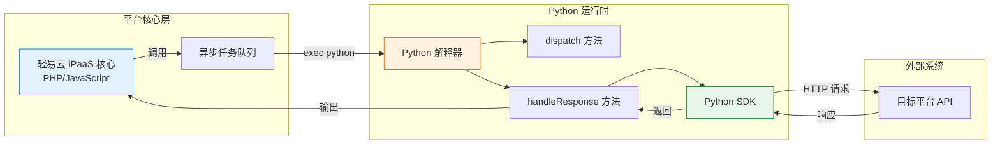

# Python 适配器开发

本文档面向需要使用 Python 开发轻易云 iPaaS 平台适配器的开发者。通过阅读本文，你将了解如何使用 Python 编写自定义适配器，包括环境配置、核心方法实现、完整示例代码以及与 JavaScript/PHP 适配器的差异对比。

> [!IMPORTANT]
> Python 适配器适用于需要利用 Python 生态（如数据科学库、AI 模型等）进行数据处理的场景。对于常规集成需求，建议优先使用平台内置的 PHP/JavaScript 适配器以获得更好的性能和官方支持。

## 概述

### 什么是 Python 适配器

Python 适配器是轻易云 iPaaS 平台支持的一种自定义适配器开发方式，允许开发者使用 Python 语言实现数据查询、转换和写入逻辑。Python 适配器通过命令行接口与平台核心交互，适用于以下场景：

- 需要利用 Python 丰富的数据处理库（如 Pandas、NumPy）
- 集成机器学习/AI 模型进行数据预测或分类
- 对接仅提供 Python SDK 的第三方服务
- 快速原型验证和定制化数据处理



### Python 适配器与 PHP/JavaScript 适配器对比

| 特性 | Python 适配器 | PHP/JavaScript 适配器 |
| ---- | ------------- | --------------------- |
| **开发语言** | Python 3.x | PHP 8.x / JavaScript ES2020+ |
| **适用场景** | 数据处理、AI 集成 | 通用集成、高性能场景 |
| **性能** | 启动开销较大，适合批处理 | 常驻内存，实时响应 |
| **生态优势** | Pandas、NumPy、ML 库丰富 | 平台原生支持，调试便捷 |
| **调试难度** | 需要独立 Python 环境 | 集成在平台内，调试方便 |
| **部署方式** | 脚本文件 + Python 环境 | 内置运行时 |

## 环境配置

### 前置条件

在开始开发 Python 适配器前，请确保满足以下条件：

1. **Python 版本**：Python 3.8 或更高版本
2. **系统权限**：服务器需安装 Python 并允许执行 Python 脚本
3. **依赖库**：根据需求安装相应的 Python 包

### 安装 Python 依赖

```bash
# 检查 Python 版本
python3 --version

# 创建虚拟环境（推荐）
python3 -m venv qeasy-adapter-env
source qeasy-adapter-env/bin/activate  # Linux/Mac
# 或
qeasy-adapter-env\Scripts\activate  # Windows

# 安装常用依赖
pip install requests pandas numpy

# 保存依赖列表
pip freeze > requirements.txt
```

### 平台配置

在轻易云控制台配置 Python 适配器：

1. 进入**连接器管理 > 适配器设置**
2. 选择目标平台或创建新平台
3. 在适配器类型中选择 **Python 脚本**
4. 配置 Python 解释器路径（默认为 `python3`）
5. 上传或编辑 Python 适配器脚本

## 适配器基本结构

每个 Python 适配器必须包含以下两个核心方法：

| 方法名 | 用途 | 调用时机 |
| ------ | ---- | -------- |
| `dispatch` | 调度队列方法，生成 API 请求参数 | 数据查询/写入前 |
| `handleResponse` | 处理 API 响应数据 | 接口调用返回后 |

### 文件结构模板

```python
#!/usr/bin/env python3
# -*- coding: utf-8 -*-
"""
轻易云 iPaaS Python 适配器模板
平台名称: [YourPlatform]
作者: [YourName]
创建日期: [Date]
"""

import json
import sys


def dispatch(params):
    """
    调度方法：处理请求参数
    
    Args:
        params (dict): 输入参数字典
        
    Returns:
        dict: 处理后的请求参数
    """
    # 实现调度逻辑
    return params


def handleResponse(params):
    """
    响应处理方法：处理 API 返回数据
    
    Args:
        params (dict): 包含响应数据、请求参数和元数据
        
    Returns:
        dict: 标准格式的响应结果
    """
    # 实现响应处理逻辑
    return {
        "status": 2,  # 2 = 成功
        "message": "处理成功",
        "data": [],
        "ids": []
    }


# 入口函数，不要修改
if __name__ == "__main__":
    if len(sys.argv) < 2:
        print(json.dumps({"error": "缺少参数"}), flush=True)
        sys.exit(1)
    
    try:
        params = json.loads(sys.argv[1])
        
        # 根据参数中的 method 字段判断调用哪个方法
        method = params.get("method", "dispatch")
        
        if method == "dispatch":
            result = dispatch(params)
        elif method == "handleResponse":
            result = handleResponse(params)
        else:
            result = {"error": f"未知方法: {method}"}
        
        # 输出 JSON 结果到 stdout
        print(json.dumps(result, ensure_ascii=False), flush=True)
        
    except json.JSONDecodeError as e:
        print(json.dumps({"error": f"JSON 解析错误: {str(e)}"}), flush=True)
        sys.exit(1)
    except Exception as e:
        print(json.dumps({"error": f"执行错误: {str(e)}"}), flush=True)
        sys.exit(1)
```

## dispatch 方法详解

`dispatch` 方法是适配器的调度入口，负责生成正确的 API 请求参数并将其放入平台队列。

### 输入参数结构

```json
{
  "request": {
    "status": 4,
    "start_time": "2022-01-03 12:00:00",
    "end_time": "2022-01-03 13:00:00"
  },
  "metadata": {
    "api": "trade_query.php",
    "type": "QUERY",
    "method": "POST",
    "number": "assNo",
    "id": "assId",
    "pagination": {
      "pageSize": 50
    },
    "idCheck": true,
    "request": [
      {
        "parent": null,
        "label": "开始日期",
        "field": "status",
        "type": "string",
        "value": "4",
        "id": "status"
      }
    ]
  },
  "source": {}
}
```

### 输入参数字段说明

| 字段 | 类型 | 说明 |
| ---- | ---- | ---- |
| `request` | object | 根据配置生成的请求基本参数 |
| `metadata` | object | 集成平台的配置元数据 |
| `metadata.api` | string | API 接口路径 |
| `metadata.type` | string | 接口类型：`QUERY` 或 `WRITE` |
| `metadata.method` | string | HTTP 方法：`GET` / `POST` / `PUT` / `DELETE` |
| `metadata.number` | string | 数据编码字段名 |
| `metadata.id` | string | 数据主键字段名 |
| `metadata.pagination` | object | 分页配置 |
| `source` | object | 原始数据（仅在目标平台调度时存在） |

### 输出参数要求

`dispatch` 方法必须返回一个字典，作为 API 请求参数：

```python
def dispatch(params):
    request = params.get("request", {})
    metadata = params.get("metadata", {})
    
    # 自定义处理逻辑
    # 例如：添加签名、修改时间格式、添加分页参数等
    
    # 示例：添加分页参数
    if metadata.get("pagination"):
        request["pageSize"] = metadata["pagination"]["pageSize"]
        request["pageNo"] = 1
    
    return request
```

### dispatch 完整示例

```python
#!/usr/bin/env python3
import json
import sys
import hashlib
import time


def dispatch(params):
    """
    示例：旺店通订单查询适配器的 dispatch 方法
    """
    request = params.get("request", {})
    metadata = params.get("metadata", {})
    
    # 获取配置参数（从元数据中提取）
    app_key = metadata.get("app_key", "")
    app_secret = metadata.get("app_secret", "")
    
    # 生成签名
    timestamp = str(int(time.time()))
    sign_str = f"{app_key}{timestamp}{app_secret}"
    sign = hashlib.md5(sign_str.encode()).hexdigest()
    
    # 构建请求参数
    processed_request = {
        "app_key": app_key,
        "timestamp": timestamp,
        "sign": sign,
        "start_time": request.get("start_time", ""),
        "end_time": request.get("end_time", ""),
        "status": request.get("status", 4),
        "page_size": metadata.get("pagination", {}).get("pageSize", 50),
        "page_no": 1
    }
    
    return processed_request


if __name__ == "__main__":
    params = json.loads(sys.argv[1])
    result = dispatch(params)
    print(json.dumps(result, ensure_ascii=False))
```

## handleResponse 方法详解

`handleResponse` 方法负责处理 API 响应数据，进行状态判断、数据提取和格式转换。

### 输入参数结构

```json
{
  "response": {
    "success": true,
    "msg": "订单查询成功",
    "orderList": [
      {
        "order_id": "20220103001",
        "buyer_name": "张三",
        "amount": 199.99
      }
    ]
  },
  "request": {
    "status": 4,
    "start_time": "2022-01-03 12:00:00"
  },
  "metadata": {
    "api": "trade_query.php",
    "id": "order_id",
    "number": "order_no"
  }
}
```

### 输出参数格式

`handleResponse` 方法必须返回固定格式的字典：

```python
{
    "status": 2,           # 状态码（见下表）
    "message": "成功",      # 状态消息
    "data": [],            # 查询结果数据列表
    "ids": []              # 写入操作返回的 ID 列表
}
```

### 状态码说明

| 状态码 | 含义 | 说明 |
| ------ | ---- | ---- |
| `1` | 重复的 | 数据重复，已跳过 |
| `2` | 成功的 | 处理成功 |
| `3` | 错误的 | 处理出错，需排查 |
| `4` | 负库存 | 库存不足（特定场景） |
| `5` | 队列中 | 已加入处理队列 |
| `6` | 基础资料错误 | 关联的基础数据有误 |

### handleResponse 完整示例

```python
#!/usr/bin/env python3
import json
import sys


def handleResponse(params):
    """
    示例：处理 API 响应数据
    """
    response = params.get("response", {})
    metadata = params.get("metadata", {})
    
    result = {
        "status": 3,  # 默认为错误状态
        "message": "",
        "data": [],
        "ids": []
    }
    
    # 判断响应是否成功
    if not response.get("success", False):
        result["message"] = response.get("msg", "接口调用失败")
        return result
    
    # 提取数据列表
    # 根据实际平台响应结构调整
    data_key = "orderList"  # 或从 metadata 配置中获取
    data_list = response.get(data_key, [])
    
    # 处理每条数据
    processed_data = []
    for item in data_list:
        processed_item = {
            "id": item.get(metadata.get("id", "order_id")),
            "number": item.get(metadata.get("number", "order_no")),
            "content": item  # 完整原始数据
        }
        processed_data.append(processed_item)
    
    result["status"] = 2  # 成功
    result["message"] = response.get("msg", "处理成功")
    result["data"] = processed_data
    
    return result


if __name__ == "__main__":
    params = json.loads(sys.argv[1])
    result = handleResponse(params)
    print(json.dumps(result, ensure_ascii=False))
```

## SDK 开发

对于复杂的平台集成，建议封装 Python SDK 类来管理连接和 API 调用。

### SDK 基础结构

```python
#!/usr/bin/env python3
import requests
import json
import hashlib
import time
from typing import Dict, Optional, Any


class PlatformSDK:
    """
    平台 SDK 基类
    """
    
    def __init__(self, host: str, app_key: str, app_secret: str):
        """
        初始化 SDK
        
        Args:
            host: 平台域名
            app_key: 应用 Key
            app_secret: 应用密钥
        """
        self.host = host.rstrip("/")
        self.app_key = app_key
        self.app_secret = app_secret
        self.token = None
        self.session = requests.Session()
        self.session.timeout = (10, 30)  # (连接超时, 读取超时)
    
    def connect(self) -> Dict[str, Any]:
        """
        建立连接，获取访问令牌
        
        Returns:
            连接结果字典
        """
        # 实现认证逻辑
        # 示例：简单的签名认证
        timestamp = str(int(time.time()))
        sign = self._generate_sign(timestamp)
        
        url = f"{self.host}/auth/token"
        payload = {
            "app_key": self.app_key,
            "timestamp": timestamp,
            "sign": sign
        }
        
        try:
            response = self.session.post(url, json=payload)
            result = response.json()
            
            if result.get("code") == 200:
                self.token = result.get("data", {}).get("token")
                return {"status": True, "token": self.token}
            else:
                return {"status": False, "error": result.get("message")}
                
        except Exception as e:
            return {"status": False, "error": str(e)}
    
    def invoke(self, api: str, params: Dict, method: str = "POST") -> Dict[str, Any]:
        """
        调用平台 API
        
        Args:
            api: API 路径
            params: 请求参数
            method: HTTP 方法
            
        Returns:
            API 响应数据
        """
        url = f"{self.host}{api}"
        headers = {
            "Content-Type": "application/json"
        }
        
        if self.token:
            headers["Authorization"] = f"Bearer {self.token}"
        
        try:
            if method.upper() == "GET":
                response = self.session.get(url, params=params, headers=headers)
            else:
                response = self.session.request(method, url, json=params, headers=headers)
            
            return response.json()
            
        except Exception as e:
            return {"error": str(e)}
    
    def _generate_sign(self, timestamp: str) -> str:
        """生成签名"""
        sign_str = f"{self.app_key}{timestamp}{self.app_secret}"
        return hashlib.md5(sign_str.encode()).hexdigest()


# 使用示例
if __name__ == "__main__":
    sdk = PlatformSDK(
        host="https://api.example.com",
        app_key="your_app_key",
        app_secret="your_app_secret"
    )
    
    # 连接
    conn_result = sdk.connect()
    print(f"连接结果: {conn_result}")
    
    # 调用 API
    if conn_result.get("status"):
        response = sdk.invoke(
            api="/orders/query",
            params={"page": 1, "page_size": 50},
            method="POST"
        )
        print(f"API 响应: {response}")
```

## 完整示例：订单查询适配器

以下是一个完整的 Python 适配器示例，实现订单查询功能：

```python
#!/usr/bin/env python3
# -*- coding: utf-8 -*-
"""
轻易云 iPaaS Python 适配器 - 订单查询示例
功能：从电商平台查询订单数据
"""

import json
import sys
import hashlib
import time
import requests
from typing import Dict, List, Any


class ECommerceSDK:
    """电商平台 SDK"""
    
    def __init__(self, host: str, app_key: str, app_secret: str):
        self.host = host.rstrip("/")
        self.app_key = app_key
        self.app_secret = app_secret
        self.session = requests.Session()
    
    def invoke(self, api: str, params: Dict, method: str = "POST") -> Dict:
        """调用 API"""
        url = f"{self.host}{api}"
        
        # 生成签名
        timestamp = str(int(time.time()))
        sign_str = f"{self.app_key}{timestamp}{self.app_secret}"
        sign = hashlib.md5(sign_str.encode()).hexdigest()
        
        headers = {
            "Content-Type": "application/json",
            "X-App-Key": self.app_key,
            "X-Timestamp": timestamp,
            "X-Sign": sign
        }
        
        try:
            if method.upper() == "GET":
                response = self.session.get(url, params=params, headers=headers)
            else:
                response = self.session.post(url, json=params, headers=headers)
            
            return response.json()
        except Exception as e:
            return {"success": False, "msg": str(e)}


def dispatch(params: Dict) -> Dict:
    """
    调度方法：生成订单查询请求参数
    """
    request = params.get("request", {})
    metadata = params.get("metadata", {})
    
    # 构建查询参数
    query_params = {
        "start_time": request.get("start_time", ""),
        "end_time": request.get("end_time", ""),
        "status": request.get("status", ""),
        "page_size": metadata.get("pagination", {}).get("pageSize", 50),
        "page_no": request.get("page_no", 1)
    }
    
    # 添加扩展配置中的参数
    for field in metadata.get("request", []):
        field_name = field.get("field")
        field_value = field.get("value")
        if field_name and field_value is not None:
            query_params[field_name] = field_value
    
    return query_params


def handleResponse(params: Dict) -> Dict[str, Any]:
    """
    响应处理方法：处理订单查询结果
    """
    response = params.get("response", {})
    metadata = params.get("metadata", {})
    
    result = {
        "status": 3,
        "message": "处理失败",
        "data": [],
        "ids": []
    }
    
    # 检查响应状态
    if not response.get("success", False):
        result["message"] = response.get("msg", "接口调用失败")
        return result
    
    # 提取订单列表
    # 不同平台的字段名可能不同，根据实际情况调整
    data_list = response.get("orderList", [])
    if not data_list:
        data_list = response.get("data", {}).get("list", [])
    
    # 处理每条订单数据
    processed_data = []
    id_field = metadata.get("id", "order_id")
    number_field = metadata.get("number", "order_no")
    
    for item in data_list:
        record = {
            "id": str(item.get(id_field, "")),
            "number": str(item.get(number_field, "")),
            "content": item
        }
        processed_data.append(record)
    
    # 设置成功状态
    result["status"] = 2  # 成功
    result["message"] = f"成功处理 {len(processed_data)} 条数据"
    result["data"] = processed_data
    
    return result


def main():
    """入口函数"""
    if len(sys.argv) < 2:
        print(json.dumps({"error": "缺少参数"}, ensure_ascii=False))
        sys.exit(1)
    
    try:
        params = json.loads(sys.argv[1])
        method = params.get("method", "dispatch")
        
        if method == "dispatch":
            result = dispatch(params)
        elif method == "handleResponse":
            result = handleResponse(params)
        else:
            result = {"error": f"未知方法: {method}"}
        
        # 输出结果到 stdout
        print(json.dumps(result, ensure_ascii=False), flush=True)
        
    except json.JSONDecodeError as e:
        error_result = {"status": 3, "message": f"JSON 解析错误: {str(e)}"}
        print(json.dumps(error_result, ensure_ascii=False), flush=True)
        sys.exit(1)
    except Exception as e:
        error_result = {"status": 3, "message": f"执行错误: {str(e)}"}
        print(json.dumps(error_result, ensure_ascii=False), flush=True)
        sys.exit(1)


if __name__ == "__main__":
    main()
```

## 与 JavaScript 适配器对比

### 语法差异

| 特性 | Python | JavaScript |
| ---- | ------ | ---------- |
| **函数定义** | `def func():` | `function func()` / `() => {}` |
| **字典/对象** | `{"key": value}` | `{key: value}` |
| **列表/数组** | `[1, 2, 3]` | `[1, 2, 3]` |
| **JSON 解析** | `json.loads(str)` | `JSON.parse(str)` |
| **JSON 生成** | `json.dumps(obj)` | `JSON.stringify(obj)` |
| **字符串插值** | `f"Hello {name}"` | `` `Hello ${name}` `` |
| **注释** | `# 单行注释` | `// 单行注释` |

### 方法对比示例

**JavaScript 适配器：**

```javascript
function dispatch(params) {
    const { request, metadata } = params;
    
    // 添加签名
    const timestamp = Date.now().toString();
    const sign = generateSign(timestamp);
    
    return {
        ...request,
        timestamp,
        sign
    };
}

function handleResponse(params) {
    const { response, metadata } = params;
    
    if (!response.success) {
        return {
            status: 3,
            message: response.msg
        };
    }
    
    return {
        status: 2,
        data: response.data.map(item => ({
            id: item[metadata.id],
            content: item
        }))
    };
}
```

**Python 适配器：**

```python
def dispatch(params):
    request = params.get("request", {})
    metadata = params.get("metadata", {})
    
    # 添加签名
    timestamp = str(int(time.time()))
    sign = generate_sign(timestamp)
    
    result = request.copy()
    result["timestamp"] = timestamp
    result["sign"] = sign
    
    return result

def handleResponse(params):
    response = params.get("response", {})
    metadata = params.get("metadata", {})
    
    if not response.get("success"):
        return {
            "status": 3,
            "message": response.get("msg")
        }
    
    data_list = response.get("data", [])
    processed = []
    for item in data_list:
        processed.append({
            "id": item.get(metadata.get("id")),
            "content": item
        })
    
    return {
        "status": 2,
        "data": processed
    }
```

### 适用场景建议

| 场景 | 推荐语言 | 原因 |
| ---- | -------- | ---- |
| 简单数据转换 | JavaScript | 语法简洁，执行效率高 |
| 复杂数据处理 | Python | Pandas 等库功能强大 |
| AI/ML 集成 | Python | 机器学习生态完善 |
| 科学计算 | Python | NumPy、SciPy 等专业库 |
| 快速原型开发 | JavaScript | 平台集成度高，调试方便 |
| 第三方 SDK 对接 | 根据 SDK 语言 | 直接使用官方 SDK |

## 调试与测试

### 本地测试方法

```python
#!/usr/bin/env python3
# 本地测试脚本

import json
from order_adapter import dispatch, handleResponse

# 测试 dispatch
test_dispatch_params = {
    "method": "dispatch",
    "request": {
        "start_time": "2024-01-01 00:00:00",
        "end_time": "2024-01-01 23:59:59",
        "status": 4
    },
    "metadata": {
        "api": "trade_query.php",
        "pagination": {"pageSize": 50}
    }
}

print("=== 测试 dispatch ===")
result = dispatch(test_dispatch_params)
print(json.dumps(result, indent=2, ensure_ascii=False))

# 测试 handleResponse
test_response_params = {
    "method": "handleResponse",
    "response": {
        "success": True,
        "msg": "查询成功",
        "orderList": [
            {"order_id": "001", "order_no": "SO20240101001", "amount": 100},
            {"order_id": "002", "order_no": "SO20240101002", "amount": 200}
        ]
    },
    "metadata": {
        "id": "order_id",
        "number": "order_no"
    }
}

print("\n=== 测试 handleResponse ===")
result = handleResponse(test_response_params)
print(json.dumps(result, indent=2, ensure_ascii=False))
```

### 调试技巧

1. **日志输出**：使用 `print()` 输出调试信息到 stderr

```python
import sys

def dispatch(params):
    # 输出调试信息到 stderr
    print(f"DEBUG: 输入参数 = {params}", file=sys.stderr)
    
    result = process(params)
    
    print(f"DEBUG: 输出结果 = {result}", file=sys.stderr)
    return result
```

2. **异常捕获**：添加详细的异常处理

```python
def handleResponse(params):
    try:
        # 处理逻辑
        return process_response(params)
    except KeyError as e:
        return {"status": 3, "message": f"缺少必要字段: {e}"}
    except Exception as e:
        return {"status": 3, "message": f"处理异常: {str(e)}"}
```

3. **模拟平台调用**：使用命令行模拟平台调用

```bash
# 模拟 dispatch 调用
echo '{"method":"dispatch","request":{"status":4},"metadata":{"api":"test"}}' | python3 adapter.py

# 模拟 handleResponse 调用
echo '{"method":"handleResponse","response":{"success":true,"data":[]},"metadata":{}}' | python3 adapter.py
```

## 最佳实践

### 1. 代码组织

```text
adapter/
├── __init__.py
├── sdk.py              # SDK 类
├── dispatch.py         # dispatch 方法实现
├── response_handler.py # handleResponse 方法实现
├── utils.py            # 工具函数
└── requirements.txt    # 依赖列表
```

### 2. 错误处理

```python
def handleResponse(params):
    response = params.get("response", {})
    
    # 检查响应结构
    if not isinstance(response, dict):
        return {
            "status": 3,
            "message": "响应格式错误：期望字典类型"
        }
    
    # 检查必要字段
    if "success" not in response:
        return {
            "status": 3,
            "message": "响应缺少 success 字段"
        }
    
    # 正常处理...
```

### 3. 性能优化

- 避免在循环中创建大量对象
- 使用生成器处理大数据集
- 缓存重复计算的结果
- 使用 `ujson` 库替代标准 `json` 库提高解析性能

```python
# 使用 ujson 提高性能
try:
    import ujson as json
except ImportError:
    import json
```

### 4. 安全建议

- 敏感信息（密钥、Token）不要硬编码
- 使用参数化方式传递认证信息
- 验证输入数据的类型和范围
- 避免使用 `eval()` 或 `exec()` 执行外部输入

## 常见问题

### Q: Python 适配器如何获取平台配置？

配置信息通过 `params["metadata"]` 传入，包括 API 配置、字段映射等。认证信息建议在连接器配置中管理，通过 `request` 或自定义字段传递。

### Q: 如何处理大量数据？

Python 适配器适合批处理场景。对于大量数据，建议使用分页查询，在 `dispatch` 中控制分页参数，在 `handleResponse` 中检查是否需要继续查询下一页。

### Q: 可以调用外部 Python 库吗？

可以，但需要确保服务器环境已安装相应库。建议在 `requirements.txt` 中声明依赖，并在适配器文档中说明。

### Q: Python 适配器支持异步处理吗？

平台通过命令行调用 Python 脚本，每次调用是同步的。如需异步处理，建议在脚本内部使用 `asyncio` 或线程池，但需确保最终结果通过 stdout 返回。

### Q: 如何调试 Python 适配器？

1. 本地使用测试脚本模拟调用
2. 使用 `print(..., file=sys.stderr)` 输出调试信息
3. 在平台开启调试模式查看详细日志
4. 使用日志文件记录运行信息

## 相关资源

- [适配器开发指南](./adapter-development) — 了解 PHP/JavaScript 适配器开发
- [自定义连接器开发](./custom-connector) — 开发自定义连接器
- [SDK 使用](./sdk) — 平台官方 SDK 文档
- [调试与测试](./debugging-testing) — 调试技巧和测试方法
- [Python 官方文档](https://docs.python.org/zh-cn/3/) — Python 语言参考
- [Requests 文档](https://requests.readthedocs.io/) — HTTP 库文档
