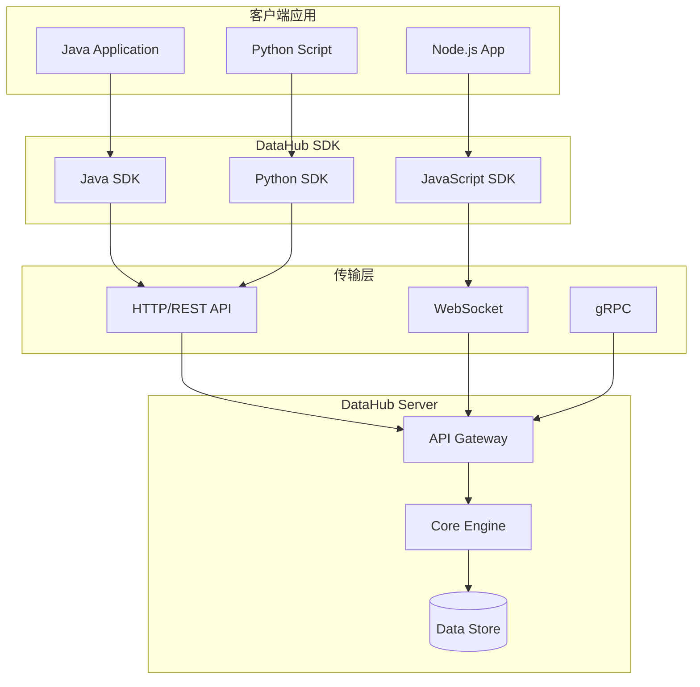
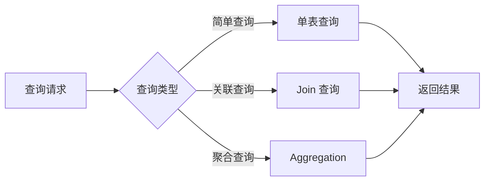
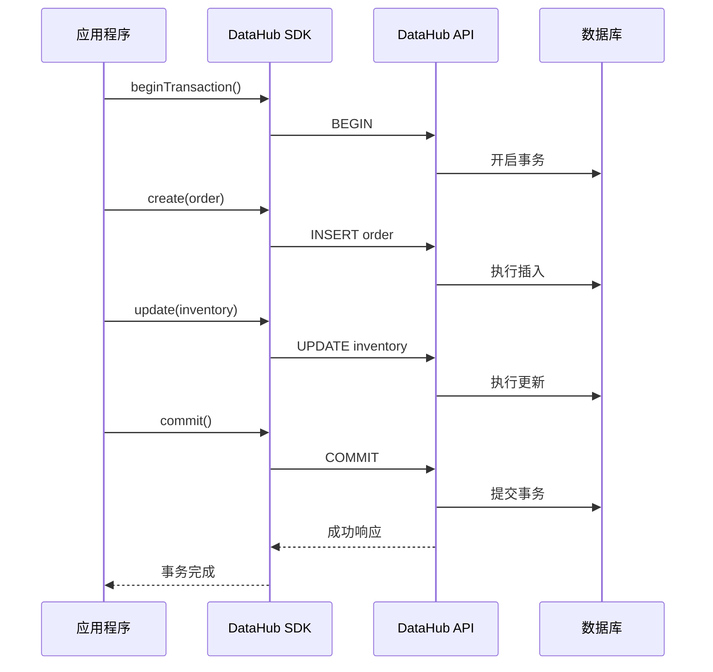

# SDK 使用指南

轻易云 DataHub 提供多语言 SDK，帮助开发者快速集成数据服务。本文档详细介绍各语言 SDK 的安装、配置和使用方法。

## SDK 概述

DataHub SDK 是轻易云官方提供的客户端开发工具包，支持主流编程语言，提供统一的数据操作接口。

### SDK 架构



### 支持的编程语言

| 语言 | SDK 版本 | 最低版本要求 | 包管理工具 | 官方支持 |
|------|----------|--------------|------------|----------|
| Java | 2.5.x | Java 8+ | Maven/Gradle | ✅ |
| Python | 1.8.x | Python 3.7+ | pip/conda | ✅ |
| JavaScript | 3.2.x | Node.js 14+ | npm/yarn | ✅ |
| Go | 1.3.x | Go 1.18+ | go modules | ✅ |
| .NET | 2.1.x | .NET 6.0+ | NuGet | ✅ |

## Java SDK 安装和使用

### Maven 安装

在 `pom.xml` 中添加依赖：

```xml
<dependency>
    <groupId>com.qingyiyun</groupId>
    <artifactId>datahub-sdk-java</artifactId>
    <version>2.5.3</version>
</dependency>
```

### Gradle 安装

```groovy
dependencies {
    implementation 'com.qingyiyun:datahub-sdk-java:2.5.3'
}
```

### Java SDK 初始化

```java
import com.qingyiyun.datahub.DataHubClient;
import com.qingyiyun.datahub.config.DataHubConfig;

public class DataHubExample {
    public static void main(String[] args) {
        // 初始化配置
        DataHubConfig config = new DataHubConfig.Builder()
            .endpoint("https://api.qingyiyun.com")
            .accessKey("your-access-key")
            .secretKey("your-secret-key")
            .timeout(30000)
            .maxConnections(100)
            .build();
        
        // 创建客户端
        DataHubClient client = new DataHubClient(config);
        
        // 使用客户端进行操作
        // ...
    }
}
```

### Java CRUD 操作示例

```java
import com.qingyiyun.datahub.model.*;

public class CrudOperations {
    private DataHubClient client;
    
    // 创建记录
    public void createRecord(String tableName, Map<String, Object> data) {
        CreateRequest request = new CreateRequest.Builder()
            .table(tableName)
            .data(data)
            .build();
        
        CreateResponse response = client.create(request);
        System.out.println("Created record ID: " + response.getId());
    }
    
    // 查询记录
    public void queryRecords(String tableName, QueryCondition condition) {
        QueryRequest request = new QueryRequest.Builder()
            .table(tableName)
            .condition(condition)
            .limit(100)
            .offset(0)
            .build();
        
        QueryResponse response = client.query(request);
        List<Record> records = response.getRecords();
        
        for (Record record : records) {
            System.out.println(record.toJson());
        }
    }
    
    // 更新记录
    public void updateRecord(String tableName, String id, Map<String, Object> data) {
        UpdateRequest request = new UpdateRequest.Builder()
            .table(tableName)
            .id(id)
            .data(data)
            .build();
        
        UpdateResponse response = client.update(request);
        System.out.println("Updated " + response.getAffectedRows() + " rows");
    }
    
    // 删除记录
    public void deleteRecord(String tableName, String id) {
        DeleteRequest request = new DeleteRequest.Builder()
            .table(tableName)
            .id(id)
            .build();
        
        DeleteResponse response = client.delete(request);
        System.out.println("Deleted " + response.getAffectedRows() + " rows");
    }
}
```

## Python SDK 安装和使用

### pip 安装

```bash
pip install qingyiyun-datahub
```

### conda 安装

```bash
conda install -c qingyiyun datahub-sdk
```

### Python SDK 初始化

```python
from qingyiyun.datahub import DataHubClient

# 初始化客户端
client = DataHubClient(
    endpoint="https://api.qingyiyun.com",
    access_key="your-access-key",
    secret_key="your-secret-key",
    timeout=30,
    max_connections=100
)

# 或者使用配置文件
client = DataHubClient.from_config("config.yaml")
```

### Python CRUD 操作示例

```python
from qingyiyun.datahub.models import QueryCondition, FilterOperator

class DataOperations:
    def __init__(self, client):
        self.client = client
    
    # 创建记录
    def create_record(self, table_name, data):
        try:
            response = self.client.create(
                table=table_name,
                data=data
            )
            print(f"Created record ID: {response.id}")
            return response.id
        except Exception as e:
            print(f"Create failed: {e}")
            raise
    
    # 查询记录
    def query_records(self, table_name, filters=None):
        condition = QueryCondition()
        if filters:
            for key, value in filters.items():
                condition.add_filter(key, FilterOperator.EQ, value)
        
        response = self.client.query(
            table=table_name,
            condition=condition,
            limit=100,
            offset=0
        )
        
        for record in response.records:
            print(record.to_dict())
        
        return response.records
    
    # 批量操作
    def batch_create(self, table_name, records):
        """批量创建记录"""
        response = self.client.batch_create(
            table=table_name,
            records=records
        )
        return response.ids
    
    # 事务操作
    def transaction_example(self):
        """事务操作示例"""
        with self.client.transaction() as tx:
            tx.create(table="orders", data={"amount": 100})
            tx.update(table="inventory", id="item_001", data={"stock": 50})
            tx.commit()
```

## JavaScript SDK 安装和使用

### npm 安装

```bash
npm install @qingyiyun/datahub-sdk
```

### yarn 安装

```bash
yarn add @qingyiyun/datahub-sdk
```

### JavaScript SDK 初始化

```javascript
const { DataHubClient } = require('@qingyiyun/datahub-sdk');
// 或 ES Module
import { DataHubClient } from '@qingyiyun/datahub-sdk';

// 初始化客户端
const client = new DataHubClient({
  endpoint: 'https://api.qingyiyun.com',
  accessKey: 'your-access-key',
  secretKey: 'your-secret-key',
  timeout: 30000,
  retryOptions: {
    maxRetries: 3,
    retryDelay: 1000
  }
});
```

### JavaScript CRUD 操作示例

```javascript
class DataService {
  constructor(client) {
    this.client = client;
  }

  // 异步创建记录
  async createRecord(tableName, data) {
    try {
      const response = await this.client.create({
        table: tableName,
        data: data
      });
      console.log('Created record ID:', response.id);
      return response.id;
    } catch (error) {
      console.error('Create failed:', error);
      throw error;
    }
  }

  // 查询记录（支持分页）
  async queryRecords(tableName, options = {}) {
    const { filters = {}, limit = 100, offset = 0 } = options;
    
    try {
      const response = await this.client.query({
        table: tableName,
        filters: filters,
        limit: limit,
        offset: offset
      });
      
      return {
        records: response.records,
        total: response.total,
        hasMore: response.has_more
      };
    } catch (error) {
      console.error('Query failed:', error);
      throw error;
    }
  }

  // 更新记录
  async updateRecord(tableName, id, data) {
    const response = await this.client.update({
      table: tableName,
      id: id,
      data: data
    });
    return response.affected_rows;
  }

  // 删除记录
  async deleteRecord(tableName, id) {
    const response = await this.client.delete({
      table: tableName,
      id: id
    });
    return response.affected_rows;
  }

  // 实时订阅
  subscribeToChanges(tableName, callback) {
    return this.client.subscribe({
      table: tableName,
      onMessage: callback,
      onError: (error) => console.error('Subscription error:', error)
    });
  }
}
```

## 常见操作示例

### 数据查询高级用法



#### 复杂查询条件

```python
from qingyiyun.datahub import FilterOperator, SortOrder

# 构建复杂查询
condition = {
    "filters": [
        {"field": "status", "operator": "eq", "value": "active"},
        {"field": "created_at", "operator": "gte", "value": "2024-01-01"},
        {"field": "amount", "operator": "between", "value": [100, 1000]}
    ],
    "sort": [
        {"field": "created_at", "order": "desc"},
        {"field": "priority", "order": "asc"}
    ],
    "joins": [
        {"table": "users", "on": "user_id", "select": ["name", "email"]}
    ],
    "aggregate": {
        "group_by": ["category"],
        "functions": [
            {"name": "count", "alias": "total"},
            {"name": "sum", "field": "amount", "alias": "total_amount"}
        ]
    }
}

results = client.query(table="orders", condition=condition)
```

### 批量操作

```java
// Java 批量操作
List<Map<String, Object>> records = Arrays.asList(
    createRecord("product_001", 100),
    createRecord("product_002", 200),
    createRecord("product_003", 300)
);

BatchCreateRequest batchRequest = new BatchCreateRequest.Builder()
    .table("inventory")
    .records(records)
    .batchSize(500)
    .build();

BatchCreateResponse response = client.batchCreate(batchRequest);
System.out.println("Success: " + response.getSuccessCount());
System.out.println("Failed: " + response.getFailedCount());
```

### 事务处理



## 错误处理

### 错误类型说明

| 错误代码 | 错误类型 | 说明 | 处理建议 |
|----------|----------|------|----------|
| 400 | BadRequest | 请求参数错误 | 检查请求参数格式 |
| 401 | Unauthorized | 认证失败 | 检查 Access Key 和 Secret Key |
| 403 | Forbidden | 权限不足 | 检查 API 权限配置 |
| 404 | NotFound | 资源不存在 | 确认资源 ID 是否正确 |
| 409 | Conflict | 资源冲突 | 处理并发冲突 |
| 429 | RateLimit | 请求过于频繁 | 实现退避重试 |
| 500 | ServerError | 服务器错误 | 联系技术支持 |
| 503 | ServiceUnavailable | 服务不可用 | 稍后重试 |

### 错误处理最佳实践

```python
from qingyiyun.datahub.exceptions import (
    DataHubError,
    AuthenticationError,
    NotFoundError,
    RateLimitError,
    ValidationError
)

def robust_operation(client):
    try:
        result = client.query(table="users", filters={"id": "123"})
        return result
    
    except AuthenticationError as e:
        # 认证错误：记录日志并通知管理员
        logger.error(f"Authentication failed: {e}")
        notify_admin("API 认证失败")
        raise
    
    except NotFoundError as e:
        # 资源不存在：返回空结果
        logger.warning(f"Resource not found: {e}")
        return None
    
    except RateLimitError as e:
        # 限流错误：退避重试
        retry_after = e.retry_after
        logger.warning(f"Rate limited, retry after {retry_after}s")
        time.sleep(retry_after)
        return robust_operation(client)  # 递归重试
    
    except ValidationError as e:
        # 验证错误：返回详细的错误信息
        logger.error(f"Validation failed: {e.details}")
        return {"error": "Validation failed", "details": e.details}
    
    except DataHubError as e:
        # 其他 SDK 错误
        logger.error(f"DataHub error: {e.code} - {e.message}")
        raise
```

### JavaScript 错误处理

```javascript
const { DataHubError, RateLimitError } = require('@qingyiyun/datahub-sdk');

async function handleErrors() {
  try {
    const result = await client.query({ table: 'orders' });
    return result;
  } catch (error) {
    if (error instanceof RateLimitError) {
      // 实现指数退避
      const delay = Math.pow(2, error.retryCount) * 1000;
      await sleep(delay);
      return handleErrors(); // 重试
    }
    
    if (error instanceof DataHubError) {
      switch (error.code) {
        case 'AUTHENTICATION_FAILED':
          console.error('认证失败，请检查 API 密钥');
          break;
        case 'RESOURCE_NOT_FOUND':
          console.error('请求的资源不存在');
          break;
        default:
          console.error(`DataHub 错误: ${error.message}`);
      }
    }
    
    throw error;
  }
}
```

> **Note**: 生产环境中建议实现熔断机制，避免在服务端故障时持续发送请求。

> **Warning**: 切勿在客户端代码中暴露 Secret Key，所有敏感操作应在服务端完成。
