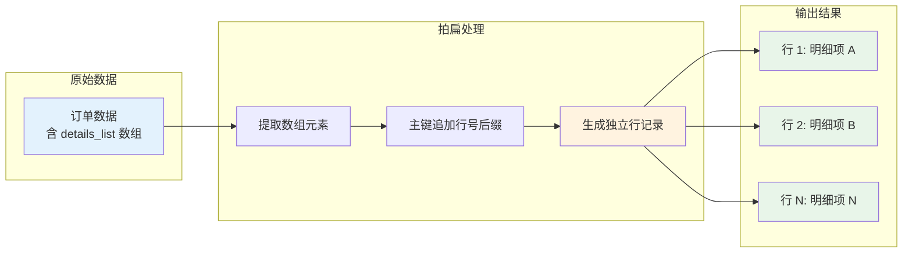
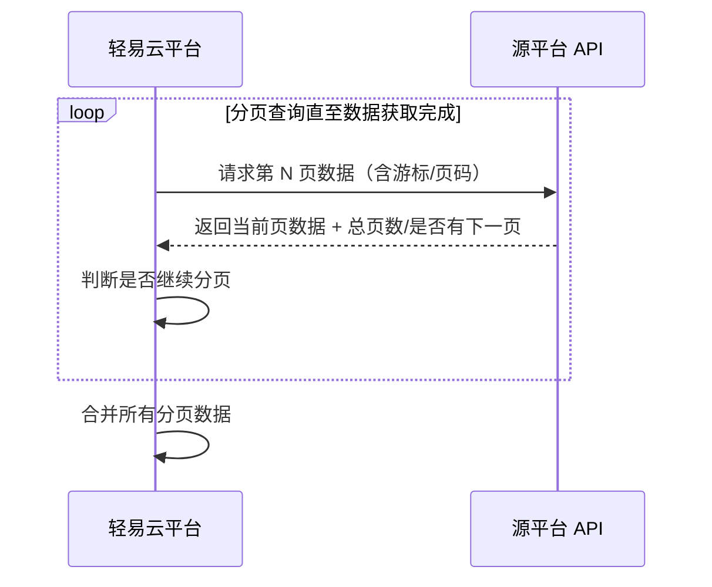
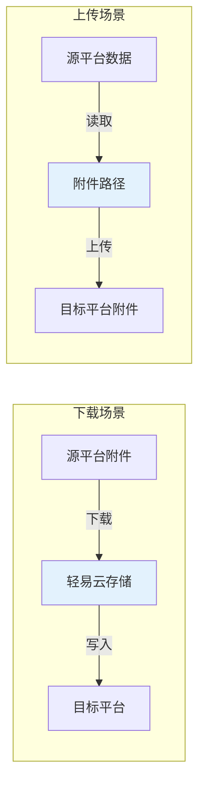
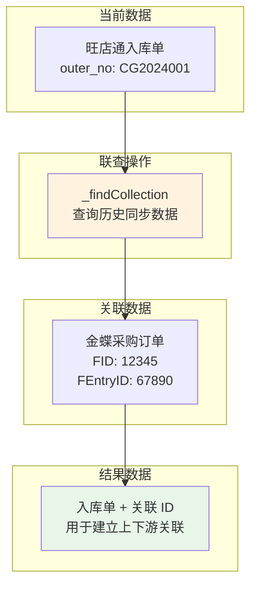
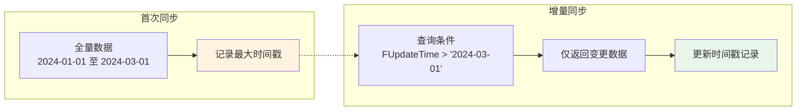

# 源平台特殊操作

本文档介绍在轻易云 iPaaS 平台中，针对源平台配置的高级操作与特殊处理机制。通过这些机制，你可以实现文件上传下载、分页游标控制、多接口联查以及增量数据读取等复杂场景。

> [!IMPORTANT]
> 以下配置项均需在源平台配置的【源码视图】中进行编辑。修改前请确保已理解各参数的作用，建议在测试环境验证后再应用到生产环境。

---

## 拍扁多维数据

### 功能说明

拍扁（Beat Flat）操作用于将嵌套的多维数组数据转换为扁平化的一维数据格式。当源平台返回的数据包含明细列表（如订单的商品明细、单据的分录信息）时，通过拍扁操作可以将每条明细转换为独立的数据行，便于后续的数据映射与写入。



### 配置示例

在源平台配置的 `otherRequestParams` 中添加 `beatFlat` 参数：

```json
{
  "beatFlat": ["details_list"]
}
```

### 数据转换示例

**原始数据：**

```json
{
  "no": "OUT20210001",
  "customer": "CK0001",
  "date": "2021-11-11",
  "details_list": [
    {
      "goods": "FOO0001",
      "num": 12
    },
    {
      "goods": "FOO0002",
      "num": 50
    }
  ]
}
```

**拍扁后数据（生成两行）：**

```json
{
  "no": "OUT20210001-1",
  "customer": "CK0001",
  "date": "2021-11-11",
  "details_list_goods": "FOO0001",
  "details_list_num": 12
}
```

```json
{
  "no": "OUT20210001-2",
  "customer": "CK0001",
  "date": "2021-11-11",
  "details_list_goods": "FOO0002",
  "details_list_num": 50
}
```

### 注意事项

- 拍扁后主键（ID）会自动追加行号后缀，如 `OUT20210001-1`、`OUT20210001-2`
- 支持同时拍扁多个数组字段，配置为 `{"beatFlat": ["array1", "array2"]}`
- 拍扁操作在数据查询后、写入目标平台前执行

---

## 分页游标控制

### 功能说明

当源平台数据量较大时，通常需要分页查询以避免一次性加载过多数据导致内存溢出或接口超时。轻易云 iPaaS 支持基于游标（Cursor）的分页机制，可适配不同平台的分页参数规范。



### 配置示例

分页参数通常在 `otherRequestParams` 中配置，具体参数名根据源平台适配器而定：

```json
{
  "pagination": {
    "pageSize": 100,
    "pageField": "page_index",
    "pageSizeField": "page_size",
    "cursorField": "cursor",
    "hasNextField": "has_more",
    "totalField": "total_count"
  }
}
```

### 常见分页模式

| 模式 | 说明 | 适用平台 |
|------|------|----------|
| **页码分页** | 通过 `page` 和 `pageSize` 参数控制 | 金蝶云星空、用友 NC 等 |
| **游标分页** | 通过 `cursor` 或 `next_token` 传递游标 | 钉钉、飞书、企业微信等 |
| **偏移量分页** | 通过 `offset` 和 `limit` 控制 | MySQL、PostgreSQL 等数据库 |

### 金蝶云星空分页示例

```json
{
  "FormId": "BD_MATERIAL",
  "FilterString": "FMaterialGroup.FNumber = '01'",
  "Limit": 100,
  "StartRow": 0,
  "Top": 100
}
```

> [!TIP]
> 金蝶云星空使用 `StartRow`（起始行号）和 `Limit`（每页条数）实现分页。首次请求 `StartRow=0`，后续请求根据返回的 `RowCount` 计算下一页的 `StartRow`。

---

## 文件上传与下载

### 功能说明

轻易云 iPaaS 支持在数据集成过程中处理文件附件，包括从源平台下载文件和向目标平台上传文件。典型的应用场景包括：

- 从金蝶云星空下载单据附件保存到本地/云存储
- 将电商平台的订单附件上传到 ERP 系统
- 在审批流程中传递附件文件



### 文件下载配置

在源平台配置的 `otherResponseParams` 中启用附件下载：

```json
{
  "DownloadAttachment": true,
  "AttachmentFields": ["FAttachment", "FFilePath"]
}
```

| 参数 | 类型 | 说明 |
|------|------|------|
| `DownloadAttachment` | boolean | 是否启用附件自动下载 |
| `AttachmentFields` | array | 附件字段名列表，指定哪些字段包含附件 URL |

### 文件上传配置

在目标平台写入配置中，设置 `isUploadFile` 标识：

```json
{
  "isUploadFile": true,
  "attachmentField": "attachments",
  "filePathField": "file_url"
}
```

### 代码示例

**附件字段映射示例：**

```json
{
  "attachment": [
    {
      "path": "/storage/files/contract.pdf",
      "filename": "contract.pdf",
      "size": 1024000
    }
  ]
}
```

**金蝶云星空附件上传完整示例：**

```json
{
  "FormId": "SAL_SaleOrder",
  "InterId": 101412,
  "BillNO": "XSDD20240001",
  "attachment": {
    "path": "/storage/attachments/order_doc.pdf",
    "filename": "order_doc.pdf",
    "size": 2048000
  },
  "attachmentIndex": 0,
  "attachmentTotal": 1
}
```

### 注意事项

- 文件路径必须是服务器本地可访问的绝对路径
- 大文件建议分片上传，通过 `attachmentIndex` 和 `attachmentTotal` 控制分片
- 上传文件后需确保单据处于可编辑状态，已审核单据无法绑定附件

---

## 多接口联查

### 功能说明

多接口联查（Relational Lookup）用于在数据集成过程中，从其他数据源查询关联信息以补全当前数据。例如：

- 根据订单号查询历史订单的 FID
- 根据物料编码查询物料的保质期管理设置
- 根据客户编码查询客户的信用额度



### 语法格式

```sql
_findCollection find {目标字段} from {方案ID} where {条件1} {条件2} ...
```

| 关键字 | 说明 |
|--------|------|
| `_findCollection` | 联查声明关键字，必须置于开头 |
| `find` | 查询字段声明 |
| `from` | 数据来源方案 ID |
| `where` | 查询条件声明 |

### 基础示例

从其他同步方案中查询采购订单的分录 ID：

```sql
_findCollection find FPOOrderEntry_FEntryId from 8e620793-bebb-3167-95a4-9030368e5262 where FBillNo={{outer_no}} FMaterialId_FNumber={{details_list.goods_no}}
```

### 多条件联查

支持多个查询条件，条件之间为 **AND** 关系：

```sql
_findCollection find FID from a1b2c3d4-e5f6-7890-abcd-ef1234567890 where FBillNo={{order_no}} FDate={{order_date}} FStatus='A'
```

### 与自定义函数嵌套

联查语句可与 `_function` 自定义函数嵌套使用，需使用 `_endFind` 结束联查：

```sql
_function case _findCollection find FIsKFPeriod from 66da8241-98f4-39f9-8fee-cac02e30e532 where FNumber={{details.details_item_code}} _endFind when true then '{{details.details_detail_batch_validTime}}' else '' end
```

### 语法注意事项

> [!WARNING]
> 1. 每段之间必须使用**单个英文空格**分隔
> 2. 条件格式为 `字段名={{变量}}`，中间不能有空格
> 3. 嵌套使用时需以 `_endFind` 标记联查结束
> 4. 实际使用时不能包含换行符或 Tab 缩进

---

## 增量字段读取

### 功能说明

增量数据同步是数据集成的核心场景之一。通过识别和读取增量字段（如创建时间、更新时间、自增 ID 等），平台可以只获取自上次同步以来新增或变更的数据，大幅提升同步效率并降低源系统压力。



### 常见增量字段类型

| 类型 | 示例字段 | 适用场景 |
|------|----------|----------|
| **时间戳** | `FCreateTime`、`FUpdateTime` | 大多数业务单据 |
| **自增 ID** | `FEntryID`、`FSeq` | 数据库表同步 |
| **日期字段** | `FDate`、`FBizDate` | 财务单据、库存单据 |
| **流水号** | `FBillNo`（含日期前缀） | 业务编号 |

### 配置示例

在源平台配置中使用变量与格式化函数组合增量条件：

```json
{
  "FilterString": "FUpdateTime >= '{{lastSyncTime|datetime}}'"
}
```

### 时间戳变量

平台提供内置时间戳变量，用于记录和传递同步时间点：

| 变量 | 说明 |
|------|------|
| `{{lastSyncTime}}` | 上次同步成功的时间戳 |
| `{{currentTime}}` | 当前系统时间 |
| `{{startTime}}` | 本次同步开始时间 |

### 日期格式化

使用 `|format` 管道符格式化日期：

```json
{{lastSyncTime|datetime('Y-m-d H:i:s')}}
{{lastSyncTime|date}}
{{currentTime|timestamp}}
```

### 金蝶云星空增量查询示例

```json
{
  "FormId": "SAL_OUTSTOCK",
  "FilterString": "FApproveDate >= '{{lastSyncTime|datetime}}' and FDocumentStatus = 'C'",
  "OrderString": "FApproveDate ASC"
}
```

### 最佳实践

> [!TIP]
> 1. **选择可靠的增量字段**：优先使用数据库自动维护的时间戳字段（如 `FUpdateTime`）
> 2. **处理边界值**：使用 `>=` 而非 `>` 避免边界数据遗漏
> 3. **排序保证**：通过 `OrderString` 确保数据按增量字段有序返回
> 4. **异常回退**：当增量同步失败时，可临时改为全量同步补数

---

## 高级组合应用

### 场景：带附件的订单增量同步

**需求描述**：

从金蝶云星空同步已审核的销售订单到电商平台，要求：
1. 只同步最近 24 小时内审核的订单（增量）
2. 下载订单附件并上传到电商平台
3. 拍扁订单分录生成多行明细

**配置组合：**

```json
{
  "requestParams": {
    "FormId": "SAL_SaleOrder",
    "FilterString": "FApproveDate >= '{{lastSyncTime|datetime}}' and FDocumentStatus = 'C'",
    "OrderString": "FApproveDate ASC"
  },
  "otherRequestParams": {
    "beatFlat": ["FSaleOrderEntry"]
  },
  "otherResponseParams": {
    "DownloadAttachment": true,
    "AttachmentFields": ["FAttachment"]
  }
}
```

### 场景：关联入库单与采购订单

**需求描述**：

旺店通采购入库单同步到金蝶时，需要关联原始采购订单建立上下游关系。

**配置组合：**

```json
{
  "requestParams": {
    "outer_no": "{{outer_no}}"
  },
  "otherRequestParams": {
    "relationMapping": {
      "FPOOrderEntry_FEntryId": "_findCollection find FPOOrderEntry_FEntryId from 8e620793-bebb-3167-95a4-9030368e5262 where FBillNo={{outer_no}} FMaterialId_FNumber={{details_list.goods_no}}"
    }
  }
}
```

---

## 常见问题

### Q: 拍扁后如何处理主键冲突？

拍扁操作会自动为主键追加行号后缀（如 `-1`、`-2`），避免主键冲突。如需自定义后缀格式，可联系平台技术支持。

### Q: 联查查询不到数据会怎样？

若 `_findCollection` 未查询到匹配数据，对应字段将返回空值。建议配合 `_function` 进行空值判断和默认值处理。

### Q: 增量同步时漏数据如何补数？

可通过以下方式补数：
1. 临时修改 `FilterString` 扩大时间范围
2. 使用全量同步模式重新执行
3. 通过数据管理功能手动触发单条数据重试

### Q: 大文件上传超时如何处理？

建议：
1. 启用分片上传，控制每片大小（如 5MB）
2. 调整集成方案的超时时间配置
3. 考虑使用异步文件传输方案

---

## 相关文档

- [适配器开发指南](./adapter-development)
- [适配器生命周期](./lifecycle)
- [自定义数据加工厂](./custom-processor)
- [联查关系型数据](../advanced/relational-lookup)
