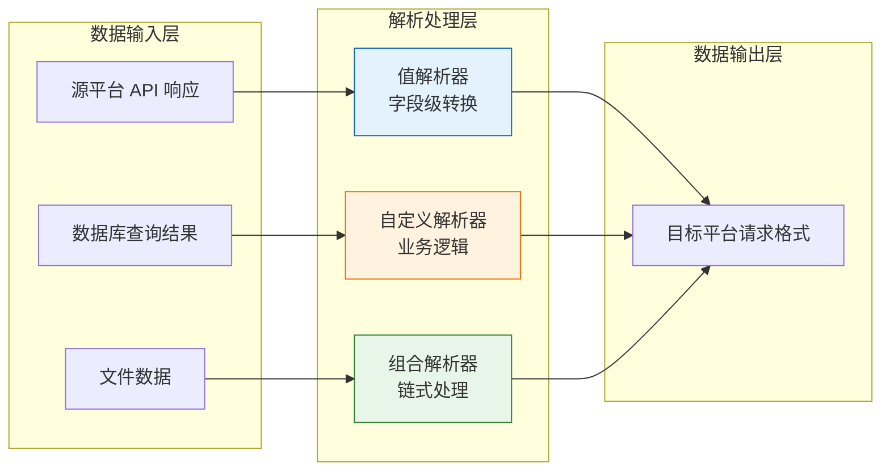
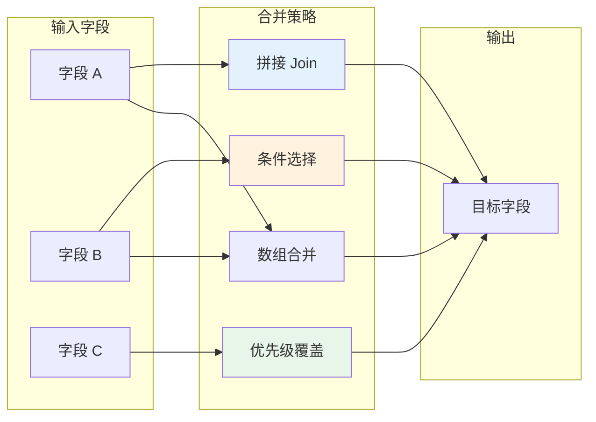
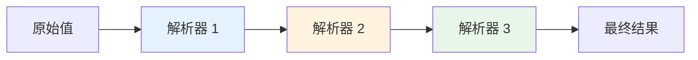

# 值解析器高级用法

值解析器是轻易云 iPaaS 平台数据集成流程中的核心转换组件，负责对源数据进行精细化提取、转换和重组。本文档深入讲解值解析器的高级用法，包括自定义解析器注册、正则表达式提取、JSONPath 嵌套查询、多值合并与条件分支处理等进阶技巧，帮助开发者应对复杂的数据转换场景。

> [!IMPORTANT]
> 本文档面向具备一定开发经验的进阶用户。如果你是初次使用值解析器，建议先阅读[解析器的应用](../advanced/parser)了解基础用法。

---

## 解析器架构概述

### 解析器在数据流中的位置



### 解析器执行流程

```mermaid
sequenceDiagram
    participant S as 调度引擎
    participant R as 值解析器
    participant C as 自定义解析器注册表
    participant D as 数据上下文

    S->>C: 1. 查询解析器类型
    C-->>S: 返回解析器类
    S->>R: 2. 实例化解析器
    S->>D: 3. 获取源数据
    D-->>S: 返回原始值
    S->>R: 4. 调用 parse(value, config)
    R-->>S: 返回转换后结果
    S->>D: 5. 写入目标字段

    style R fill:#e3f2fd
    style C fill:#fff3e0
```

---

## 自定义解析器注册

### 什么是自定义解析器

当内置解析器无法满足特定业务需求时，你可以注册自定义解析器。自定义解析器是一段运行在平台托管环境中的代码，可以访问完整的运行时上下文，实现任意复杂的数据转换逻辑。

### 自定义解析器接口规范

自定义解析器必须实现以下接口：

```php
<?php

/**
 * 自定义值解析器接口
 */
interface ValueResolverInterface
{
    /**
     * 解析方法
     *
     * @param mixed $value 源字段值
     * @param array $config 解析器配置参数
     * @param array $context 上下文数据（整条记录）
     * @return mixed 解析后的值
     */
    public function parse($value, array $config, array $context);

    /**
     * 获取解析器名称
     *
     * @return string
     */
    public function getName(): string;

    /**
     * 获取配置参数定义
     *
     * @return array
     */
    public function getConfigSchema(): array;
}
```

### 实现自定义解析器

以下示例展示如何实现一个自定义的「汇率转换」解析器：

```php
<?php

/**
 * 汇率转换解析器
 * 将源币种金额转换为目标币种金额
 */
class CurrencyExchangeResolver implements ValueResolverInterface
{
    /**
     * 汇率缓存
     */
    private static $rateCache = [];

    public function getName(): string
    {
        return 'CurrencyExchange';
    }

    public function getConfigSchema(): array
    {
        return [
            'sourceCurrency' => [
                'type' => 'string',
                'required' => true,
                'description' => '源币种字段名或固定值'
            ],
            'targetCurrency' => [
                'type' => 'string',
                'required' => true,
                'description' => '目标币种（如 CNY、USD）'
            ],
            'rateTable' => [
                'type' => 'string',
                'required' => false,
                'description' => '汇率表标识',
                'default' => 'default'
            ]
        ];
    }

    public function parse($value, array $config, array $context)
    {
        // 获取源币种
        $sourceCurrency = $config['sourceCurrency'];
        if (isset($context[$sourceCurrency])) {
            $sourceCurrency = $context[$sourceCurrency];
        }

        $targetCurrency = $config['targetCurrency'];
        $rateTable = $config['rateTable'] ?? 'default';

        // 相同币种无需转换
        if ($sourceCurrency === $targetCurrency) {
            return $value;
        }

        // 获取汇率
        $rate = $this->getExchangeRate($sourceCurrency, $targetCurrency, $rateTable);

        if ($rate === null) {
            throw new \RuntimeException(
                "无法获取汇率: {$sourceCurrency} -> {$targetCurrency}"
            );
        }

        // 执行转换并保留 2 位小数
        return round(floatval($value) * $rate, 2);
    }

    /**
     * 获取汇率（带缓存）
     */
    private function getExchangeRate($from, $to, $table): ?float
    {
        $cacheKey = "{$table}:{$from}:{$to}";

        if (!isset(self::$rateCache[$cacheKey])) {
            // 从汇率服务获取（示例代码）
            // 实际实现中可通过 API 或数据库查询
            self::$rateCache[$cacheKey] = $this->fetchRateFromService($from, $to, $table);
        }

        return self::$rateCache[$cacheKey];
    }

    /**
     * 从服务获取实时汇率
     */
    private function fetchRateFromService($from, $to, $table): ?float
    {
        // 伪代码：实际实现需调用汇率 API
        $mockRates = [
            'default:USD:CNY' => 7.25,
            'default:CNY:USD' => 0.138,
            'default:EUR:CNY' => 7.85,
        ];

        return $mockRates["{$table}:{$from}:{$to}"] ?? null;
    }
}
```

### 注册解析器

在集成方案配置中注册自定义解析器：

```json
{
  "customResolvers": [
    {
      "name": "CurrencyExchange",
      "class": "CurrencyExchangeResolver",
      "code": "<?php class CurrencyExchangeResolver implements ValueResolverInterface { ... }"
    }
  ],
  "request": {
    "FAmount": {
      "parser": {
        "name": "CurrencyExchange",
        "sourceCurrency": "FCurrencyId",
        "targetCurrency": "CNY",
        "rateTable": "daily"
      },
      "mapping": "amount"
    }
  }
}
```

> [!TIP]
> 自定义解析器代码会被缓存，修改后需重新部署集成方案才能生效。

---

## 正则表达式提取

### 正则解析器基础用法

正则解析器使用正则表达式从字符串中提取特定模式的数据，适用于从非结构化文本中提取关键信息。

**基本配置结构**：

```json
{
  "parser": {
    "type": "regex",
    "pattern": "正则表达式模式",
    "flags": "gi",
    "group": 1,
    "defaultValue": ""
  }
}
```

### 配置参数详解

| 参数 | 类型 | 必填 | 说明 |
|------|------|------|------|
| `type` | string | ✅ | 固定值为 `regex` |
| `pattern` | string | ✅ | 正则表达式模式 |
| `flags` | string | — | 匹配标志：`g`(全局)、`i`(忽略大小写)、`m`(多行) |
| `group` | number | — | 提取的捕获组序号，默认 `0`（完整匹配） |
| `extractAll` | boolean | — | 是否提取所有匹配项，默认 `false` |
| `defaultValue` | string | — | 无匹配时的默认值 |

### 常用正则模式示例

| 场景 | 正则表达式 | 说明 |
|------|-----------|------|
| 提取手机号 | `1[3-9]\d{9}` | 中国大陆 11 位手机号 |
| 提取邮箱 | `[\w.-]+@[\w.-]+\.\w+` | 标准邮箱格式 |
| 提取身份证号 | `\d{17}[\dXx]` | 18 位身份证号码 |
| 提取订单号 | `(SO\|PO)\d{10,12}` | SO 或 PO 开头的订单号 |
| 提取金额 | `\d+\.?\d{0,2}` | 支持小数的金额数字 |
| 提取日期 | `\d{4}-\d{2}-\d{2}` | YYYY-MM-DD 格式 |
| 提取中文 | `[\u4e00-\u9fa5]+` | 连续中文字符 |

### 单值提取示例

从物流信息中提取快递单号：

```json
{
  "request": {
    "FTrackingNo": {
      "parser": {
        "type": "regex",
        "pattern": "快递单号[：:]\s*(\w+)",
        "group": 1,
        "defaultValue": ""
      },
      "mapping": "logistics_info"
    }
  }
}
```

**数据转换效果**：

| 源数据 | 转换结果 |
|--------|---------|
| `快递单号: SF1234567890，已发货` | `SF1234567890` |
| `订单已发出，单号 JD9876543210` | `（空字符串，使用默认值）` |

### 多值提取与数组处理

提取文本中的所有手机号：

```json
{
  "request": {
    "FContactPhones": {
      "parser": {
        "type": "regex",
        "pattern": "1[3-9]\\d{9}",
        "flags": "g",
        "extractAll": true
      },
      "mapping": "contact_info"
    }
  }
}
```

**数据转换效果**：

| 源数据 | 转换结果 |
|--------|---------|
| `联系人：13800138000 / 13900139000` | `["13800138000", "13900139000"]` |
| `电话：15012345678` | `["15012345678"]` |

### 复杂捕获组提取

从地址信息中提取省、市、区：

```json
{
  "request": {
    "FProvince": {
      "parser": {
        "type": "regex",
        "pattern": "^([^省]+省)?([^市]+市)?([^区]+区)?",
        "group": 1,
        "defaultValue": ""
      },
      "mapping": "address"
    },
    "FCity": {
      "parser": {
        "type": "regex",
        "pattern": "^([^省]+省)?([^市]+市)?([^区]+区)?",
        "group": 2,
        "defaultValue": ""
      },
      "mapping": "address"
    },
    "FDistrict": {
      "parser": {
        "type": "regex",
        "pattern": "^([^省]+省)?([^市]+市)?([^区]+区)?",
        "group": 3,
        "defaultValue": ""
      },
      "mapping": "address"
    }
  }
}
```

**数据转换效果**：

| 源数据 | FProvince | FCity | FDistrict |
|--------|-----------|-------|-----------|
| `广东省深圳市南山区科技园` | `广东省` | `深圳市` | `南山区` |
| `北京市朝阳区建国路` | `` | `北京市` | `朝阳区` |

### 命名捕获组（高级）

使用命名捕获组提取结构化数据：

```json
{
  "request": {
    "FBankInfo": {
      "parser": {
        "type": "regex",
        "pattern": "开户行[：:](?<bank>[^，,]+)[，,]?账号[：:](?<account>\\d+)",
        "namedGroups": ["bank", "account"],
        "outputFormat": "object"
      },
      "mapping": "bank_text"
    }
  }
}
```

**数据转换效果**：

**源数据**：`开户行：中国工商银行深圳分行，账号：6222021234567890123`

**转换结果**：
```json
{
  "FBankInfo": {
    "bank": "中国工商银行深圳分行",
    "account": "6222021234567890123"
  }
}
```

---

## JSONPath 嵌套查询

### JSONPath 基础语法

JSONPath 是一种用于从 JSON 结构中提取数据的查询语言，类似于 XPath 对于 XML 的作用。

```mermaid
mindmap
  root((JSONPath 语法))
    根元素
      $ 根对象
    子元素访问
      .key 直接子元素
      ["key"] 括号访问
    数组操作
      [0] 索引访问
      [0,2] 多索引
      [0:3] 切片
      [*] 所有元素
    递归下降
      ..key 递归查找
    过滤器
      [?(@.price > 10)] 条件过滤
```

### 基础查询示例

| JSONPath 表达式 | 说明 | 示例结果 |
|----------------|------|---------|
| `$.name` | 提取根对象的 name 属性 | 单个值 |
| `$.items[0]` | 提取 items 数组的第一个元素 | 对象或值 |
| `$.items[*].id` | 提取 items 数组所有元素的 id | 数组 |
| `$..price` | 递归提取所有 price 属性 | 数组 |
| `$.items[?(@.status=='active')]` | 过滤数组元素 | 符合条件的对象数组 |
| `$.items[?(@.price > 100)]` | 条件过滤（数值比较） | 价格大于 100 的对象 |

### 单层嵌套查询

从标准 API 响应中提取数据列表：

```json
{
  "response": {
    "data": {
      "parser": {
        "type": "jsonpath",
        "expression": "$.result.data.list[*]",
        "extractAll": true
      }
    }
  }
}
```

**源数据**：
```json
{
  "code": 200,
  "result": {
    "data": {
      "list": [
        {"id": "001", "name": "产品 A"},
        {"id": "002", "name": "产品 B"}
      ],
      "total": 100
    }
  }
}
```

**转换结果**：
```json
[
  {"id": "001", "name": "产品 A"},
  {"id": "002", "name": "产品 B"}
]
```

### 多层嵌套查询

处理复杂的嵌套结构，提取深层数据：

```json
{
  "request": {
    "FMaterialName": {
      "parser": {
        "type": "jsonpath",
        "expression": "$.product.details.name",
        "defaultValue": "未知物料"
      },
      "mapping": "material_json"
    },
    "FMaterialCode": {
      "parser": {
        "type": "jsonpath",
        "expression": "$.product.details.code"
      },
      "mapping": "material_json"
    }
  }
}
```

**源数据**：
```json
{
  "material_json": {
    "product": {
      "id": "P001",
      "details": {
        "name": "铝合金型材",
        "code": "AL-2024-001",
        "category": "原材料"
      }
    }
  }
}
```

### 数组元素条件过滤

使用过滤器表达式提取符合条件的数组元素：

```json
{
  "request": {
    "FMainItems": {
      "parser": {
        "type": "jsonpath",
        "expression": "$.items[?(@.isMain==true)]",
        "extractAll": true
      },
      "mapping": "order_items"
    },
    "FGiftItems": {
      "parser": {
        "type": "jsonpath",
        "expression": "$.items[?(@.type=='gift')]",
        "extractAll": true
      },
      "mapping": "order_items"
    }
  }
}
```

**源数据**：
```json
{
  "order_items": {
    "items": [
      {"id": "1", "name": "iPhone 15", "isMain": true, "type": "product"},
      {"id": "2", "name": "充电头", "isMain": false, "type": "accessory"},
      {"id": "3", "name": "手机壳", "isMain": false, "type": "gift"}
    ]
  }
}
```

**转换结果**：
- `FMainItems`: `[{"id": "1", "name": "iPhone 15", ...}]`
- `FGiftItems`: `[{"id": "3", "name": "手机壳", ...}]`

### 多路径结果合并

从多个路径提取数据并合并为数组：

```json
{
  "request": {
    "FAllContacts": {
      "parser": {
        "type": "jsonpath",
        "expressions": [
          "$.buyer.phone",
          "$.seller.phone",
          "$.emergency.contact"
        ],
        "mergeStrategy": "concat",
        "removeEmpty": true
      },
      "mapping": "contract_data"
    }
  }
}
```

### 高级过滤器表达式

```mermaid
flowchart TD
    A[JSONPath 过滤器] --> B[比较运算符]
    A --> C[逻辑运算符]
    A --> D[函数表达式]

    B --> B1[@.price == 100]
    B --> B2[@.price > 50]
    B --> B3[@.name =~ /iPhone/]

    C --> C1[&& 逻辑与]
    C --> C2[|| 逻辑或]
    C --> C3[! 逻辑非]

    D --> D1[length(@.items) > 5]
    D --> D2[count(@.tags)]

    style A fill:#e3f2fd
    style B fill:#e8f5e9
    style C fill:#fff3e0
    style D fill:#f3e5f5
```

**复杂过滤示例**：

```json
{
  "parser": {
    "type": "jsonpath",
    "expression": "$.orders[?(@.amount > 1000 && @.status == 'paid' && @.items.length > 0)]",
    "extractAll": true
  }
}
```

---

## 多值合并与条件分支

### 多值合并策略

在实际业务场景中，经常需要将多个字段的值合并为一个字段，或根据条件选择不同的值。



### 字符串拼接合并

将多个字段拼接为一个字符串：

```json
{
  "request": {
    "FAddress": {
      "parser": {
        "type": "merge",
        "strategy": "join",
        "fields": ["province", "city", "district", "street"],
        "separator": "",
        "skipEmpty": true
      }
    }
  }
}
```

**数据转换效果**：

| province | city | district | street | FAddress |
|----------|------|----------|--------|----------|
| 广东省 | 深圳市 | 南山区 | 科技园 | `广东省深圳市南山区科技园` |
| 北京市 | 朝阳区 | | 建国路 | `北京市朝阳区建国路` |

### 带格式的拼接

使用模板进行格式化拼接：

```json
{
  "request": {
    "FDescription": {
      "parser": {
        "type": "merge",
        "strategy": "template",
        "template": "订单号：{orderNo}，客户：{customerName}，金额：￥{amount}",
        "defaultValue": "暂无描述"
      }
    }
  }
}
```

### 条件分支选择

根据条件选择不同的字段值：

```json
{
  "request": {
    "FContactPhone": {
      "parser": {
        "type": "conditional",
        "conditions": [
          {
            "when": "$.priority == 'high'",
            "then": "$.managerPhone"
          },
          {
            "when": "$.isVip == true",
            "then": "$.vipServiceLine"
          }
        ],
        "default": "$.customerServicePhone"
      }
    }
  }
}
```

### 优先级覆盖策略

按优先级顺序取第一个非空值：

```json
{
  "request": {
    "FInvoiceTitle": {
      "parser": {
        "type": "merge",
        "strategy": "priority",
        "fields": [
          "invoiceTitle",
          "companyName",
          "customerName"
        ],
        "trim": true,
        "ignoreEmpty": true
      }
    }
  }
}
```

**数据转换效果**：

| invoiceTitle | companyName | customerName | FInvoiceTitle |
|--------------|-------------|--------------|---------------|
| 张三有限公司 | 李四集团 | 王五 | `张三有限公司` |
| | 李四集团 | 王五 | `李四集团` |
| | | 王五 | `王五` |

### 数组扁平化合并

将多个数组字段合并为一个数组：

```json
{
  "request": {
    "FAllItems": {
      "parser": {
        "type": "merge",
        "strategy": "flatten",
        "fields": ["mainItems", "giftItems", "addonItems"],
        "deduplicate": true,
        "dedupKey": "itemId"
      }
    }
  }
}
```

**数据转换效果**：

**源数据**：
```json
{
  "mainItems": [
    {"itemId": "001", "name": "iPhone"}
  ],
  "giftItems": [
    {"itemId": "002", "name": "充电头"}
  ],
  "addonItems": [
    {"itemId": "001", "name": "iPhone"}
  ]
}
```

**转换结果**（去重后）：
```json
[
  {"itemId": "001", "name": "iPhone"},
  {"itemId": "002", "name": "充电头"}
]
```

### 条件映射转换

根据字段值进行映射转换：

```json
{
  "request": {
    "FOrderStatus": {
      "parser": {
        "type": "map",
        "source": "$.sourceStatus",
        "mappings": {
          "待付款": "unpaid",
          "已付款": "paid",
          "已发货": "shipped",
          "已完成": "completed",
          "已取消": "cancelled"
        },
        "defaultValue": "unknown"
      }
    }
  }
}
```

### 多条件组合判断

使用复杂条件进行值选择：

```json
{
  "request": {
    "FDeliveryType": {
      "parser": {
        "type": "conditional",
        "conditions": [
          {
            "when": "$.weight > 30 || $.volume > 1",
            "then": "logistics"
          },
          {
            "when": "$.amount >= 99 && $.isVip == true",
            "then": "express_free"
          },
          {
            "when": "$.city == '同城'",
            "then": "same_day"
          }
        ],
        "default": "standard"
      }
    }
  }
}
```

---

## 解析器链式调用

### 链式调用概念

解析器支持链式调用，一个字段可以依次经过多个解析器处理，每个解析器的输出作为下一个解析器的输入。



### 链式配置语法

```json
{
  "request": {
    "FMaterialCode": {
      "parser": [
        {
          "type": "jsonpath",
          "expression": "$.material.code"
        },
        {
          "type": "regex",
          "pattern": "^(MAT-\\d+)",
          "group": 1
        },
        {
          "type": "transform",
          "operation": "uppercase"
        }
      ]
    }
  }
}
```

### 实际应用示例

**场景**：从富文本中提取价格并转换为数字格式

```json
{
  "request": {
    "FPrice": {
      "parser": [
        {
          "type": "regex",
          "pattern": "价格[：:]\\s*([\\d,]+(?:\\.\\d{2})?)",
          "group": 1
        },
        {
          "type": "transform",
          "operation": "replace",
          "search": ",",
          "replace": ""
        },
        {
          "type": "transform",
          "operation": "toNumber"
        }
      ],
      "mapping": "product_desc"
    }
  }
}
```

**数据转换流程**：

| 步骤 | 值 |
|------|-----|
| 原始值 | `产品价格： 1,299.00 元，限时优惠` |
| 正则提取 | `1,299.00` |
| 移除逗号 | `1299.00` |
| 转为数字 | `1299` |

---

## 实战案例

### 案例一：金蝶云星空复杂基础资料封装

**需求**：将供应商信息封装为金蝶云星空要求的复杂对象格式，包含编码、名称、地址等多层结构。

```json
{
  "request": {
    "FSupplierId": {
      "parser": {
        "type": "composite",
        "fields": {
          "FNumber": {
            "source": "supplier_code",
            "parser": { "type": "direct" }
          },
          "FName": {
            "source": "supplier_name",
            "parser": { "type": "direct" }
          },
          "FAddress": {
            "source": "address_info",
            "parser": {
              "type": "jsonpath",
              "expression": "$.fullAddress"
            }
          }
        }
      }
    }
  }
}
```

**转换结果**：
```json
{
  "FSupplierId": {
    "FNumber": "SUP001",
    "FName": "深圳科技有限公司",
    "FAddress": "广东省深圳市南山区科技园"
  }
}
```

### 案例二：电商订单多平台适配

**需求**：将不同电商平台的订单状态统一映射为标准状态。

```json
{
  "customResolvers": [
    {
      "name": "UnifiedOrderStatus",
      "code": "<?php class UnifiedOrderStatusResolver { ... }"
    }
  ],
  "request": {
    "FStatus": {
      "parser": {
        "name": "UnifiedOrderStatus",
        "platform": "taobao",
        "mappings": {
          "WAIT_BUYER_PAY": "unpaid",
          "WAIT_SELLER_SEND": "paid",
          "WAIT_BUYER_CONFIRM": "shipped",
          "TRADE_FINISHED": "completed"
        }
      },
      "mapping": "platform_status"
    }
  }
}
```

### 案例三：物流信息智能解析

**需求**：从非结构化的物流文本中提取关键信息。

```json
{
  "request": {
    "FLogisticsInfo": {
      "parser": {
        "type": "composite",
        "extractors": [
          {
            "field": "company",
            "parser": {
              "type": "regex",
              "pattern": "(顺丰|京东|中通|韵达|圆通|申通|EMS)",
              "defaultValue": "其他"
            }
          },
          {
            "field": "trackingNo",
            "parser": {
              "type": "regex",
              "pattern": "[SFJDZY]\\w{10,}",
              "flags": "g",
              "extractAll": true
            }
          },
          {
            "field": "estimatedDate",
            "parser": {
              "type": "regex",
              "pattern": "预计(\\d{4}-\\d{2}-\\d{2})送达",
              "group": 1
            }
          }
        ]
      },
      "mapping": "logistics_text"
    }
  }
}
```

---

## 调试与排错

### 常见错误及解决方案

| 错误现象 | 可能原因 | 解决方案 |
|---------|---------|---------|
| 解析结果为空 | JSONPath 路径不正确 | 使用调试器验证路径 |
| 正则匹配失败 | 特殊字符未转义 | 检查正则表达式语法 |
| 数组越界 | 索引超出范围 | 添加边界检查 |
| 类型转换错误 | 源数据类型不符 | 使用默认值或前置解析器 |
| 链式解析中断 | 中间结果格式错误 | 分步调试每个解析器 |

### 调试技巧

1. **使用平台调试器**：在[调试器](../guide/debugger)中查看每一步的解析结果

2. **分段测试链式解析**：将多步解析拆分测试，确认每一步输出

3. **记录中间结果**：使用自定义解析器记录调试信息

```php
<?php
class DebugResolver implements ValueResolverInterface
{
    public function parse($value, array $config, array $context)
    {
        // 记录输入值
        error_log("[Debug] Input: " . json_encode($value));

        // 执行实际解析逻辑
        $result = $this->doParse($value, $config);

        // 记录输出值
        error_log("[Debug] Output: " . json_encode($result));

        return $result;
    }
}
```

### 性能优化建议

| 建议 | 说明 |
|------|------|
| 避免深层嵌套 | JSONPath 嵌套层级过深影响性能 |
| 缓存解析结果 | 对于重复数据使用缓存 |
| 精简正则表达式 | 复杂的正则会降低匹配效率 |
| 合理使用链式调用 | 过多步骤会增加处理时间 |

---

## 相关文档

- [解析器的应用](../advanced/parser) — 了解解析器基础用法
- [自定义数据加工厂](./custom-processor) — 实现更复杂的数据处理逻辑
- [数据映射](../guide/data-mapping) — 学习字段映射配置方法
- [调试器使用指南](../guide/debugger) — 掌握调试技巧和问题排查
- [目标平台配置](../guide/target-platform-config) — 配置数据写入规则
