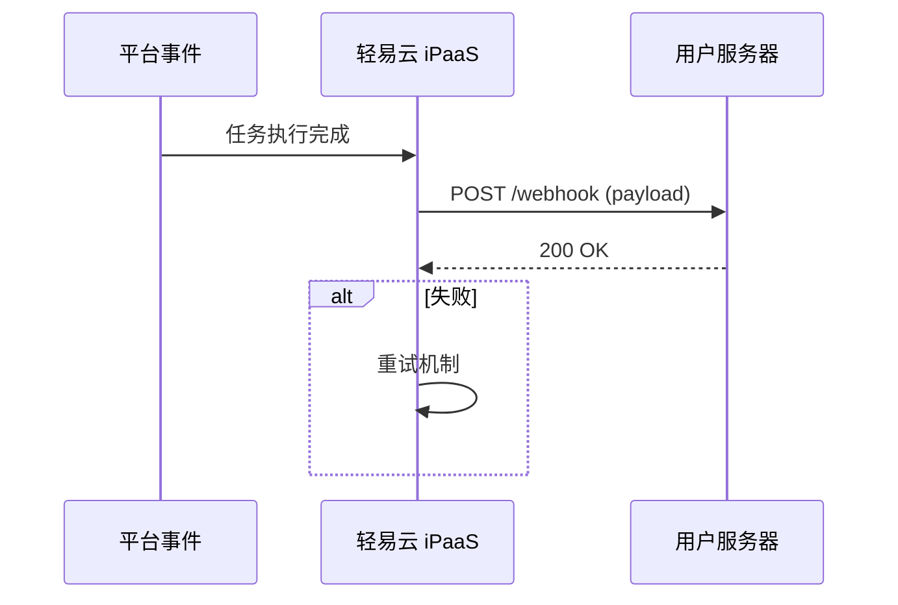

# Webhook 配置

Webhook 允许您在特定事件发生时，接收来自轻易云 iPaaS 的实时通知。

## Webhook 概述

### 什么是 Webhook

Webhook 是一种用户自定义的 HTTP 回调，当特定事件发生时，轻易云 iPaaS 会向用户配置的 URL 发送 HTTP 请求。



### 适用场景

| 场景 | 说明 |
|-----|------|
| 任务完成通知 | 集成方案执行完成后通知业务系统 |
| 异常告警 | 任务失败时立即通知 |
| 数据同步 | 实时推送数据变更 |
| 链式触发 | 一个任务完成后触发另一个任务 |

## 配置 Webhook

### 创建 Webhook

1. 进入控制台「开发者中心」→「Webhook 管理」
2. 点击「新建 Webhook」
3. 填写配置信息

```json
{
  "name": "任务完成通知",
  "url": "https://your-server.com/webhook",
  "events": ["task.completed", "task.failed"],
  "secret": "your_webhook_secret",
  "active": true,
  "retry": {
    "maxAttempts": 3,
    "interval": 60
  }
}
```

### 配置参数

| 参数 | 必填 | 说明 |
|-----|------|------|
| name | 是 | Webhook 名称 |
| url | 是 | 接收通知的 URL |
| events | 是 | 订阅的事件列表 |
| secret | 否 | 签名密钥，用于验证请求 |
| active | 否 | 是否启用，默认 true |
| retry | 否 | 重试配置 |

## 事件类型

### 任务事件

| 事件 | 说明 |
|-----|------|
| task.created | 任务创建 |
| task.started | 任务开始执行 |
| task.completed | 任务执行成功 |
| task.failed | 任务执行失败 |
| task.cancelled | 任务被取消 |
| task.timeout | 任务超时 |

### 方案事件

| 事件 | 说明 |
|-----|------|
| scheme.created | 方案创建 |
| scheme.updated | 方案更新 |
| scheme.deleted | 方案删除 |
| scheme.enabled | 方案启用 |
| scheme.disabled | 方案禁用 |

### 数据事件

| 事件 | 说明 |
|-----|------|
| data.received | 收到新数据 |
| data.processed | 数据处理完成 |
| data.failed | 数据处理失败 |

## 消息格式

### 请求方法

Webhook 统一使用 **POST** 方法。

### 请求头

```http
POST /webhook HTTP/1.1
Host: your-server.com
Content-Type: application/json
X-Qeasy-Event: task.completed
X-Qeasy-Delivery: 123e4567-e89b-12d3-a456-426614174000
X-Qeasy-Timestamp: 1640995200
X-Qeasy-Signature: sha256=1234567890abcdef...
```

### 消息体

```json
{
  "event": "task.completed",
  "timestamp": "2024-01-01T12:00:00Z",
  "data": {
    "taskId": "task_abc123",
    "schemeId": "scheme_xyz789",
    "schemeName": "订单同步",
    "status": "success",
    "startTime": "2024-01-01T11:59:00Z",
    "endTime": "2024-01-01T12:00:00Z",
    "duration": 60,
    "statistics": {
      "inputCount": 1000,
      "outputCount": 1000,
      "errorCount": 0
    }
  }
}
```

### 任务失败消息

```json
{
  "event": "task.failed",
  "timestamp": "2024-01-01T12:00:00Z",
  "data": {
    "taskId": "task_abc123",
    "schemeId": "scheme_xyz789",
    "schemeName": "订单同步",
    "status": "failed",
    "startTime": "2024-01-01T11:59:00Z",
    "endTime": "2024-01-01T12:00:00Z",
    "error": {
      "code": "CONNECTOR_ERROR",
      "message": "连接源系统失败",
      "detail": "Connection timeout"
    }
  }
}
```

## 安全验证

### 签名验证

为确保 Webhook 请求来自轻易云 iPaaS，建议验证请求签名：

**验证步骤：**

1. 从请求头获取 `X-Qeasy-Signature`
2. 获取请求体原文
3. 使用密钥计算签名
4. 对比签名是否一致

**代码示例：**

```python
import hmac
import hashlib

def verify_signature(payload, signature, secret):
    expected = hmac.new(
        secret.encode('utf-8'),
        payload.encode('utf-8'),
        hashlib.sha256
    ).hexdigest()
    
    return hmac.compare_digest(f"sha256={expected}", signature)
```

### 其他安全措施

- **HTTPS 必需**：Webhook URL 必须使用 HTTPS
- **IP 白名单**：可配置接受请求的 IP 范围
- **时间戳校验**：检查请求时间戳，防止重放攻击

## 接收端开发

### 服务要求

接收 Webhook 的服务需要满足：

| 要求 | 说明 |
|-----|------|
| 公网可访问 | URL 必须是公网可访问的 |
| 响应迅速 | 3 秒内返回响应 |
| 返回 2xx | 成功处理返回 200-299 状态码 |
| 幂等处理 | 同一事件可能多次推送 |

### 接收示例

**Flask (Python):**

```python
from flask import Flask, request, jsonify
import hmac
import hashlib

app = Flask(__name__)
WEBHOOK_SECRET = "your_secret"

@app.route('/webhook', methods=['POST'])
def webhook():
    # 获取签名
    signature = request.headers.get('X-Qeasy-Signature')
    
    # 验证签名
    payload = request.get_data(as_text=True)
    if not verify_signature(payload, signature, WEBHOOK_SECRET):
        return jsonify({"error": "Invalid signature"}), 401
    
    # 处理事件
    event = request.json.get('event')
    data = request.json.get('data')
    
    if event == 'task.completed':
        handle_task_completed(data)
    elif event == 'task.failed':
        handle_task_failed(data)
    
    return jsonify({"status": "ok"}), 200

def verify_signature(payload, signature, secret):
    expected = hmac.new(
        secret.encode(),
        payload.encode(),
        hashlib.sha256
    ).hexdigest()
    return hmac.compare_digest(f"sha256={expected}", signature)
```

**Express (Node.js):**

```javascript
const express = require('express');
const crypto = require('crypto');

const app = express();
const WEBHOOK_SECRET = 'your_secret';

app.use(express.raw({ type: 'application/json' }));

app.post('/webhook', (req, res) => {
  // 验证签名
  const signature = req.headers['x-qeasy-signature'];
  const payload = req.body;
  
  if (!verifySignature(payload, signature, WEBHOOK_SECRET)) {
    return res.status(401).json({ error: 'Invalid signature' });
  }
  
  // 处理事件
  const event = JSON.parse(payload);
  
  switch (event.event) {
    case 'task.completed':
      handleTaskCompleted(event.data);
      break;
    case 'task.failed':
      handleTaskFailed(event.data);
      break;
  }
  
  res.json({ status: 'ok' });
});

function verifySignature(payload, signature, secret) {
  const expected = crypto
    .createHmac('sha256', secret)
    .update(payload)
    .digest('hex');
  
  return crypto.timingSafeEqual(
    Buffer.from(signature),
    Buffer.from(`sha256=${expected}`)
  );
}
```

## 重试机制

### 重试策略

当您的服务返回非 2xx 状态码或超时时，轻易云 iPaaS 会自动重试：

| 次数 | 间隔时间 | 说明 |
|-----|---------|------|
| 第 1 次 | 立即 | 首次失败 |
| 第 2 次 | 60 秒 | 第 1 次重试 |
| 第 3 次 | 300 秒 | 第 2 次重试 |

### 去重处理

同一事件可能多次推送，接收端需要做好幂等处理：

```python
processed_events = set()

def handle_webhook(event_id, data):
    if event_id in processed_events:
        return  # 已处理过，直接返回
    
    # 处理业务逻辑
    process_data(data)
    
    # 记录已处理
    processed_events.add(event_id)
```

## 调试工具

### 使用 ngrok 本地调试

在本地开发时，可以使用 ngrok 暴露本地服务：

```bash
# 安装 ngrok
npm install -g ngrok

# 暴露本地端口
ngrok http 8080

# 获取公网 URL，如 https://abc123.ngrok.io
# 将 https://abc123.ngrok.io/webhook 配置到平台
```

### Webhook 日志

在控制台可以查看 Webhook 推送日志：

- 推送时间
- 请求内容
- 响应状态
- 失败原因

## 最佳实践

### 1. 异步处理

Webhook 处理应该是异步的：

```python
@app.route('/webhook', methods=['POST'])
def webhook():
    # 立即返回成功
    response = jsonify({"status": "received"}), 200
    
    # 异步处理业务逻辑
    threading.Thread(target=process_async, args=(request.json,)).start()
    
    return response
```

### 2. 队列缓冲

对于高并发场景，使用消息队列缓冲：

```python
@app.route('/webhook', methods=['POST'])
def webhook():
    # 放入队列
    message_queue.put(request.json)
    return jsonify({"status": "queued"}), 200

# 消费者处理
def consumer():
    while True:
        event = message_queue.get()
        process_event(event)
```

### 3. 监控告警

监控 Webhook 接收情况：

- 成功率监控
- 响应时间监控
- 失败告警

### 4. 版本兼容

预留版本处理逻辑：

```python
def handle_webhook(payload):
    version = payload.get('version', 'v1')
    
    if version == 'v1':
        handle_v1(payload)
    elif version == 'v2':
        handle_v2(payload)
```
