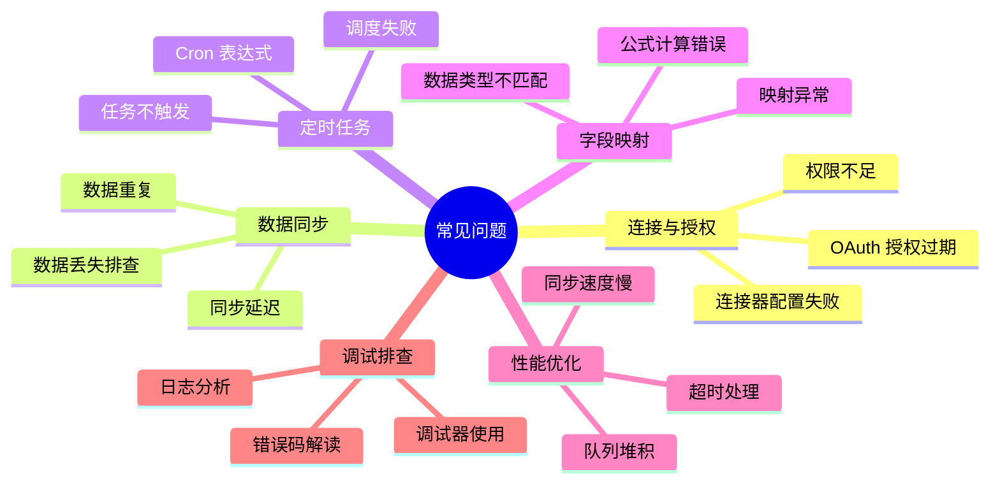
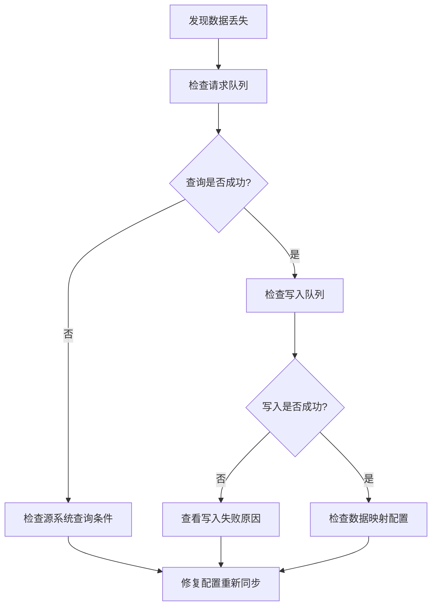
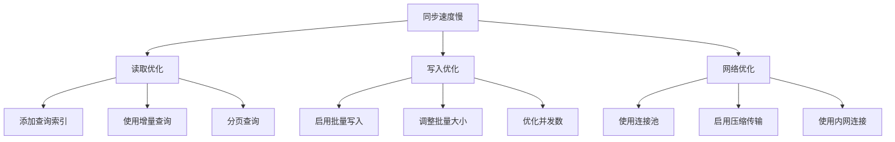
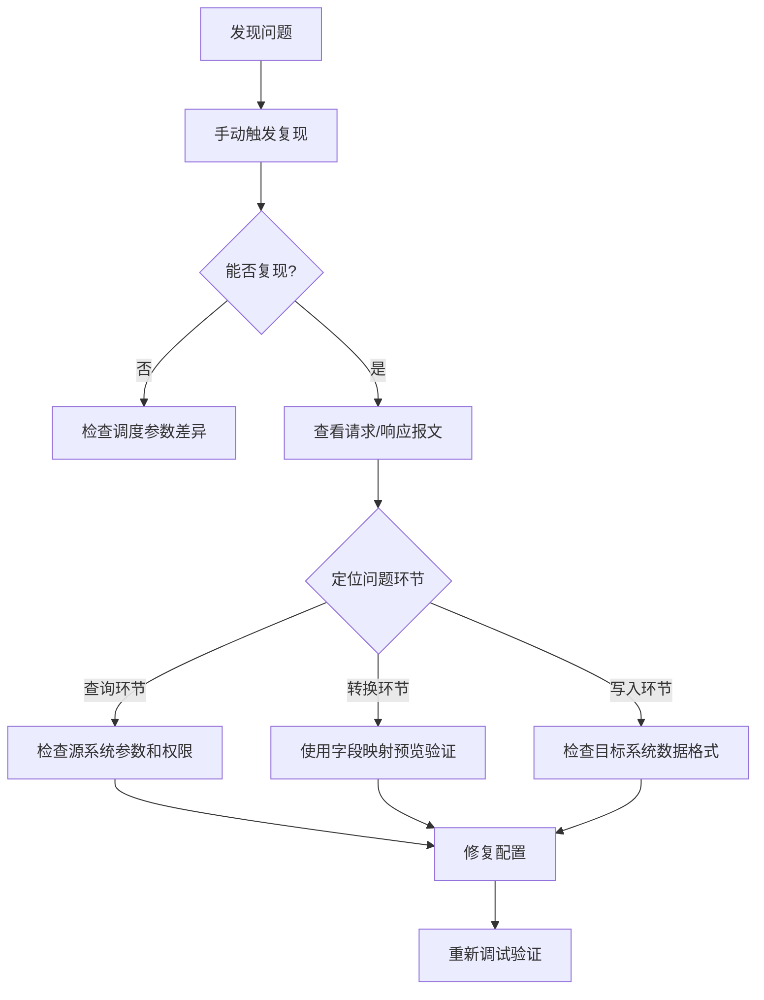

# 常见问题 FAQ

本文档汇总轻易云 iPaaS 平台使用过程中的高频问题与解决方案，涵盖连接配置、数据同步、定时调度、字段映射、故障排查等各个方面。如未能找到所需答案，可通过页面底部的联系方式获取技术支持。

---

## 问题分类导航



---

## 连接与授权问题

### 连接器测试失败，如何解决？

**问题描述**：在配置连接器后，点击**测试连接**按钮提示连接失败。

**排查步骤**：

| 步骤 | 检查项 | 解决方案 |
|------|--------|----------|
| 1 | 网络连通性 | 确认服务器地址和端口可访问，检查防火墙设置 |
| 2 | 凭证正确性 | 核对 AppKey、密码、令牌等认证信息是否正确 |
| 3 | 服务状态 | 确认目标系统服务正常运行 |
| 4 | 权限配置 | 检查账号是否具备必要的接口访问权限 |

**常见错误对照表**：

| 错误提示 | 可能原因 | 解决方案 |
|----------|----------|----------|
| `Connection refused` | 目标服务未启动或端口错误 | 检查服务状态和端口配置 |
| `Connection timeout` | 网络不通或防火墙拦截 | 检查网络连通性，开放相应端口 |
| `Authentication failed` | 用户名/密码错误 | 核对认证信息，确认账号未被锁定 |
| `Access denied` | 权限不足 | 联系目标系统管理员开通权限 |
| `SSL certificate error` | SSL 证书问题 | 检查证书配置或临时禁用 SSL 验证 |

> [!TIP]
> 详细的连接器配置指南请参考 [配置连接器](../guide/configure-connector)。

---

### OAuth 授权过期后如何重新授权？

**问题描述**：使用钉钉、飞书、企业微信等 OAuth 类型连接器时，提示授权已过期。

**解决方案**：

1. 进入**连接器管理**页面
2. 找到目标连接器，点击**编辑**按钮
3. 在连接器配置页面点击**重新授权**按钮
4. 按照引导跳转到第三方平台进行授权确认
5. 授权成功后保存连接器配置

> [!NOTE]
> 部分平台（如 Salesforce）的授权令牌有固定的有效期，到期后必须重新授权。建议在令牌过期前设置提醒。

---

### 连接测试通过但集成方案运行失败？

**问题描述**：连接器测试显示成功，但实际运行集成方案时失败。

**可能原因**：

1. **接口权限不足**：连接测试仅验证基础连通性，实际业务接口可能需要额外权限
2. **请求参数格式错误**：源系统对查询参数有特定格式要求
3. **业务规则限制**：目标系统的业务规则导致写入失败（如必填字段为空）

**排查方法**：

1. 使用[调试器](../guide/debugger)查看详细的请求/响应报文
2. 检查错误日志中的具体错误信息
3. 验证源系统的接口权限是否完整

---

### 数据库连接提示 "Access denied"？

**问题描述**：配置 MySQL/Oracle 等数据库连接器时，提示访问被拒绝。

**解决方案**：

1. 检查用户名和密码是否正确
2. 确认用户是否有从远程主机连接的权限（MySQL 需配置 `user@'%'`）
3. 验证用户是否具备所需的数据库权限

```sql
-- 查看 MySQL 用户权限
SHOW GRANTS FOR 'easypaas_user'@'%';

-- 授予基础读写权限
GRANT SELECT, INSERT, UPDATE, DELETE ON your_database.* TO 'easypaas_user'@'%';
FLUSH PRIVILEGES;
```

> [!WARNING]
> 请勿使用 `root` 或超级管理员账号配置连接器。建议创建专用账号并限制访问来源 IP。

---

## 数据同步问题

### 数据同步后发现数据丢失，如何排查？

**问题描述**：集成方案执行后，发现部分数据未同步到目标系统。

**排查流程**：



**常见原因与解决方案**：

| 原因 | 排查方法 | 解决方案 |
|------|----------|----------|
| 查询条件过滤 | 检查源平台的查询过滤条件 | 调整过滤条件，确保包含目标数据 |
| 数据映射错误 | 检查字段映射配置 | 修正字段名称，确保映射正确 |
| 主键冲突 | 检查目标系统是否已存在相同主键的数据 | 配置主键冲突处理策略（更新/忽略） |
| 写入失败 | 查看写入队列的失败记录 | 根据错误提示修复数据或配置 |
| 数据类型不匹配 | 对比源/目标字段类型 | 使用值格式化或公式进行类型转换 |

---

### 如何处理数据重复问题？

**问题描述**：同步后发现目标系统存在重复数据。

**解决方案**：

**方案一：配置主键映射**（推荐）

1. 在目标平台配置中，设置**主键字段**
2. 配置**写入模式**为「新增或更新」
3. 系统将根据主键判断数据是否存在，存在则更新，不存在则新增

**方案二：使用唯一性约束**

1. 在目标系统中设置唯一索引或主键约束
2. 配置异常处理策略为「单条失败时跳过继续」

**方案三：数据清洗**

1. 在数据映射中使用公式进行去重处理
2. 或使用自定义脚本在写入前进行数据清洗

---

### 数据同步延迟高怎么办？

**问题描述**：数据同步耗时过长，或 CDC 实时同步出现延迟。

**优化建议**：

| 优化方向 | 具体措施 |
|----------|----------|
| 查询优化 | 为常用查询字段添加索引；优化 SQL 查询条件 |
| 批量大小 | 调整批量处理大小，建议单次 500~1000 条 |
| 并发控制 | 适当增加并发线程数（需根据数据库性能调整） |
| 网络优化 | 使用内网或专线连接；启用数据压缩传输 |
| 定时错峰 | 避免多个方案在同一时间点触发 |

**CDC 同步延迟专项排查**：

1. 检查 Binlog 生成频率，避免单事务过大
2. 优化网络连接
3. 调整消费者线程数和批量处理大小
4. 监控数据库服务器 I/O 性能

---

### 中文显示乱码如何处理？

**问题描述**：同步后的中文数据显示为乱码。

**解决方案**：

1. **确保连接字符集为 `utf8mb4`**：
   ```json
   { "charset": "utf8mb4" }
   ```

2. **检查数据库和表字符集**：
   ```sql
   -- 查看数据库字符集
   SHOW CREATE DATABASE your_database;
   
   -- 查看表字符集
   SHOW CREATE TABLE your_table;
   ```

3. **必要时转换字符集**：
   ```sql
   ALTER TABLE your_table CONVERT TO CHARACTER SET utf8mb4;
   ```

---

## 定时任务与调度问题

### 定时任务未触发，如何解决？

**问题描述**：配置了定时调度，但任务未按计划执行。

**排查清单**：

| 检查项 | 检查方法 | 解决方案 |
|--------|----------|----------|
| 方案状态 | 查看方案列表状态列 | 确保方案处于「运行中」状态 |
| 调度配置 | 进入方案详情查看调度配置 | 确认 Cron 表达式正确且已保存 |
| 时区设置 | 检查系统时区配置 | 确保时区与业务时区一致 |
| 执行时间 | 对比当前时间与计划时间 | 检查是否处于设置的执行时间段内 |
| 依赖阻塞 | 检查是否有前置依赖方案 | 确保前置方案已执行完成 |

> [!IMPORTANT]
> 方案启动后，队列中的任务才会真正进入队列池排队。如果方案未启动，即使到了调度时间也不会执行。

---

### Cron 表达式如何编写？

**语法说明**：

轻易云 iPaaS 使用标准 Cron 表达式（5 位格式）：

```text
┌───────────── 分钟 (0 - 59)
│ ┌───────────── 小时 (0 - 23)
│ │ ┌───────────── 日期 (1 - 31)
│ │ │ ┌───────────── 月份 (1 - 12)
│ │ │ │ ┌───────────── 星期 (0 - 6, 0 表示星期日)
│ │ │ │ │
* * * * *
```

**常用配置示例**：

| Cron 表达式 | 执行频率说明 |
|------------|-------------|
| `*/5 * * * *` | 每 5 分钟执行一次 |
| `0 * * * *` | 每小时整点执行 |
| `0 */2 * * *` | 每 2 小时执行一次 |
| `0 9,18 * * *` | 每天 9:00 和 18:00 执行 |
| `0 9-18 * * 1-5` | 工作日 9:00 至 18:00 每小时执行 |
| `0 0 * * 0` | 每周日零点执行 |
| `0 0 1 * *` | 每月 1 号零点执行 |

> [!TIP]
> 可以使用在线工具验证 Cron 表达式：[https://tool.lu/crontab](https://tool.lu/crontab)

---

### 可以临时暂停定时调度而不停止方案吗？

**解决方案**：

可以。在方案详情页的调度配置中，点击**暂停调度**按钮。暂停期间：

- 方案保持运行状态
- 不会触发新的同步任务
- 已加入队列的任务会继续执行

需要恢复时，点击**恢复调度**按钮即可。

---

### 多个方案配置相同的执行时间会有冲突吗？

**问题描述**：多个集成方案配置了相同的执行时间，是否会相互影响？

**说明**：

- 系统支持并发执行多个方案
- 但建议将方案执行时间错开，避免对源/目标系统造成瞬时压力
- 建议间隔至少 1~2 分钟，或根据系统承载能力调整

---

## 字段映射与转换问题

### 字段映射后值为空，如何处理？

**问题描述**：配置了字段映射，但目标字段值为空。

**排查步骤**：

1. **检查源字段名称**：确认源字段名称拼写正确（区分大小写）
2. **验证源数据**：使用调试器查看源系统实际返回的数据结构
3. **检查映射类型**：确认映射类型选择正确（字段映射/固定值/公式等）
4. **查看转换规则**：检查是否配置了错误的值格式化规则

**常见原因**：

| 原因 | 排查方法 | 解决方案 |
|------|----------|----------|
| 源字段不存在 | 查看源系统响应报文 | 修正字段名称或选择正确的接口 |
| 源数据为空 | 检查源系统实际数据 | 配置默认值或跳过空值处理 |
| 嵌套字段引用错误 | 检查 JSON 结构 | 使用正确的点符号路径，如 `customer.name` |
| 数据类型不匹配 | 对比源/目标字段类型 | 使用类型转换函数 |

---

### 公式计算错误如何解决？

**问题描述**：配置了公式映射，但计算结果不正确或报错。

**排查方法**：

1. **验证公式语法**：使用调试器的字段映射预览功能验证
2. **检查数据类型**：确保参与运算的字段类型正确
3. **检查字段引用**：确认 `{{字段名}}` 引用的字段存在

**常见公式错误**：

| 错误类型 | 示例 | 正确写法 |
|----------|------|----------|
| 除零错误 | `{{amount}} / {{qty}}` | `if({{qty}} == 0, 0, {{amount}} / {{qty}})` |
| 类型错误 | `{{price}} + '元'` | `concat({{price}}, '元')` |
| 空值处理 | `{{value}} * 1.13` | `if(isEmpty({{value}}), 0, {{value}} * 1.13)` |

---

### 如何处理状态码转换？

**问题描述**：源系统和目标系统的状态码不一致，需要进行转换。

**解决方案**：

**方案一：使用条件映射**

```text
switch({{status_code}}, 
  '01', '待处理',
  '02', '处理中', 
  '03', '已完成',
  '99', '已取消',
  '未知状态')
```

**方案二：使用静态映射表**

1. 在**数据映射管理**页面创建映射表
2. 维护源值与目标值的对应关系
3. 在字段映射中选择「静态映射」类型，引用该映射表

---

### 批量写入时提示 "Data too long"？

**问题描述**：批量写入数据库时，提示数据长度超过字段定义。

**解决方案**：

1. **查看字段定义**：
   ```sql
   SHOW FULL COLUMNS FROM your_table;
   ```

2. **修改字段长度**：
   ```sql
   ALTER TABLE your_table MODIFY COLUMN your_column VARCHAR(500);
   ```

3. **或在映射中截断数据**：
   ```text
   substring({{long_field}}, 0, 100)
   ```

---

## 性能与优化问题

### 同步速度慢如何优化？

**优化策略**：



**具体建议**：

| 优化项 | 建议配置 | 预期效果 |
|--------|----------|----------|
| 批量大小 | 500~1000 条/批次 | 减少网络往返次数 |
| 并发线程 | 3~5 个 | 平衡并发性能与系统负载 |
| 连接池大小 | 5~20 | 减少连接建立开销 |
| 查询索引 | 为过滤字段添加索引 | 加速数据查询 |

---

### 队列堆积如何处理？

**问题描述**：请求队列或写入队列出现大量堆积。

**排查流程**：

1. **查看堆积原因**：
   - 进入方案详情 → 队列管理页面
   - 查看队列状态分布（待处理/处理中/失败）

2. **常见原因与处理**：

| 堆积原因 | 识别特征 | 解决方案 |
|----------|----------|----------|
| 任务执行慢 | 大量任务处于「处理中」状态 | 优化查询/写入性能 |
| 频繁失败重试 | 大量任务处于「失败」或「待重试」状态 | 分析失败原因并修复 |
| 调度过于密集 | 多个方案同时触发 | 错峰调整执行时间 |
| 并发限制 | 处理速率明显低于生产速率 | 增加并发线程数 |

3. **紧急处理**：
   - 对于失败任务，可以批量重试或取消
   - 对于历史堆积数据，可以导出后清理

---

## 调试与排查问题

### 如何使用调试器排查问题？

**调试器功能概述**：

| 功能 | 用途 | 适用场景 |
|------|------|----------|
| 手动触发 | 立即执行方案，无需等待调度 | 快速验证配置变更 |
| 报文观测 | 查看完整的请求/响应数据 | 接口联调、定位数据问题 |
| 映射预览 | 预览字段映射转换效果 | 验证映射配置正确性 |
| 逐步调试 | 单步跟踪数据流转过程 | 复杂问题定位 |
| 日志下载 | 导出完整调试日志 | 离线分析、问题归档 |

**问题排查流程**：



> [!TIP]
> 详细调试指南请参考 [使用调试器](../guide/debugger)。

---

### 如何查看历史执行记录？

**操作步骤**：

1. 进入方案详情页
2. 切换到**执行历史**标签
3. 查看每次执行的开始时间、结束时间、处理记录数、执行结果等详细信息
4. 点击某次执行记录，可查看详细的任务日志

---

### 调试日志下载后如何分析？

**日志分析要点**：

| 关注项 | 分析方法 |
|--------|----------|
| 耗时分布 | 查看各环节时间戳，识别耗时最长的环节 |
| 数据变化 | 对比源数据和目标数据，验证转换逻辑 |
| 异常记录 | 搜索 `error`、`exception` 等关键词 |
| 参数变化 | 追踪变量在流程中的赋值变化 |

**日志格式选择**：

| 格式 | 适用场景 |
|------|----------|
| JSON | 导入日志分析工具、程序化处理 |
| 文本 | 文本编辑器查看、快速检索 |
| HTML | 浏览器打开、团队分享、问题汇报 |

---

## 平台使用问题

### 为什么源接口列表为空？

**可能原因**：

- 所选连接器未配置查询接口，需要到连接器详情页添加
- 连接器配置异常，建议先测试连接器连通性
- 当前账号无权限查看该接口

**解决方案**：

1. 进入连接器管理页面，检查所选连接器是否已配置查询接口
2. 测试连接器连通性，确保连接正常
3. 确认当前账号有权限访问该接口

---

### 可以修改已创建方案的方案类型吗？

**回答**：方案类型（定时/实时）一旦创建后**不可修改**。

如需更换类型，建议：
1. 复制现有方案
2. 在新方案中选择正确的方案类型
3. 重新配置并测试
4. 下线旧方案，启用新方案

---

### 如何实现一个源对多个目标的同步？

**回答**：目前一个集成方案只支持一个源和一个目标。

如需一对多同步，可以：

1. **创建多个集成方案**：使用相同的源接口，分别配置不同的目标系统
2. **链式触发**：在第一个目标同步完成后，通过 Webhook 触发其他方案
3. **使用消息队列**：源系统写入消息队列，多个目标方案订阅消费

---

### 删除方案会有什么影响？

**删除方案将**：

- 停止该方案的所有调度任务
- 删除方案的配置信息（**不可恢复**）
- 保留历史运行日志（用于审计追溯）
- 保留队列中的历史数据（如需清理请手动操作）

> [!CAUTION]
> 删除操作不可恢复，建议删除前先禁用方案并观察一段时间，确认无影响后再执行删除。

---

### 队列中的数据会保留多久？

**默认保留策略**：

| 数据状态 | 默认保留时长 | 可配置范围 |
|----------|-------------|-----------|
| 已完成 | 30 天 | 7~90 天 |
| 失败 | 90 天 | 30~180 天 |
| 待处理 | 3 天 | 1~7 天 |

可以在方案的**数据管理**设置中调整保留策略。

---

## 联系支持

如果以上问题未能解决你的疑问，可通过以下方式获取帮助：

| 支持渠道 | 联系方式 | 响应时间 |
|----------|----------|----------|
| 在线客服 | 控制台右下角「帮助」入口 | 实时 |
| 工单系统 | [提交工单](https://support.qeasy.cloud) | 1 小时内响应 |
| 技术支持邮件 | support@qeasy.cloud | 4 小时内响应 |
| 官网文档 | [https://www.qeasy.cloud/docs](https://www.qeasy.cloud/docs) | 24/7 |

---

## 相关文档

| 文档 | 说明 |
|------|------|
| [配置连接器](../guide/configure-connector) | 连接器基础配置指南 |
| [数据映射](../guide/data-mapping) | 字段映射配置方法 |
| [启动与定时策略](../guide/schedule-and-launch) | 方案调度配置详解 |
| [使用调试器](../guide/debugger) | 调试工具使用指南 |
| [数据与队列管理](../guide/data-queue-management) | 队列管理与故障排查 |
